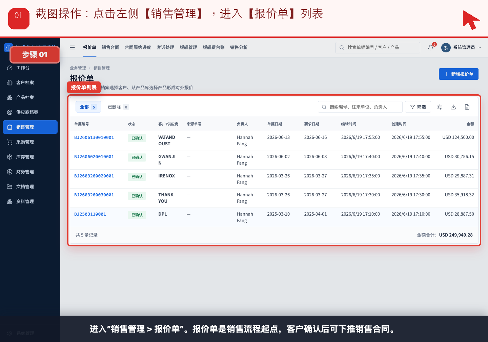
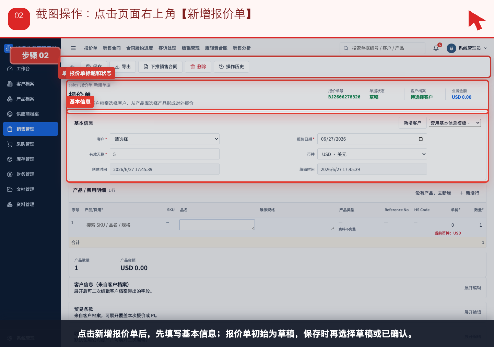
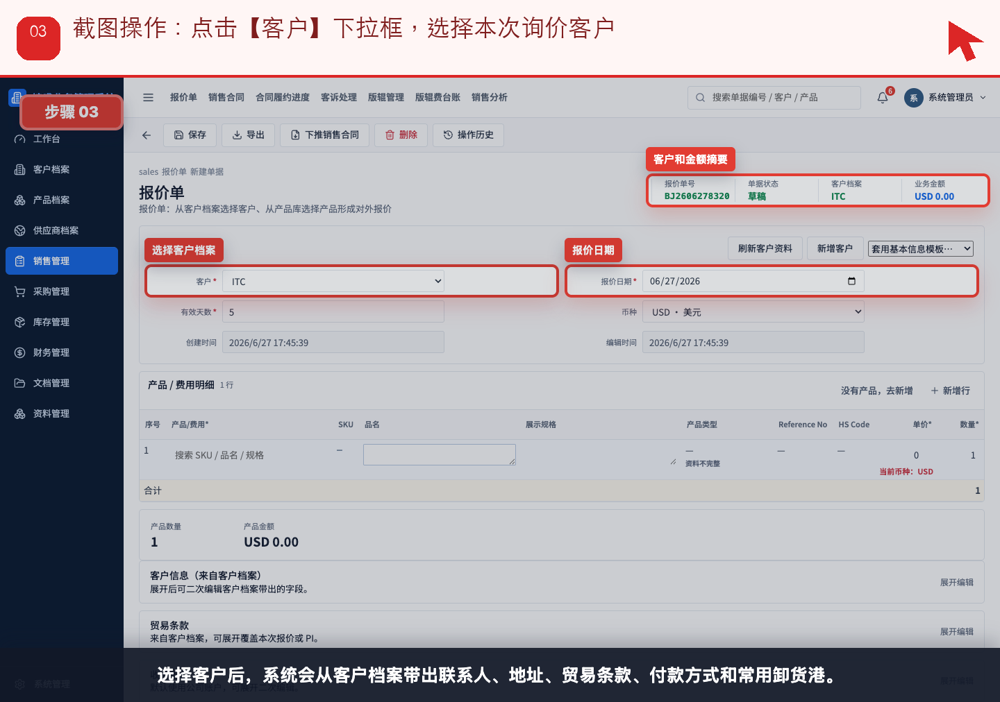
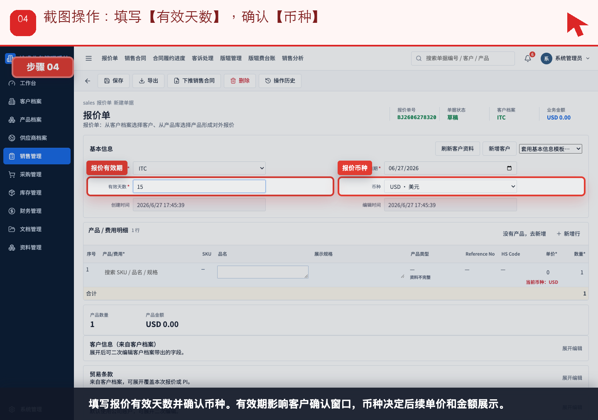
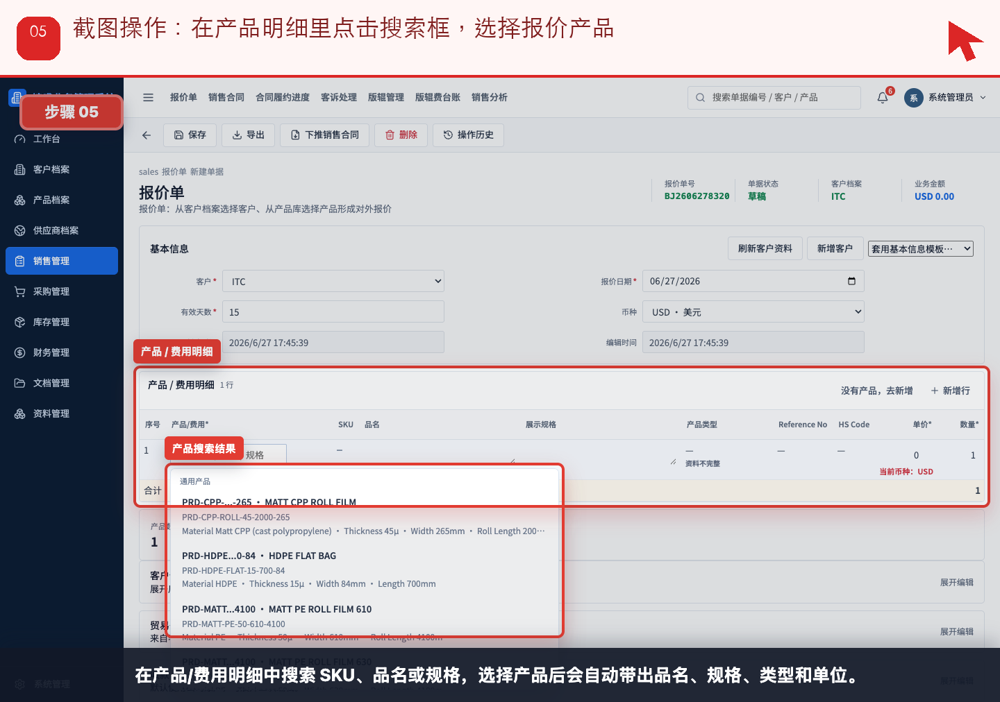
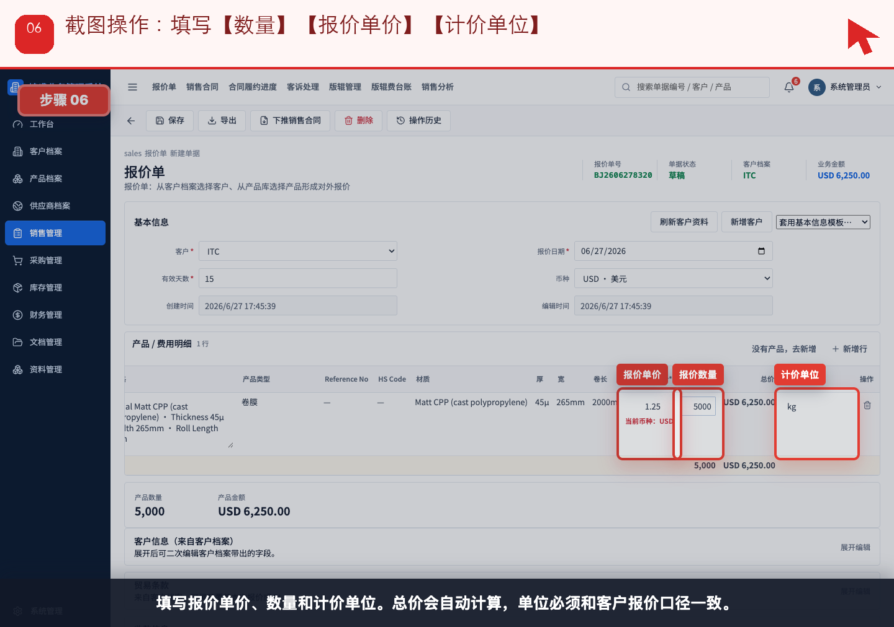
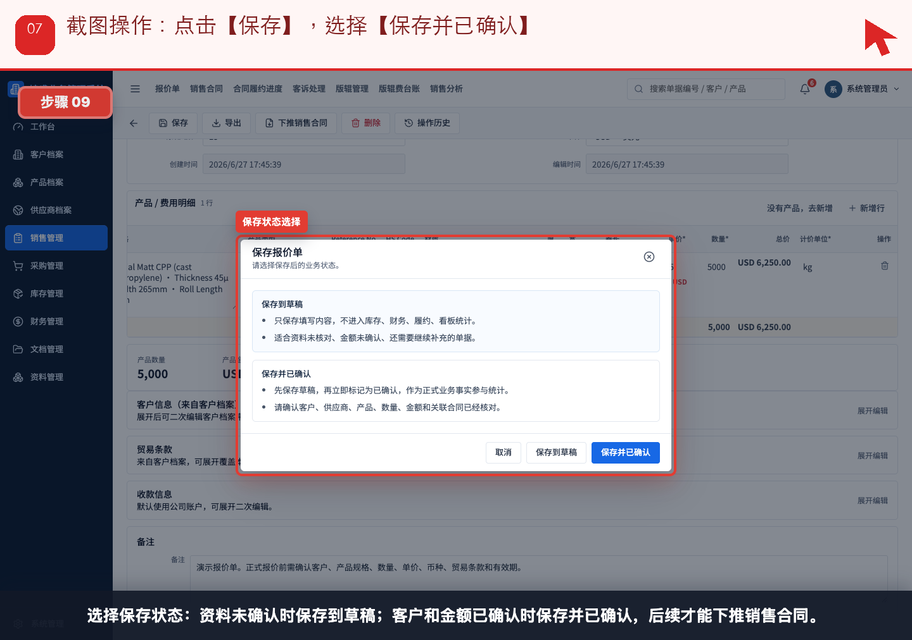
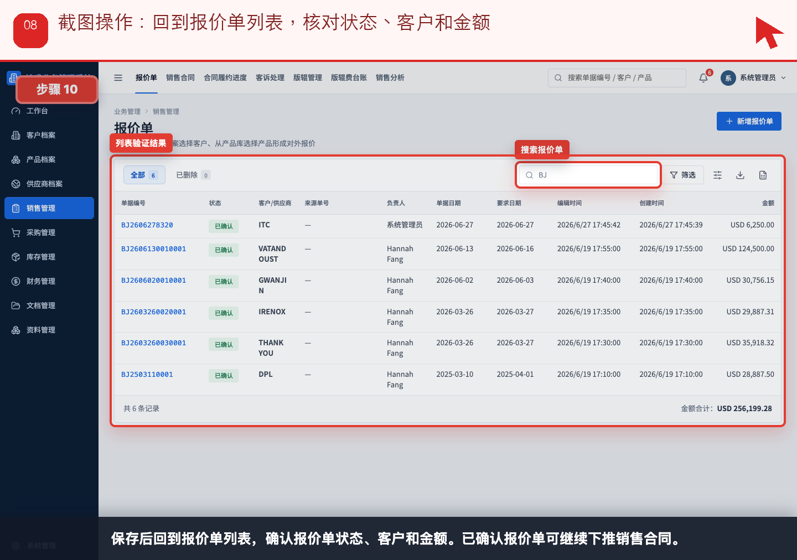

# 流程 01：客户要报价，销售如何创建正式报价单

本流程从 **销售/业务员** 的实际业务需求出发，不按表单字段讲解。截图顶部红色提示写明本步要点击、填写或核对的位置。

## 业务场景

- **谁来做**：销售/业务员
- **为什么做**：客户发来询价，销售需要把客户、产品、数量、币种、单价和有效期沉淀成可追溯报价。
- **财务参与**：报价阶段通常不做财务单据；如果涉及预收款、版辊费或特殊费用，财务提前确认币种和收款账户。
- **下一步交接**：客户确认后，销售进入“流程 02：客户确认下单”。

## 操作步骤

### 步骤 01：点击左侧【销售管理】，进入【报价单】列表

按截图顶部红色提示操作：点击左侧【销售管理】，进入【报价单】列表。

### 步骤 02：点击页面右上角【新增报价单】

按截图顶部红色提示操作：点击页面右上角【新增报价单】。

### 步骤 03：点击【客户】下拉框，选择本次询价客户

按截图顶部红色提示操作：点击【客户】下拉框，选择本次询价客户。

### 步骤 04：填写【有效天数】，确认【币种】

按截图顶部红色提示操作：填写【有效天数】，确认【币种】。

### 步骤 05：在产品明细里点击搜索框，选择报价产品

按截图顶部红色提示操作：在产品明细里点击搜索框，选择报价产品。

### 步骤 06：填写【数量】【报价单价】【计价单位】

按截图顶部红色提示操作：填写【数量】【报价单价】【计价单位】。

### 步骤 07：点击【保存】，选择【保存并已确认】

按截图顶部红色提示操作：点击【保存】，选择【保存并已确认】。

### 步骤 08：回到报价单列表，核对状态、客户和金额

按截图顶部红色提示操作：回到报价单列表，核对状态、客户和金额。

## 完成标准

- 当前角色完成了本流程的关键动作。
- 如果本流程产生财务影响，已经由财务创建或核对对应财务单据。
- 下一角色可以从来源单据、看板或列表继续处理，不需要重新录入同一业务事实。

[返回实际业务流程索引](../README.md)
