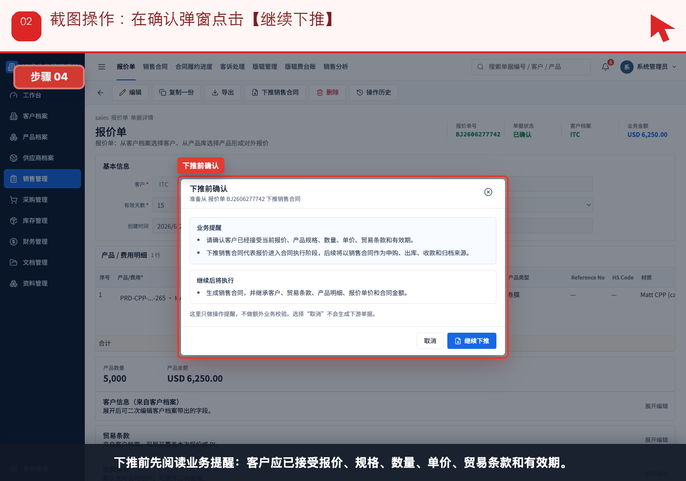
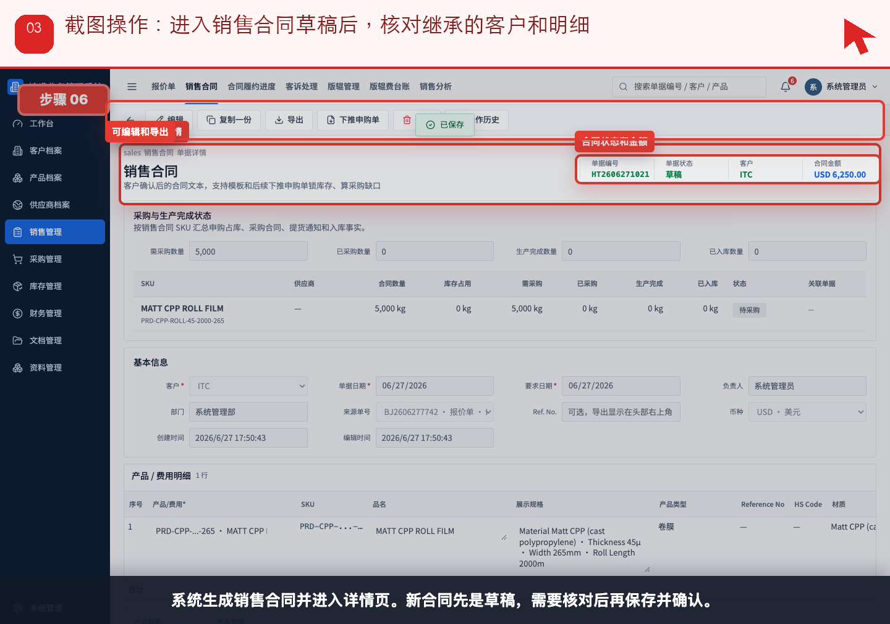
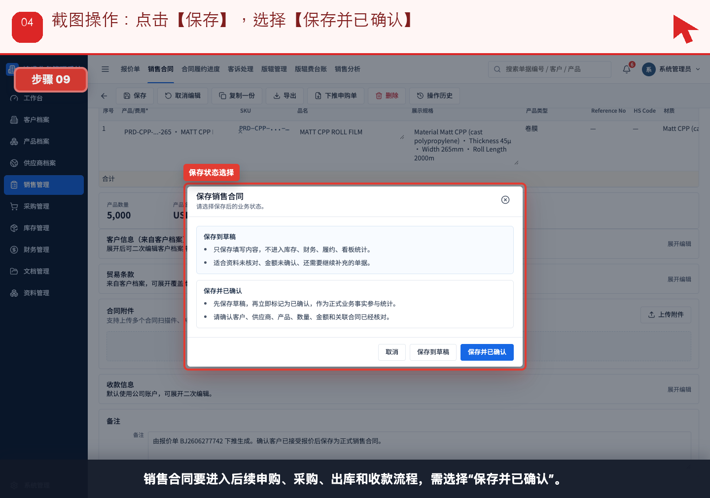
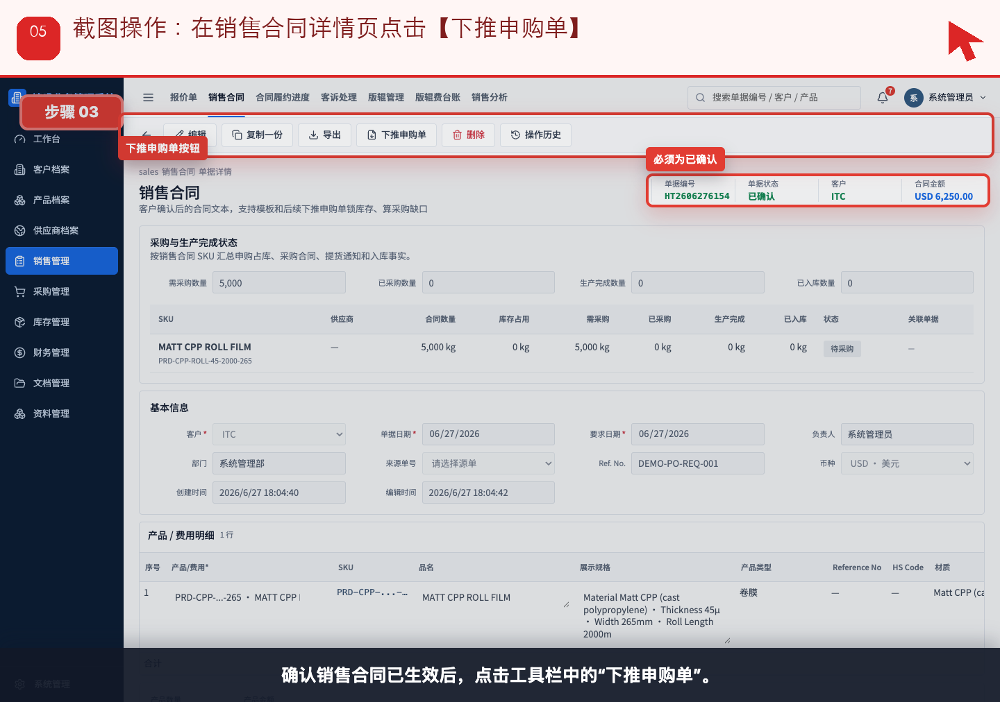
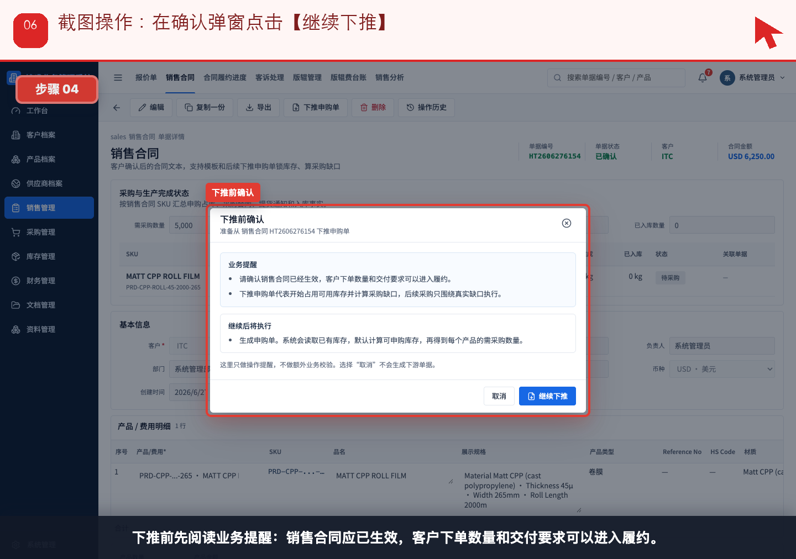
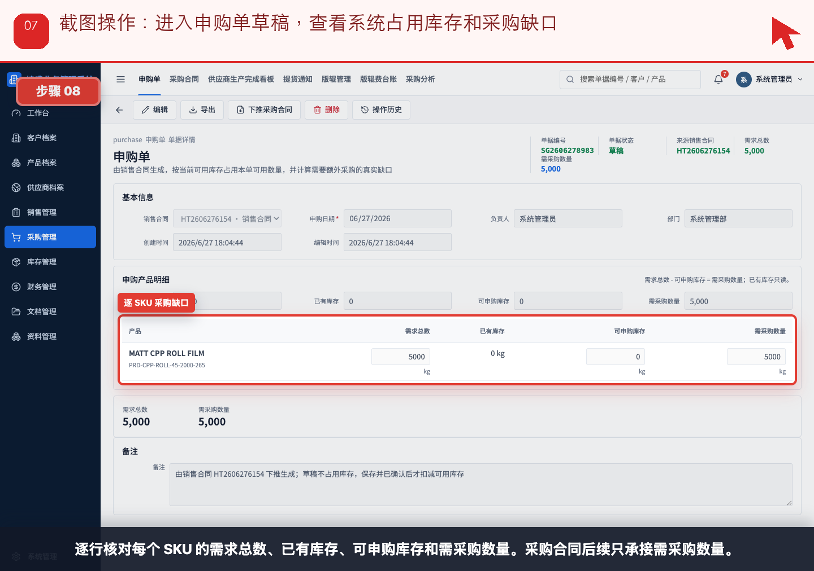
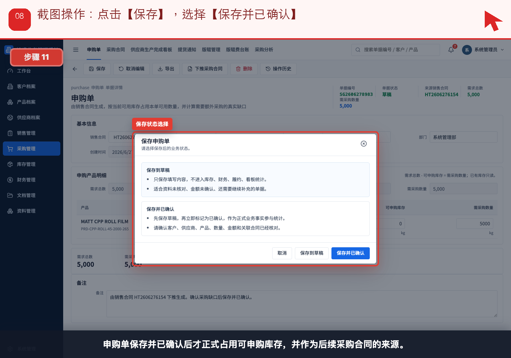
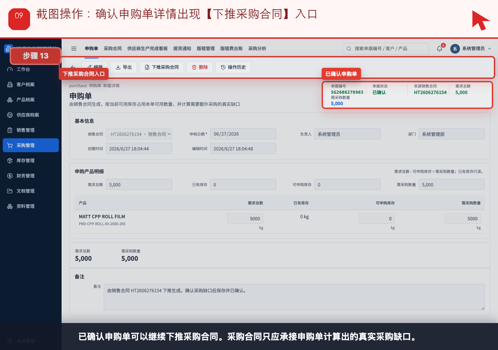

# 流程 02：客户确定下单，销售如何转销售合同并下推申购

本流程从 **销售/业务员，管理层查看** 的实际业务需求出发，不按表单字段讲解。截图顶部红色提示写明本步要点击、填写或核对的位置。

## 业务场景

- **谁来做**：销售/业务员，管理层查看
- **为什么做**：客户接受报价后，销售要把报价转成正式销售合同，并让采购和仓库看到真实需求。
- **财务参与**：销售合同本身不进资金流水；财务需要关注付款条款、币种、开票要求和后续应收风险。
- **下一步交接**：申购单确认后，采购进入“流程 03：供应商下单与生产完成”。

## 操作步骤

### 步骤 01：在已确认报价单详情页点击【下推销售合同】

按截图顶部红色提示操作：在已确认报价单详情页点击【下推销售合同】。

### 步骤 02：在确认弹窗点击【继续下推】

按截图顶部红色提示操作：在确认弹窗点击【继续下推】。

### 步骤 03：进入销售合同草稿后，核对继承的客户和明细

按截图顶部红色提示操作：进入销售合同草稿后，核对继承的客户和明细。

### 步骤 04：点击【保存】，选择【保存并已确认】

按截图顶部红色提示操作：点击【保存】，选择【保存并已确认】。

### 步骤 05：在销售合同详情页点击【下推申购单】

按截图顶部红色提示操作：在销售合同详情页点击【下推申购单】。

### 步骤 06：在确认弹窗点击【继续下推】

按截图顶部红色提示操作：在确认弹窗点击【继续下推】。

### 步骤 07：进入申购单草稿，查看系统占用库存和采购缺口

按截图顶部红色提示操作：进入申购单草稿，查看系统占用库存和采购缺口。

### 步骤 08：点击【保存】，选择【保存并已确认】

按截图顶部红色提示操作：点击【保存】，选择【保存并已确认】。

### 步骤 09：确认申购单详情出现【下推采购合同】入口

按截图顶部红色提示操作：确认申购单详情出现【下推采购合同】入口。

## 完成标准

- 当前角色完成了本流程的关键动作。
- 如果本流程产生财务影响，已经由财务创建或核对对应财务单据。
- 下一角色可以从来源单据、看板或列表继续处理，不需要重新录入同一业务事实。

[返回实际业务流程索引](../README.md)
