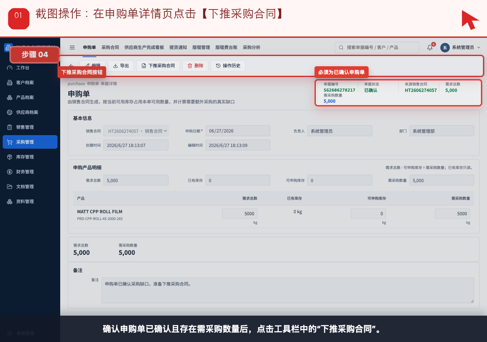
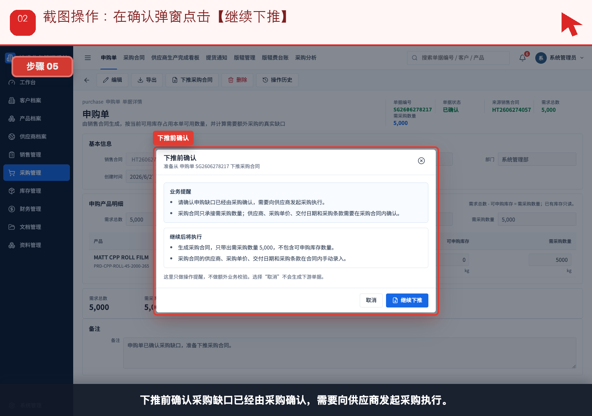
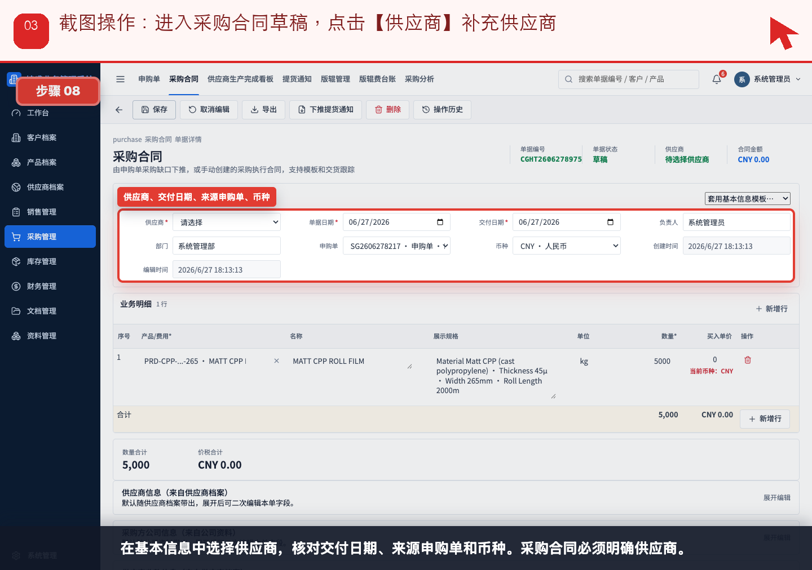
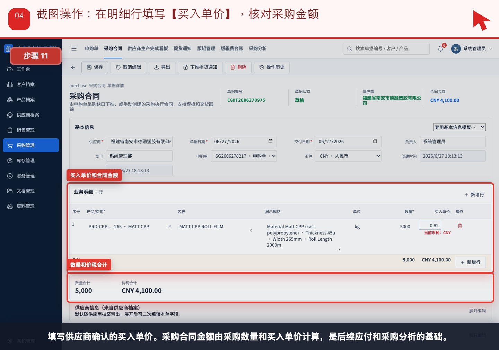
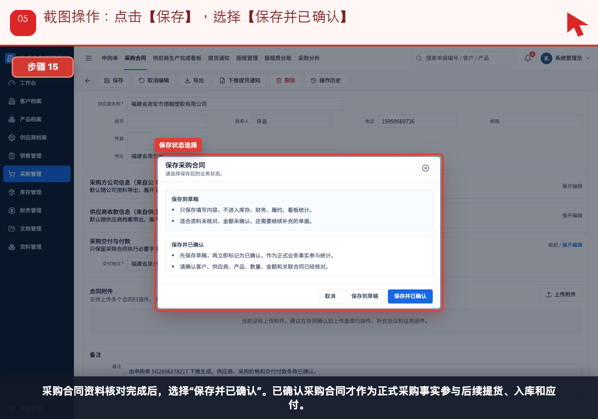
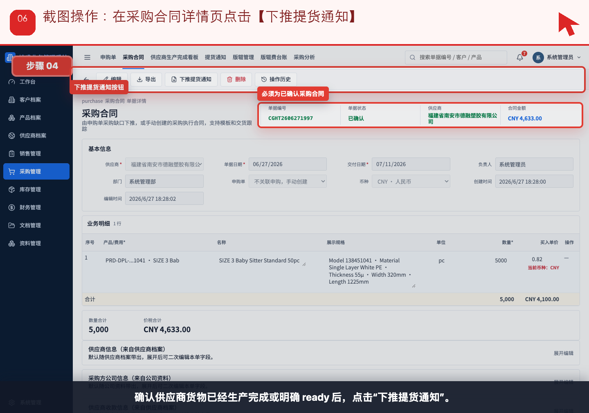
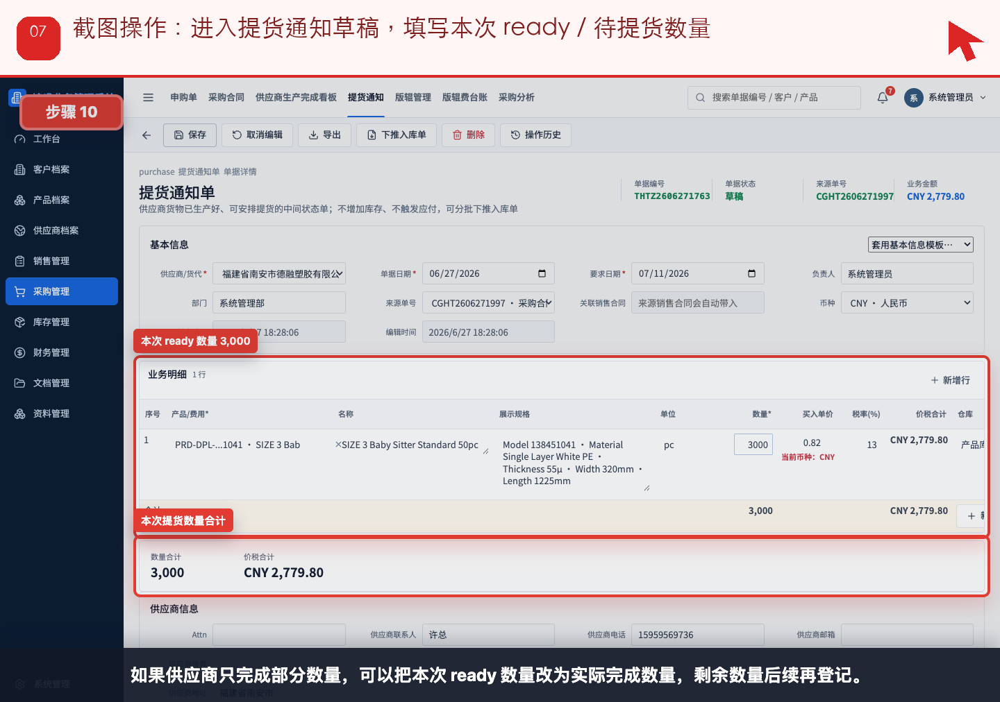
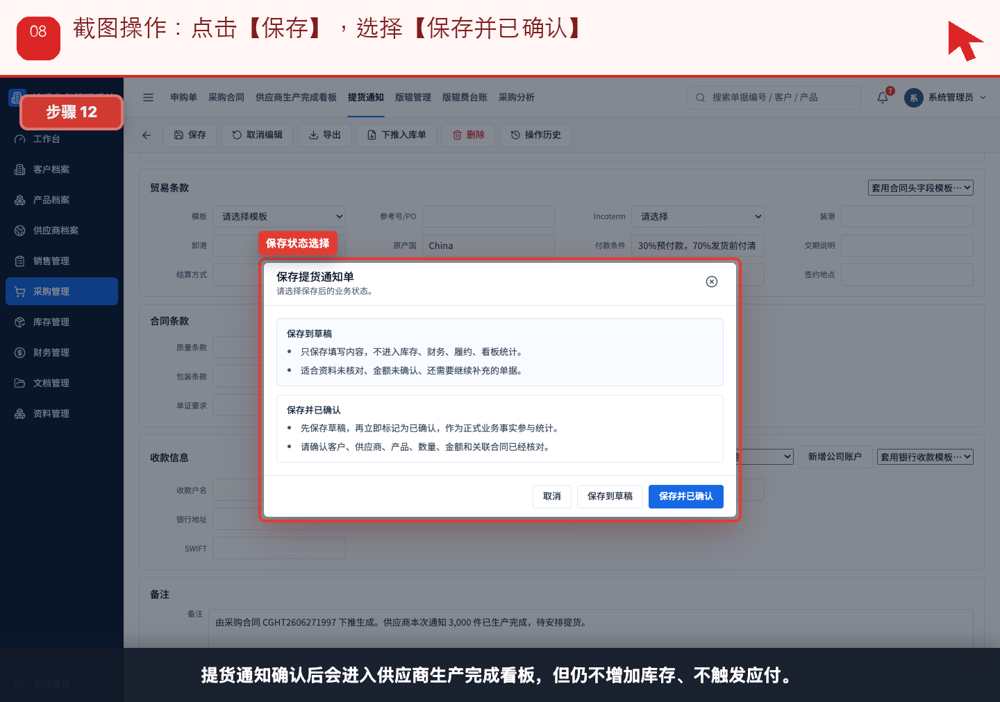
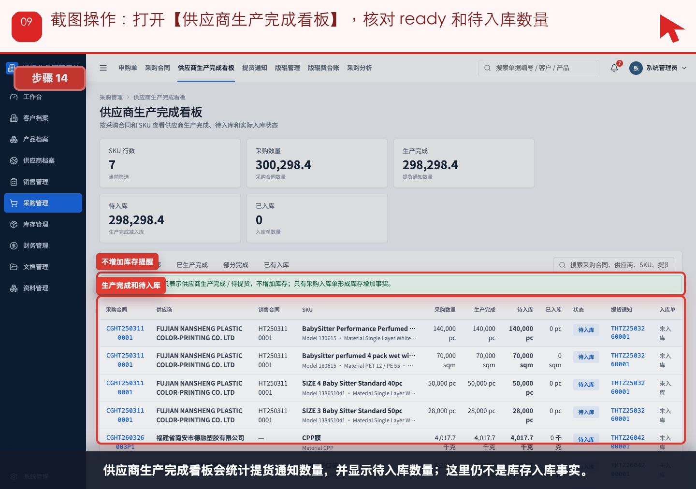

# 流程 03：采购收到申购缺口，如何给供应商下单并登记生产完成

本流程从 **采购员，仓管查看 ready 状态** 的实际业务需求出发，不按表单字段讲解。截图顶部红色提示写明本步要点击、填写或核对的位置。

## 业务场景

- **谁来做**：采购员，仓管查看 ready 状态
- **为什么做**：销售合同产生采购缺口后，采购要按缺口给供应商下采购合同，并在供应商生产完成时登记提货通知。
- **财务参与**：采购合同和提货通知都不是付款事实；财务只在预付款、费用或供应商对账时介入。正式应付从入库和采购发票开始。
- **下一步交接**：供应商生产完成后，仓管进入“流程 04：入库与出库”。

## 操作步骤

### 步骤 01：在申购单详情页点击【下推采购合同】

按截图顶部红色提示操作：在申购单详情页点击【下推采购合同】。

### 步骤 02：在确认弹窗点击【继续下推】

按截图顶部红色提示操作：在确认弹窗点击【继续下推】。

### 步骤 03：进入采购合同草稿，点击【供应商】补充供应商

按截图顶部红色提示操作：进入采购合同草稿，点击【供应商】补充供应商。

### 步骤 04：在明细行填写【买入单价】，核对采购金额

按截图顶部红色提示操作：在明细行填写【买入单价】，核对采购金额。

### 步骤 05：点击【保存】，选择【保存并已确认】

按截图顶部红色提示操作：点击【保存】，选择【保存并已确认】。

### 步骤 06：在采购合同详情页点击【下推提货通知】

按截图顶部红色提示操作：在采购合同详情页点击【下推提货通知】。

### 步骤 07：进入提货通知草稿，填写本次 ready / 待提货数量

按截图顶部红色提示操作：进入提货通知草稿，填写本次 ready / 待提货数量。

### 步骤 08：点击【保存】，选择【保存并已确认】

按截图顶部红色提示操作：点击【保存】，选择【保存并已确认】。

### 步骤 09：打开【供应商生产完成看板】，核对 ready 和待入库数量

按截图顶部红色提示操作：打开【供应商生产完成看板】，核对 ready 和待入库数量。

## 完成标准

- 当前角色完成了本流程的关键动作。
- 如果本流程产生财务影响，已经由财务创建或核对对应财务单据。
- 下一角色可以从来源单据、看板或列表继续处理，不需要重新录入同一业务事实。

[返回实际业务流程索引](../README.md)
