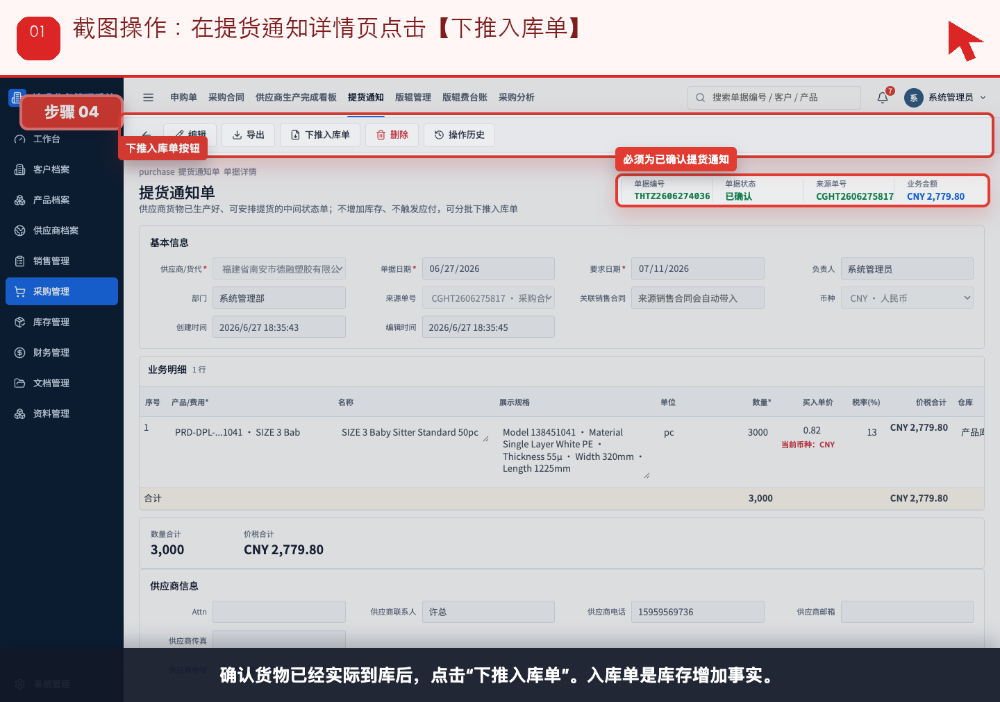
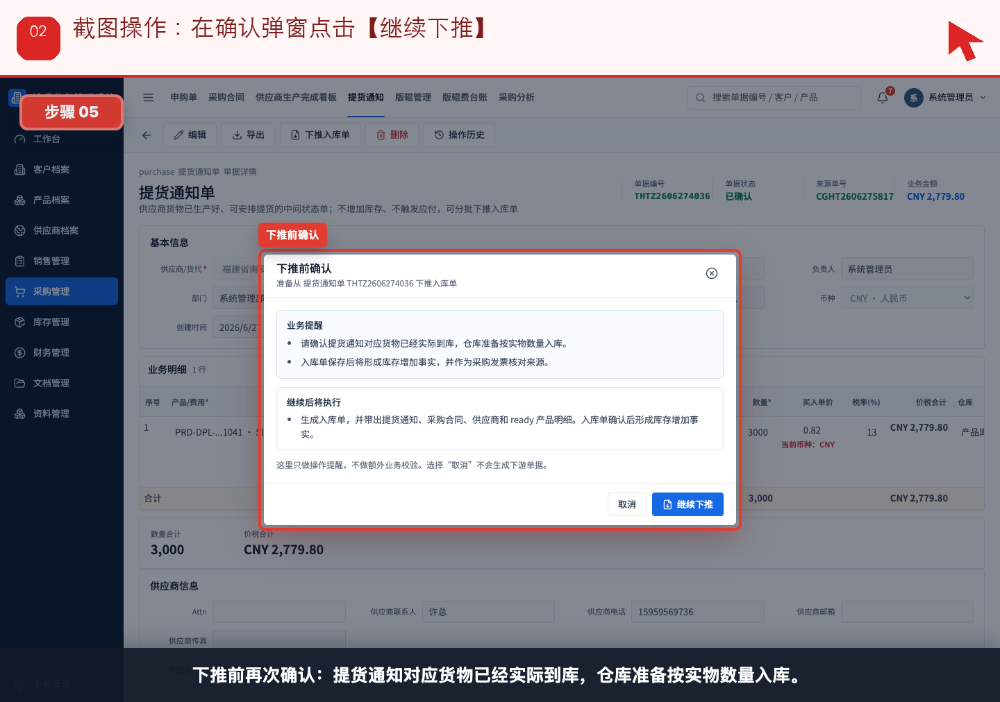
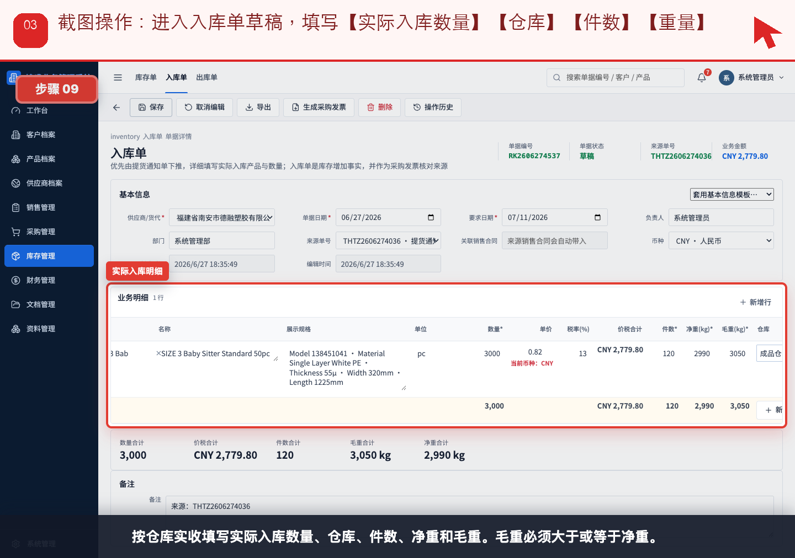
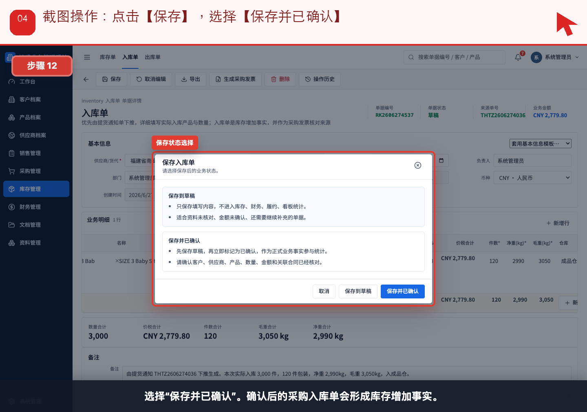
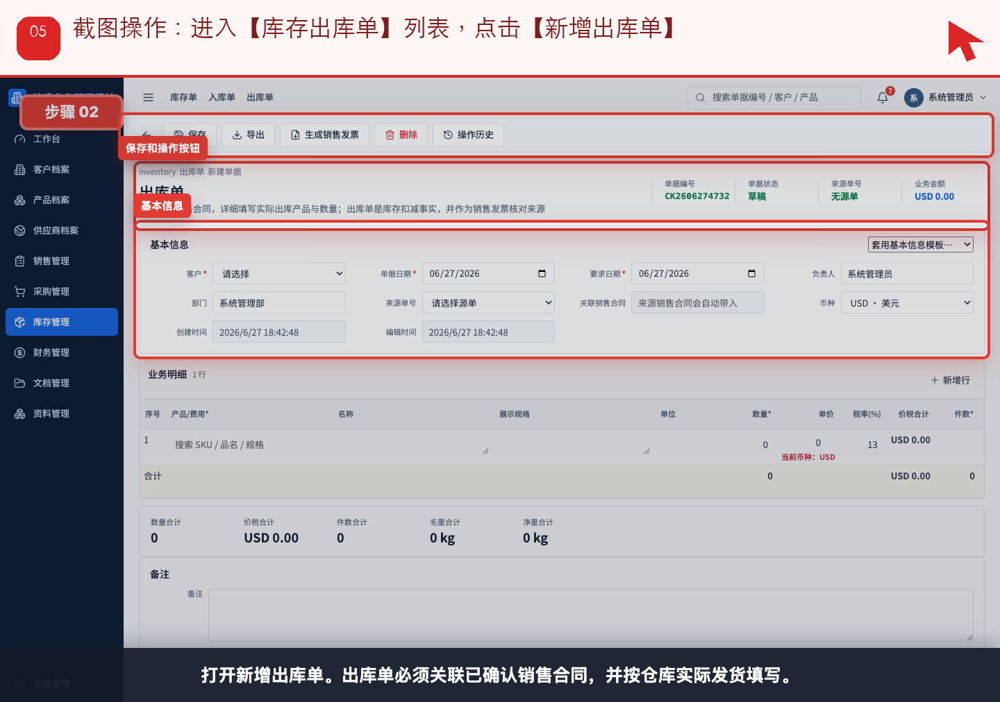
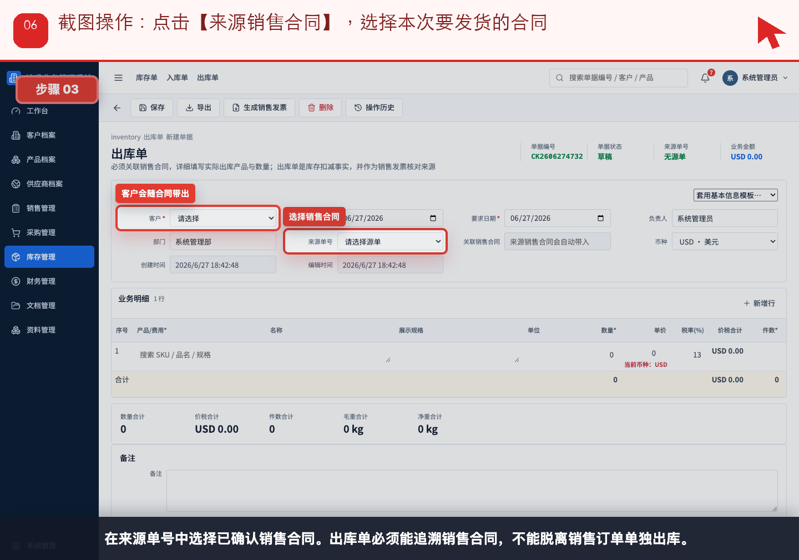
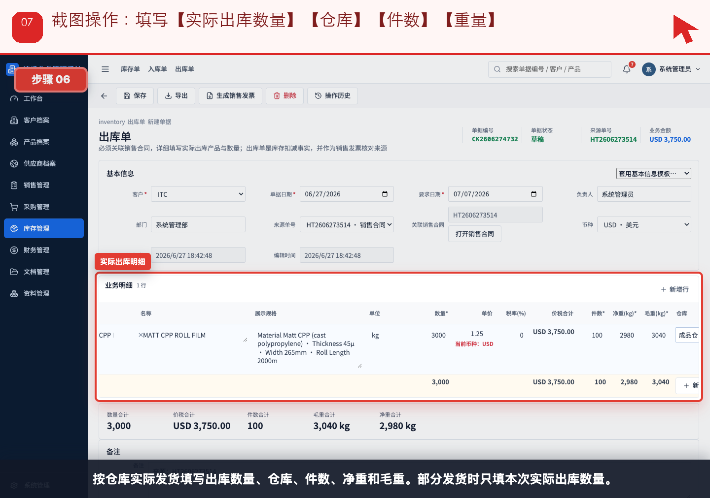
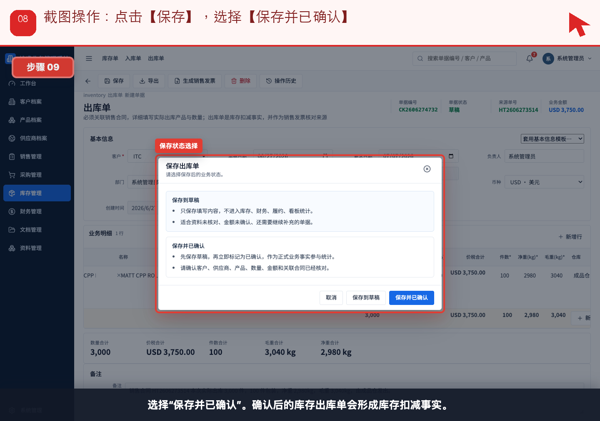
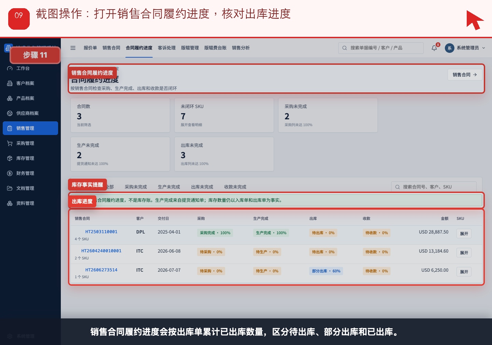

# 流程 04：供应商发货后，仓管如何入库并给客户出库

本流程从 **仓管员，采购和销售查看履约状态** 的实际业务需求出发，不按表单字段讲解。截图顶部红色提示写明本步要点击、填写或核对的位置。

## 业务场景

- **谁来做**：仓管员，采购和销售查看履约状态
- **为什么做**：货物实际移动时，仓管要记录真实入库和真实出库，避免把 ready 状态误认为库存。
- **财务参与**：入库单是采购发票来源，出库单是销售发票来源；入库/出库本身不进资金流水。
- **下一步交接**：出库确认后，财务进入“流程 05：销售发票与收款”；入库确认后，财务进入“流程 06：采购发票与付款”。

## 操作步骤

### 步骤 01：在提货通知详情页点击【下推入库单】

按截图顶部红色提示操作：在提货通知详情页点击【下推入库单】。

### 步骤 02：在确认弹窗点击【继续下推】

按截图顶部红色提示操作：在确认弹窗点击【继续下推】。

### 步骤 03：进入入库单草稿，填写【实际入库数量】【仓库】【件数】【重量】

按截图顶部红色提示操作：进入入库单草稿，填写【实际入库数量】【仓库】【件数】【重量】。

### 步骤 04：点击【保存】，选择【保存并已确认】

按截图顶部红色提示操作：点击【保存】，选择【保存并已确认】。

### 步骤 05：进入【库存出库单】列表，点击【新增出库单】

按截图顶部红色提示操作：进入【库存出库单】列表，点击【新增出库单】。

### 步骤 06：点击【来源销售合同】，选择本次要发货的合同

按截图顶部红色提示操作：点击【来源销售合同】，选择本次要发货的合同。

### 步骤 07：填写【实际出库数量】【仓库】【件数】【重量】

按截图顶部红色提示操作：填写【实际出库数量】【仓库】【件数】【重量】。

### 步骤 08：点击【保存】，选择【保存并已确认】

按截图顶部红色提示操作：点击【保存】，选择【保存并已确认】。

### 步骤 09：打开销售合同履约进度，核对出库进度

按截图顶部红色提示操作：打开销售合同履约进度，核对出库进度。

## 完成标准

- 当前角色完成了本流程的关键动作。
- 如果本流程产生财务影响，已经由财务创建或核对对应财务单据。
- 下一角色可以从来源单据、看板或列表继续处理，不需要重新录入同一业务事实。

[返回实际业务流程索引](../README.md)
