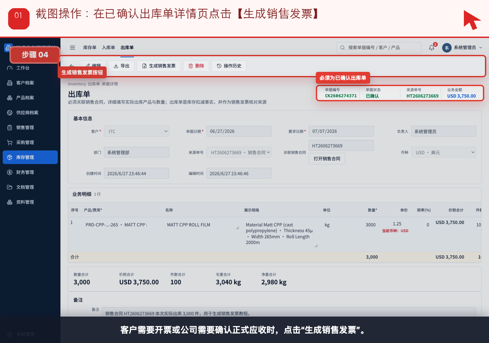
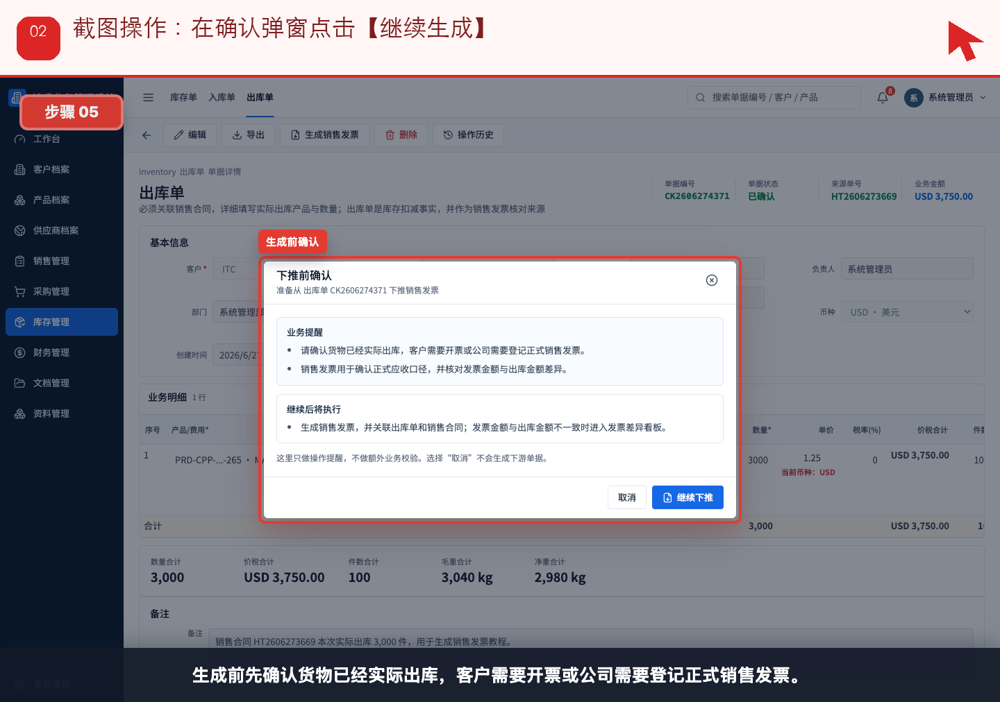
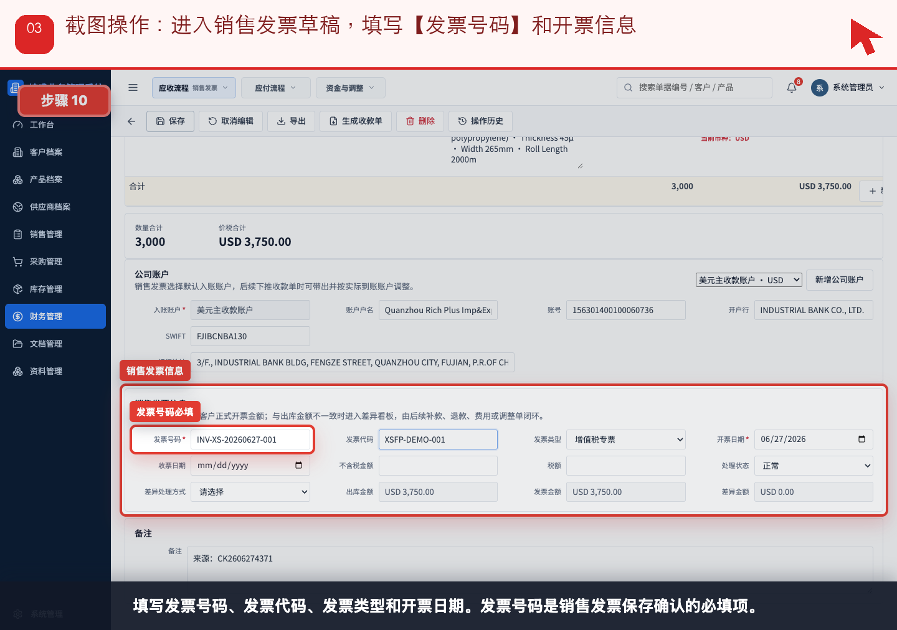
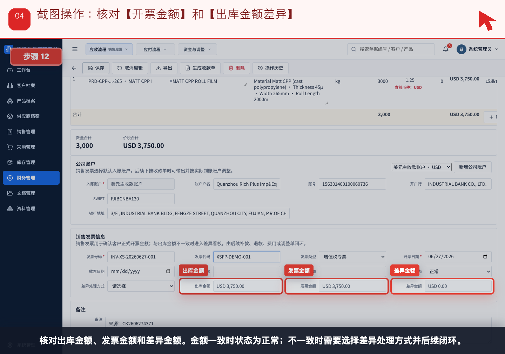
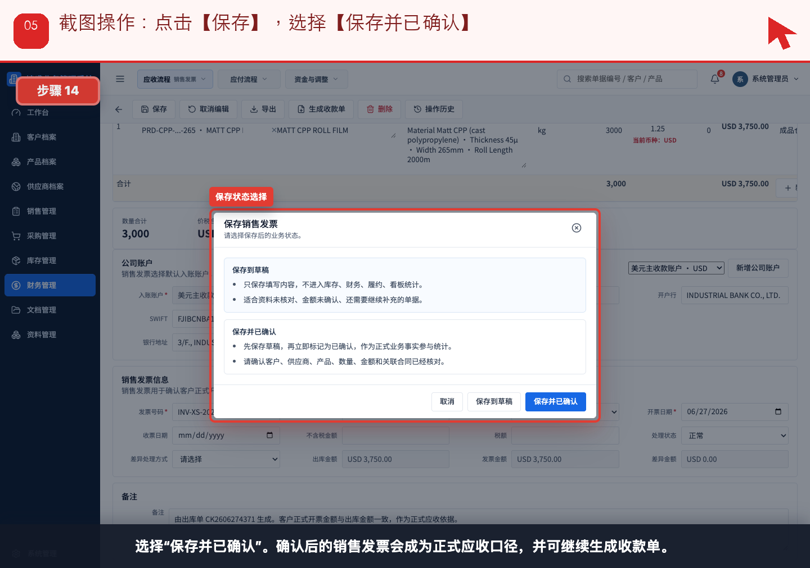
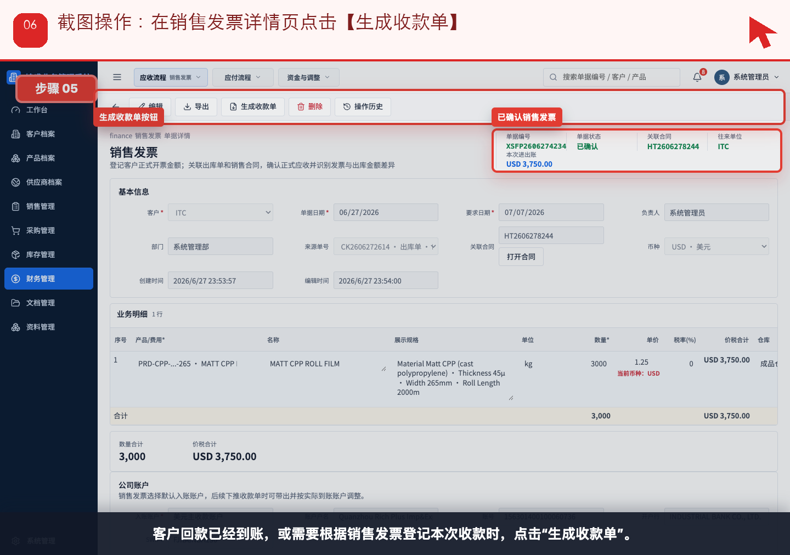
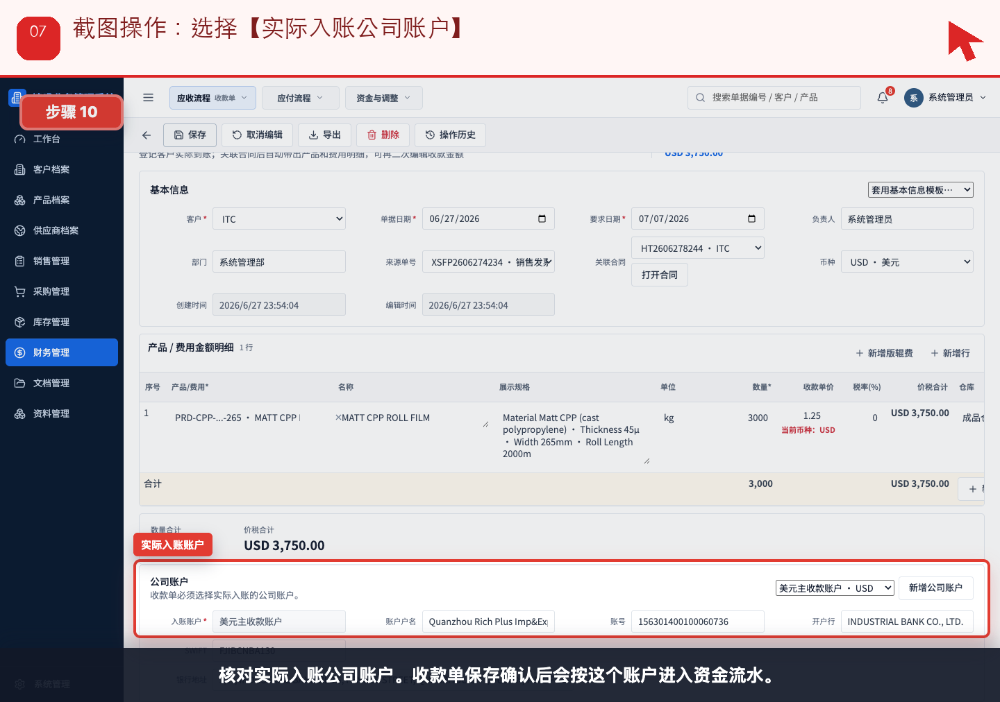
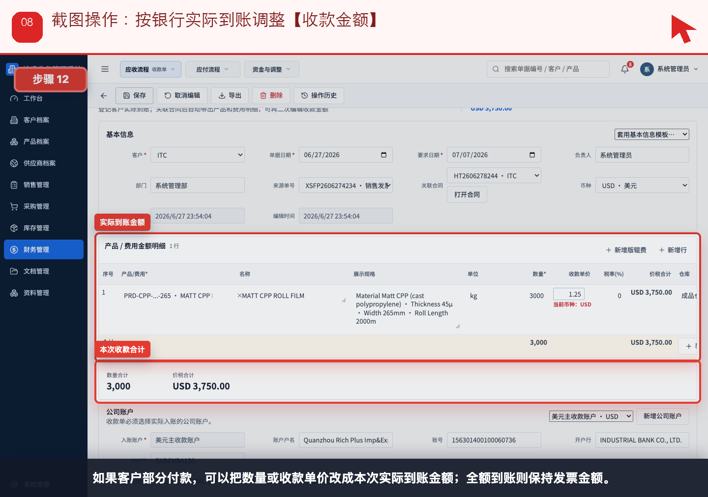
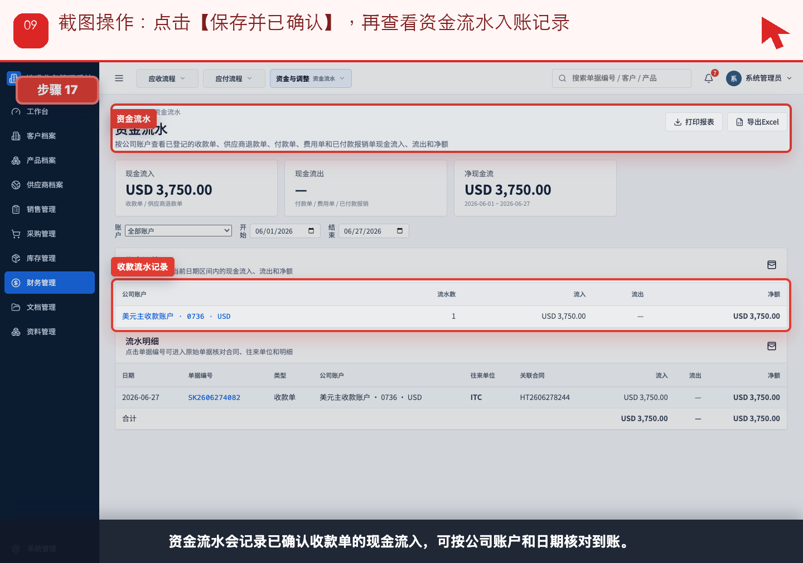

# 流程 05：客户出货后，财务如何开销售发票并登记收款

本流程从 **财务，销售查看应收状态** 的实际业务需求出发，不按表单字段讲解。截图顶部红色提示写明本步要点击、填写或核对的位置。

## 业务场景

- **谁来做**：财务，销售查看应收状态
- **为什么做**：出库完成后，财务要确认正式应收，客户到账后登记真实现金流入。
- **财务参与**：销售发票确认正式应收；收款单确认实际到账并进入资金流水。
- **下一步交接**：收款确认后，销售和管理层在应收看板、账龄和资金流水中核对闭环。

## 操作步骤

### 步骤 01：在已确认出库单详情页点击【生成销售发票】

按截图顶部红色提示操作：在已确认出库单详情页点击【生成销售发票】。

### 步骤 02：在确认弹窗点击【继续生成】

按截图顶部红色提示操作：在确认弹窗点击【继续生成】。

### 步骤 03：进入销售发票草稿，填写【发票号码】和开票信息

按截图顶部红色提示操作：进入销售发票草稿，填写【发票号码】和开票信息。

### 步骤 04：核对【开票金额】和【出库金额差异】

按截图顶部红色提示操作：核对【开票金额】和【出库金额差异】。

### 步骤 05：点击【保存】，选择【保存并已确认】

按截图顶部红色提示操作：点击【保存】，选择【保存并已确认】。

### 步骤 06：在销售发票详情页点击【生成收款单】

按截图顶部红色提示操作：在销售发票详情页点击【生成收款单】。

### 步骤 07：选择【实际入账公司账户】

按截图顶部红色提示操作：选择【实际入账公司账户】。

### 步骤 08：按银行实际到账调整【收款金额】

按截图顶部红色提示操作：按银行实际到账调整【收款金额】。

### 步骤 09：点击【保存并已确认】，再查看资金流水入账记录

按截图顶部红色提示操作：点击【保存并已确认】，再查看资金流水入账记录。

## 完成标准

- 当前角色完成了本流程的关键动作。
- 如果本流程产生财务影响，已经由财务创建或核对对应财务单据。
- 下一角色可以从来源单据、看板或列表继续处理，不需要重新录入同一业务事实。

[返回实际业务流程索引](../README.md)
