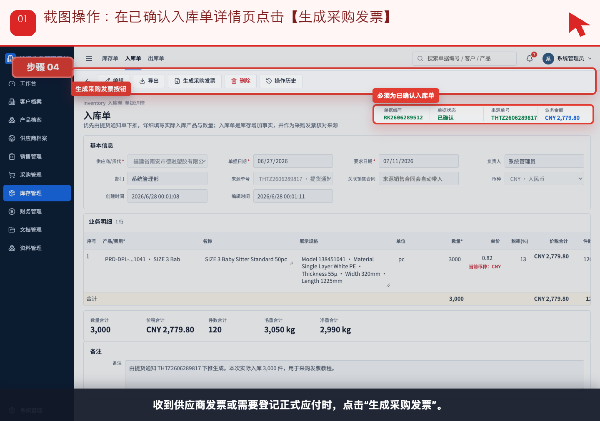
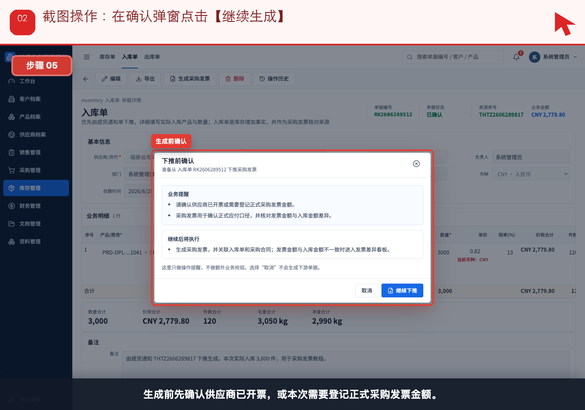
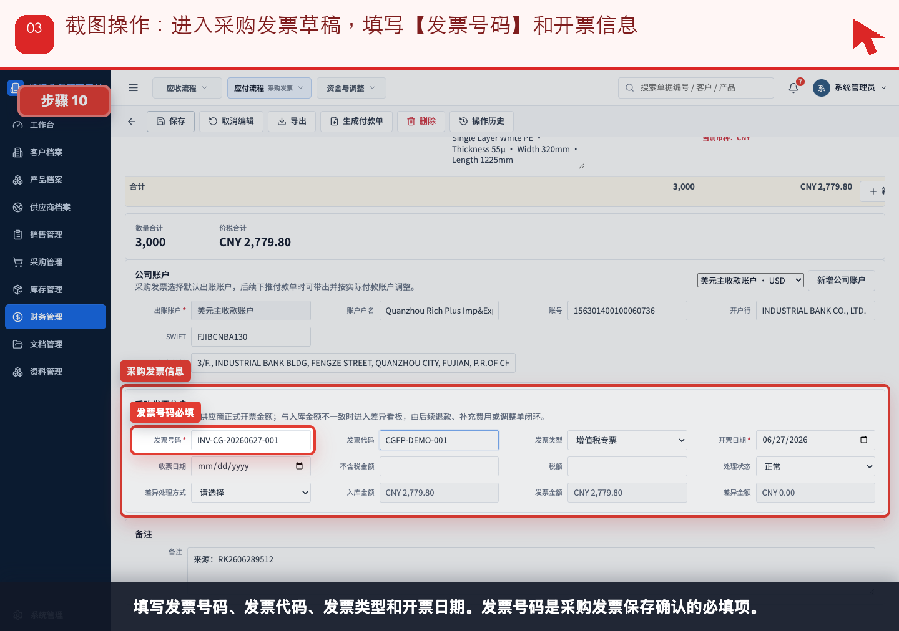
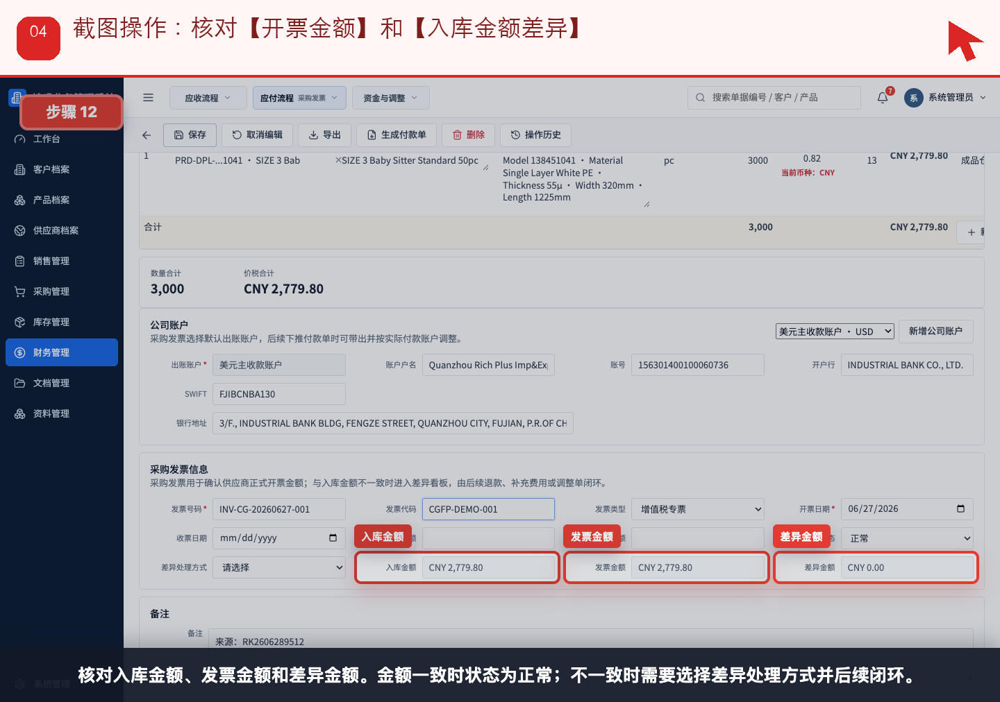
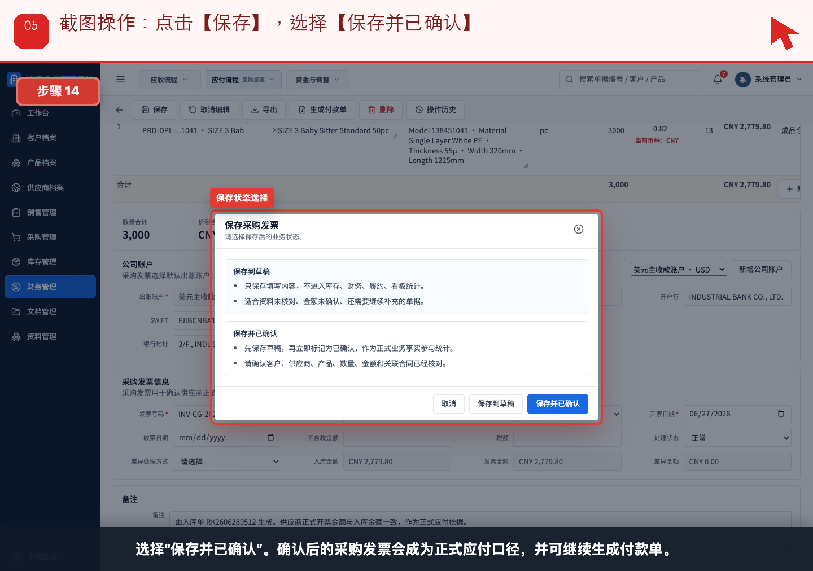
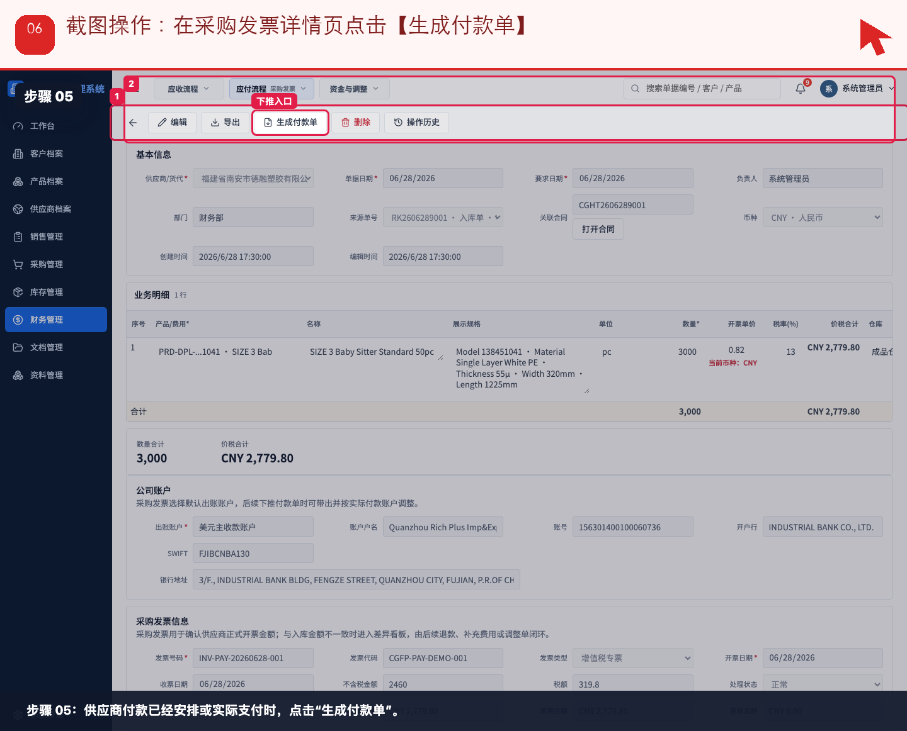
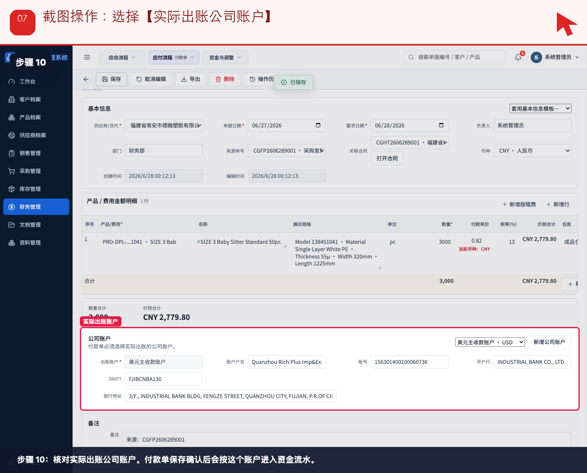
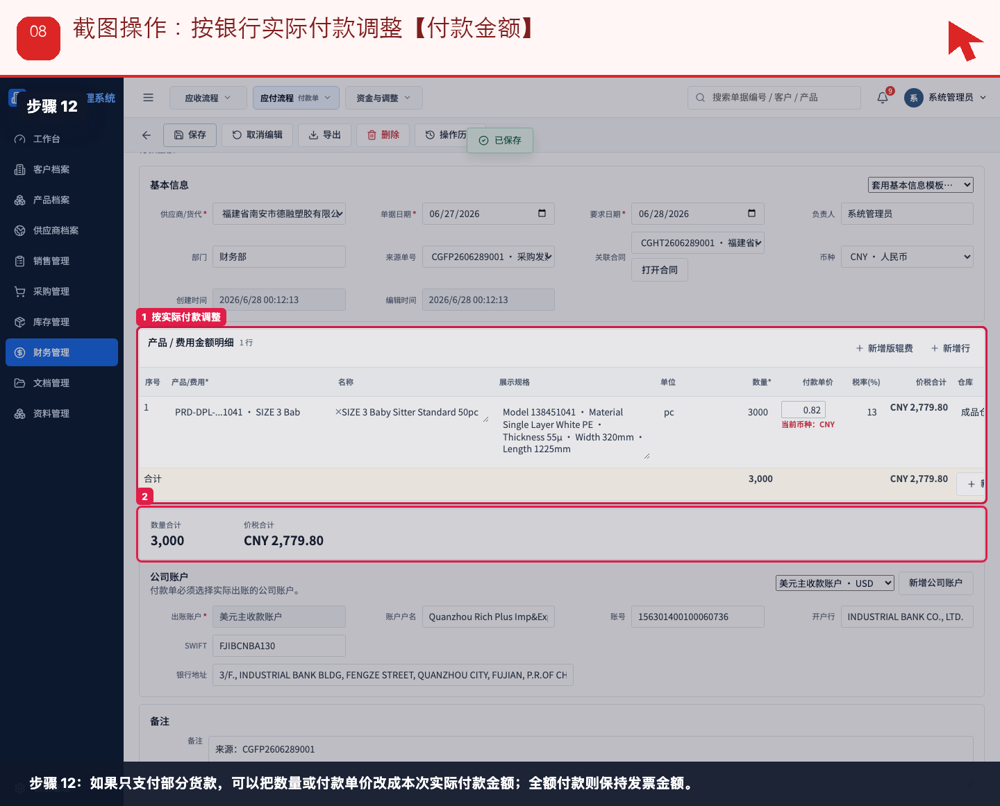
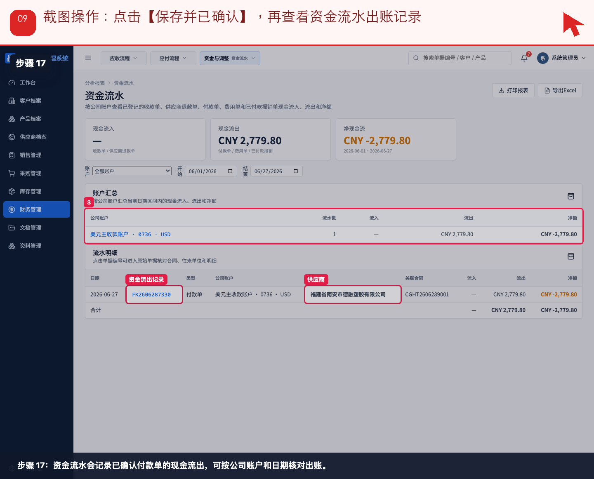

# 流程 06：供应商开票后，财务如何登记采购发票并付款

本流程从 **财务，采购查看应付状态** 的实际业务需求出发，不按表单字段讲解。截图顶部红色提示写明本步要点击、填写或核对的位置。

## 业务场景

- **谁来做**：财务，采购查看应付状态
- **为什么做**：供应商开票并要求付款时，财务要从入库事实确认正式应付，再按银行实际付款登记现金流出。
- **财务参与**：采购发票确认正式应付；付款单确认实际出账并进入资金流水。
- **下一步交接**：付款确认后，采购和管理层在应付看板、账龄和资金流水中核对闭环。

## 操作步骤

### 步骤 01：在已确认入库单详情页点击【生成采购发票】

按截图顶部红色提示操作：在已确认入库单详情页点击【生成采购发票】。

### 步骤 02：在确认弹窗点击【继续生成】

按截图顶部红色提示操作：在确认弹窗点击【继续生成】。

### 步骤 03：进入采购发票草稿，填写【发票号码】和开票信息

按截图顶部红色提示操作：进入采购发票草稿，填写【发票号码】和开票信息。

### 步骤 04：核对【开票金额】和【入库金额差异】

按截图顶部红色提示操作：核对【开票金额】和【入库金额差异】。

### 步骤 05：点击【保存】，选择【保存并已确认】

按截图顶部红色提示操作：点击【保存】，选择【保存并已确认】。

### 步骤 06：在采购发票详情页点击【生成付款单】

按截图顶部红色提示操作：在采购发票详情页点击【生成付款单】。

### 步骤 07：选择【实际出账公司账户】

按截图顶部红色提示操作：选择【实际出账公司账户】。

### 步骤 08：按银行实际付款调整【付款金额】

按截图顶部红色提示操作：按银行实际付款调整【付款金额】。

### 步骤 09：点击【保存并已确认】，再查看资金流水出账记录

按截图顶部红色提示操作：点击【保存并已确认】，再查看资金流水出账记录。

## 完成标准

- 当前角色完成了本流程的关键动作。
- 如果本流程产生财务影响，已经由财务创建或核对对应财务单据。
- 下一角色可以从来源单据、看板或列表继续处理，不需要重新录入同一业务事实。

[返回实际业务流程索引](../README.md)
