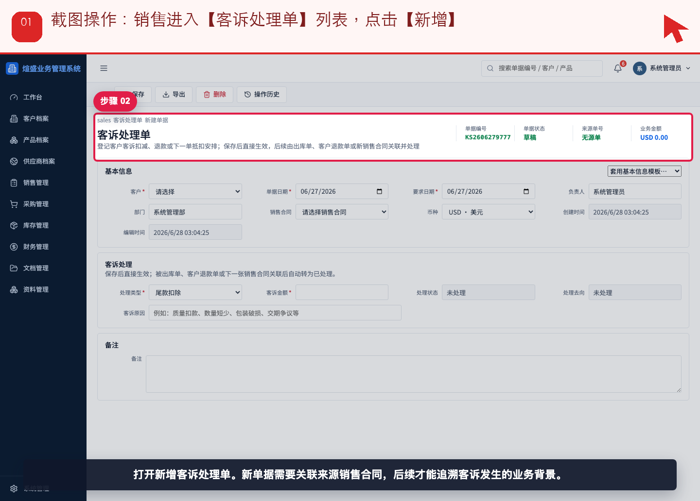
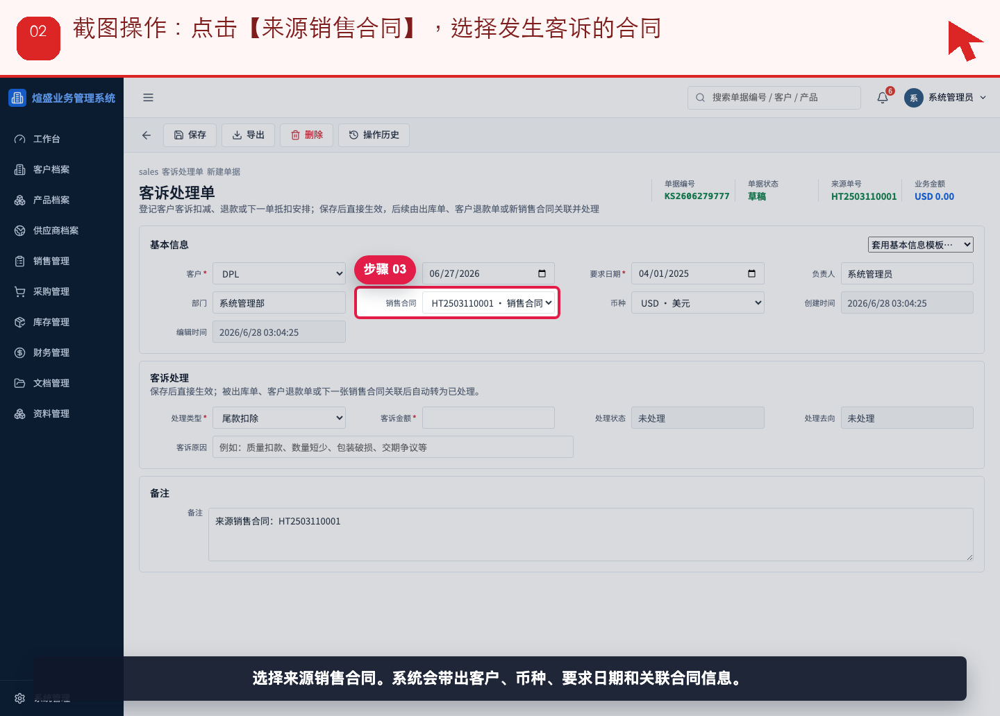
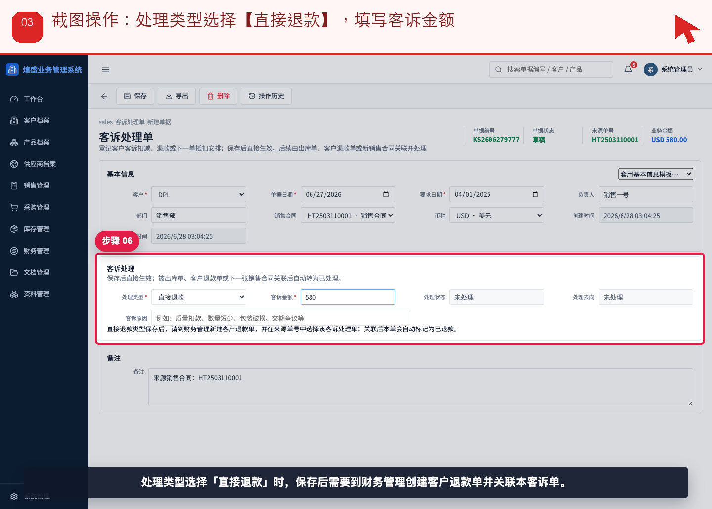
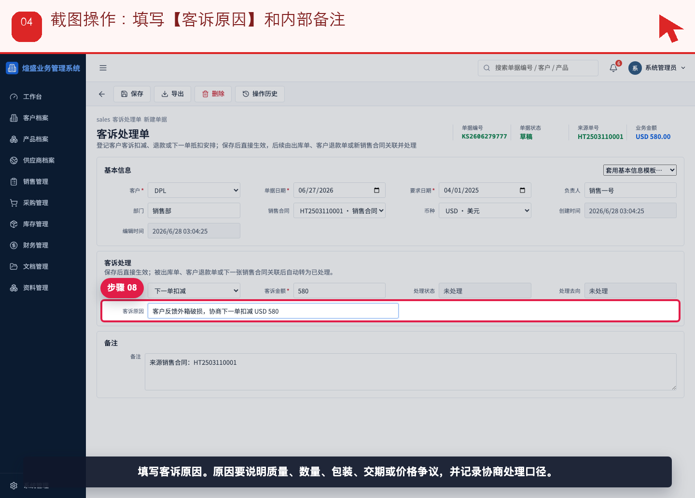
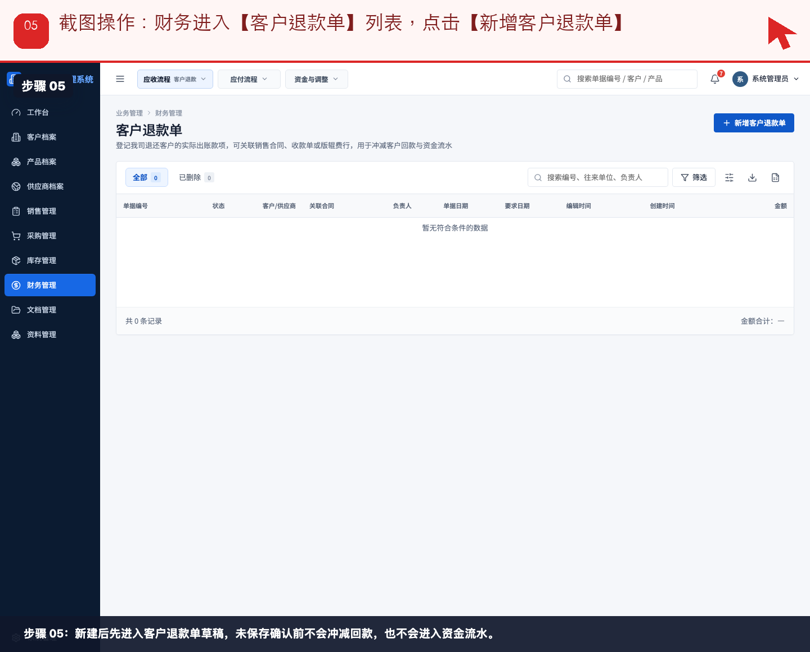
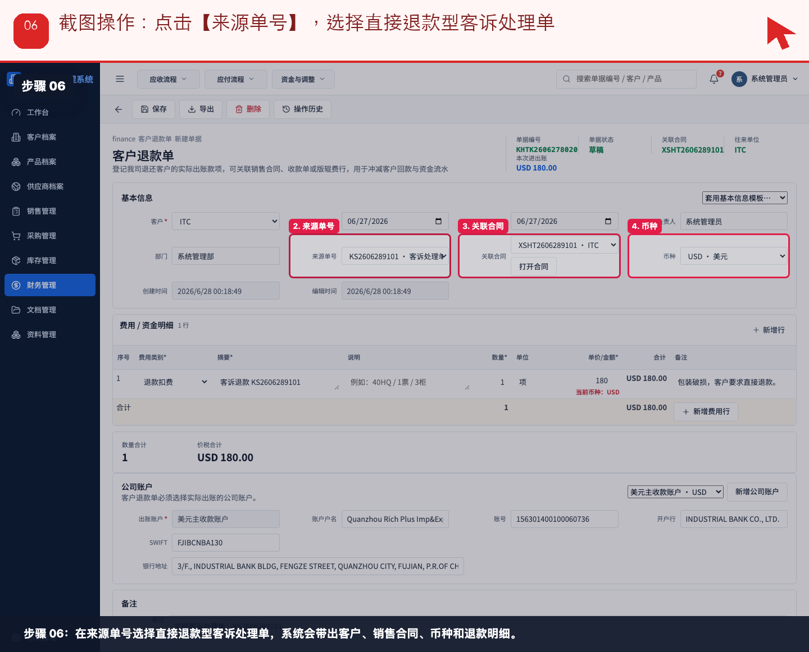
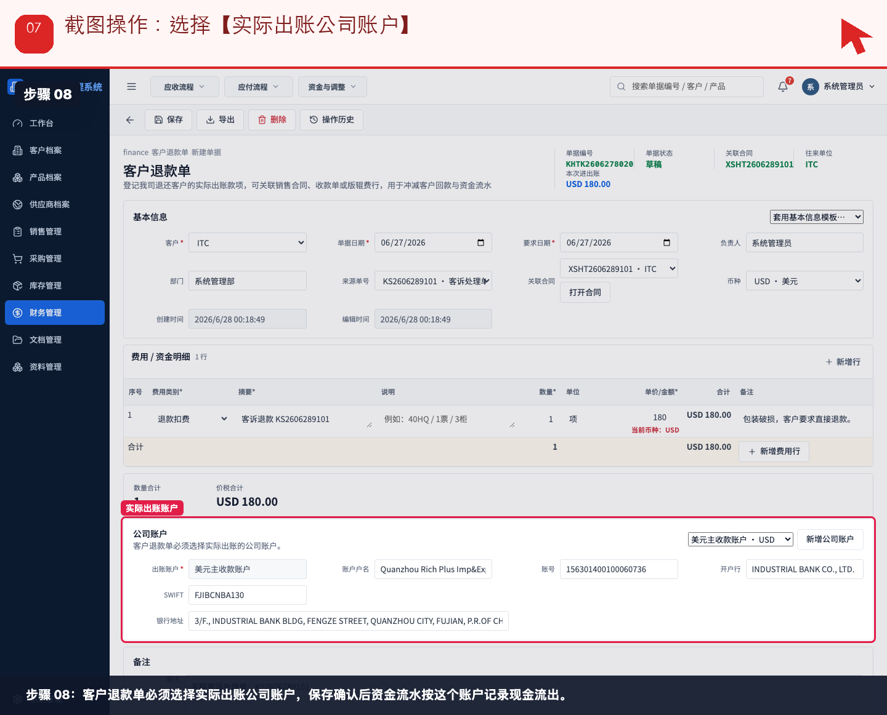
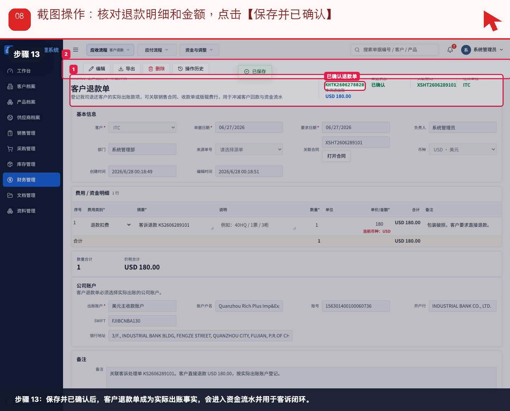
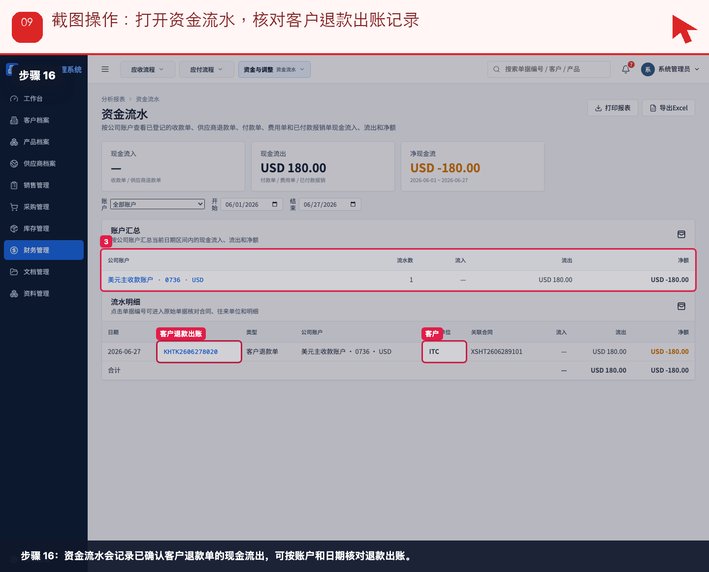

# 流程 07：客户投诉要求退款，销售和财务如何闭环

本流程从 **销售/业务员，财务，管理层查看** 的实际业务需求出发，不按表单字段讲解。截图顶部红色提示写明本步要点击、填写或核对的位置。

## 业务场景

- **谁来做**：销售/业务员，财务，管理层查看
- **为什么做**：客户提出质量、数量、包装或交期问题并要求退款时，销售先登记客诉，财务再登记真实退款出账。
- **财务参与**：客诉处理单只记录原因和处理方案；客户退款单才是实际现金流出。
- **下一步交接**：客户退款确认后，销售查看客诉状态，管理层查看资金流水和应收影响。

## 操作步骤

### 步骤 01：销售进入【客诉处理单】列表，点击【新增】

按截图顶部红色提示操作：销售进入【客诉处理单】列表，点击【新增】。

### 步骤 02：点击【来源销售合同】，选择发生客诉的合同

按截图顶部红色提示操作：点击【来源销售合同】，选择发生客诉的合同。

### 步骤 03：处理类型选择【直接退款】，填写客诉金额

按截图顶部红色提示操作：处理类型选择【直接退款】，填写客诉金额。

### 步骤 04：填写【客诉原因】和内部备注

按截图顶部红色提示操作：填写【客诉原因】和内部备注。

### 步骤 05：财务进入【客户退款单】列表，点击【新增客户退款单】

按截图顶部红色提示操作：财务进入【客户退款单】列表，点击【新增客户退款单】。

### 步骤 06：点击【来源单号】，选择直接退款型客诉处理单

按截图顶部红色提示操作：点击【来源单号】，选择直接退款型客诉处理单。

### 步骤 07：选择【实际出账公司账户】

按截图顶部红色提示操作：选择【实际出账公司账户】。

### 步骤 08：核对退款明细和金额，点击【保存并已确认】

按截图顶部红色提示操作：核对退款明细和金额，点击【保存并已确认】。

### 步骤 09：打开资金流水，核对客户退款出账记录

按截图顶部红色提示操作：打开资金流水，核对客户退款出账记录。

## 完成标准

- 当前角色完成了本流程的关键动作。
- 如果本流程产生财务影响，已经由财务创建或核对对应财务单据。
- 下一角色可以从来源单据、看板或列表继续处理，不需要重新录入同一业务事实。

[返回实际业务流程索引](../README.md)
