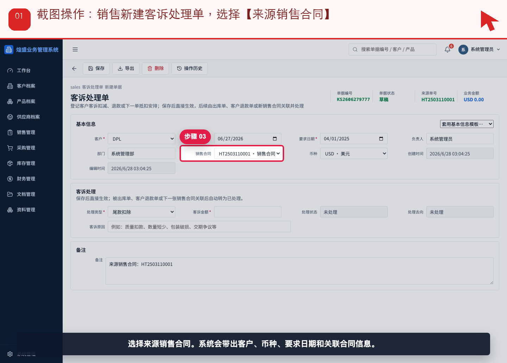
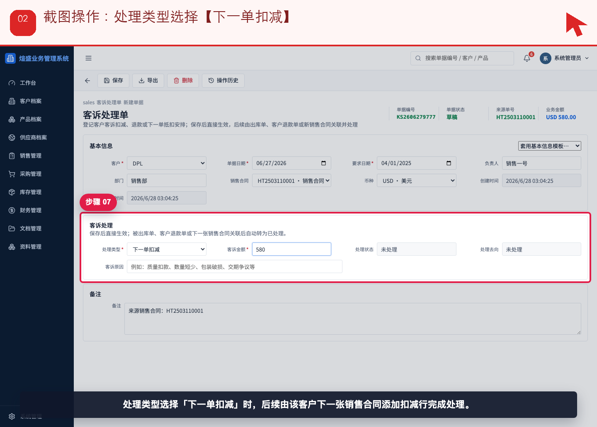
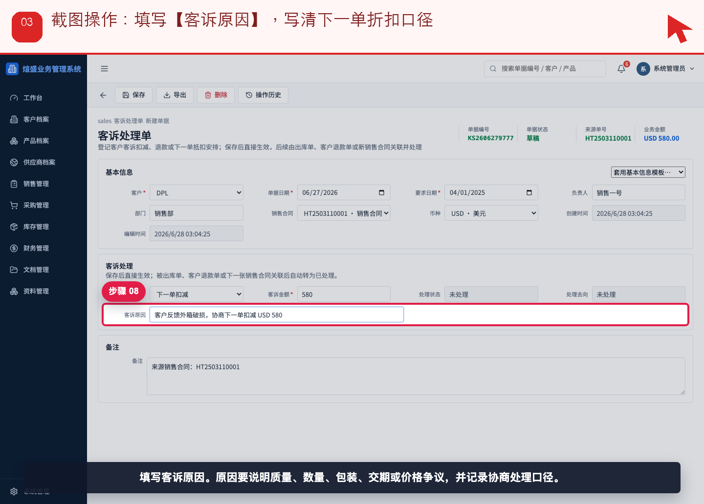
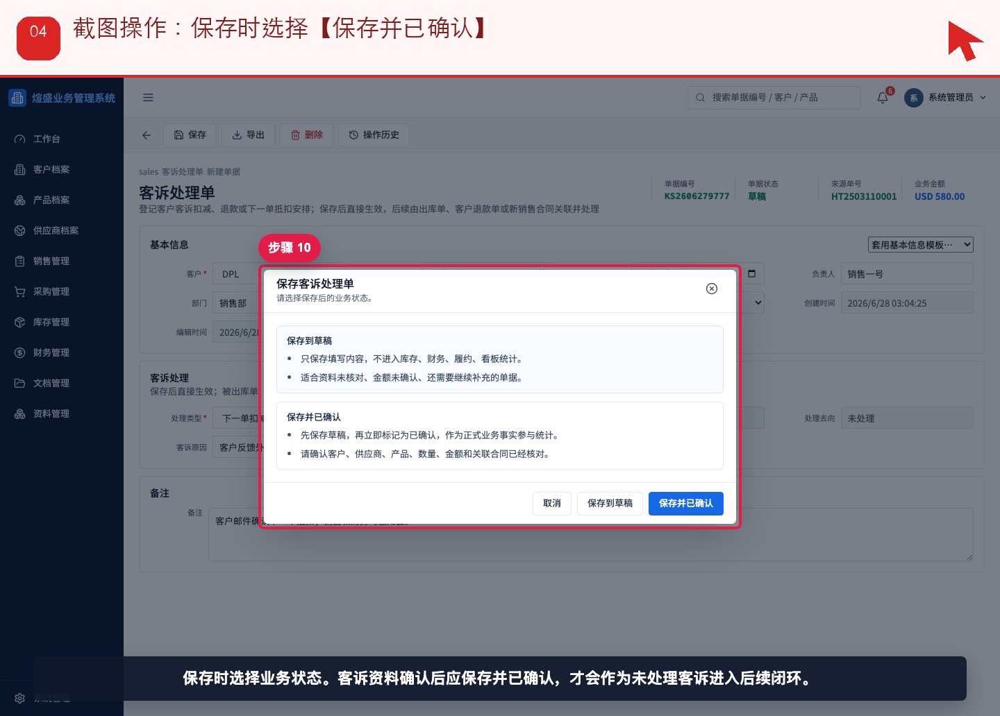
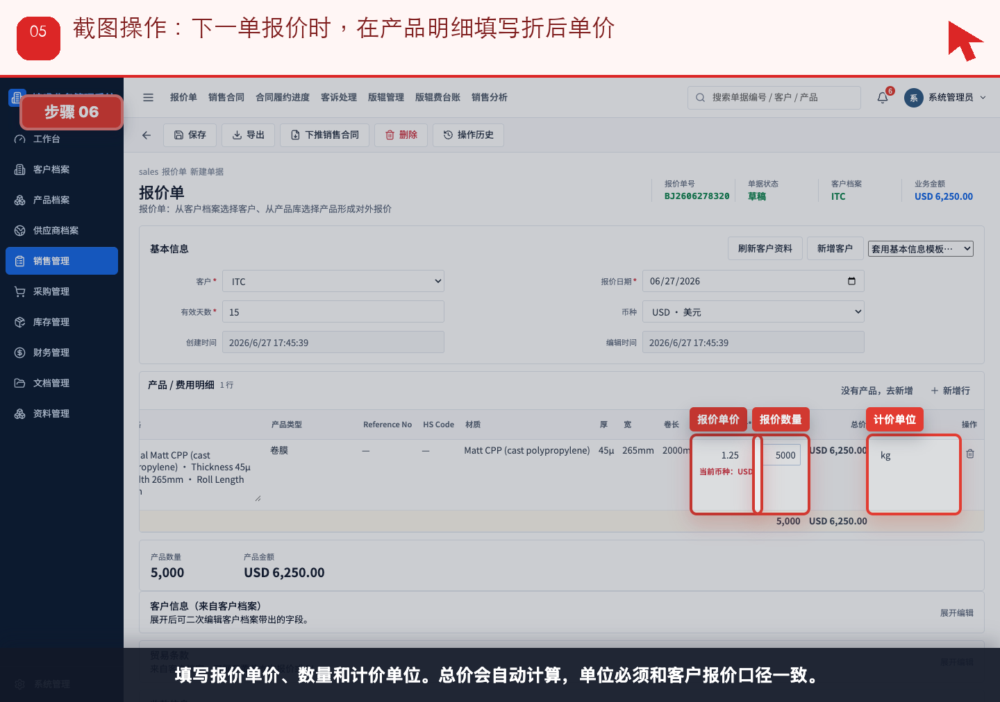
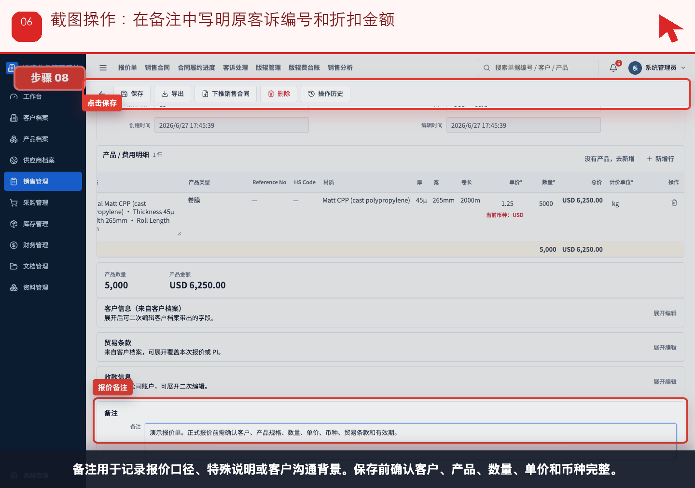
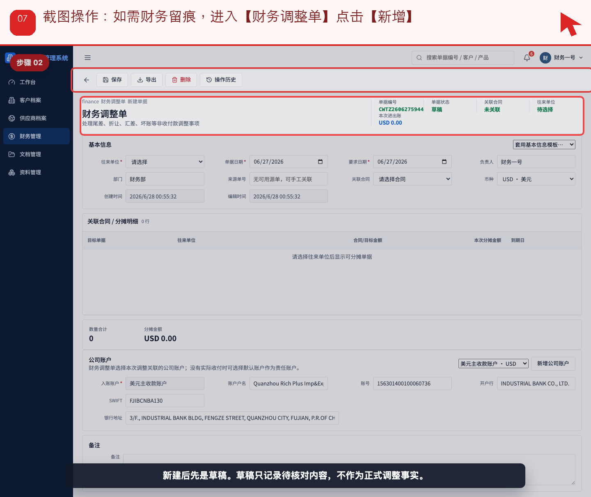
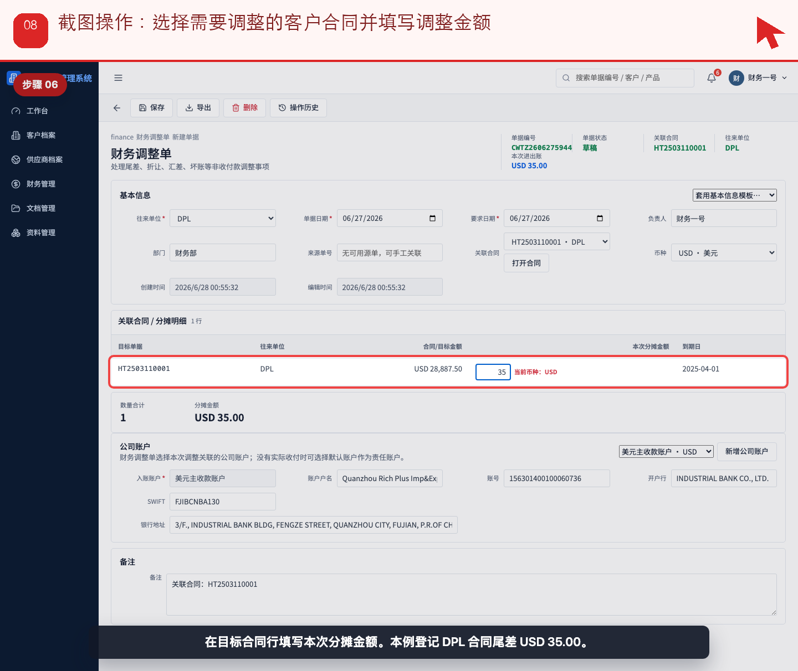
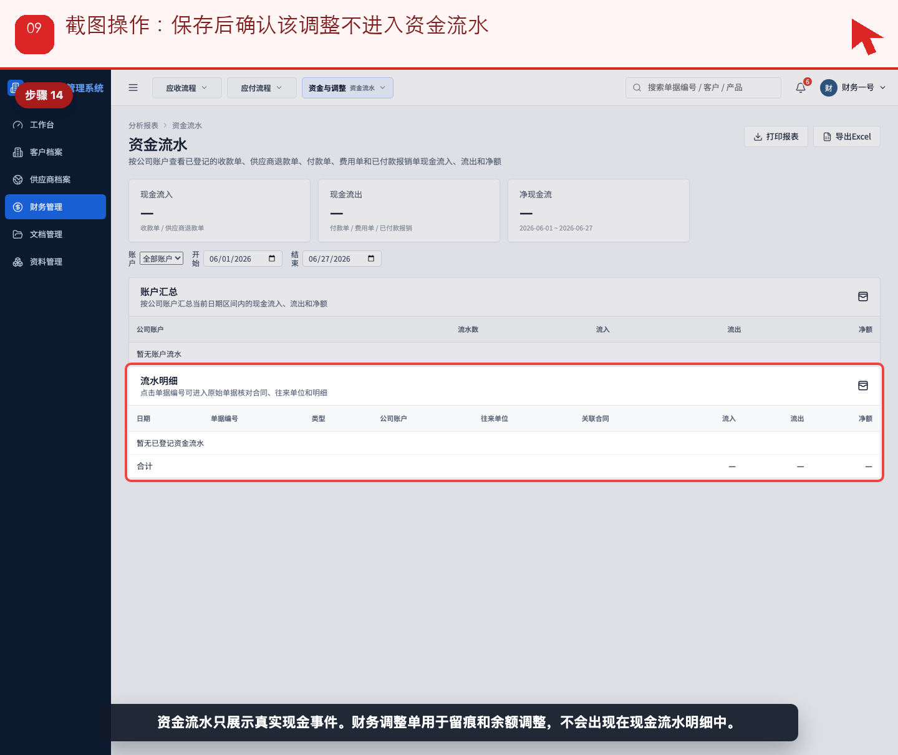

# 流程 08：客户投诉改为下一单打折，销售和财务如何留痕

本流程从 **销售/业务员，财务** 的实际业务需求出发，不按表单字段讲解。截图顶部红色提示写明本步要点击、填写或核对的位置。

## 业务场景

- **谁来做**：销售/业务员，财务
- **为什么做**：客户不要求立即退款，而要求下一单折扣时，销售要记录原客诉，下一单价格要体现抵扣，财务要解释发票差异或调整。
- **财务参与**：没有真实退款时不要建客户退款单；如需留痕或核销尾差，用财务调整单，不进入资金流水。
- **下一步交接**：下一张报价或销售合同创建时，销售要在备注中关联原客诉编号。

## 操作步骤

### 步骤 01：销售新建客诉处理单，选择【来源销售合同】

按截图顶部红色提示操作：销售新建客诉处理单，选择【来源销售合同】。

### 步骤 02：处理类型选择【下一单扣减】

按截图顶部红色提示操作：处理类型选择【下一单扣减】。

### 步骤 03：填写【客诉原因】，写清下一单折扣口径

按截图顶部红色提示操作：填写【客诉原因】，写清下一单折扣口径。

### 步骤 04：保存时选择【保存并已确认】

按截图顶部红色提示操作：保存时选择【保存并已确认】。

### 步骤 05：下一单报价时，在产品明细填写折后单价

按截图顶部红色提示操作：下一单报价时，在产品明细填写折后单价。

### 步骤 06：在备注中写明原客诉编号和折扣金额

按截图顶部红色提示操作：在备注中写明原客诉编号和折扣金额。

### 步骤 07：如需财务留痕，进入【财务调整单】点击【新增】

按截图顶部红色提示操作：如需财务留痕，进入【财务调整单】点击【新增】。

### 步骤 08：选择需要调整的客户合同并填写调整金额

按截图顶部红色提示操作：选择需要调整的客户合同并填写调整金额。

### 步骤 09：保存后确认该调整不进入资金流水

按截图顶部红色提示操作：保存后确认该调整不进入资金流水。

## 完成标准

- 当前角色完成了本流程的关键动作。
- 如果本流程产生财务影响，已经由财务创建或核对对应财务单据。
- 下一角色可以从来源单据、看板或列表继续处理，不需要重新录入同一业务事实。

[返回实际业务流程索引](../README.md)
