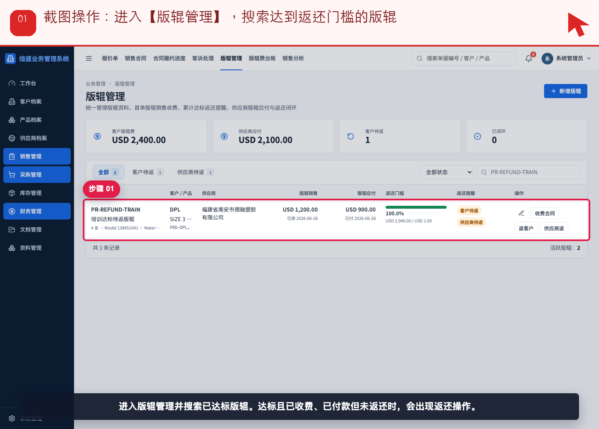
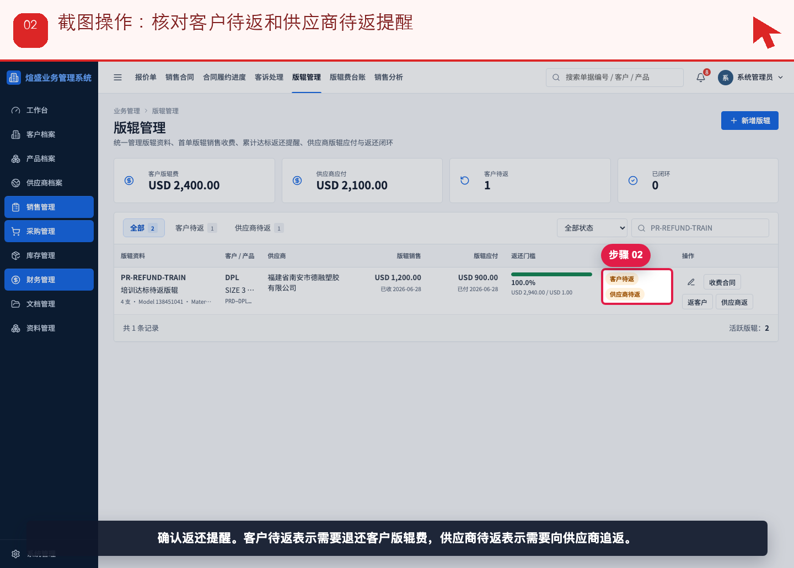
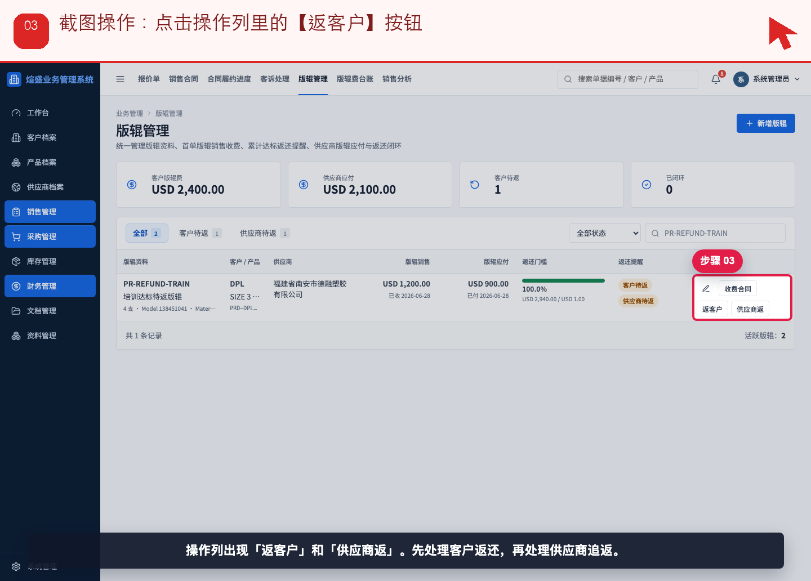
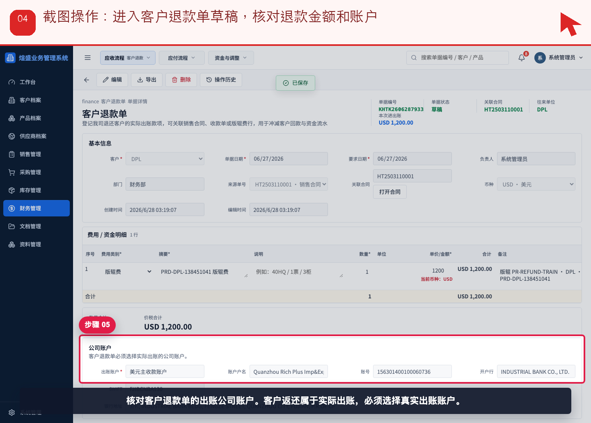
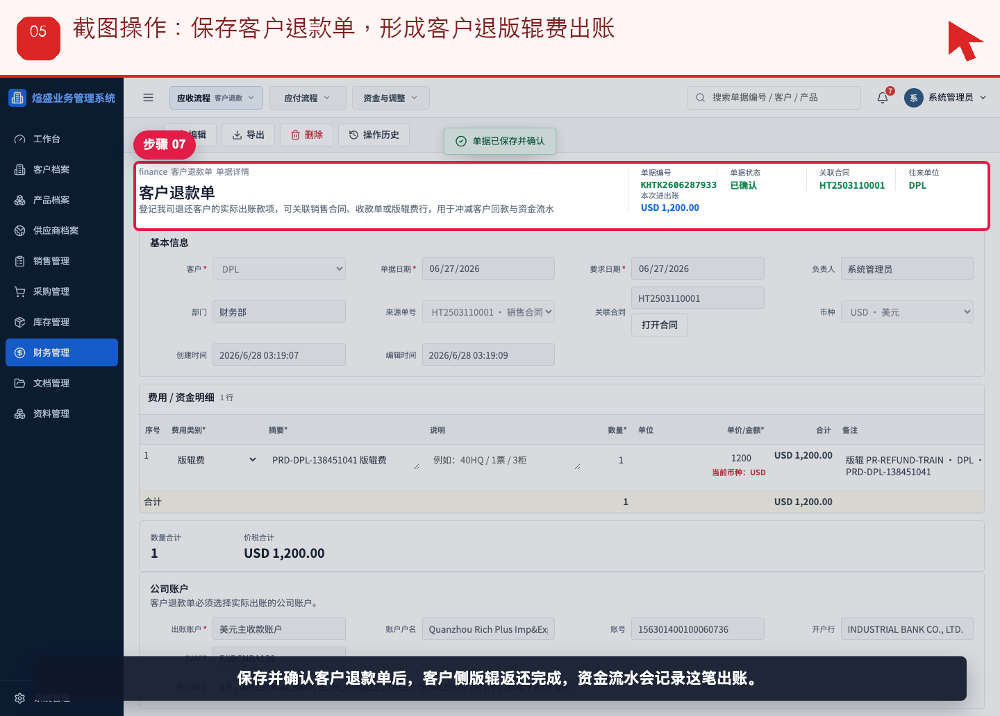
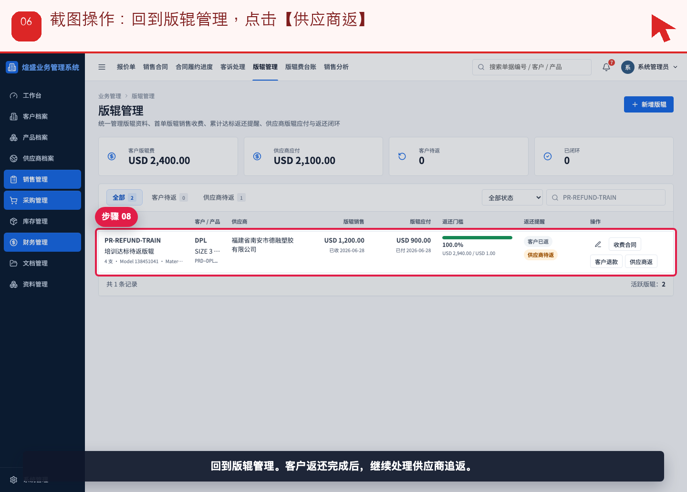
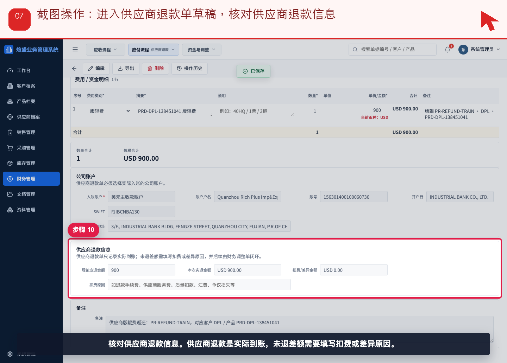
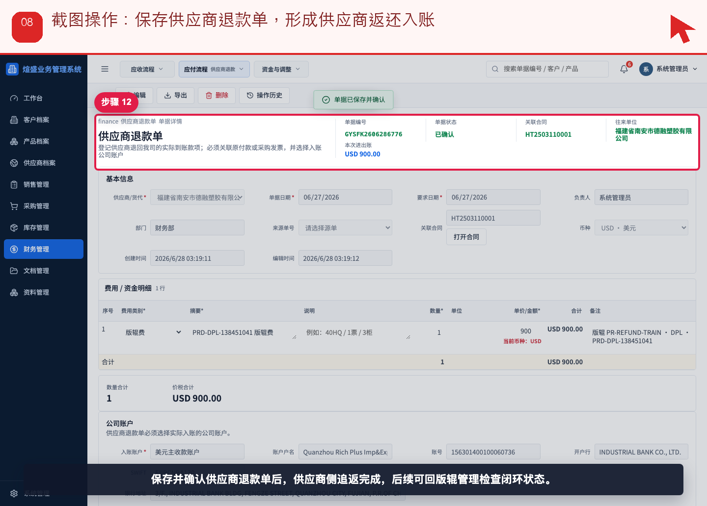
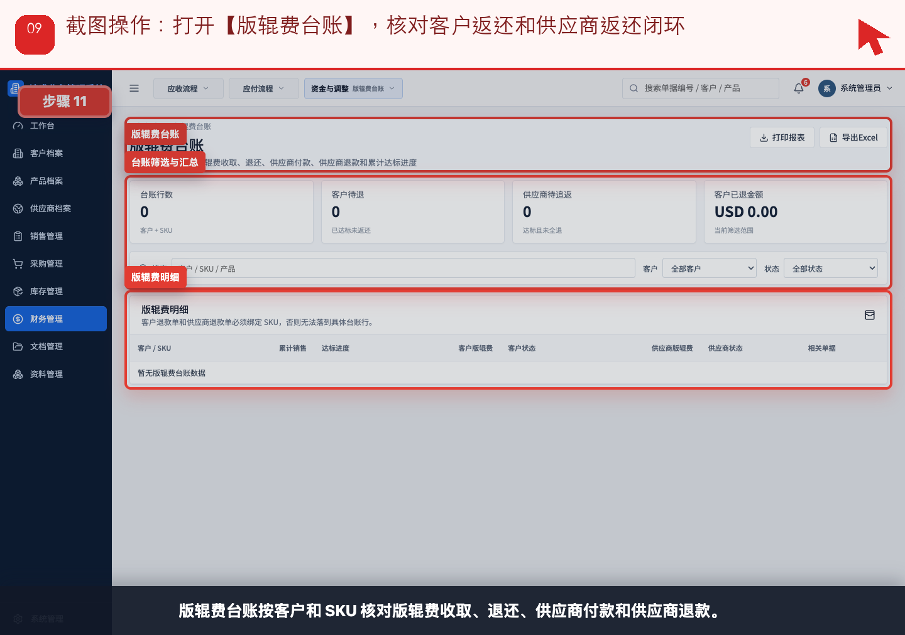

# 流程 09：客户达标后，如何退版辊费并追踪供应商返还

本流程从 **销售，采购，财务** 的实际业务需求出发，不按表单字段讲解。截图顶部红色提示写明本步要点击、填写或核对的位置。

## 业务场景

- **谁来做**：销售，采购，财务
- **为什么做**：产品涉及版辊费时，公司要同时追踪客户收费、供应商付款、达标返还和实际现金流。
- **财务参与**：退给客户用客户退款单；供应商返还用供应商退款单；两者都必须选择实际账户并进入资金流水。
- **下一步交接**：退费后，财务和管理层用版辊费台账核对是否闭环。

## 操作步骤

### 步骤 01：进入【版辊管理】，搜索达到返还门槛的版辊

按截图顶部红色提示操作：进入【版辊管理】，搜索达到返还门槛的版辊。

### 步骤 02：核对客户待返和供应商待返提醒

按截图顶部红色提示操作：核对客户待返和供应商待返提醒。

### 步骤 03：点击操作列里的【返客户】按钮

按截图顶部红色提示操作：点击操作列里的【返客户】按钮。

### 步骤 04：进入客户退款单草稿，核对退款金额和账户

按截图顶部红色提示操作：进入客户退款单草稿，核对退款金额和账户。

### 步骤 05：保存客户退款单，形成客户退版辊费出账

按截图顶部红色提示操作：保存客户退款单，形成客户退版辊费出账。

### 步骤 06：回到版辊管理，点击【供应商返】

按截图顶部红色提示操作：回到版辊管理，点击【供应商返】。

### 步骤 07：进入供应商退款单草稿，核对供应商退款信息

按截图顶部红色提示操作：进入供应商退款单草稿，核对供应商退款信息。

### 步骤 08：保存供应商退款单，形成供应商返还入账

按截图顶部红色提示操作：保存供应商退款单，形成供应商返还入账。

### 步骤 09：打开【版辊费台账】，核对客户返还和供应商返还闭环

按截图顶部红色提示操作：打开【版辊费台账】，核对客户返还和供应商返还闭环。

## 完成标准

- 当前角色完成了本流程的关键动作。
- 如果本流程产生财务影响，已经由财务创建或核对对应财务单据。
- 下一角色可以从来源单据、看板或列表继续处理，不需要重新录入同一业务事实。

[返回实际业务流程索引](../README.md)
