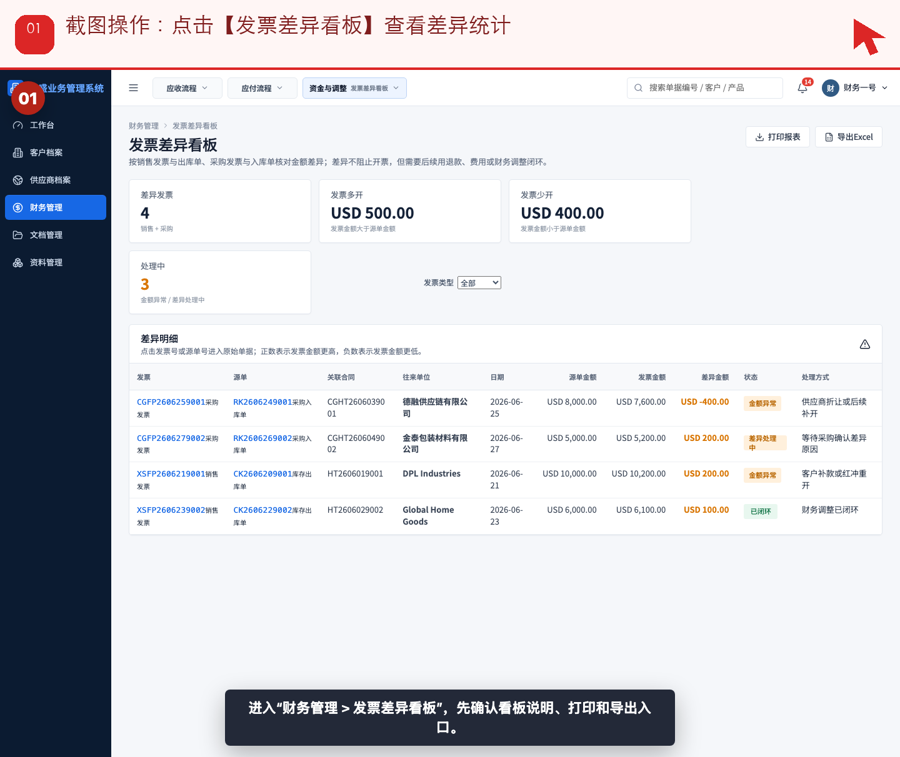
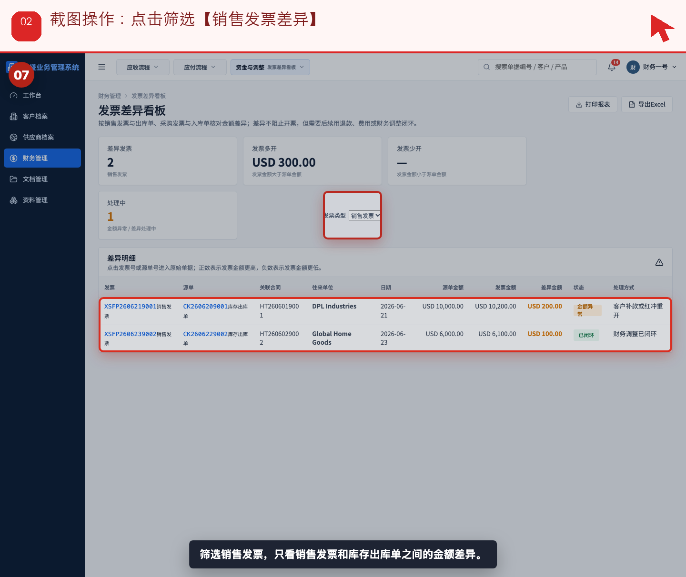
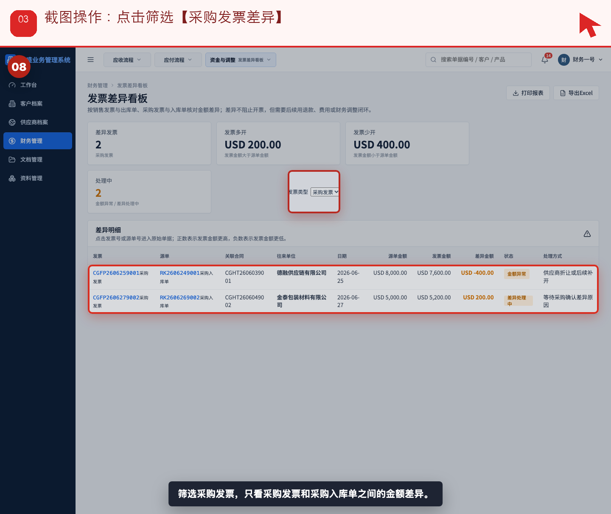
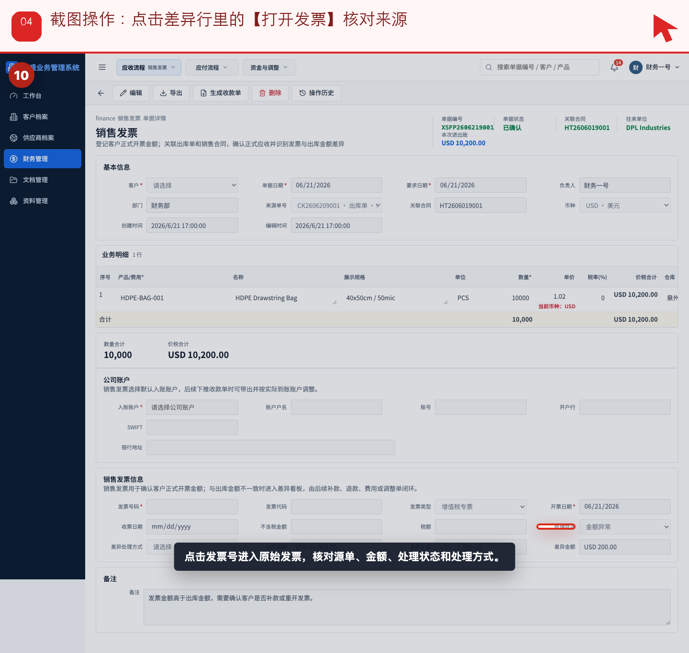
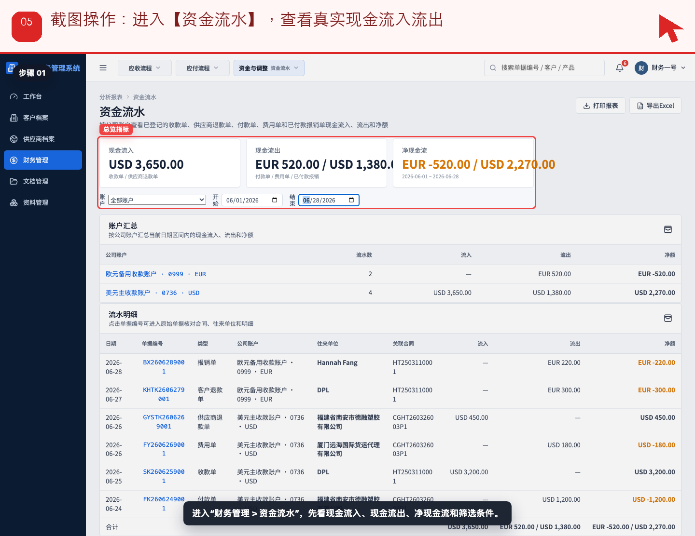
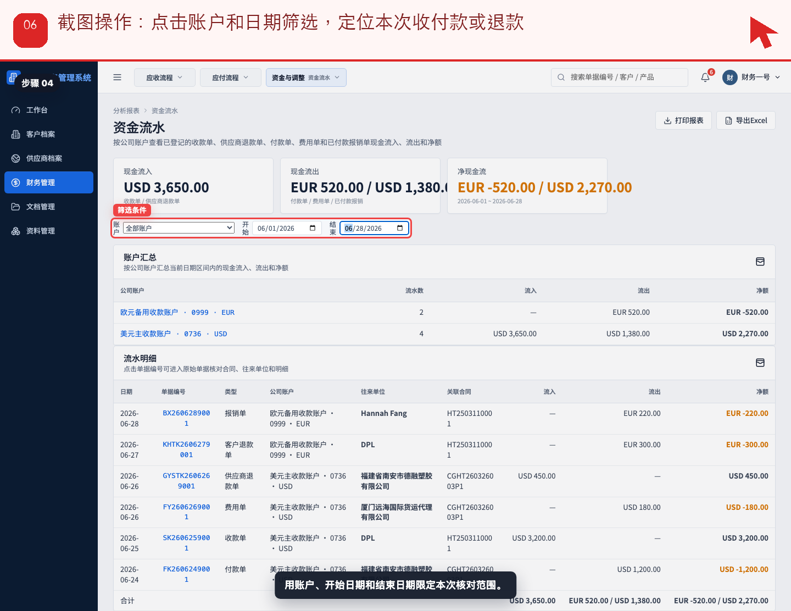
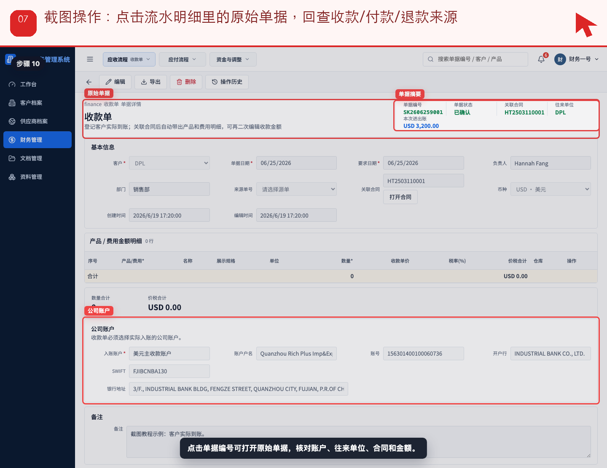
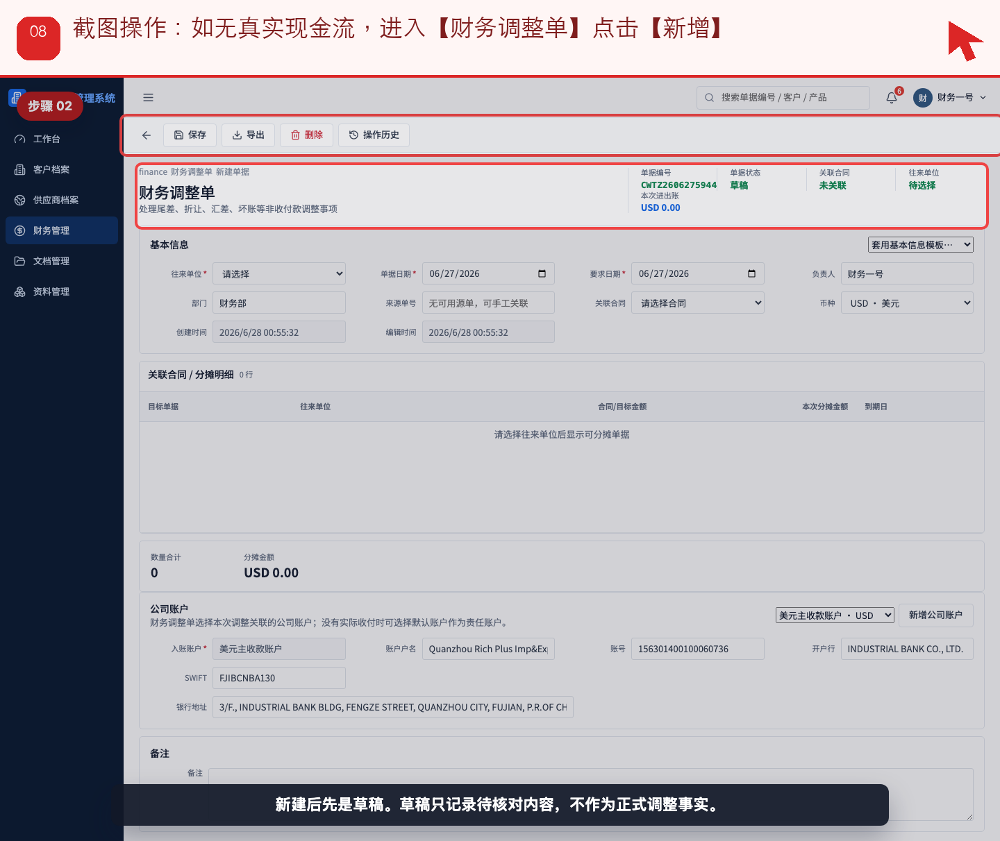
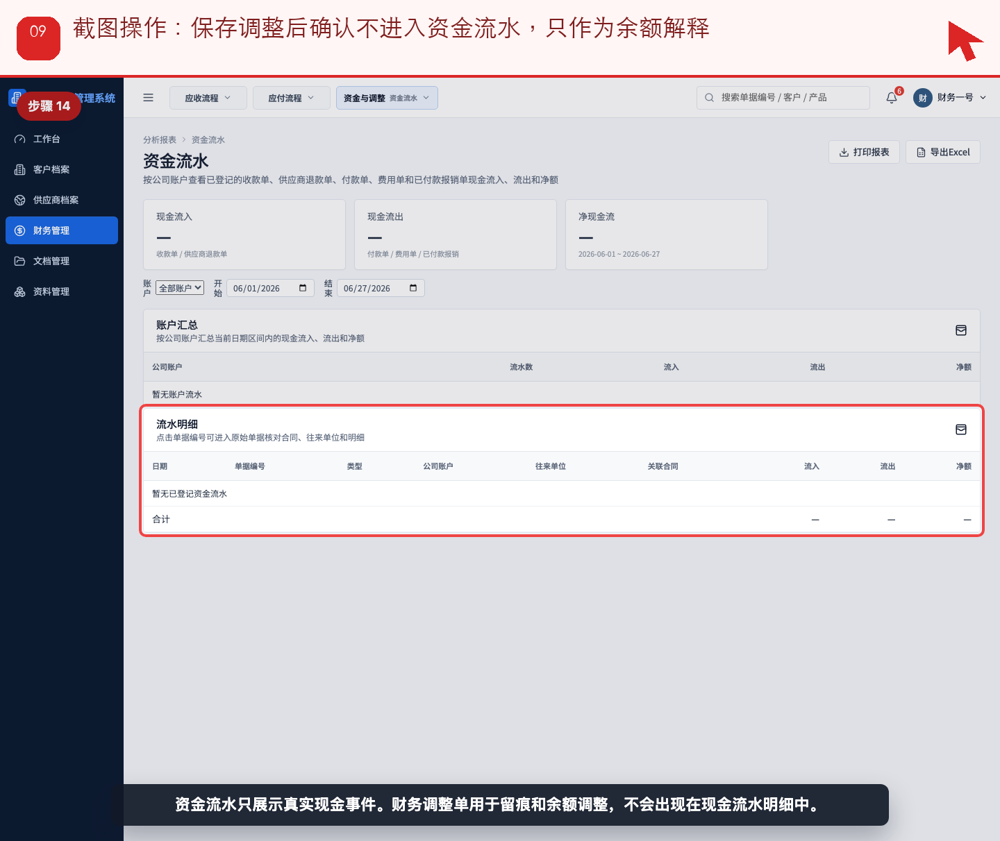

# 流程 10：财务如何跟踪发票差异、账龄和资金流水

本流程从 **财务，管理层，只读审计** 的实际业务需求出发，不按表单字段讲解。截图顶部红色提示写明本步要点击、填写或核对的位置。

## 业务场景

- **谁来做**：财务，管理层，只读审计
- **为什么做**：当发票、收付款、退款、费用或调整发生后，财务和管理层要能解释每笔差异和余额。
- **财务参与**：资金流水只统计真实现金事件；发票差异和财务调整用于解释正式应收应付与源单金额不一致。
- **下一步交接**：未闭环差异要回到对应业务流程补单、退款、费用、红冲重开或调整。

## 操作步骤

### 步骤 01：点击【发票差异看板】查看差异统计

按截图顶部红色提示操作：点击【发票差异看板】查看差异统计。

### 步骤 02：点击筛选【销售发票差异】

按截图顶部红色提示操作：点击筛选【销售发票差异】。

### 步骤 03：点击筛选【采购发票差异】

按截图顶部红色提示操作：点击筛选【采购发票差异】。

### 步骤 04：点击差异行里的【打开发票】核对来源

按截图顶部红色提示操作：点击差异行里的【打开发票】核对来源。

### 步骤 05：进入【资金流水】，查看真实现金流入流出

按截图顶部红色提示操作：进入【资金流水】，查看真实现金流入流出。

### 步骤 06：点击账户和日期筛选，定位本次收付款或退款

按截图顶部红色提示操作：点击账户和日期筛选，定位本次收付款或退款。

### 步骤 07：点击流水明细里的原始单据，回查收款/付款/退款来源

按截图顶部红色提示操作：点击流水明细里的原始单据，回查收款/付款/退款来源。

### 步骤 08：如无真实现金流，进入【财务调整单】点击【新增】

按截图顶部红色提示操作：如无真实现金流，进入【财务调整单】点击【新增】。

### 步骤 09：保存调整后确认不进入资金流水，只作为余额解释

按截图顶部红色提示操作：保存调整后确认不进入资金流水，只作为余额解释。

## 完成标准

- 当前角色完成了本流程的关键动作。
- 如果本流程产生财务影响，已经由财务创建或核对对应财务单据。
- 下一角色可以从来源单据、看板或列表继续处理，不需要重新录入同一业务事实。

[返回实际业务流程索引](../README.md)
