# 外贸公司实际业务流程与多角色协作教程

本教程面向新员工和部门负责人，用一条真实外贸订单主线讲清楚系统怎么支持日常业务。阅读顺序按员工实际需求组织，不按表单菜单组织。

适用角色：

- 销售/业务员：接客户需求、报价、签销售合同、跟进履约、处理客诉。
- 采购员：把销售需求转成供应商采购、跟踪生产完成和提货。
- 仓管员：确认实际入库、实际出库和库存数量。
- 财务：确认发票、收付款、退款、费用、版辊费返还和资金流水。
- 管理层：查看履约、库存、应收应付、账龄、资金和异常。
- 只读审计：只读核对单据、附件、报表和资金闭环。

管理员只负责账号、权限和基础配置，不作为本教程的日常业务参与角色。

## Demo 背景

本教程假设一笔外贸包装订单：

- 客户：海外客户询价一批定制包装产品。
- 产品：需要确认规格、数量、单价、交期和贸易条款。
- 供应商：国内工厂按采购合同生产。
- 特殊事项：产品涉及版辊费，客户达标后可退版辊费。
- 可能异常：客户收到货后投诉质量问题，处理方式可能是退款、下一单打折或财务调整。

第一屏从工作台开始，员工先看待办、风险和流程卡点，再进入自己的任务。

## 系统功能总览

| 业务问题 | 主要角色 | 系统入口 | 系统解决什么 |
|---|---|---|---|
| 客户要报价 | 销售 | 报价单、客户档案、产品档案 | 形成对外报价、数量、币种、交期和贸易条款 |
| 客户确认下单 | 销售、管理层 | 销售合同、合同 folder | 把报价转成正式客户合同，并沉淀合同附件 |
| 要不要采购 | 销售、采购、仓管 | 申购单、库存看板 | 锁定可用库存，计算需采购缺口 |
| 给供应商下单 | 采购 | 采购合同 | 确认供应商、采购数量、采购价格和交付要求 |
| 供应商生产完成 | 采购、仓管 | 提货通知、供应商生产完成看板 | 记录 ready / 待提货数量，但不增加库存 |
| 货实际到库 | 仓管、采购、财务 | 采购入库单 | 形成库存增加事实，成为采购发票核对来源 |
| 发货给客户 | 仓管、销售、财务 | 库存出库单 | 形成库存扣减事实，成为销售发票核对来源 |
| 给客户开票收款 | 财务、销售 | 销售发票、收款单、应收看板 | 确认正式应收和实际到账，跟踪逾期 |
| 收到供应商发票并付款 | 财务、采购 | 采购发票、付款单、应付看板 | 确认正式应付和实际付款，跟踪账龄 |
| 客户投诉 | 销售、财务、管理层 | 客诉处理单、客户退款单、财务调整单 | 登记责任、金额和处理方式，形成闭环 |
| 下一单打折 | 销售、财务 | 新报价/销售合同、客诉处理单、发票差异看板 | 把折扣体现在下一单价格或财务调整中 |
| 达标退版辊费 | 销售、采购、财务 | 版辊管理、客户退款单、版辊费台账 | 追踪客户收费、供应商付款、达标返还和现金出账 |
| 经营复盘 | 管理层、审计 | 销售分析、采购分析、资金流水、账龄、发票差异 | 看订单是否赚钱、是否逾期、是否有异常差异 |

## 主流程一：客户要报价

员工需求：销售收到客户询价，需要快速给出可追溯的正式报价。

销售要做：

1. 确认客户档案、产品档案、币种和贸易条款是否完整。
2. 创建报价单，选择客户、产品、数量、单价、交期和负责人。
3. 如果产品涉及版辊费，在报价沟通时同步说明收费、达标返还规则和是否由客户承担。
4. 报价保存确认后，对外导出或发送给客户。

财务是否参与：报价阶段通常不做财务单据；如果报价涉及版辊费、预收款、特殊费用或信用风险，财务需要提前确认收款账户、币种和风险口径。

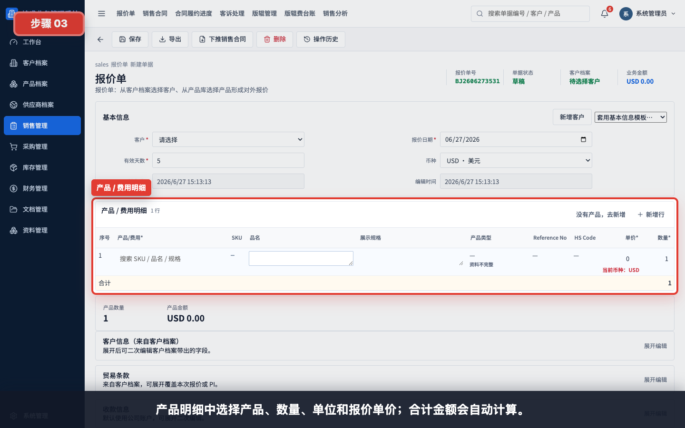

结果检查：

- 报价单要能追溯到客户、产品和负责人。
- 销售金额对销售、财务、管理层可见；采购和仓管不应看到客户销售价格。
- 报价还不是库存事实，也不是应收事实。

## 主流程二：客户确定下单

员工需求：客户确认报价，销售要把沟通结果变成后续所有部门都能执行的合同。

销售要做：

1. 从已确认报价下推销售合同，避免重复录入。
2. 核对客户、产品、数量、币种、交期、贸易条款和附件。
3. 需要归档客户 PO、PI、合同、往来邮件时，进入销售合同 folder 上传附件。
4. 合同确认后下推申购单，让采购和仓库知道需求。

管理层要看：

- 重点合同金额、交期、客户风险和是否需要特殊审批。
- 合同履约进度中采购、生产完成、出库、收款是否卡住。

财务是否参与：客户合同本身不产生现金流水；但财务需要关注付款条款、币种、收款账户、开票要求和后续应收风险。

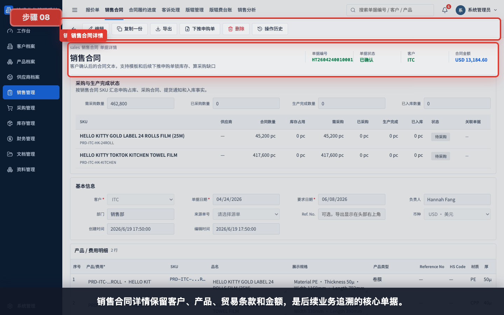

结果检查：

- 销售合同是后续申购、采购、库存、发票、收款和文档归档的核心源头。
- 采购只能看到采购所需字段，不应看到客户销售金额。
- 仓管只需要产品、规格、数量和库存动作，不需要看到金额。

## 主流程三：判断库存并转采购

员工需求：客户下单后，公司要先判断库存够不够，不够的部分再采购。

销售要做：

1. 从销售合同下推申购单。
2. 查看申购单是否占用了可用库存，以及还差多少需要采购。
3. 把采购进度反馈给客户，但不介入采购价格。

采购要做：

1. 打开申购单，确认采购缺口数量。
2. 从申购单下推采购合同。
3. 选择供应商，确认采购价格、交期、币种和交付要求。
4. 如有版辊制作，采购同步维护供应商侧版辊应付或制作进度。

财务是否参与：申购单和采购合同还不等于付款；财务可以查看采购合同金额和付款条款，但实际应付要等入库和采购发票。

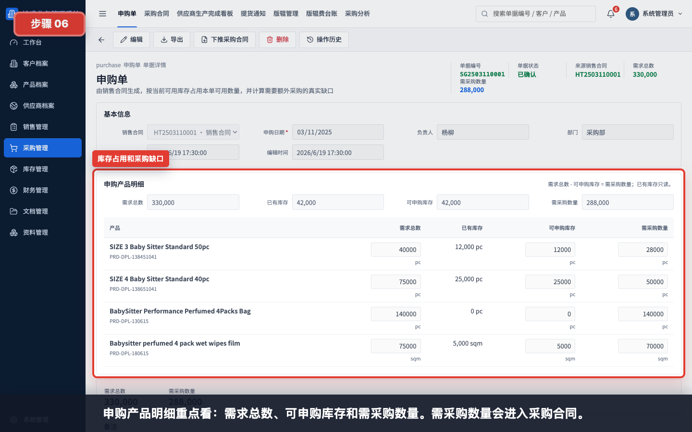

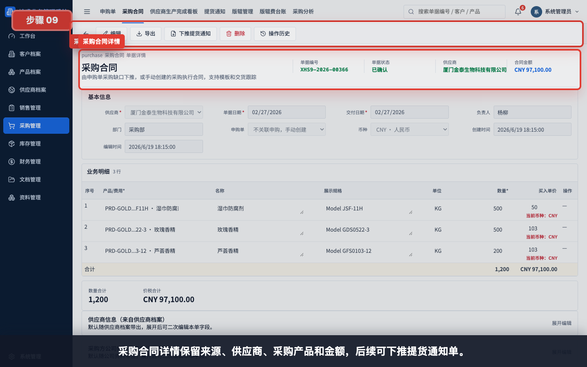

结果检查：

- 采购合同只承接申购缺口，不应绕过申购直接把全部销售数量重复采购。
- 采购员可见采购金额和应付状态；销售不应看到采购单价、采购总额和供应商付款信息。

## 主流程四：供应商下单后生产完成

员工需求：供应商通知货做好了，采购要通知仓库和业务，但不能把未到库的货当成库存。

采购要做：

1. 在供应商生产完成看板查看每个采购合同和 SKU 的 ready 状态。
2. 从采购合同下推提货通知单，登记本次已生产完成或待提货数量。
3. 维护预计提货日期、物流备注和异常说明。

仓管要做：

1. 根据提货通知安排收货准备。
2. 明确提货通知不是入库，不能把 ready 数量当作可用库存发给客户。

财务是否参与：提货通知不触发应付、不进入资金流水。财务只在需要预付款、物流费用或供应商对账时关注。

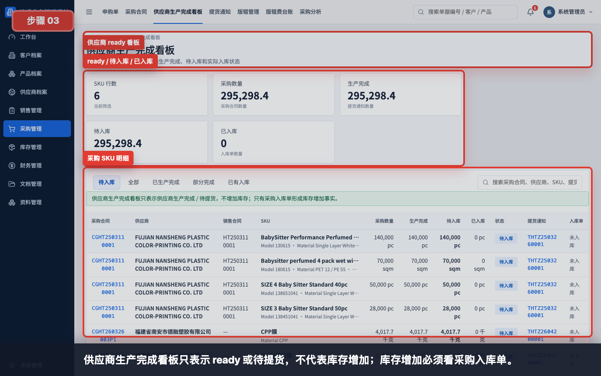

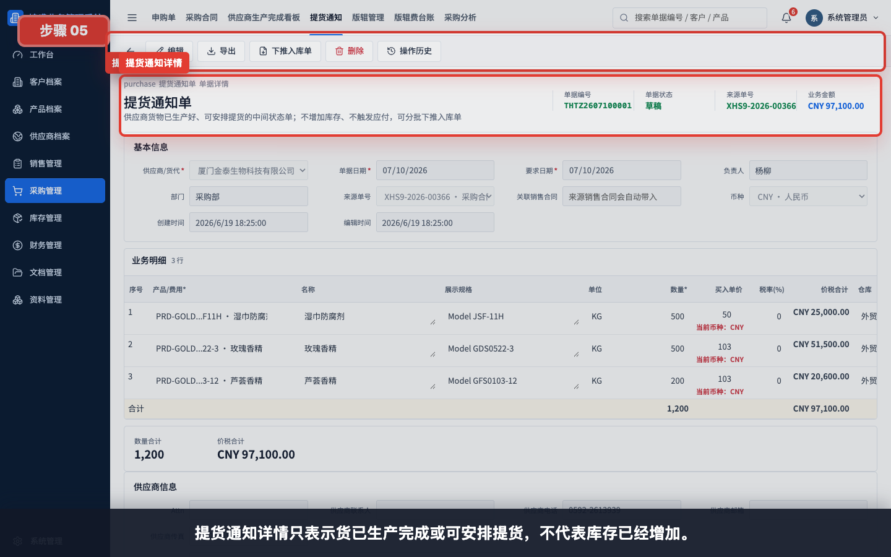

结果检查：

- ready / 待提货只代表供应商侧状态。
- 只有采购入库单才增加库存，并进入采购发票核对。

## 主流程五：供应商发货、我司入库、客户出库

员工需求：货物实际移动后，仓库要把数量事实录入系统，销售和财务据此跟踪履约和收付款。

仓管入库要做：

1. 货物实际到库后，从提货通知下推采购入库单。
2. 核对产品、数量、仓库、件数、净重、毛重。
3. 保存确认后形成库存增加事实。

仓管出库要做：

1. 客户订单准备发货时，创建库存出库单并关联销售合同。
2. 按实际发货数量填写出库明细。
3. 保存确认后形成库存扣减事实。

销售要看：

- 销售合同履约进度中，采购覆盖、生产完成、入库、出库和收款是否闭环。
- 如果客户分批发货，每批都要有对应出库记录。

财务要看：

- 入库单是采购发票和应付核对来源。
- 出库单是销售发票和应收核对来源。
- 入库/出库本身不是现金流水，只有后续收付款、退款、费用和已付款报销才进入资金流水。

结果检查：

- 供应商直接发到客户时，也需要按公司内控要求保留可追溯库存事实。常见做法是通过虚拟仓或先入后出的方式记录入库、出库，确保应付和应收都有来源。
- 仓管不应录入或修改销售单价、采购单价和财务收付信息。

## 主流程六：销售发票、收款和应收跟踪

员工需求：客户要正式发票或公司要确认应收，财务需要从出库事实进入开票和收款闭环。

财务要做：

1. 从库存出库单生成销售发票，核对客户、销售合同、产品、数量和开票金额。
2. 如果发票金额和出库金额不同，保留差异原因，后续在发票差异看板跟进。
3. 银行实际到账后，从销售发票生成收款单或手动关联合同/出库单。
4. 选择实际入账公司账户，确认收款金额。
5. 在应收看板、应收账龄和资金流水中跟踪未收、逾期和实际到账。

销售要看：

- 只看本人客户的应收状态、待收和逾期提示，用于催收。
- 不进入资金流水全表，不查看供应商付款。

管理层要看：

- 大额应收、逾期账龄、客户回款表现和异常差异。

财务判断：

- 发票确认正式应收。
- 收款单确认实际到账。
- 发票不进入资金流水，收款单进入资金流水。

## 主流程七：供应商发票、付款和应付跟踪

员工需求：供应商开票并要求付款，财务要从入库事实进入应付和付款闭环。

财务要做：

1. 从采购入库单生成采购发票，核对供应商、采购合同、产品、数量和开票金额。
2. 如果发票金额和入库金额不同，进入发票差异看板跟踪原因。
3. 银行实际付款后，从采购发票生成付款单或手动关联采购合同/入库单。
4. 选择实际出账公司账户，确认付款金额。
5. 在应付看板、应付账龄和资金流水中跟踪未付、逾期和实际付款。

采购要看：

- 可查看采购合同付款状态和供应商应付状态。
- 不录入付款单，不查看客户收款和客户应收。

管理层要看：

- 供应商付款压力、账龄、采购差异和资金安排。

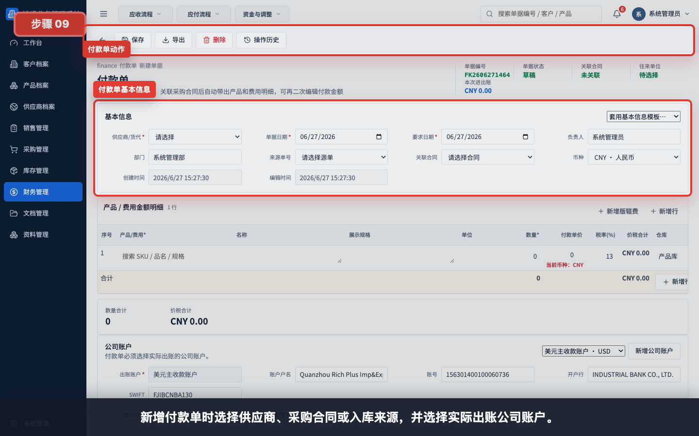

财务判断：

- 采购发票确认正式应付。
- 付款单确认实际出账。
- 采购发票不进入资金流水，付款单进入资金流水。

## 分支流程一：客户投诉要求退款

员工需求：客户反馈质量、数量、包装或交期问题，要求退款或赔付。

销售要做：

1. 先在客诉处理单登记客户、来源销售合同、问题类型、客诉金额、原因和处理方式。
2. 上传或备注客户证据、沟通结论和内部责任判断。
3. 如果需要退款，通知财务按客诉处理结果创建客户退款单。

财务要做：

1. 核对客诉处理单、原销售合同、原收款或发票。
2. 创建客户退款单，选择实际出账公司账户。
3. 保存确认后，客户退款进入资金流水，冲减客户回款。
4. 如果不是实际退款，而是折让、坏账、尾差或汇差，用财务调整单留痕。

管理层要看：

- 大额客诉、重复客诉客户、责任归属和是否影响利润。

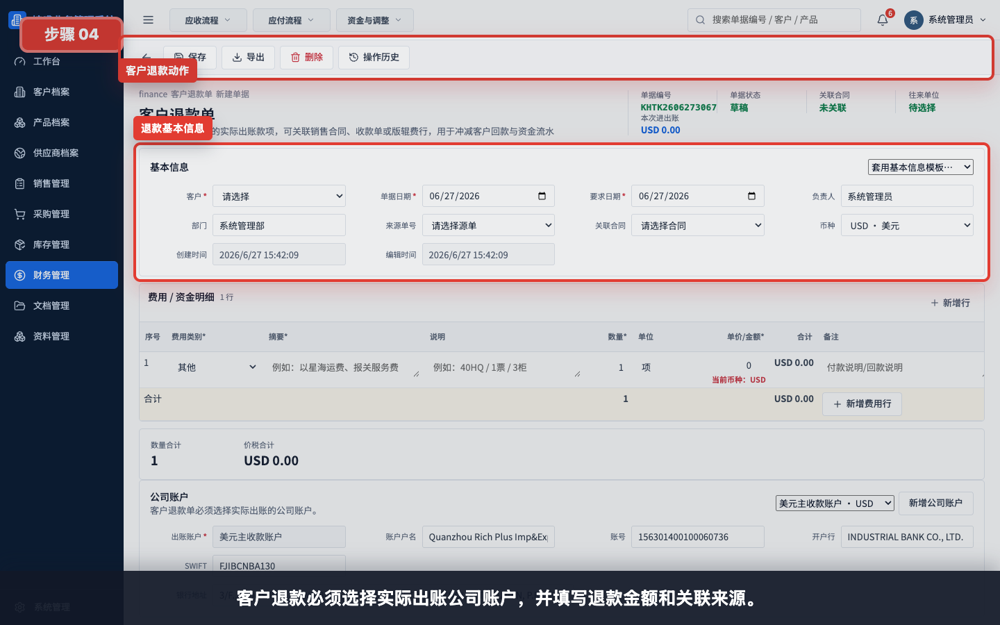

闭环标准：

- 有来源销售合同。
- 有处理方式和金额。
- 有财务单据或调整记录。
- 应收、资金流水和差异看板能解释这笔退款。

## 分支流程二：客户投诉，约定下一单打折

员工需求：客户不要求立即退款，而是要求下一单优惠。

销售要做：

1. 仍然先创建客诉处理单，处理方式写清楚“下一单抵扣/折扣”。
2. 新一单报价或销售合同时，把折扣体现在单价、费用行或备注中。
3. 关联原客诉编号，避免后续忘记抵扣来源。

财务要做：

1. 判断折扣是否已经体现在新销售发票金额中。
2. 如果发票金额和出库金额有差异，在发票差异看板标注原因。
3. 如果需要单独留痕但没有实际收付，用财务调整单处理。

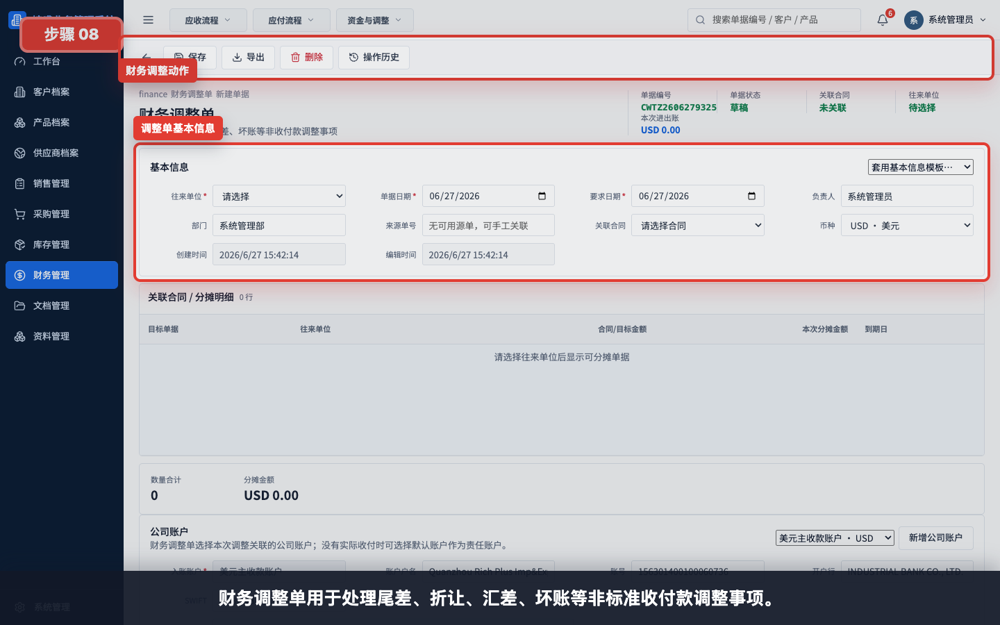

闭环标准：

- 原客诉有记录。
- 下一单价格或发票差异能解释折扣来源。
- 没有实际现金退款时，不要创建客户退款单。

## 分支流程三：达标给客户退版辊费

员工需求：订单涉及版辊费，客户达到约定采购量或金额后，公司要退还客户版辊费。

销售要做：

1. 在报价或销售合同阶段说明版辊收费和达标返还规则。
2. 在版辊管理中登记客户、产品、供应商、客户收费金额、返还门槛和关联销售合同。
3. 达标后通知财务处理客户退款。

采购要做：

1. 维护供应商版辊制作、应付金额、付款或返还条件。
2. 如果供应商后续返还或抵扣版辊费，通知财务创建供应商退款单或付款调整。

财务要做：

1. 用版辊费台账核对客户收费、供应商付款、达标状态和待退金额。
2. 达标退给客户时，创建客户退款单并关联版辊费行。
3. 供应商退回款项时，创建供应商退款单并选择入账账户。
4. 资金流水核对客户退款出账和供应商退款入账。

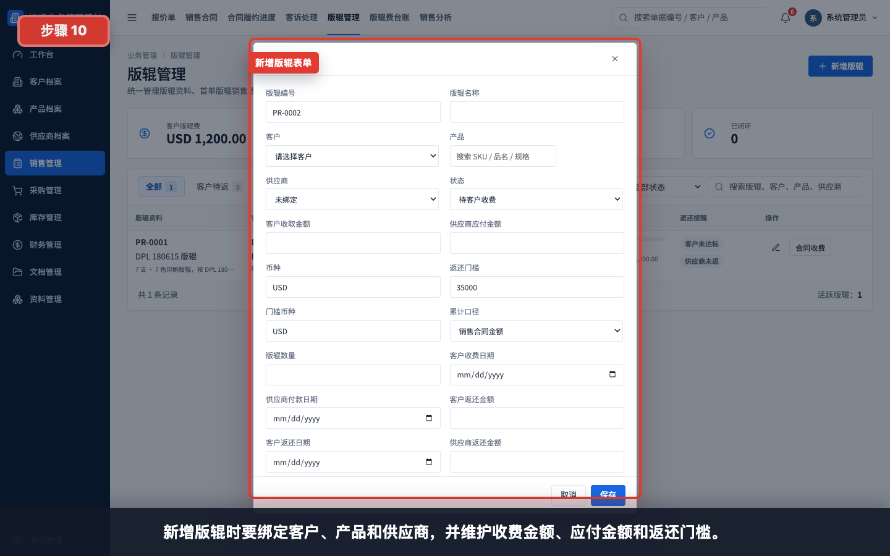

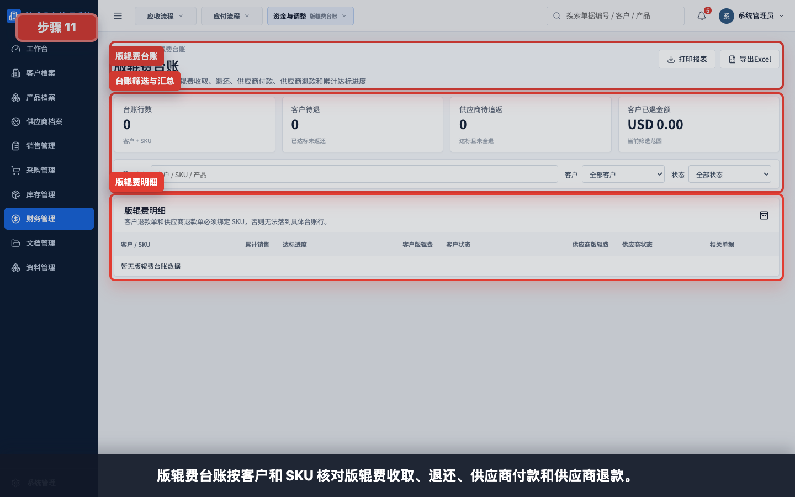

闭环标准：

- 版辊记录能同时解释客户收费、供应商应付和达标返还。
- 客户退款单或供应商退款单必须体现实际现金流。
- 版辊费台账中不能长期留下无说明的未闭环差额。

## 分支流程四：发票差异和财务流程跟踪

员工需求：发票金额和出入库金额不一致，或收付款金额和合同金额不一致，财务要能解释差异。

财务要做：

1. 打开发票差异看板，查看销售发票与出库单、采购发票与入库单的差异。
2. 按原因选择处理方式：补充费用、退款、红冲重开、折让、汇差、坏账或财务调整。
3. 发生实际收付时，用收款单、付款单、客户退款单、供应商退款单、费用单或已付款报销单记录现金事件。
4. 没有实际收付但需要留痕时，用财务调整单。
5. 最后在资金流水、应收账龄、应付账龄中复核余额。

管理层要看：

- 哪些差异未处理。
- 哪些客户逾期未收。
- 哪些供应商待付影响交付。
- 资金流入、流出和净额是否符合经营预期。

审计要看：

- 单据是否能从销售合同追溯到采购、库存、发票和收付款。
- 附件是否归档。
- 权限是否符合角色边界。

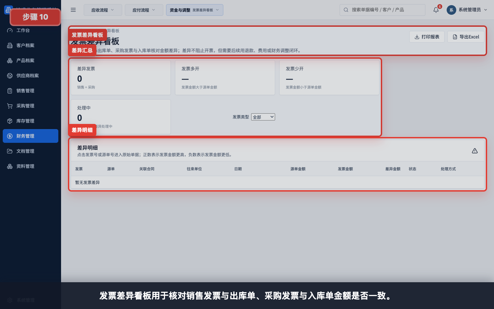

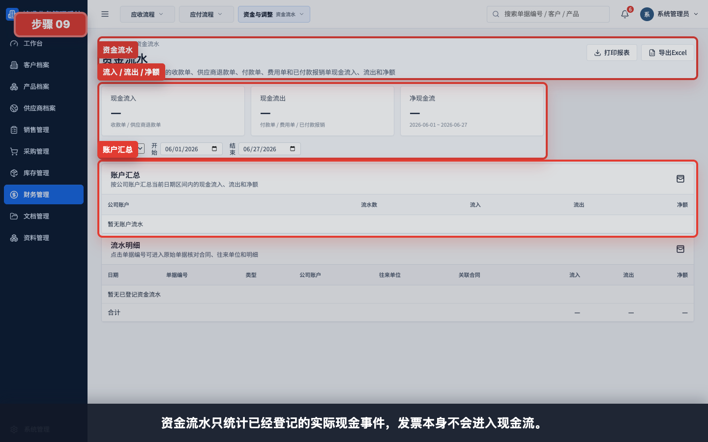

## 角色工作场景清单

### 销售/业务员

每天打开系统时，销售关心的是客户需求和订单是否顺利交付：

- 今天有没有新客户询价要报价。
- 已报价客户是否确认下单。
- 销售合同是否已经下推申购。
- 采购、生产完成、入库、出库是否卡住。
- 客户是否付款，是否逾期。
- 客诉是否已经登记、退款或下一单折扣是否闭环。
- 版辊费是否达到返还条件。

销售不应该直接处理：

- 采购单价、供应商付款、采购发票。
- 公司资金流水全表。
- 用户权限和系统设置。

### 采购员

采购关心的是供应商能不能按销售需求交货：

- 哪些申购单有采购缺口。
- 哪些缺口已经下推采购合同。
- 哪些供应商已生产完成、待提货或延期。
- 哪些货已入库，哪些还在路上。
- 供应商发票和付款状态是否影响继续生产。
- 供应商版辊费用是否已登记、付款或返还。

采购不应该直接处理：

- 客户报价单价、客户应收和客户收款。
- 销售利润和资金流水全表。

### 仓管员

仓管关心的是实物有没有进出仓：

- 哪些提货通知需要准备收货。
- 哪些货实际入库，数量、仓库、件数和重量是否正确。
- 哪些销售合同需要出库。
- 出库后库存是否足够，是否出现负库存或数量差异。

仓管不应该直接处理：

- 销售价格、采购价格。
- 收款、付款、退款、费用和发票。

### 财务

财务关心的是发票、收付款和资金闭环：

- 出库后是否已开销售发票。
- 销售发票后客户是否已付款。
- 入库后是否已收到采购发票。
- 采购发票后是否已付款给供应商。
- 客诉退款、供应商退款、费用、报销、财务调整是否有来源和审批依据。
- 版辊费是否该退、是否已退、资金是否入账或出账。
- 应收应付账龄、资金流水和发票差异是否能解释。

财务不应该直接修改：

- 销售合同业务明细。
- 采购合同业务明细。
- 仓库实际入库和出库数量。

### 管理层

管理层关心的是风险和经营结果：

- 哪些合同履约卡住。
- 哪些供应商生产完成但未入库。
- 哪些库存不足或长时间未出库。
- 哪些客户逾期未收。
- 哪些供应商待付影响交付。
- 哪些客诉、退款、发票差异和版辊费未闭环。
- 销售、采购和资金结构是否健康。

管理层默认只看不改，避免绕过业务责任人。

### 只读审计

审计关心的是追溯和内控：

- 单据是否按销售合同串起来。
- 财务单据是否关联来源单据。
- 现金流水是否只来自实际收付、退款、费用或已付款报销。
- 角色是否越权查看或修改敏感字段。
- 附件和合同 folder 是否完整。

审计不新增、不编辑、不下推、不作废。

## 端到端验收清单

一条完整外贸业务至少要能回答这些问题：

| 问题 | 应查看的系统证据 |
|---|---|
| 客户最初要了什么价格和条款？ | 报价单、报价附件 |
| 客户最终下了什么订单？ | 销售合同、合同 folder |
| 库存够不够？缺口是多少？ | 申购单、库存看板 |
| 缺口采购给了哪个供应商？ | 采购合同 |
| 供应商货是否生产完成？ | 提货通知、供应商生产完成看板 |
| 货是否实际入库？ | 采购入库单 |
| 是否实际发给客户？ | 库存出库单 |
| 客户是否开票和付款？ | 销售发票、收款单、应收看板、资金流水 |
| 供应商是否开票和付款？ | 采购发票、付款单、应付看板、资金流水 |
| 客诉怎么处理？ | 客诉处理单、客户退款单或财务调整单 |
| 下一单折扣有没有兑现？ | 原客诉处理单、新报价/销售合同、发票差异或财务调整 |
| 版辊费是否达标返还？ | 版辊管理、版辊费台账、客户退款单 |
| 财务余额是否准确？ | 应收账龄、应付账龄、发票差异看板、资金流水 |

## 外贸常见场景覆盖清单

这些场景不是每一单都会发生，但培训和验收时应知道由哪个角色发起、是否需要财务参与。

| 员工实际业务需求 | 发起角色 | 参与角色 | 系统处理方式 | 财务参与 |
|---|---|---|---|---|
| 新客户第一次询价，需要建立往来资料 | 销售 | 财务、审计 | 新增客户档案，维护联系人、地址、付款条款和必要附件 | 财务核对付款条款、币种和收款账户口径 |
| 新供应商第一次合作，需要建立付款资料 | 采购 | 财务、审计 | 新增供应商档案，维护联系人、银行账户和采购条款 | 财务核对供应商收款账户和付款风险 |
| 新产品第一次报价，需要维护规格 | 销售 | 采购、仓管 | 新增产品档案，维护 SKU、规格、单位和属性 | 通常不参与；涉及版辊、费用或税务口径时参与 |
| 客户要求样品或小批量试单 | 销售 | 采购、仓管、财务 | 用报价、销售合同、申购、采购、出入库按同一主线处理 | 收样品费、退样品费或承担样品费时用收款、退款、费用或调整 |
| 客户要求预付款后生产 | 销售 | 财务、采购 | 销售合同确认付款条款，采购按合同推进 | 财务先登记收款单，后续销售发票和尾款继续跟踪 |
| 客户分批出货 | 销售 | 仓管、财务 | 同一销售合同下多张库存出库单 | 每批出库可分别开票、收款和跟踪应收 |
| 供应商分批交货 | 采购 | 仓管、财务 | 同一采购合同下多张提货通知和入库单 | 每批入库可分别收票、付款和跟踪应付 |
| 供应商生产延期 | 采购 | 销售、管理层 | 在提货通知、生产完成看板和备注中跟踪 | 若产生罚款、折让或费用，用供应商退款、费用或财务调整闭环 |
| 客户要求改规格或改数量 | 销售 | 采购、仓管、财务 | 更新或新建销售合同，并检查申购、采购和库存影响 | 金额变化影响发票、收款、退款或财务调整 |
| 出口前发现库存不够 | 仓管 | 销售、采购 | 库存看板和申购缺口提示，采购补齐缺口 | 通常不参与；若紧急采购费用增加，用费用单或调整记录 |
| 物流、报关、港杂或银行手续费发生 | 财务 | 销售、采购 | 创建费用单，可关联合同 | 费用单保存确认后进入资金流水 |
| 员工垫付费用需要报销 | 员工/财务 | 管理层 | 创建报销单，记录线下确认和费用明细 | 已付款报销单进入资金流水 |
| 客户多付或重复付款 | 财务 | 销售 | 收款单记录实际到账，客户退款单处理退回 | 客户退款单进入资金流水并冲减客户余额 |
| 供应商多收或退回差异款 | 财务 | 采购 | 供应商退款单关联原付款或采购发票 | 供应商退款单进入资金流水并冲减供应商余额 |
| 客户质量客诉要求现金退款 | 销售 | 财务、管理层 | 客诉处理单登记责任和金额，客户退款单执行 | 客户退款单必须选择实际出账账户 |
| 客户质量客诉要求下一单折扣 | 销售 | 财务、管理层 | 客诉处理单登记下一单抵扣，新报价/销售合同体现折扣 | 财务核对发票差异；无现金流时用财务调整留痕 |
| 客户短少、破损或交期争议扣款 | 销售 | 仓管、采购、财务 | 客诉处理单记录问题，必要时追溯出库、入库和供应商责任 | 退款、供应商退款、费用或财务调整按处理结果选择 |
| 版辊费收取、付款和达标返还 | 销售 | 采购、财务、管理层 | 版辊管理和版辊费台账追踪客户、供应商和达标状态 | 客户退款、供应商付款或供应商退款必须进入资金流水 |
| 销售发票金额和出库金额不一致 | 财务 | 销售、管理层 | 发票差异看板跟踪差异原因 | 用补充收款、客户退款、红冲重开或财务调整闭环 |
| 采购发票金额和入库金额不一致 | 财务 | 采购、管理层 | 发票差异看板跟踪差异原因 | 用补充付款、供应商退款、红冲重开、费用单或财务调整闭环 |
| 外币收付款出现汇差 | 财务 | 管理层 | 财务调整单记录汇差 | 有实际银行流水时用收付款，汇差本身用调整留痕 |
| 客户长期不付款，需要坏账处理 | 财务 | 销售、管理层、审计 | 应收账龄定位风险，财务调整单记录坏账处理 | 财务调整不等于现金流，不进入资金流水 |
| 管理层要看一单是否真正闭环 | 管理层 | 销售、采购、仓管、财务 | 合同履约、应收应付、资金流水、发票差异、版辊台账联查 | 必须能解释未收、未付、退款、费用和差异 |
| 审计要查一笔订单完整证据 | 审计 | 各业务角色 | 只读查看合同、附件、下游单据、报表和资金记录 | 不操作财务，只核对来源、金额、账户和权限记录 |

## 后续教程写作规范

在 `guides/` 继续增加教程时，标题和正文必须从某个角色的真实业务需求出发。

推荐标题写法：

- `销售收到客户确认后，如何把报价转成可执行销售合同`
- `采购收到申购缺口后，如何给供应商下采购合同`
- `仓管收到提货通知后，如何确认实际入库`
- `财务收到客户到账后，如何登记收款并核对应收`
- `销售收到客诉后，如何选择退款、下一单折扣或财务调整`

不推荐标题写法：

- `报价单表单说明`
- `采购合同字段说明`
- `收款单页面介绍`

每篇教程至少包含：

- 这个角色为什么要做这件事。
- 上一步是谁交接过来的。
- 本角色在系统里完成哪些动作。
- 如果需要财务处理，财务必须做哪些单据和核对。
- 下一步交给哪个角色。
- 哪些报表或看板可以确认流程闭环。
- 至少一张与该业务动作相关的 demo 截图。

## 任务级教程索引

需要进一步看具体点击路径时，再进入这些任务级教程：

- [销售流程：报价单到销售合同](../sales-quotation-contract/README.md)
- [销售到采购：销售合同、申购单、采购合同](../sales-to-purchase/README.md)
- [采购履约与库存出入库](../procurement-inventory/README.md)
- [财务流程：发票、收款、付款](../finance-invoices-payments/README.md)
- [例外业务与专题报表](../exceptions-reports/README.md)
- [核心看板与核对](../core-dashboards/README.md)
- [不同角色日常操作](../05-role-guides.md)
