# 协作与管理截图指引

本指引用于培训文档归档、资料设置、账号权限和审计追溯。它适合在核心业务流程和核心看板之后讲解，重点是让新用户知道哪些配置会影响单据输出、哪些操作只有管理员或特定角色可做。

建议讲解顺序：

1. 先讲文档管理，说明所有资料都围绕销售合同 folder 归档。
2. 再讲公司资料、合同模板和头信息模板，说明这些配置会影响单据抬头和导出内容。
3. 再讲币种汇率和公司账户，说明财务单据的币种和账户来源。
4. 最后讲用户管理、权限差异和审计日志。

任务级细分指引：

- [如何创建销售合同 folder](../文档管理/创建销售合同folder/README.md)
- [如何上传和预览合同附件](../文档管理/上传和预览合同附件/README.md)
- [如何新增用户并分配角色](../系统管理/新增用户并分配角色/README.md)
- [如何重置用户密码](../系统管理/重置用户密码/README.md)
- [如何查看审计日志](../系统管理/查看审计日志/README.md)
- [如何维护公司资料](../资料管理/维护公司资料/README.md)
- [如何维护合同模板](../资料管理/维护合同模板/README.md)
- [如何维护头信息模板](../资料管理/维护头信息模板/README.md)
- [如何维护币种汇率](../资料管理/维护币种汇率/README.md)
- [如何维护公司账户](../资料管理/维护公司账户/README.md)

## 步骤 01：文档 folder 总览

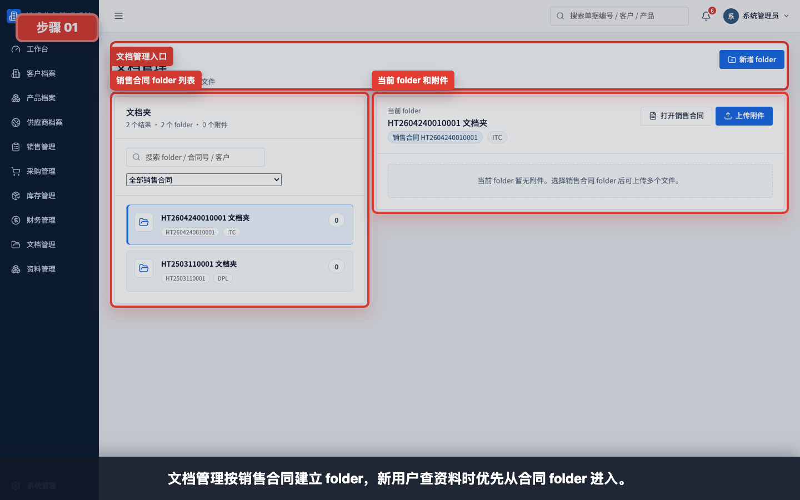

文档管理按销售合同建立 folder。新用户查找合同、PI、客户资料和业务往来文件时，优先从销售合同 folder 进入。

## 步骤 02：新增 folder

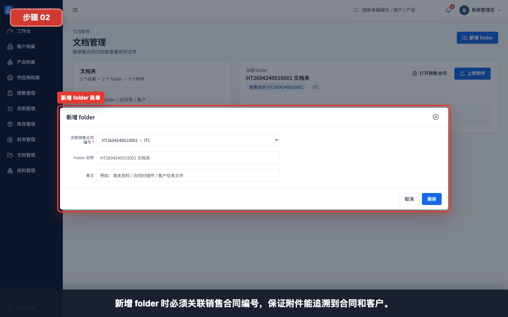

新增 folder 时必须关联销售合同编号，确保附件能追溯到合同、客户和业务链路。

## 步骤 03：folder 附件操作

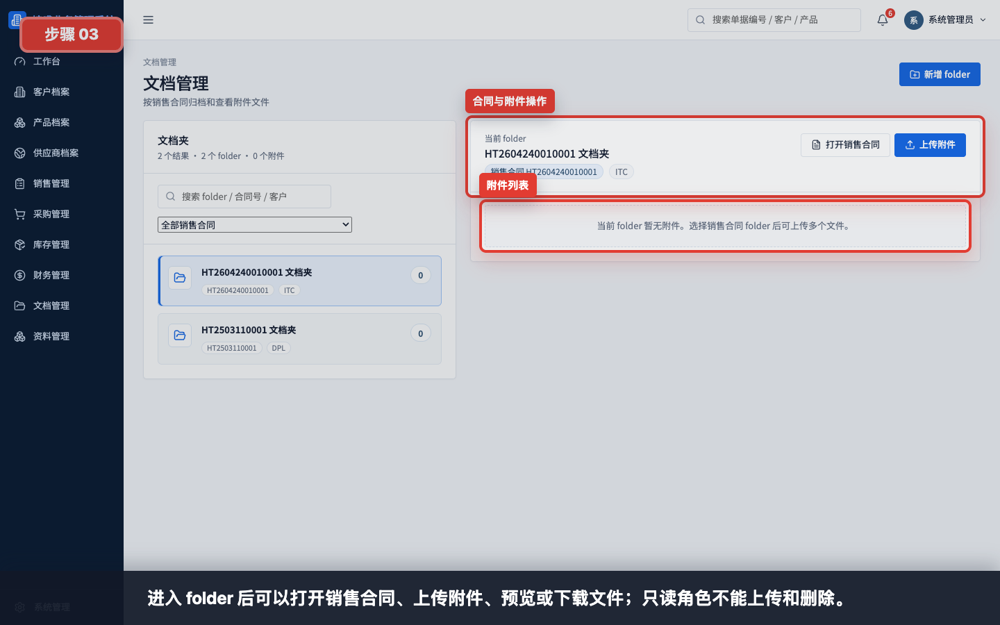

进入 folder 后可以打开销售合同、上传附件、预览或下载文件。只读角色可查看和下载，但不能上传或删除。

## 步骤 04：公司资料

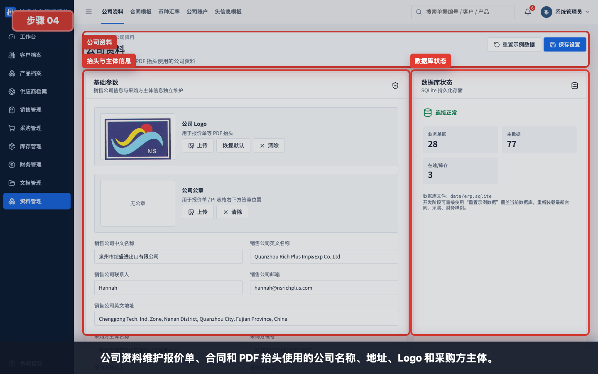

公司资料维护报价单、销售合同、采购合同和 PDF 抬头使用的公司名称、地址、Logo、采购方主体等信息。

## 步骤 05：合同模板

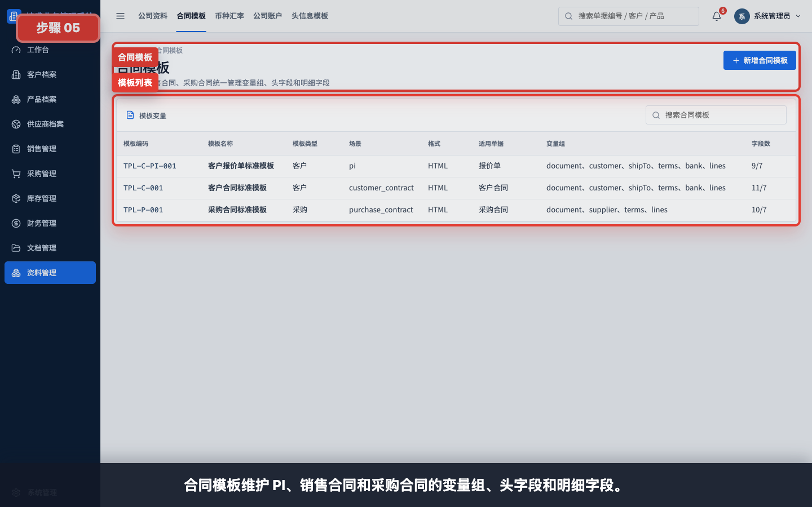

合同模板维护 PI、销售合同和采购合同的变量组、头字段和明细字段。模板控制导出结构，不替代单据实际内容确认。

## 步骤 06：头信息模板

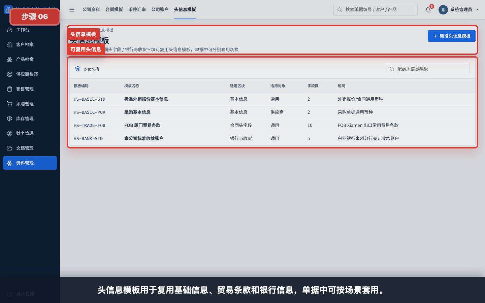

头信息模板用于复用基础信息、贸易条款和银行信息，单据中可按客户或场景套用。

## 步骤 07：币种汇率

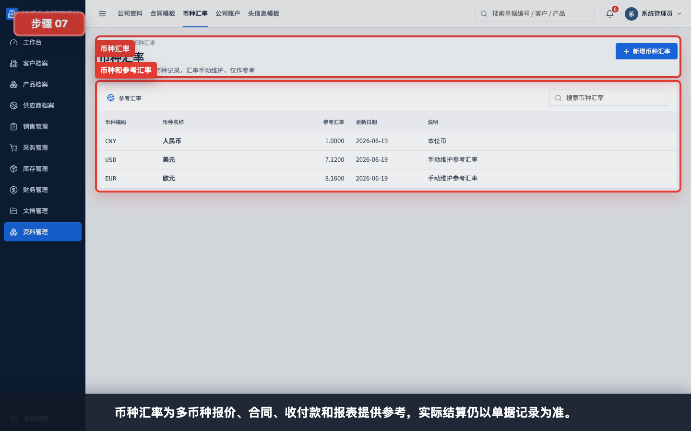

币种汇率为多币种报价、合同、收付款和报表提供参考。实际结算金额仍以单据记录为准。

## 步骤 08：公司账户

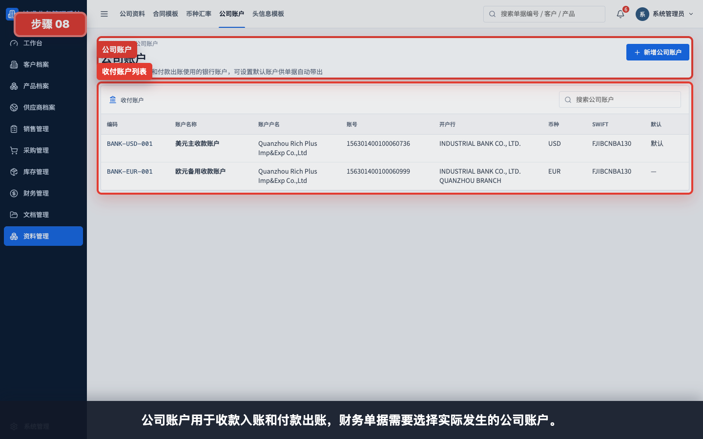

公司账户用于收款入账和付款出账。培训财务用户时要强调：收款单和付款单应选择实际发生的公司账户。

## 步骤 09：系统设置

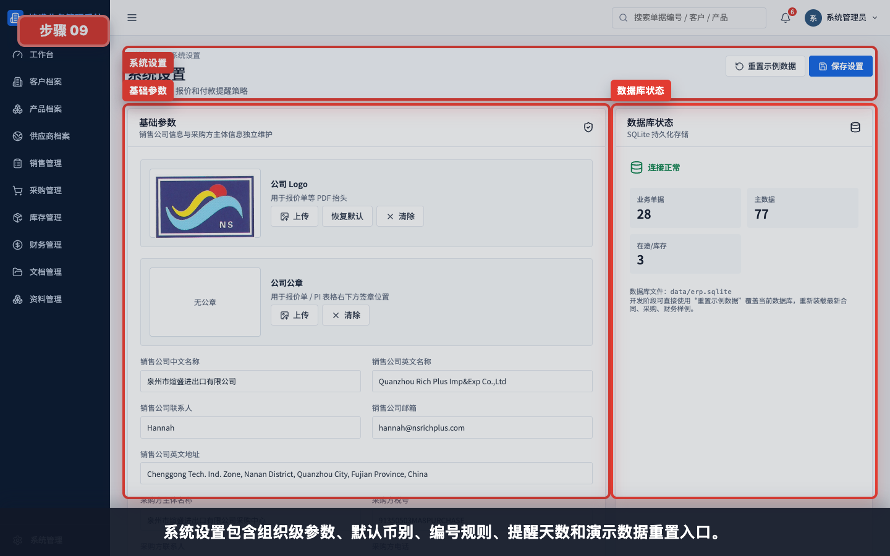

系统设置包含默认币别、编号规则、报价有效期、付款提醒天数和演示数据重置入口。普通业务用户通常不需要维护。

## 步骤 10：用户管理和角色权限

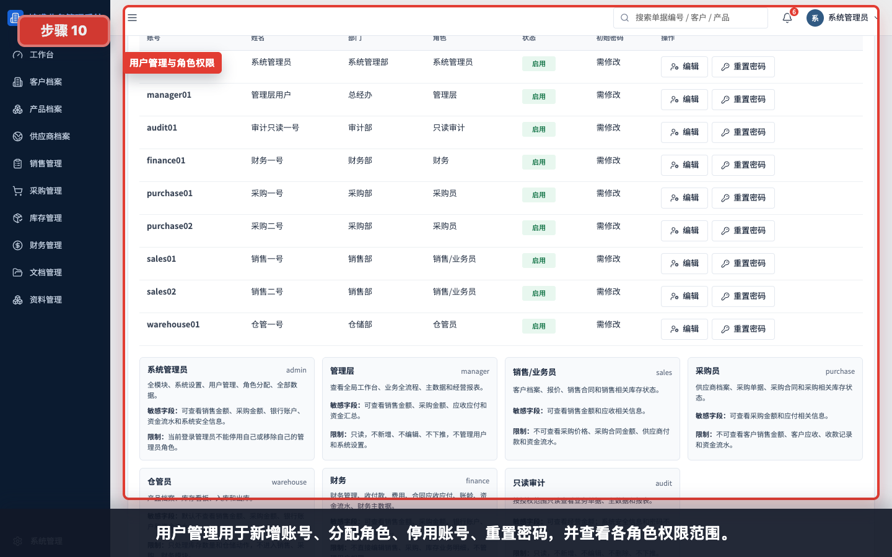

管理员可以新增账号、分配角色、停用账号、重置密码，并查看每个角色的权限范围和敏感字段限制。

## 步骤 11：新增用户

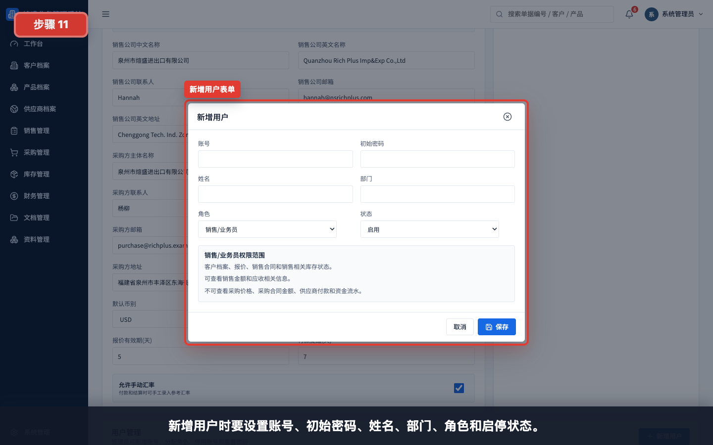

新增用户时要设置账号、初始密码、姓名、部门、角色和启停状态。初始密码应通过安全渠道交给用户，并要求首次登录后修改。

## 步骤 12：审计日志

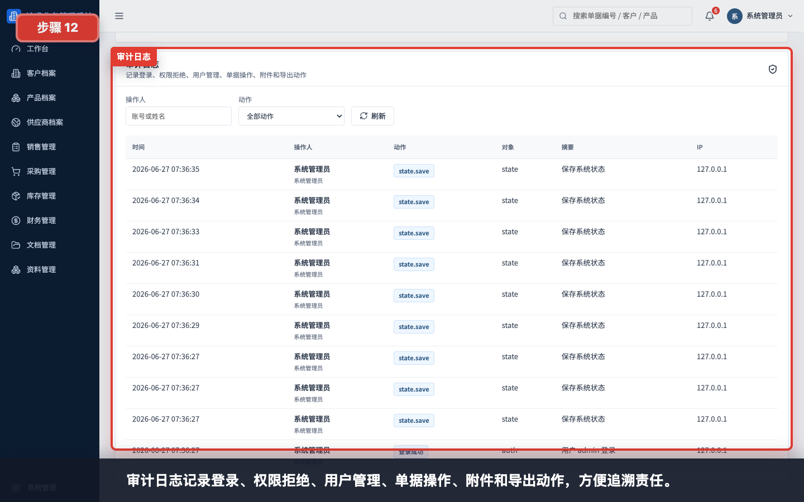

审计日志记录登录、权限拒绝、用户管理、单据操作、附件和导出动作。出现争议时可按操作人、动作和时间追溯。

## 步骤 13：权限差异

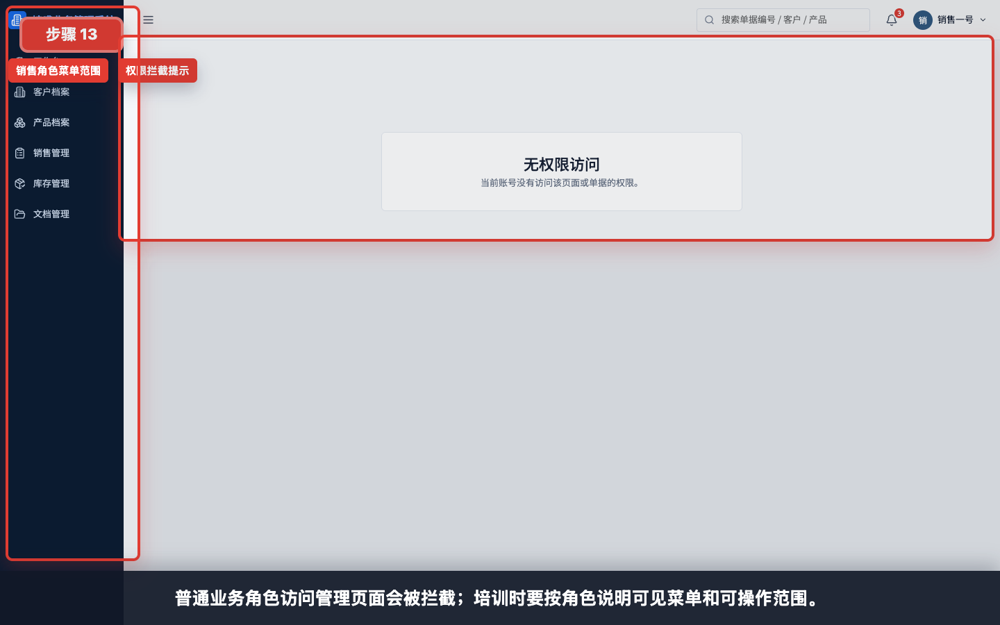

普通业务角色访问管理页面会被系统拦截。培训时应按角色说明可见菜单、可操作范围和敏感字段限制。

## 讲解重点

- 文档 folder 必须围绕销售合同组织。
- 公司资料、合同模板和头信息模板影响导出文件。
- 币种汇率是参考口径，结算以单据金额为准。
- 公司账户必须按实际收付账户选择。
- 用户权限按角色控制，管理员负责账号维护。
- 审计日志用于追溯，不是业务处理入口。
