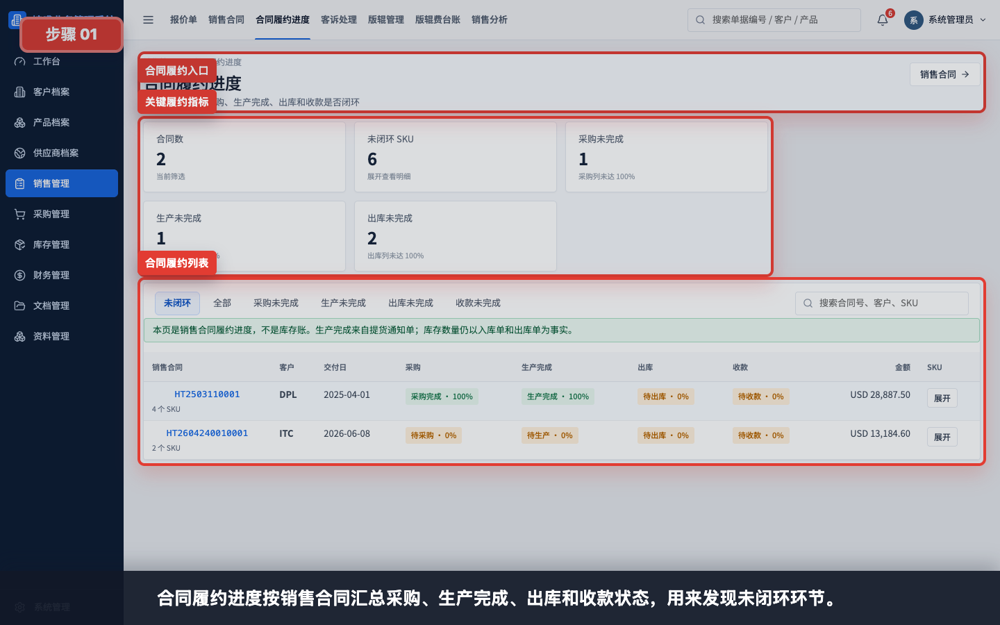
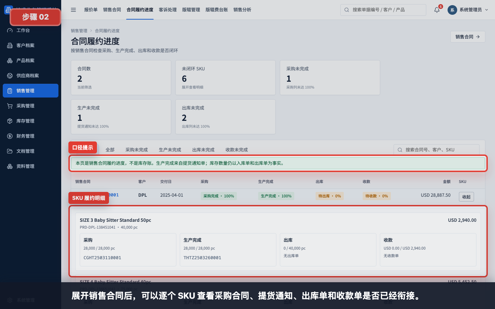
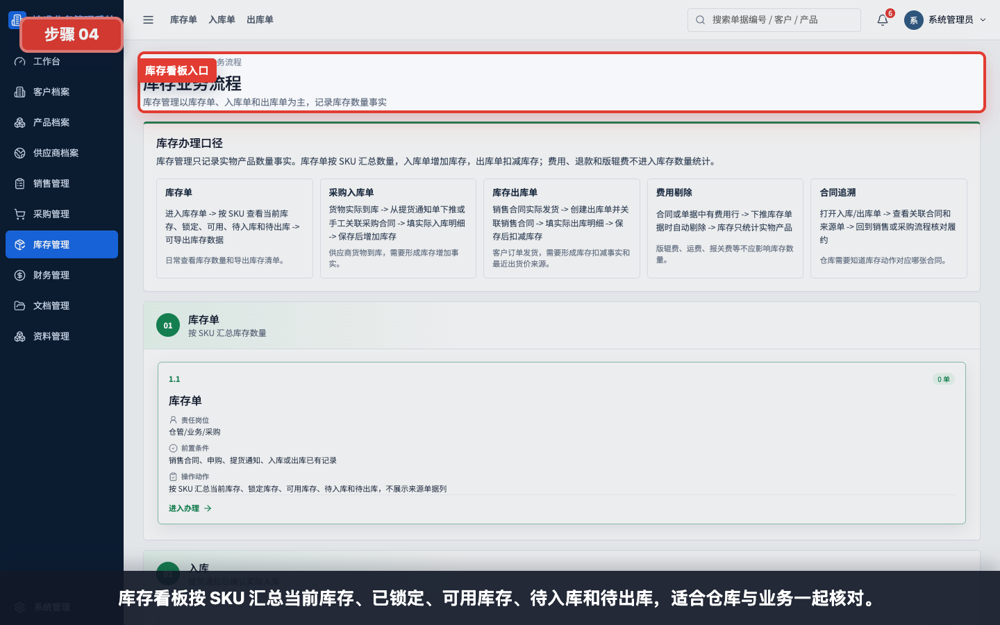
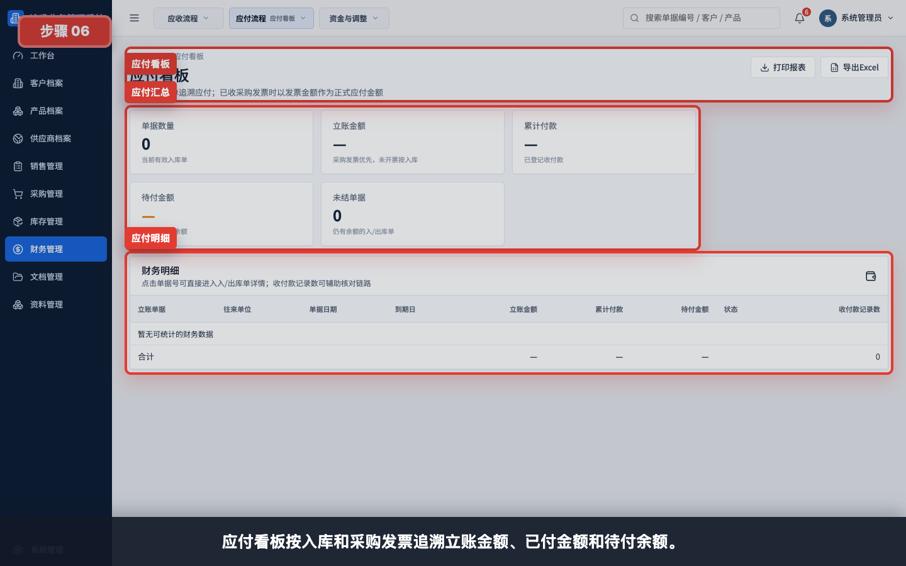
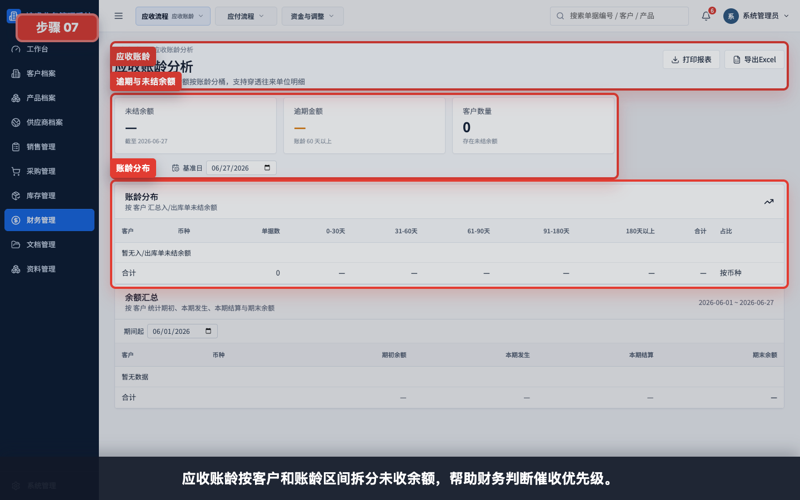
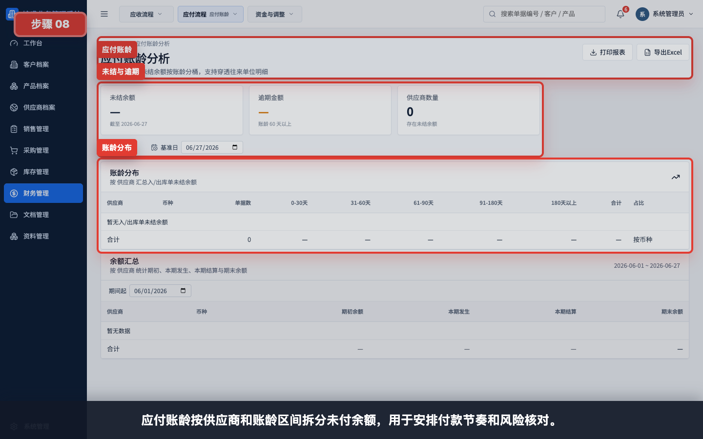

# 核心看板与核对截图指引

本指引用于培训新用户查看核心看板。重点不是录入单据，而是学会从看板发现流程是否闭环、库存是否够用、财务余额是否需要跟进。

建议讲解顺序：

1. 先看合同履约进度，确认一张销售合同是否完成采购、生产、出库和收款。
2. 再看供应商生产完成看板，区分 ready、待入库和已入库。
3. 再看库存看板，理解当前库存、已锁定、可用库存、待入库和待出库。
4. 最后看应收、应付、账龄、资金流水和发票差异，完成财务核对。

任务级细分指引：

- [如何查看合同履约进度](../看板报表/查看合同履约进度/README.md)
- [如何查看供应商生产完成看板](../看板报表/查看供应商生产完成看板/README.md)
- [如何查看库存看板](../看板报表/查看库存看板/README.md)
- [如何查看应收看板](../看板报表/查看应收看板/README.md)
- [如何查看应付看板](../看板报表/查看应付看板/README.md)
- [如何查看应收账龄](../看板报表/查看应收账龄/README.md)
- [如何查看应付账龄](../看板报表/查看应付账龄/README.md)
- [如何查看资金流水](../看板报表/查看资金流水/README.md)
- [如何查看发票差异看板](../看板报表/查看发票差异看板/README.md)
- [如何查看销售分析](../看板报表/查看销售分析/README.md)
- [如何查看采购分析](../看板报表/查看采购分析/README.md)

## 步骤 01：合同履约进度总览

合同履约进度按销售合同汇总采购、生产完成、出库和收款状态。培训时强调：这里是履约进度，不是库存账。

## 步骤 02：展开 SKU 履约明细

展开销售合同后，可以逐个 SKU 查看采购合同、提货通知、出库单和收款单是否已经衔接。

## 步骤 03：供应商生产完成看板

供应商生产完成看板用于采购和仓库交接。ready 或待提货不代表库存增加，只有采购入库单才形成库存增加事实。

## 步骤 04：库存看板

库存看板按 SKU 汇总当前库存、已锁定、可用库存、待入库和待出库。适合用来回答“现在有多少能发”“还有多少等入库”。

## 步骤 05：应收看板

应收看板按出库和销售发票追溯立账金额、已收金额和待收余额。财务可以从这里进入原始单据核对。

## 步骤 06：应付看板

应付看板按入库和采购发票追溯立账金额、已付金额和待付余额。采购和财务可用它核对供应商付款安排。

## 步骤 07：应收账龄

应收账龄按客户和账龄区间拆分未收余额，用于判断催收优先级。

## 步骤 08：应付账龄

应付账龄按供应商和账龄区间拆分未付余额，用于安排付款节奏和风险核对。

## 步骤 09：资金流水

资金流水只统计实际现金事件，例如收款单、付款单、退款单和费用单。发票本身不会进入现金流。

## 步骤 10：发票差异看板

发票差异看板用于核对销售发票与出库单、采购发票与入库单金额是否一致。发现差异后，应回到原始单据或后续退款、费用、调整流程闭环。

## 讲解重点

- 看板用于发现问题，处理问题仍要回到具体业务单据。
- 合同履约进度看的是销售合同闭环。
- 供应商 ready 看板看的是采购侧生产完成和待入库。
- 库存看板以入库单和出库单为事实口径。
- 应收、应付和账龄用于判断资金风险。
- 资金流水只记录真实现金进出。
- 发票差异不阻止开票，但需要后续闭环处理。
