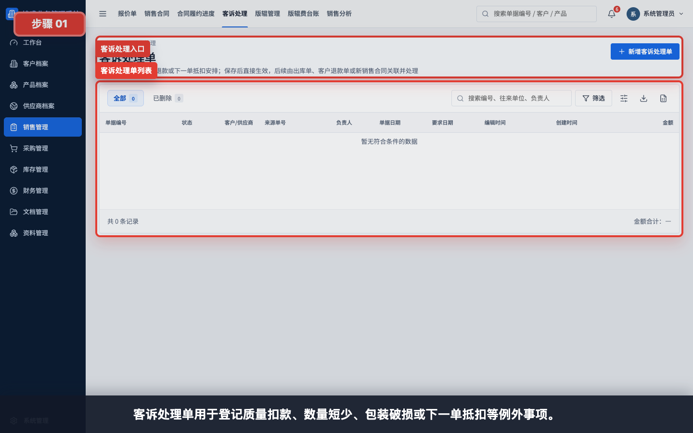
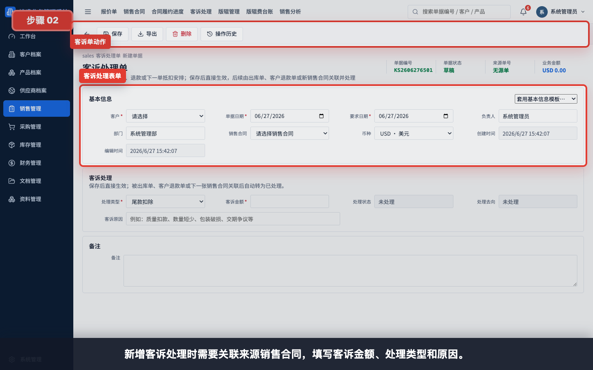
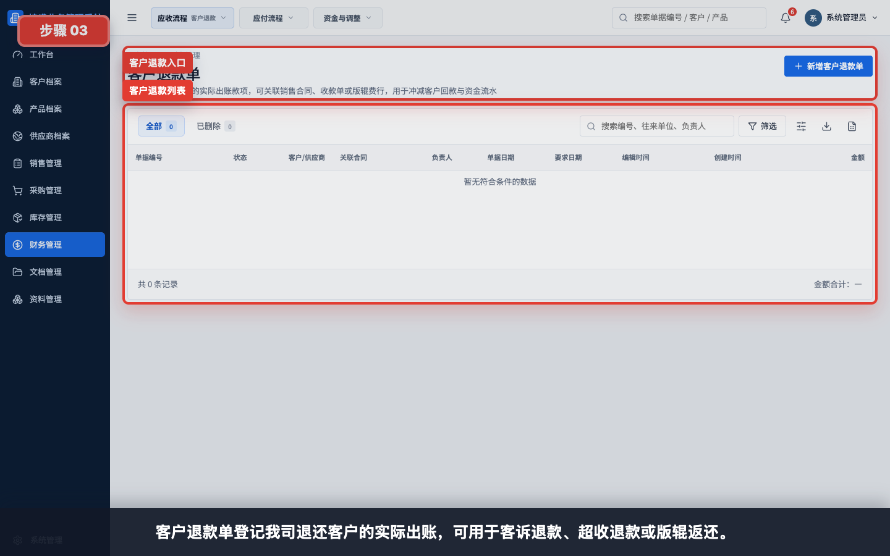
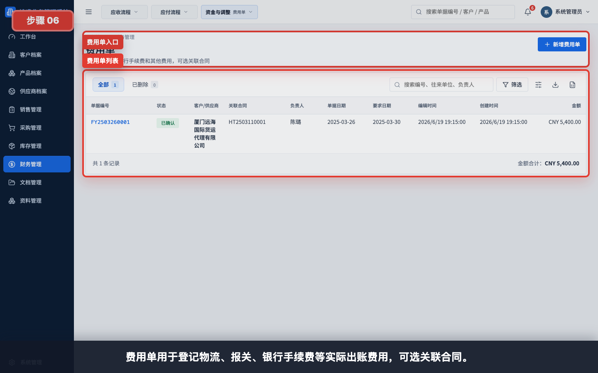
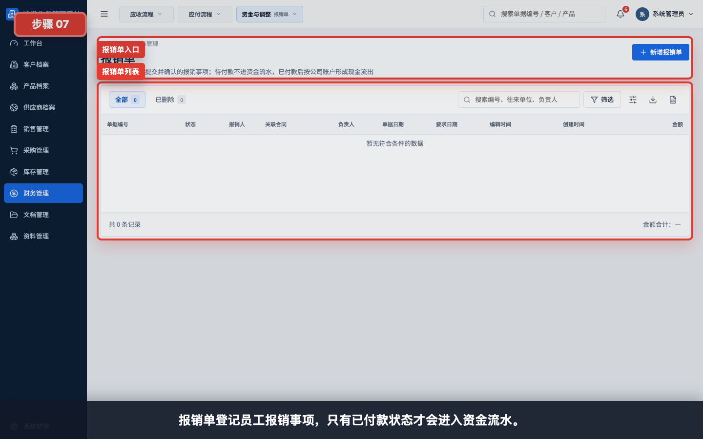
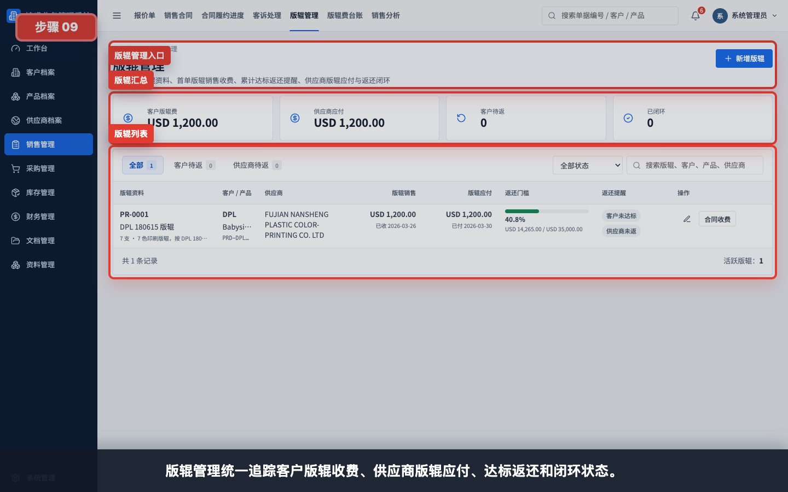
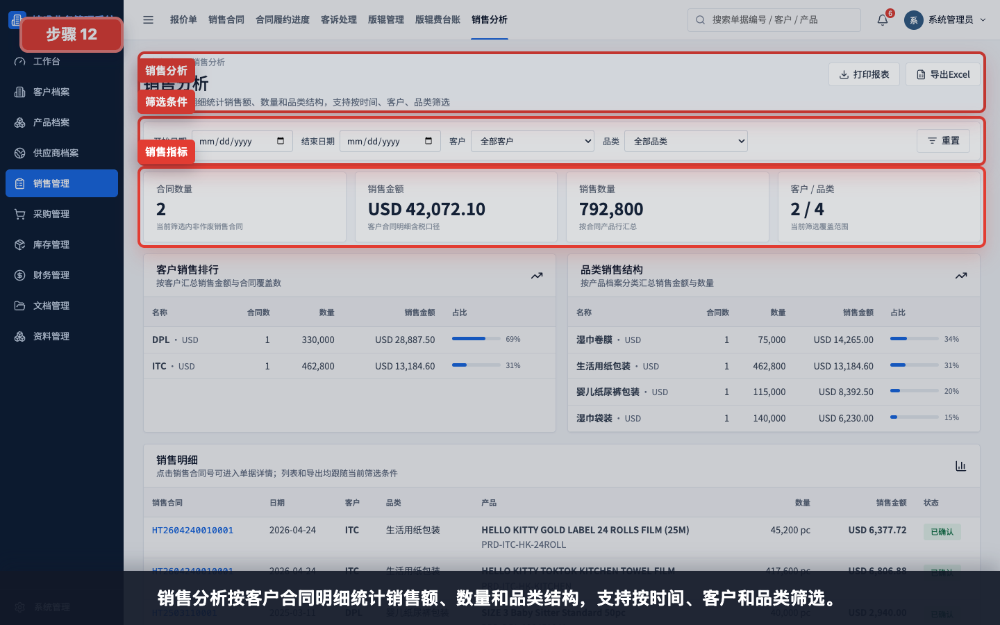
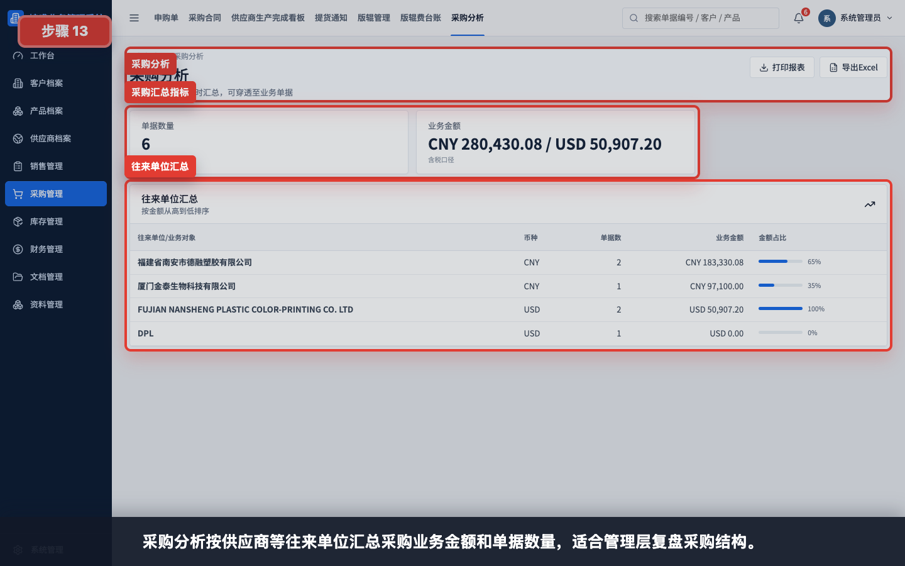

# 例外业务与专题报表截图指引

本指引用于培训客诉、退款、费用、报销、财务调整、版辊和经营分析等边缘模块。这些功能不是每笔订单都会使用，建议放在核心流程、核心看板和协作管理之后讲解。

建议讲解顺序：

1. 先讲客诉处理，说明例外事项如何登记和后续闭环。
2. 再讲客户退款、供应商退款、费用单、报销单和财务调整单。
3. 再讲版辊管理和版辊费台账。
4. 最后讲销售分析和采购分析。

任务级细分指引：

- [如何创建客诉处理单](../销售管理/创建客诉处理单/README.md)
- [如何创建客户退款单](../财务管理/创建客户退款单/README.md)
- [如何创建供应商退款单](../财务管理/创建供应商退款单/README.md)
- [如何创建费用单](../财务管理/创建费用单/README.md)
- [如何创建报销单](../财务管理/创建报销单/README.md)
- [如何创建财务调整单](../财务管理/创建财务调整单/README.md)
- [如何创建版辊记录](../版辊管理/创建版辊记录/README.md)
- [如何生成版辊应付](../版辊管理/生成版辊应付/README.md)
- [如何处理版辊返还](../版辊管理/处理版辊返还/README.md)
- [如何查看版辊费台账](../版辊管理/查看版辊费台账/README.md)

## 步骤 01：客诉处理列表

客诉处理单用于登记质量扣款、数量短少、包装破损、交期争议、下一单抵扣等例外事项。

## 步骤 02：新增客诉处理

新增客诉处理时需要关联来源销售合同，填写客诉金额、处理类型和原因。客诉不会自动替代退款或出库操作，后续仍要按处理方式闭环。

## 步骤 03：客户退款列表

客户退款单登记我司退还客户的实际出账，可用于客诉退款、超收退款或版辊返还。

## 步骤 04：新增客户退款

客户退款必须选择实际出账公司账户，并填写退款金额和关联来源。保存确认后才进入资金流水。

## 步骤 05：供应商退款

供应商退款单登记供应商退回超付款或差异款，是实际现金流入。

## 步骤 06：费用单

费用单用于登记物流、报关、银行手续费、港杂费等实际出账费用，可选关联合同。

## 步骤 07：报销单

报销单登记员工报销事项。只有已付款状态才会进入资金流水。

## 步骤 08：财务调整单

财务调整单用于处理尾差、折让、汇差、坏账等非标准收付款调整事项。

## 步骤 09：版辊管理

版辊管理统一追踪客户版辊收费、供应商版辊应付、达标返还和闭环状态。

## 步骤 10：新增版辊

新增版辊时要绑定客户、产品和供应商，并维护收费金额、应付金额和返还门槛。

## 步骤 11：版辊费台账

版辊费台账按客户和 SKU 核对版辊费收取、客户退还、供应商付款和供应商退款。

## 步骤 12：销售分析

销售分析按客户合同明细统计销售额、数量和品类结构，支持按时间、客户和品类筛选。

## 步骤 13：采购分析

采购分析按供应商等往来单位汇总采购业务金额和单据数量，适合管理层复盘采购结构。

## 讲解重点

- 例外业务要先确认责任和来源单据，再登记处理结果。
- 退款、费用和报销只有形成实际收付时才影响资金流水。
- 财务调整用于处理非标准收付款，不应替代正常发票、收款或付款流程。
- 版辊专题需要同时看客户收费、供应商付款和返还条件。
- 销售分析和采购分析用于复盘结构，不是业务录入入口。
