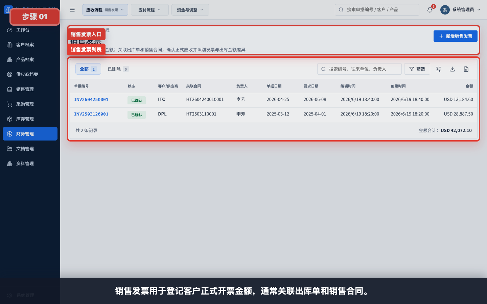
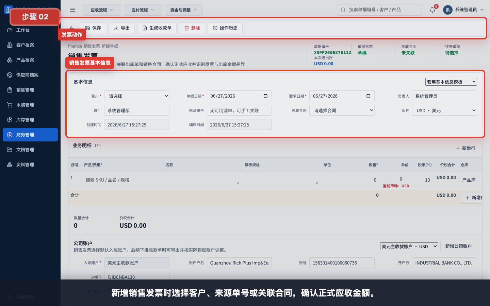
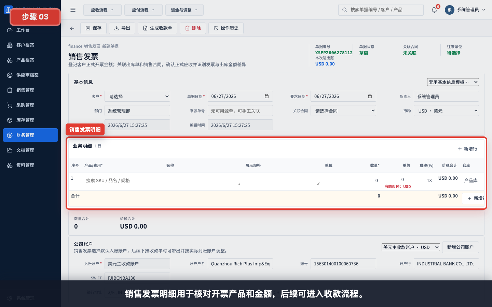
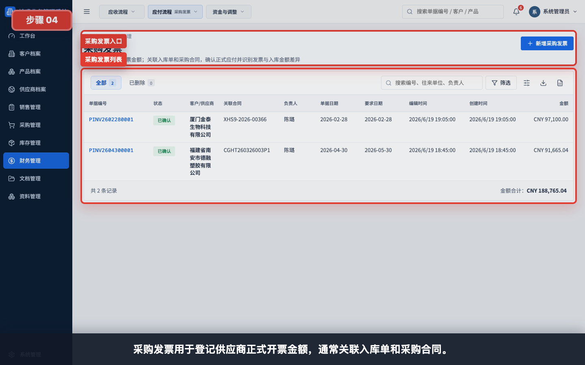
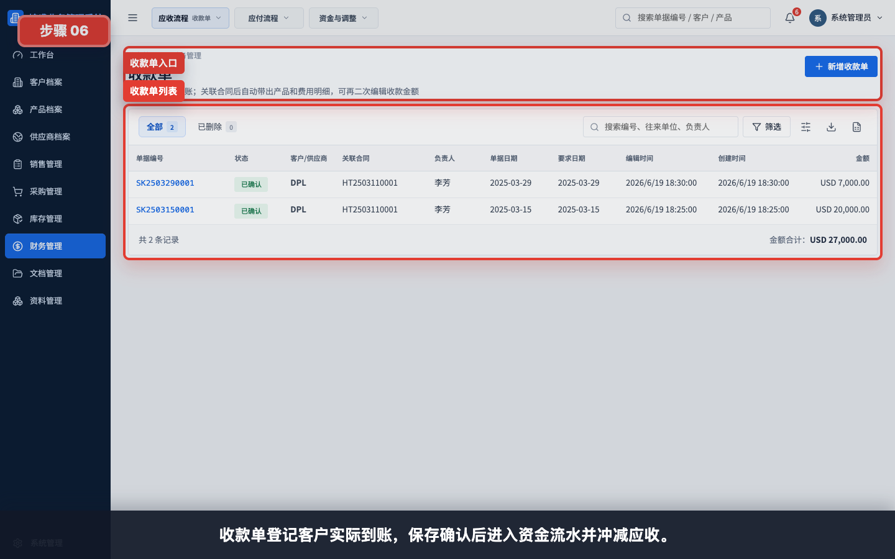
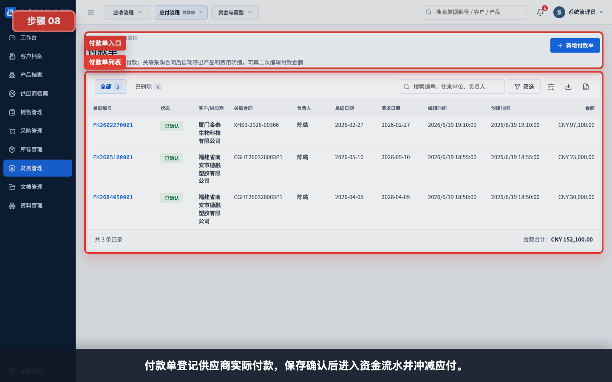
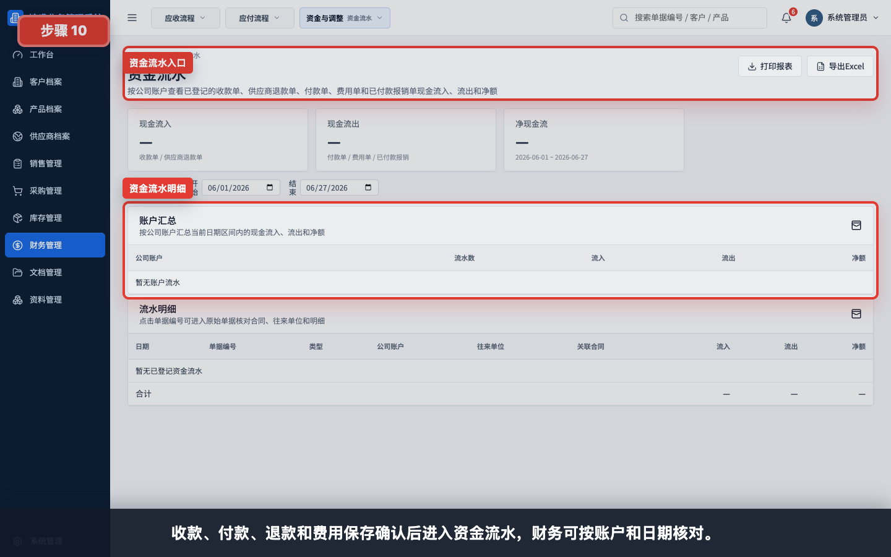

# 财务流程：发票、收款、付款

本模块用于讲解出库如何进入应收、入库如何进入应付，以及销售发票、采购发票、收款单、付款单和资金流水之间的关系。

任务级细分指引：

- [如何从出库单生成销售发票](../财务管理/出库单生成销售发票/README.md)
- [如何从销售发票生成收款单](../财务管理/销售发票生成收款单/README.md)
- [如何从入库单生成采购发票](../财务管理/入库单生成采购发票/README.md)
- [如何从采购发票生成付款单](../财务管理/采购发票生成付款单/README.md)
- [如何创建客户退款单](../财务管理/创建客户退款单/README.md)
- [如何创建供应商退款单](../财务管理/创建供应商退款单/README.md)
- [如何创建费用单](../财务管理/创建费用单/README.md)
- [如何创建报销单](../财务管理/创建报销单/README.md)
- [如何创建财务调整单](../财务管理/创建财务调整单/README.md)
- [如何查看应收看板](../看板报表/查看应收看板/README.md)
- [如何查看应付看板](../看板报表/查看应付看板/README.md)
- [如何查看应收账龄](../看板报表/查看应收账龄/README.md)
- [如何查看应付账龄](../看板报表/查看应付账龄/README.md)
- [如何查看资金流水](../看板报表/查看资金流水/README.md)
- [如何查看发票差异看板](../看板报表/查看发票差异看板/README.md)

## 适用对象

- 财务。
- 管理层。
- 销售/业务员在查看应收状态时参考。
- 采购员在查看应付状态时参考。

## 操作步骤

### 1. 查看销售发票列表

销售发票用于登记客户正式开票金额，通常关联出库单和销售合同。

### 2. 新增销售发票

新增销售发票时选择客户、来源单号或关联合同，确认正式应收金额。

### 3. 核对销售发票明细

销售发票明细用于核对开票产品和金额，后续可进入收款流程。

### 4. 查看采购发票列表

采购发票用于登记供应商正式开票金额，通常关联入库单和采购合同。

### 5. 新增采购发票

新增采购发票时选择供应商、来源入库单或采购合同，确认正式应付金额。

### 6. 查看收款单列表

收款单登记客户实际到账，保存确认后进入资金流水并冲减应收。

### 7. 新增收款单

新增收款单时选择客户、销售合同或出库来源，并选择实际入账公司账户。

### 8. 查看付款单列表

付款单登记供应商实际付款，保存确认后进入资金流水并冲减应付。

### 9. 新增付款单

新增付款单时选择供应商、采购合同或入库来源，并选择实际出账公司账户。

### 10. 查看资金流水

收款、付款、退款和费用保存确认后进入资金流水，财务可按账户和日期核对。

## 使用建议

- 出库单是应收链路的重要来源。
- 入库单是应付链路的重要来源。
- 发票用于确认正式开票金额。
- 收款单和付款单用于记录实际资金进出。
- 财务单据应尽量关联源单或合同，避免后续无法追溯。

## 常见问题

- **为什么收款单需要选择公司账户**：资金流水需要知道实际入账账户。
- **为什么付款单需要选择公司账户**：资金流水需要知道实际出账账户。
- **发票金额和源单金额不一致怎么办**：后续到发票差异看板核对。
- **为什么财务单据要关联合同或源单**：关联后应收、应付、账龄和资金流水才能形成闭环。
