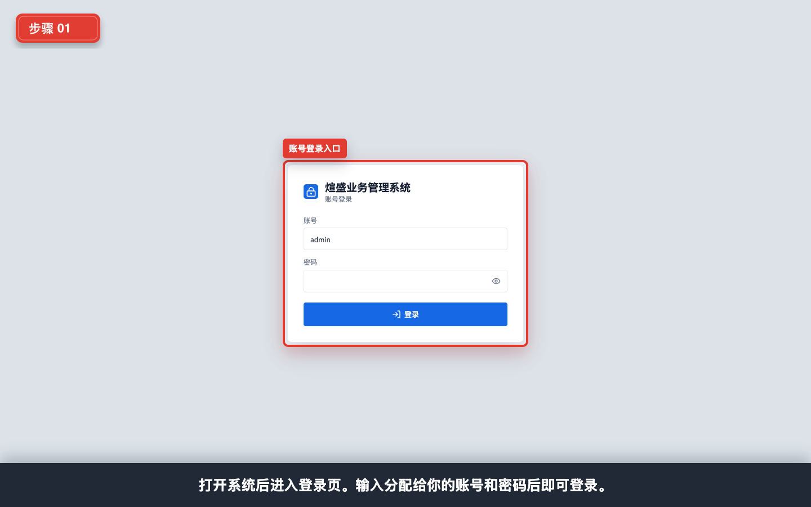
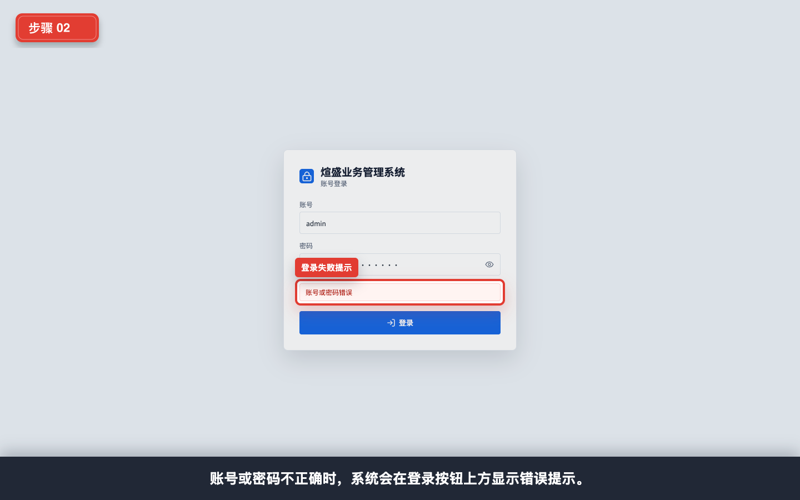
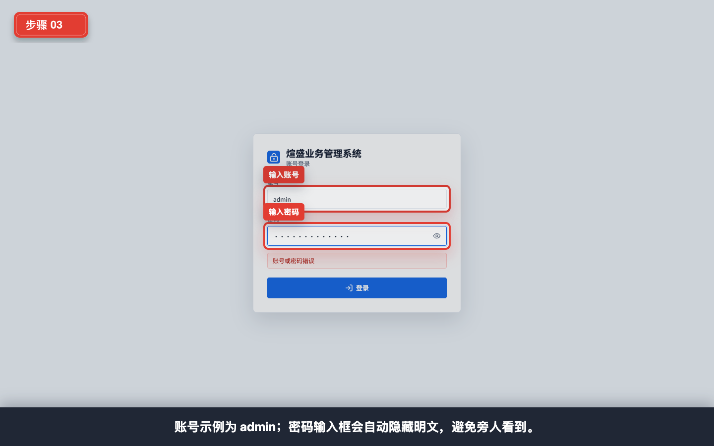
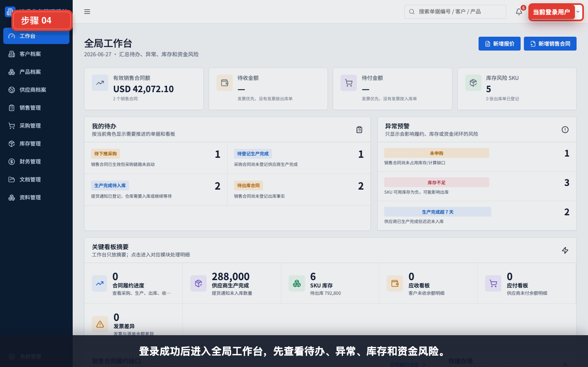
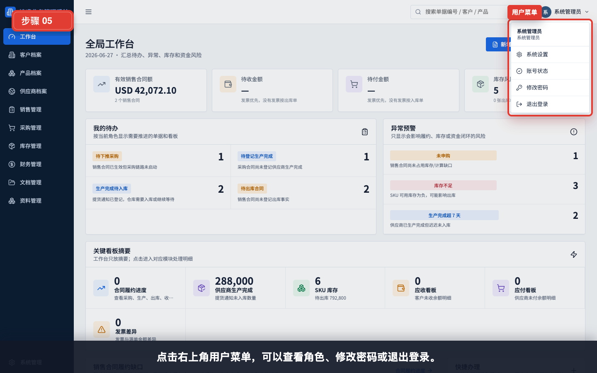
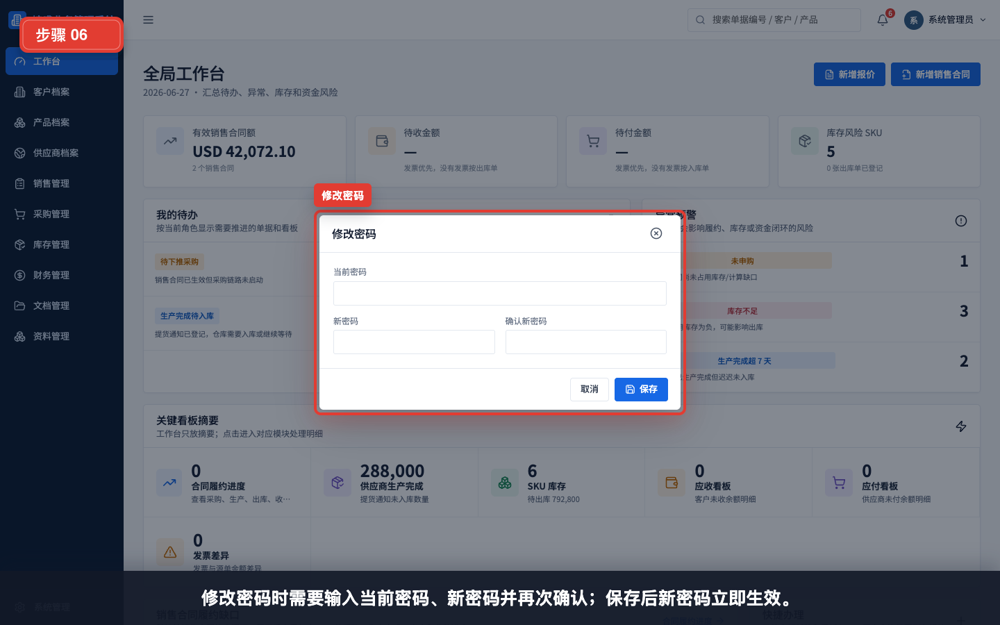
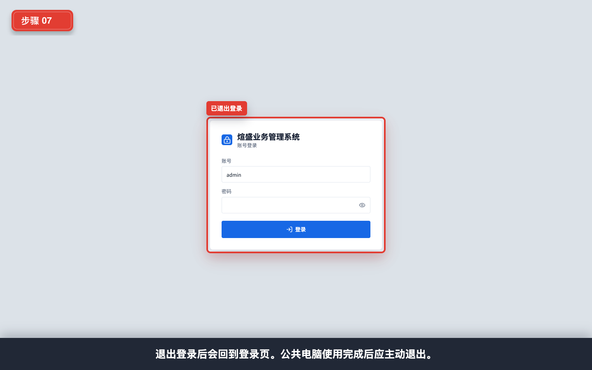

# 登录与账号入口

本模块用于新用户第一次进入系统时学习登录、错误提示、用户菜单、修改密码和退出登录。

## 适用对象

- 所有新用户。
- 培训讲师。
- 系统管理员在发放账号时使用。

## 操作步骤

### 1. 打开登录页

打开系统地址后会进入登录页。用户需要输入分配给自己的账号和密码。

### 2. 识别登录失败提示

如果账号或密码不正确，系统会在登录按钮上方显示错误提示。遇到该提示时，应先检查账号、密码和大小写；仍无法登录时联系管理员重置密码。

### 3. 输入账号和密码

账号示例为 `admin`。实际培训或生产使用时，应输入管理员分配的个人账号。密码输入框会自动隐藏明文，避免旁人看到。

### 4. 登录成功后进入工作台

登录成功后默认进入全局工作台。新用户应先查看待办、异常、库存和资金风险，再进入具体模块处理业务。

### 5. 打开右上角用户菜单

点击右上角用户菜单，可以查看当前账号、角色，进入系统设置、修改密码或退出登录。

### 6. 修改密码

修改密码时需要输入当前密码、新密码并再次确认。保存后新密码立即生效。

### 7. 退出登录

公共电脑或共享办公环境中，使用完成后应主动退出登录。退出后系统会回到登录页。

## 常见问题

- **忘记密码**：联系系统管理员重置密码。
- **提示账号或密码错误**：检查账号、密码、大小写和输入法状态。
- **看不到某些菜单**：通常是当前账号角色没有对应权限。
- **登录后菜单和同事不同**：不同角色拥有不同菜单、字段和数据范围。
- **修改密码失败**：确认当前密码正确，并按系统密码规则设置新密码。

## 安全提醒

- 不要共用账号。
- 不要把密码写在纸面或聊天工具中。
- 公共电脑使用完成后应退出登录。
- 发现账号异常或权限不对时，及时联系系统管理员。
