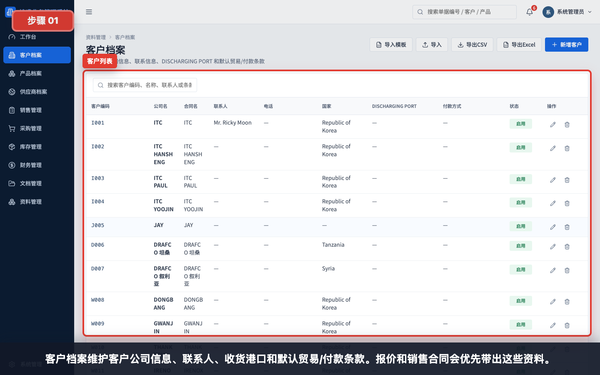
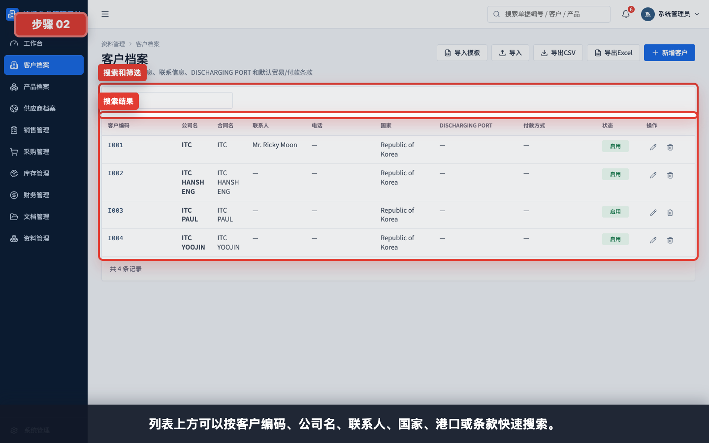
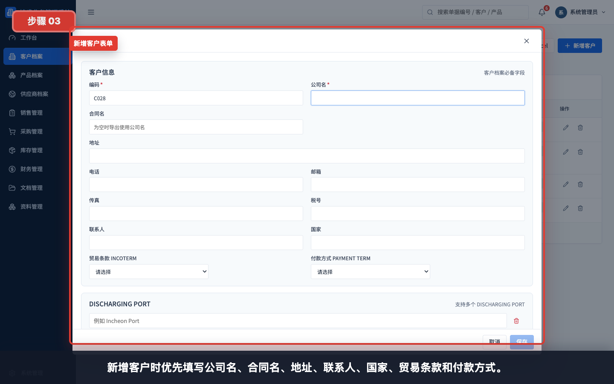
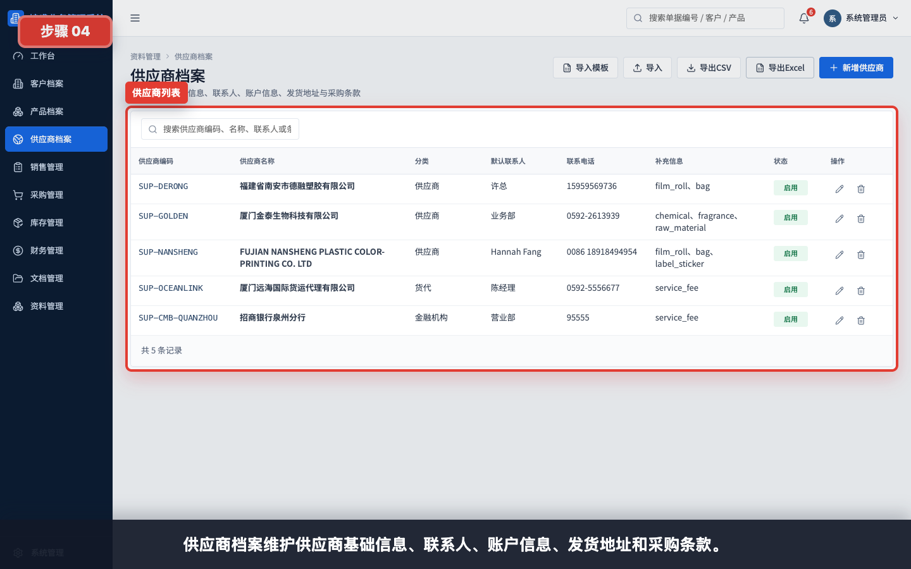
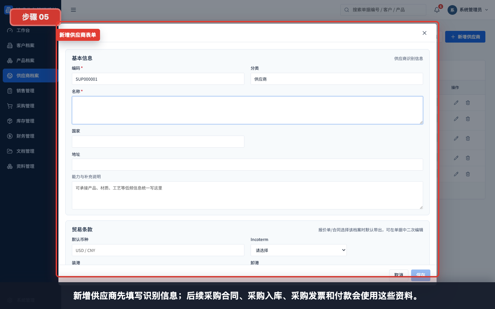
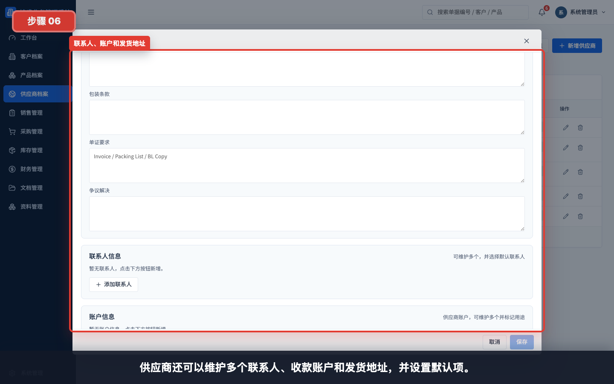
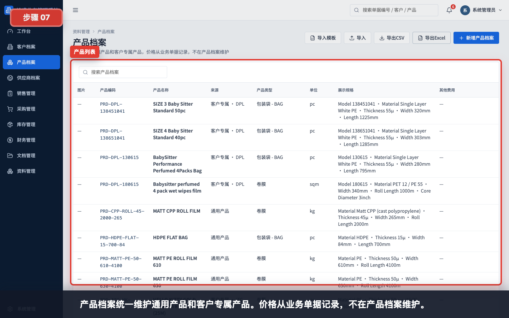
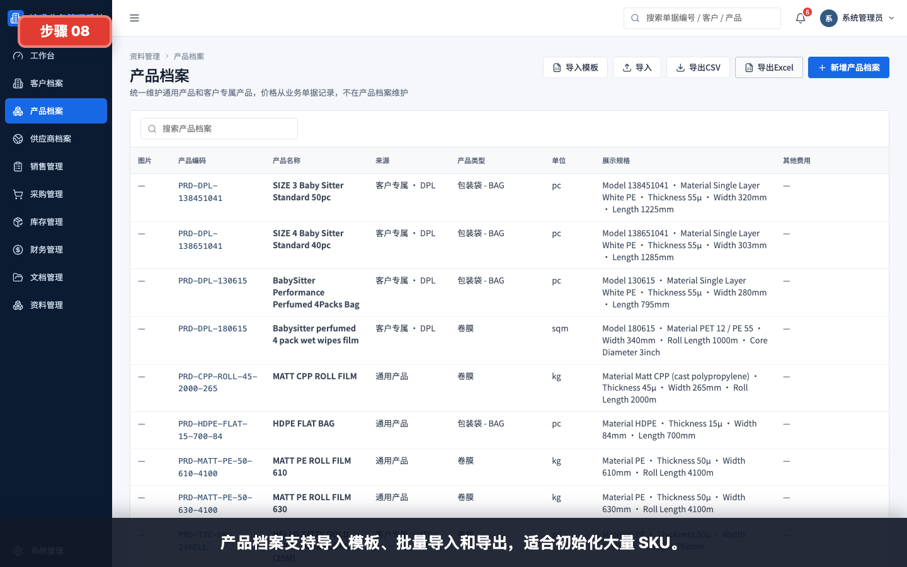
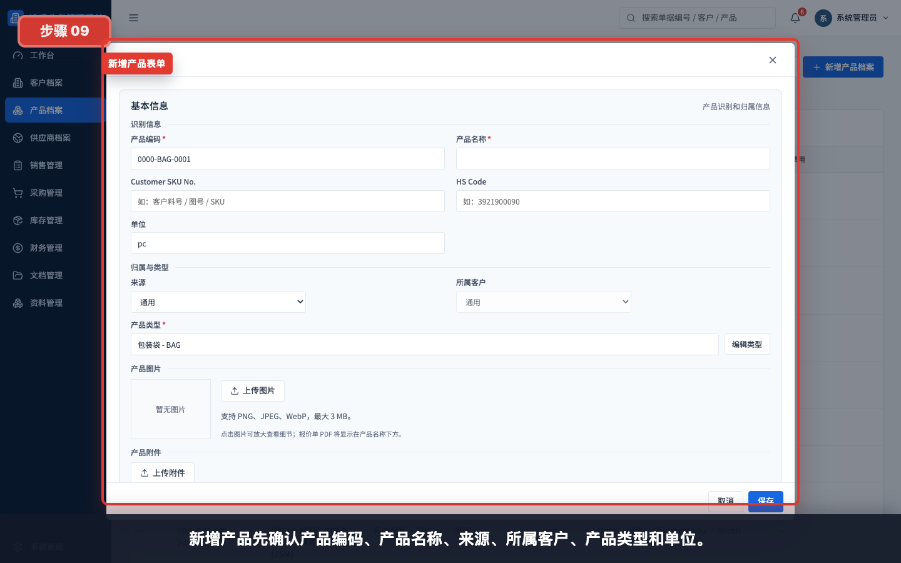
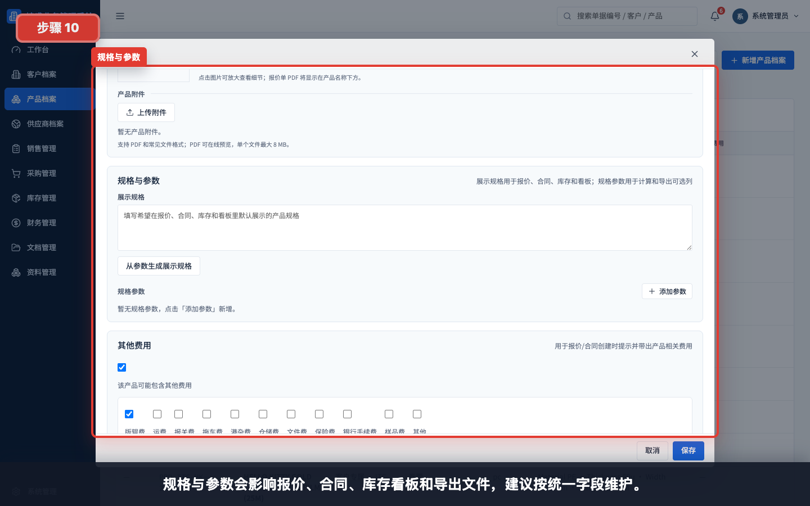

# 基础资料：客户、供应商、产品

本模块用于新用户理解业务录单前需要先维护哪些基础资料。客户、供应商和产品是报价、合同、采购、库存和财务单据的基础。

任务级细分指引：

- [如何创建一个新客户](../基础资料/创建新客户/README.md)
- [如何创建一个新供应商](../基础资料/创建新供应商/README.md)
- [如何创建一个新产品](../基础资料/创建新产品/README.md)
- [如何维护公司资料](../资料管理/维护公司资料/README.md)
- [如何维护合同模板](../资料管理/维护合同模板/README.md)
- [如何维护头信息模板](../资料管理/维护头信息模板/README.md)
- [如何维护币种汇率](../资料管理/维护币种汇率/README.md)
- [如何维护公司账户](../资料管理/维护公司账户/README.md)

## 适用对象

- 销售/业务员。
- 采购员。
- 仓管员。
- 财务。
- 系统管理员和关键用户。

## 操作步骤

### 1. 查看客户档案

客户档案维护客户公司信息、联系人、DISCHARGING PORT 和默认贸易/付款条款。报价和销售合同会优先带出这些资料。

### 2. 搜索客户

可以按客户编码、公司名、联系人、国家、港口或条款快速搜索客户。

### 3. 新增客户

新增客户时优先填写公司名、合同名、地址、联系人、国家、贸易条款和付款方式。

### 4. 查看供应商档案

供应商档案维护供应商基础信息、联系人、账户信息、发货地址和采购条款。

### 5. 新增供应商基础信息

新增供应商先填写识别信息。后续采购合同、采购入库、采购发票和付款会使用这些资料。

### 6. 维护供应商联系人、账户和地址

供应商可以维护多个联系人、收款账户和发货地址，并设置默认项。

### 7. 查看产品档案

产品档案统一维护通用产品和客户专属产品。价格从业务单据记录，不在产品档案维护。

### 8. 使用产品导入导出

产品档案支持导入模板、批量导入和导出，适合初始化大量 SKU。

### 9. 新增产品基础信息

新增产品先确认产品编码、产品名称、来源、所属客户、产品类型和单位。

### 10. 维护产品规格参数

规格与参数会影响报价、合同、库存看板和导出文件，建议按统一字段维护。

## 使用建议

- 录入报价单或销售合同前，先确认客户和产品档案是否完整。
- 创建采购合同前，先确认供应商档案、联系人和收款账户是否完整。
- 产品规格字段尽量统一，避免同一含义使用多个名称。
- 批量初始化资料时优先使用导入模板。

## 常见问题

- **为什么报价单里带不出客户信息**：先检查客户档案是否维护完整。
- **为什么采购付款时找不到供应商账户**：先检查供应商档案中的账户信息。
- **为什么产品规格在导出里不一致**：可能是产品档案的规格字段命名不统一。
- **什么时候用客户专属产品**：当产品只服务某个客户、需要绑定客户料号或专属规格时使用。
