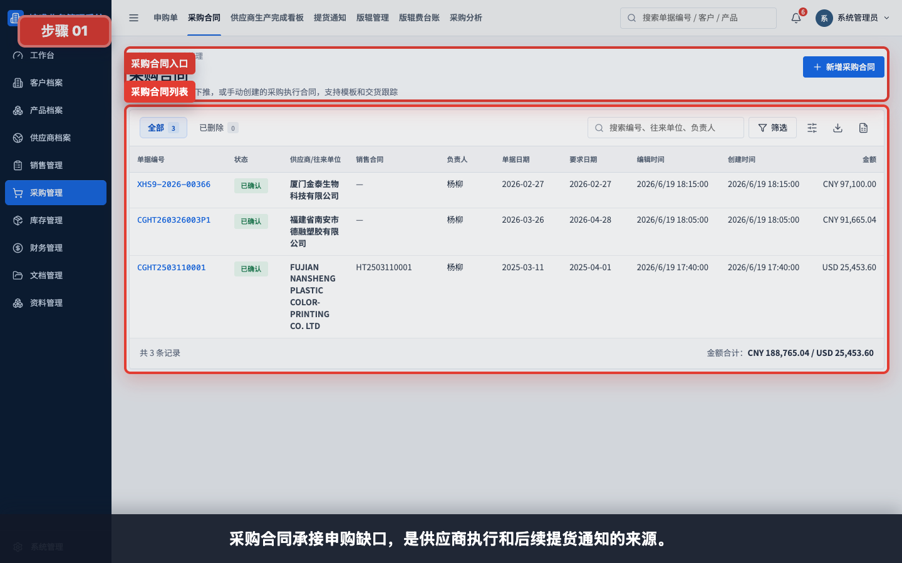
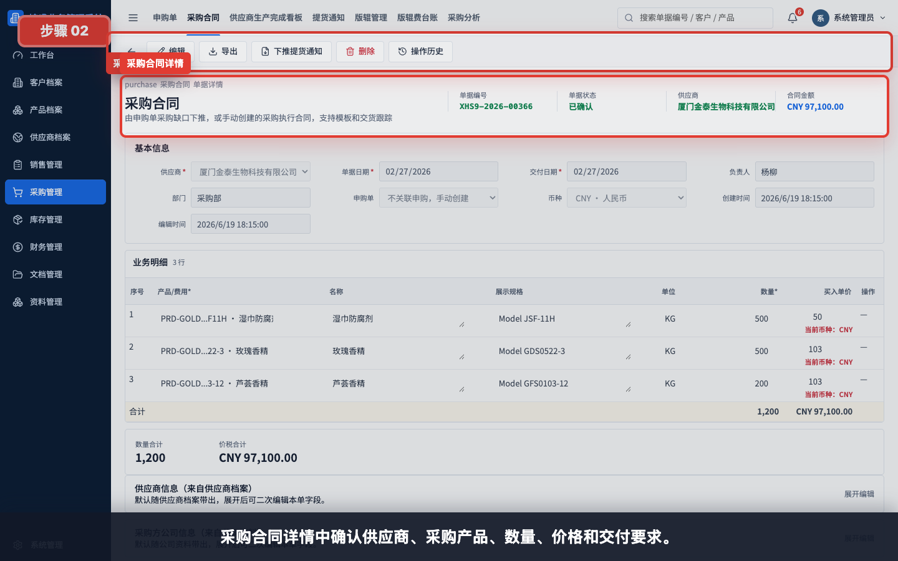
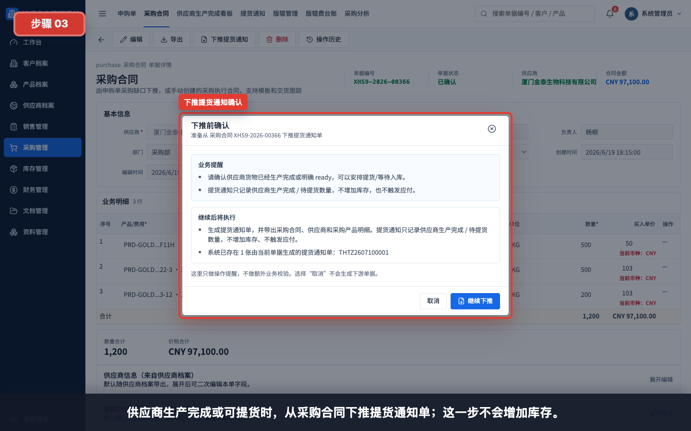
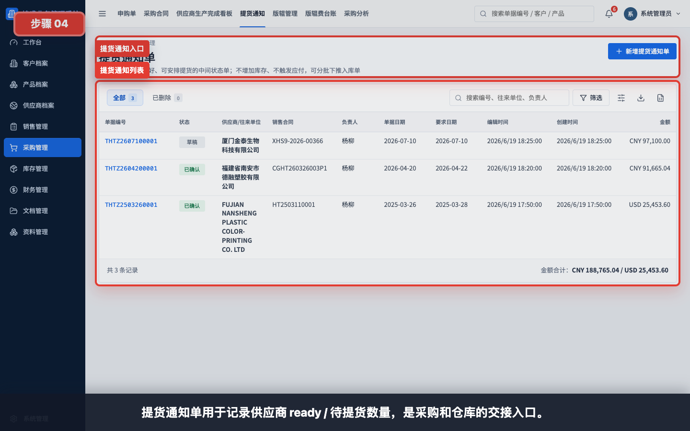
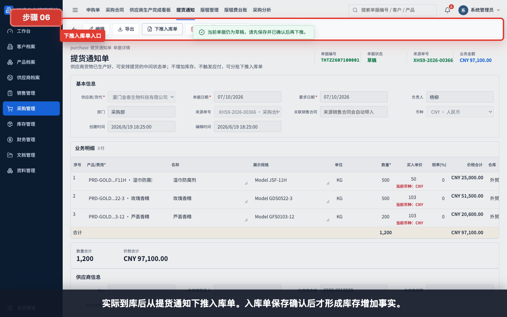
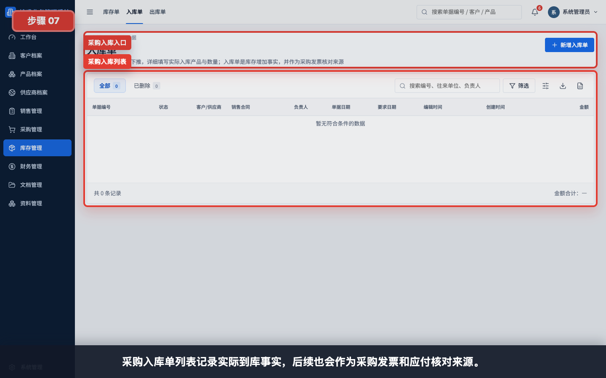
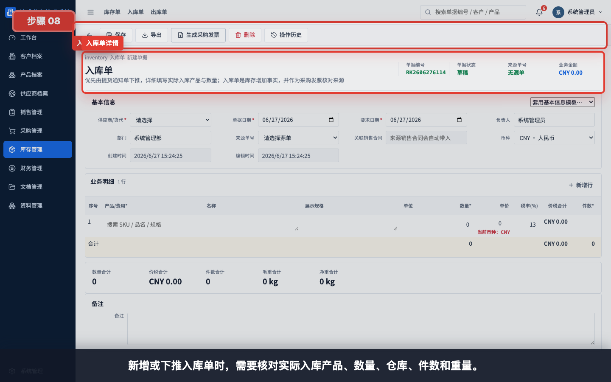
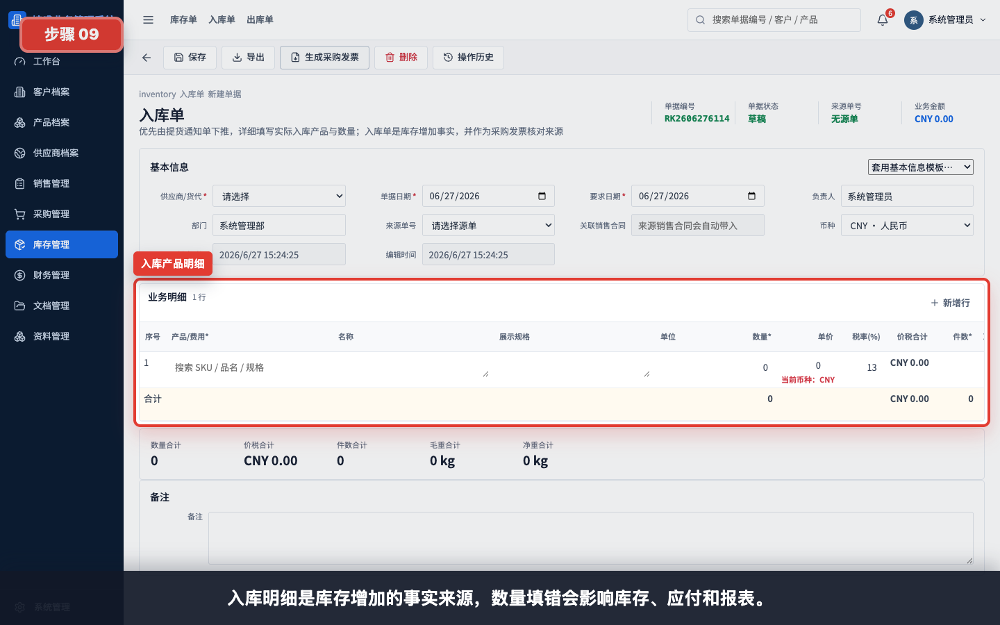
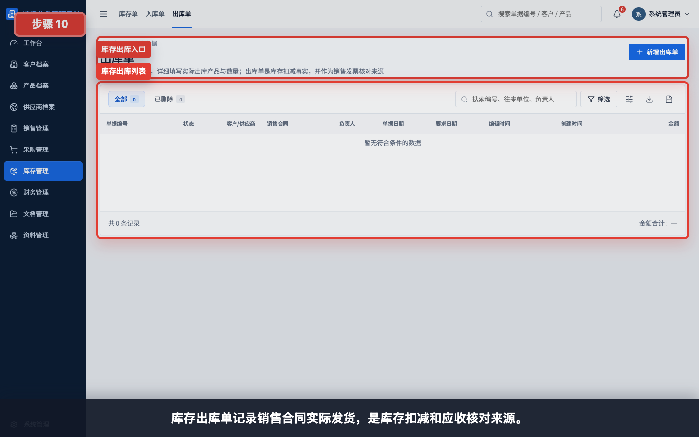
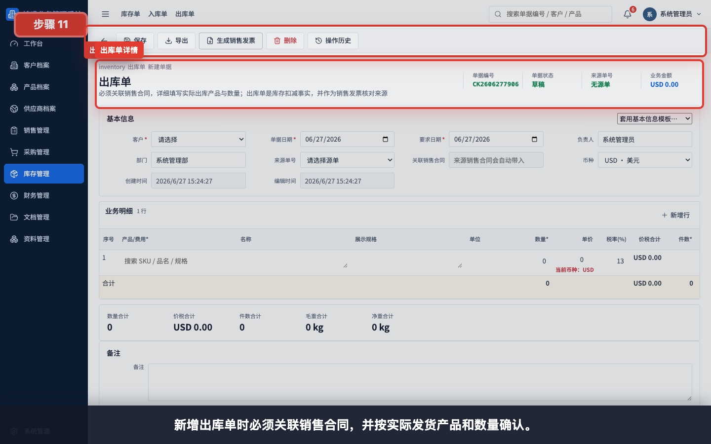

# 采购履约与库存出入库

本模块用于讲解采购合同后续如何登记供应商 ready、如何形成入库事实，以及销售出库如何扣减库存。

任务级细分指引：

- [如何从申购单下推采购合同](../采购管理/申购单下推采购合同/README.md)
- [如何创建采购合同](../采购管理/创建采购合同/README.md)
- [如何从采购合同下推提货通知](../采购管理/采购合同下推提货通知/README.md)
- [如何从提货通知下推采购入库单](../库存管理/提货通知下推采购入库单/README.md)
- [如何查看供应商生产完成看板](../看板报表/查看供应商生产完成看板/README.md)
- [如何查看库存看板](../看板报表/查看库存看板/README.md)
- [如何创建库存出库单](../库存管理/创建库存出库单/README.md)
- [如何从出库单生成销售发票](../财务管理/出库单生成销售发票/README.md)
- [如何从入库单生成采购发票](../财务管理/入库单生成采购发票/README.md)
- [如何从采购发票生成付款单](../财务管理/采购发票生成付款单/README.md)
- [如何创建供应商退款单](../财务管理/创建供应商退款单/README.md)
- [如何创建费用单](../财务管理/创建费用单/README.md)

## 适用对象

- 采购员。
- 仓管员。
- 销售/业务员在查看履约状态时参考。
- 财务在理解应付/应收来源时参考。

## 操作步骤

### 1. 查看采购合同列表

采购合同承接申购缺口，是供应商执行和后续提货通知的来源。

### 2. 查看采购合同详情

采购合同详情中确认供应商、采购产品、数量、价格和交付要求。

### 3. 从采购合同下推提货通知

供应商生产完成或可提货时，从采购合同下推提货通知单；这一步不会增加库存。

### 4. 查看提货通知列表

提货通知单用于记录供应商 ready / 待提货数量，是采购和仓库的交接入口。

### 5. 查看提货通知详情

提货通知详情只表示货已生产完成或可安排提货，不代表库存已经增加。

### 6. 从提货通知下推入库单

实际到库后从提货通知下推入库单。入库单保存确认后才形成库存增加事实。

### 7. 查看采购入库列表

采购入库单列表记录实际到库事实，后续也会作为采购发票和应付核对来源。

### 8. 新增或查看入库单详情

新增或下推入库单时，需要核对实际入库产品、数量、仓库、件数和重量。

### 9. 核对入库产品明细

入库明细是库存增加的事实来源，数量填错会影响库存、应付和报表。

### 10. 查看库存出库列表

库存出库单记录销售合同实际发货，是库存扣减和应收核对来源。

### 11. 新增或查看出库单详情

新增出库单时必须关联销售合同，并按实际发货产品和数量确认。

## 使用建议

- 采购合同确认供应商和采购要求。
- 提货通知只记录 ready / 待提货，不增加库存。
- 入库单才增加库存，并进入应付核对链路。
- 出库单才扣减库存，并进入应收核对链路。
- 仓管录入数量时应按实际收发货情况填写。

## 常见问题

- **提货通知为什么不算库存**：提货通知只说明供应商 ready，货还没有实际入库。
- **什么时候做入库单**：货物实际到库后做入库单。
- **什么时候做出库单**：销售合同实际发货后做出库单。
- **为什么财务要看入库/出库**：入库是应付核对来源，出库是应收核对来源。
