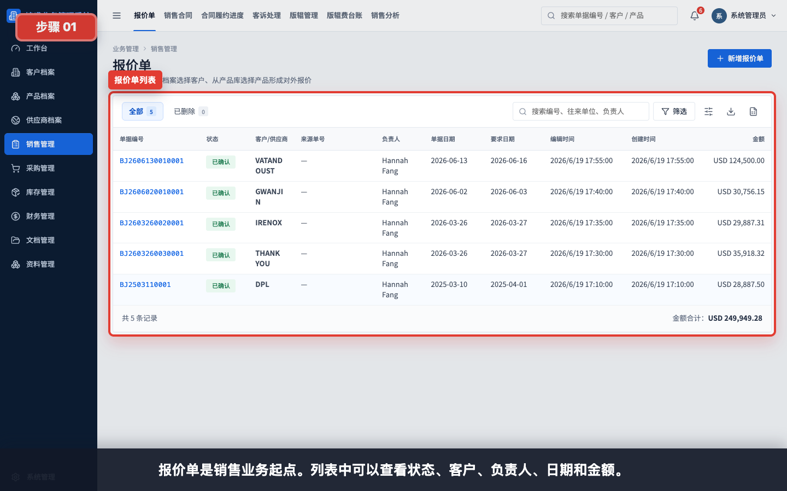
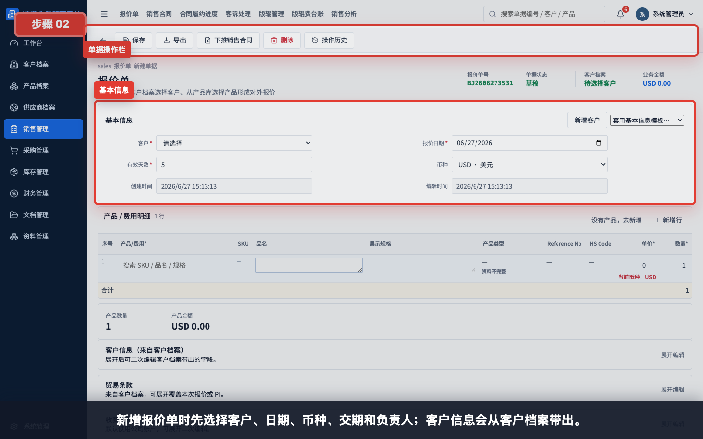
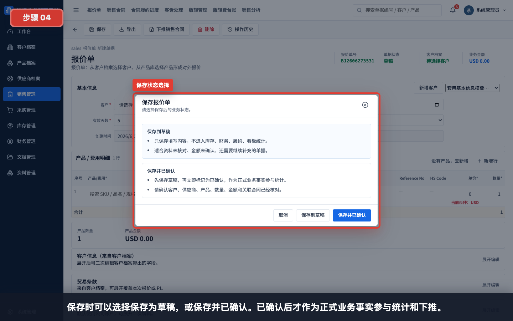
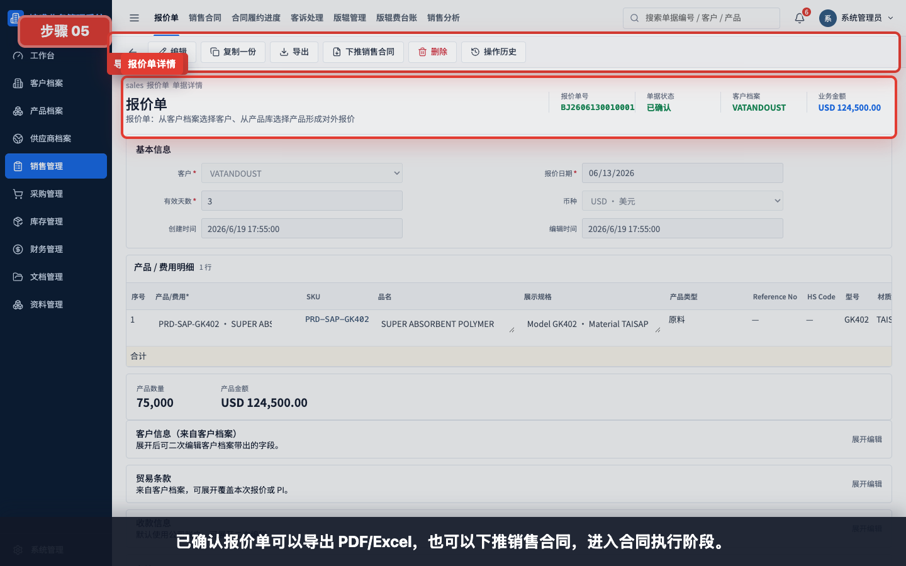
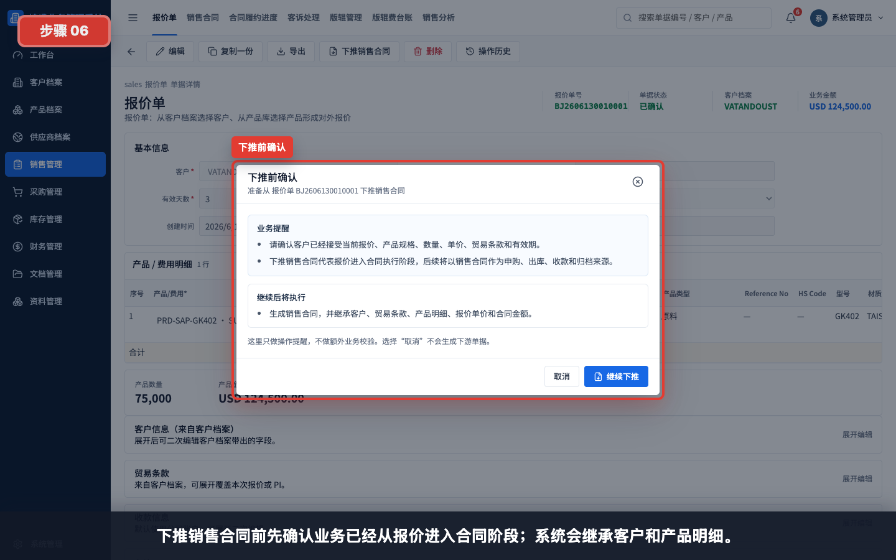
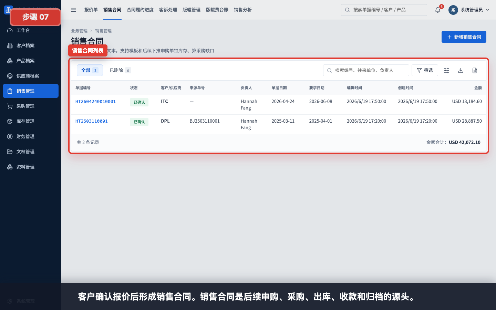
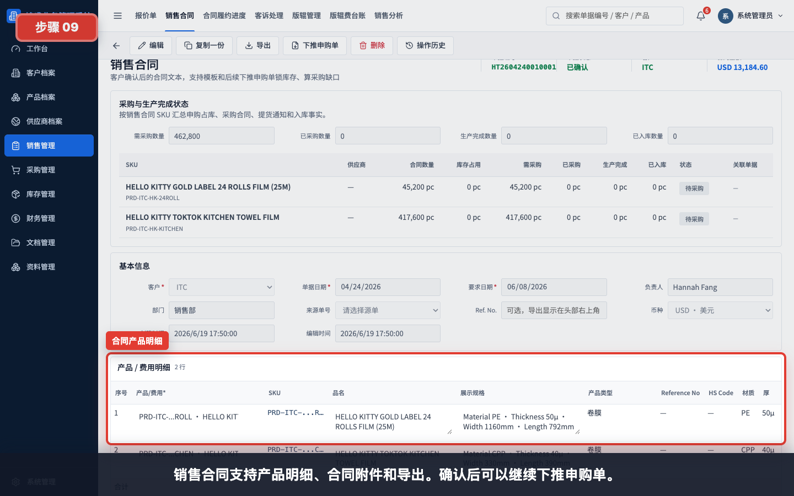

# 销售流程：报价单到销售合同

本模块用于讲解销售业务的起点：如何查看报价单、创建报价单、保存确认、导出，以及将已确认报价下推为销售合同。

任务级细分指引：

- [如何创建报价单](../销售管理/创建报价单/README.md)
- [如何从报价单下推销售合同](../销售管理/报价单下推销售合同/README.md)
- [如何创建销售合同](../销售管理/创建销售合同/README.md)
- [如何从销售合同下推申购单](../销售管理/销售合同下推申购单/README.md)
- [如何查看合同履约进度](../看板报表/查看合同履约进度/README.md)
- [如何创建客诉处理单](../销售管理/创建客诉处理单/README.md)
- [如何创建客户退款单](../财务管理/创建客户退款单/README.md)

## 适用对象

- 销售/业务员。
- 管理层。
- 财务和只读审计在查看销售链路时参考。

## 操作步骤

### 1. 查看报价单列表

报价单是销售业务起点。列表中可以查看状态、客户、负责人、日期和金额。

### 2. 新增报价单基本信息

新增报价单时先选择客户、日期、币种、交期和负责人；客户信息会从客户档案带出。

### 3. 维护报价产品明细

产品明细中选择产品、数量、单位和报价单价；合计金额会自动计算。

### 4. 保存报价单

保存时可以选择保存为草稿，或保存并已确认。已确认后才作为正式业务事实参与统计和下推。

### 5. 查看已确认报价单动作

已确认报价单可以导出 PDF/Excel，也可以下推销售合同，进入合同执行阶段。

### 6. 下推销售合同前确认

下推销售合同前先确认业务已经从报价进入合同阶段；系统会继承客户和产品明细。

### 7. 查看销售合同列表

客户确认报价后形成销售合同。销售合同是后续申购、采购、出库、收款和归档的源头。

### 8. 查看销售合同详情

销售合同详情保留客户、产品、贸易条款和金额，是后续业务追溯的核心单据。

### 9. 查看合同明细和附件

销售合同支持产品明细、合同附件和导出。确认后可以继续下推申购单。

## 使用建议

- 报价前先确认客户档案和产品档案是否完整。
- 尽量从报价单下推销售合同，避免重复录入并保留来源追溯。
- 对外发送前先检查 PDF/Excel 导出预览。
- 销售合同确认后再进入申购、采购、出库和收款流程。

## 常见问题

- **为什么不能下推销售合同**：报价单需要先保存并已确认。
- **为什么客户资料不完整**：先回到客户档案维护地址、联系人、港口和付款条款。
- **为什么产品带不出规格**：先检查产品档案的规格字段。
- **销售合同为什么重要**：后续申购、采购、库存、财务和文档归档都围绕销售合同追溯。
