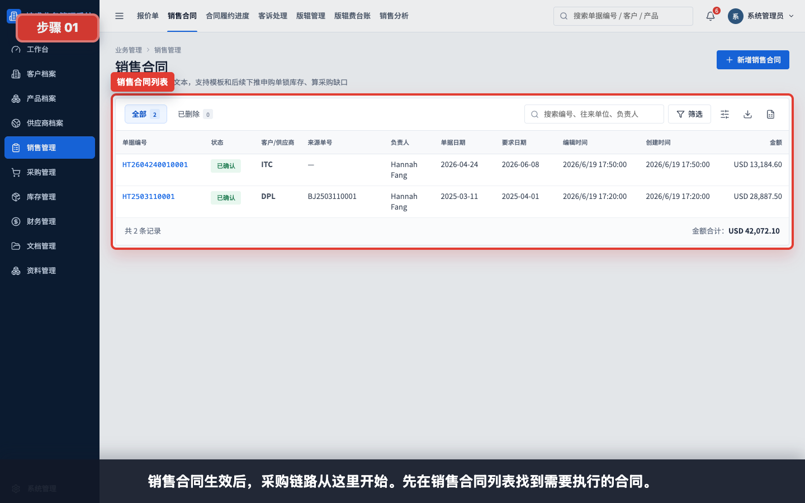
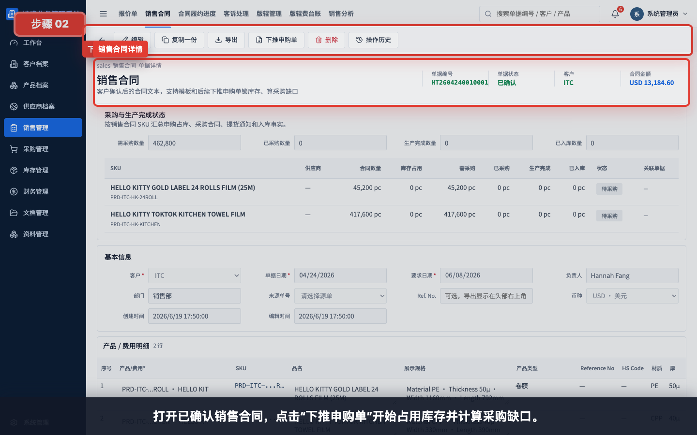
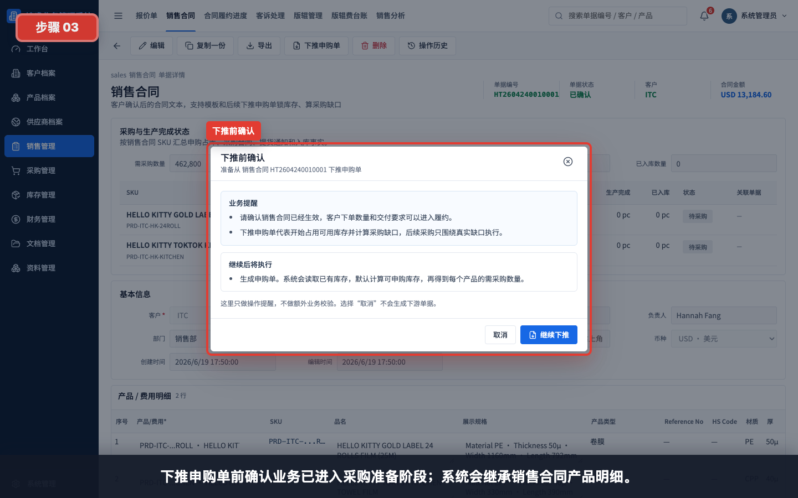
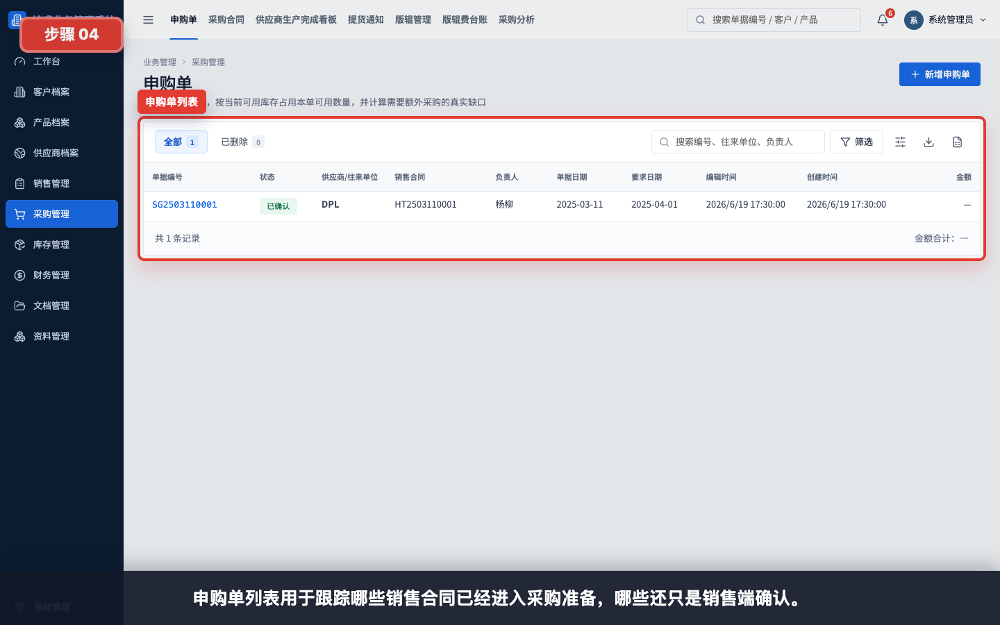
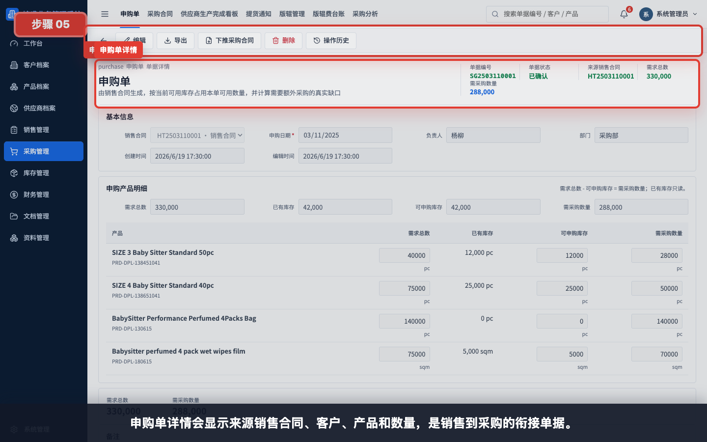
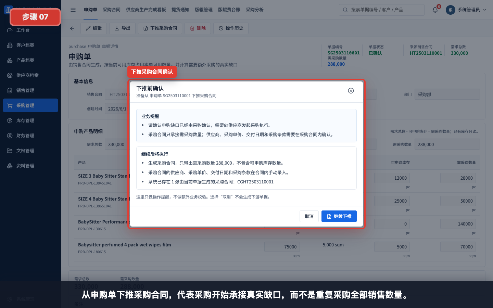
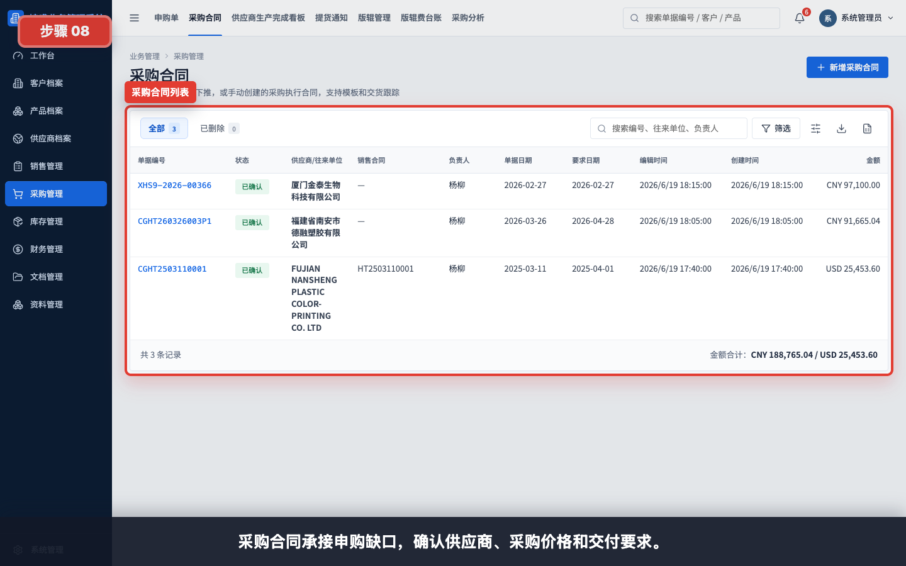

# 销售到采购：销售合同、申购单、采购合同

本模块用于讲解销售合同确认后如何进入采购准备：从销售合同下推申购单，再由申购单下推采购合同。

任务级细分指引：

- [如何从销售合同下推申购单](../销售管理/销售合同下推申购单/README.md)
- [如何从申购单下推采购合同](../采购管理/申购单下推采购合同/README.md)
- [如何创建采购合同](../采购管理/创建采购合同/README.md)
- [如何从采购合同下推提货通知](../采购管理/采购合同下推提货通知/README.md)
- [如何从提货通知下推采购入库单](../库存管理/提货通知下推采购入库单/README.md)
- [如何创建库存出库单](../库存管理/创建库存出库单/README.md)

## 适用对象

- 销售/业务员。
- 采购员。
- 管理层。
- 仓管员在理解库存锁定时参考。

## 操作步骤

### 1. 查看销售合同列表

销售合同生效后，采购链路从这里开始。先在销售合同列表找到需要执行的合同。

### 2. 从销售合同下推申购单

打开已确认销售合同，点击“下推申购单”开始占用库存并计算采购缺口。

### 3. 确认下推申购单

下推申购单前确认业务已进入采购准备阶段；系统会继承销售合同产品明细。

### 4. 查看申购单列表

申购单列表用于跟踪哪些销售合同已经进入采购准备，哪些还只是销售端确认。

### 5. 查看申购单详情

申购单详情会显示来源销售合同、客户、产品和数量，是销售到采购的衔接单据。

### 6. 查看库存占用和采购缺口

申购产品明细重点看：需求总数、可申购库存和需采购数量。需采购数量会进入采购合同。

### 7. 从申购单下推采购合同

从申购单下推采购合同，代表采购开始承接真实缺口，而不是重复采购全部销售数量。

### 8. 查看采购合同列表

采购合同承接申购缺口，确认供应商、采购价格和交付要求。

### 9. 查看采购合同详情

采购合同详情保留来源、供应商、采购产品和金额，后续可下推提货通知单。

## 使用建议

- 销售合同确认后应及时下推申购单。
- 申购单中重点核对可申购库存和需采购数量。
- 采购合同应优先从申购单下推，保证采购数量来自真实缺口。
- 如果申购单已经锁定库存，后续作废或修改需要注意库存影响。

## 常见问题

- **为什么销售合同不能下推申购单**：销售合同需要先保存并已确认。
- **为什么采购数量小于销售数量**：系统会先占用可申购库存，只把缺口带入采购合同。
- **为什么采购合同没有客户销售金额**：采购角色可能没有销售金额权限。
- **为什么不建议手工新建采购合同**：手工新建容易丢失销售合同来源和采购缺口口径。
