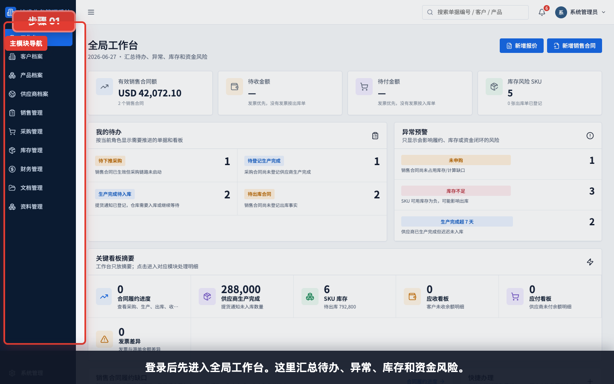
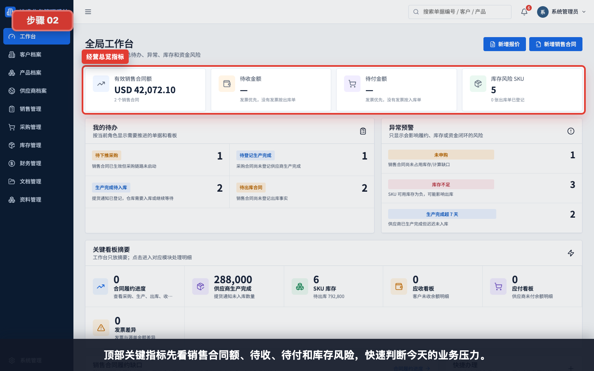
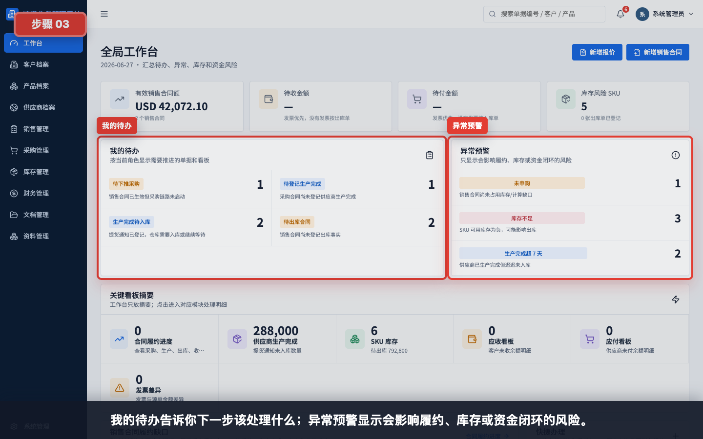
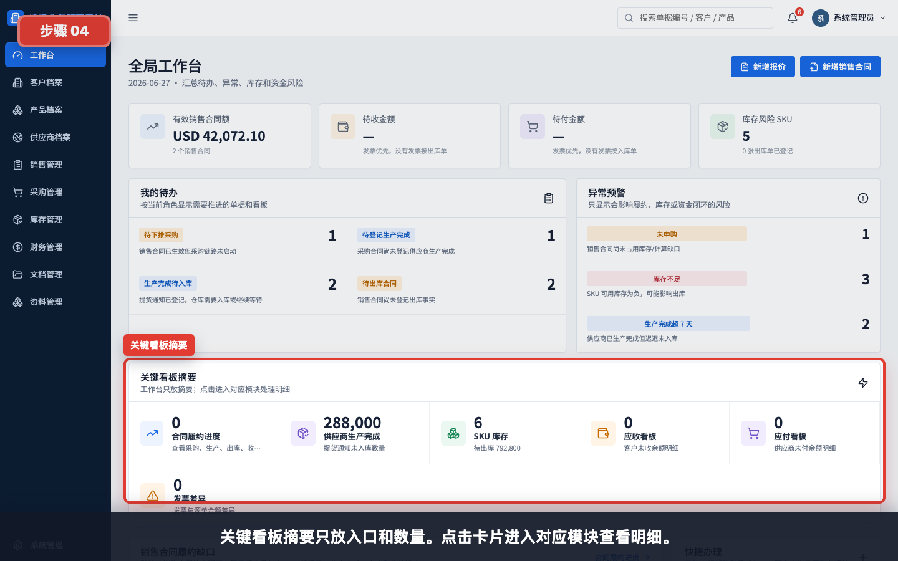
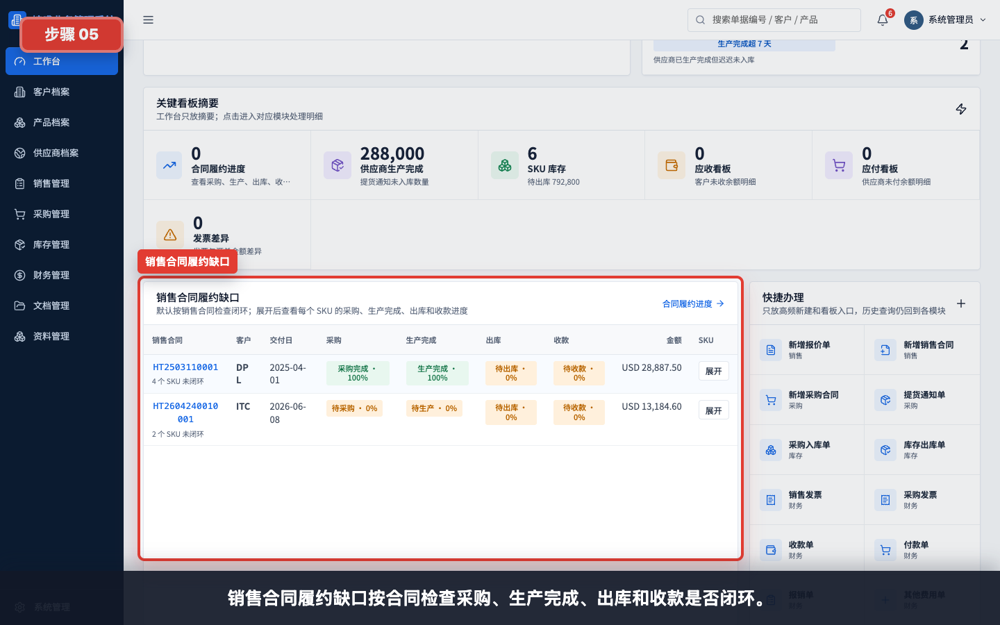
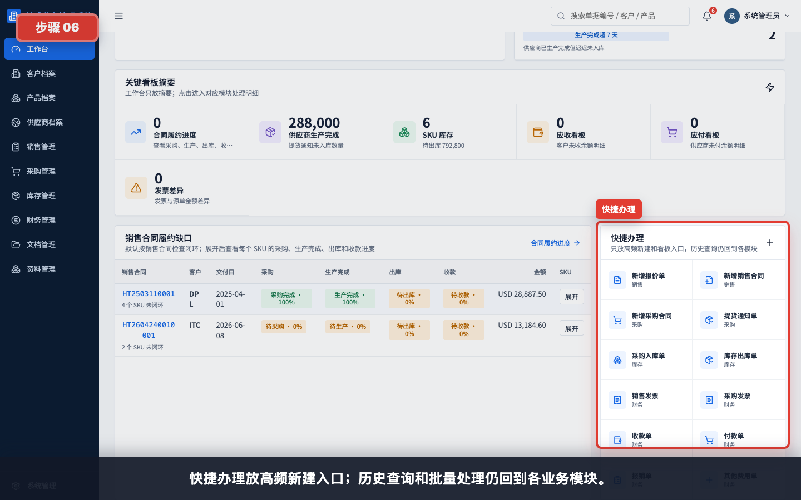
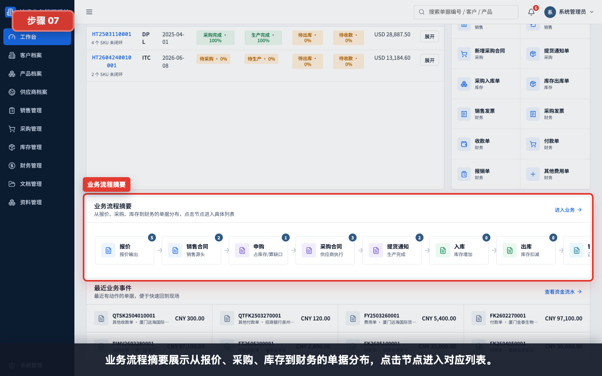
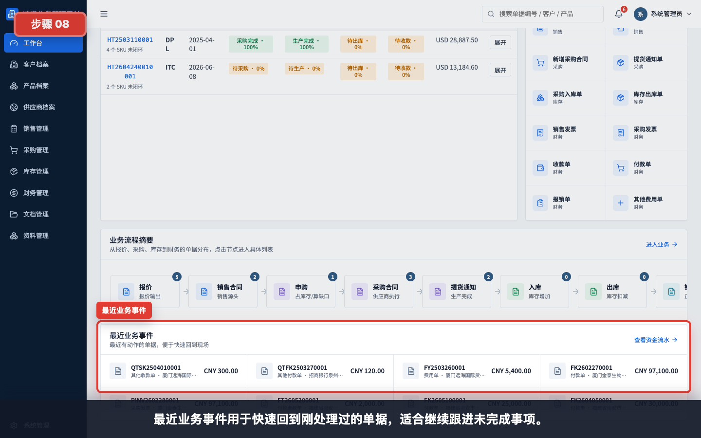
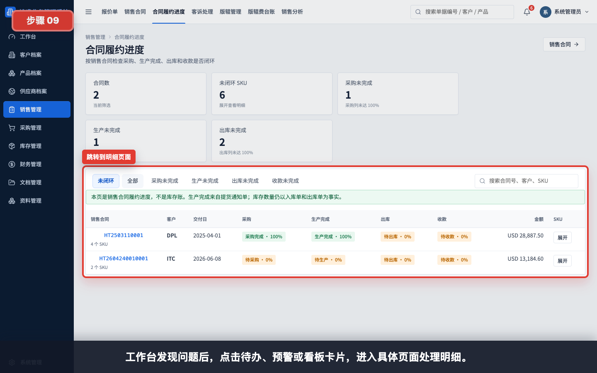

# 工作台使用

本模块用于帮助新用户理解登录后第一眼应该看什么，以及如何从工作台进入具体业务处理页面。

## 适用对象

- 所有日常业务用户。
- 管理层和财务用户。
- 培训讲师。

## 操作步骤

### 1. 进入全局工作台

登录后默认进入全局工作台。工作台用于汇总待办、异常、库存和资金风险。

### 2. 查看顶部关键指标

先看销售合同额、待收金额、待付金额和库存风险 SKU，快速判断当前业务压力。

### 3. 处理待办和异常

“我的待办”告诉当前角色下一步要处理什么；“异常预警”显示会影响履约、库存或资金闭环的风险。

### 4. 使用关键看板摘要

关键看板摘要只展示入口和数量。点击卡片后进入对应模块查看明细。

### 5. 查看销售合同履约缺口

履约缺口按销售合同检查采购、生产完成、出库和收款是否闭环。

### 6. 使用快捷办理

快捷办理放高频新建入口，例如新增采购合同、提货通知、入库单、出库单、发票、收款和付款。

### 7. 查看业务流程摘要

业务流程摘要展示从报价、采购、库存到财务的单据分布。点击节点可以进入对应列表。

### 8. 回到最近业务事件

最近业务事件用于快速回到刚处理过的单据，适合继续跟进未完成事项。

### 9. 从工作台跳转到明细

发现问题后，点击待办、预警或看板卡片，进入具体页面处理明细。

## 使用建议

- 每天登录后先看工作台，再进入具体模块。
- 优先处理待办和异常预警。
- 工作台只做提示和跳转，不替代业务单据录入。
- 需要修改、审核、下推或作废时，应进入对应业务模块操作。

## 常见问题

- **为什么我看到的待办和同事不同**：待办会按当前账号角色和权限过滤。
- **为什么金额显示已隐藏**：当前角色没有对应金额字段权限。
- **点击卡片后去了别的模块**：这是正常行为，工作台是跨模块入口。
- **风险处理后还显示**：确认下游单据是否已生效，部分看板只统计已审核或已过账单据。
