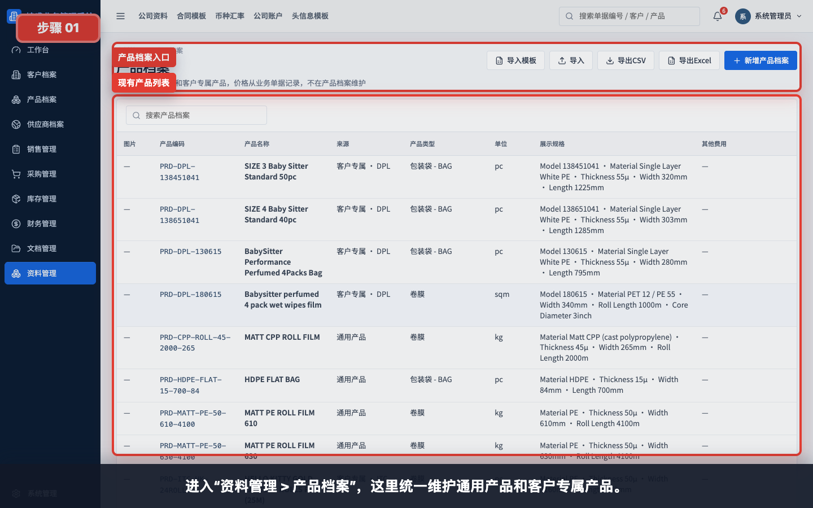
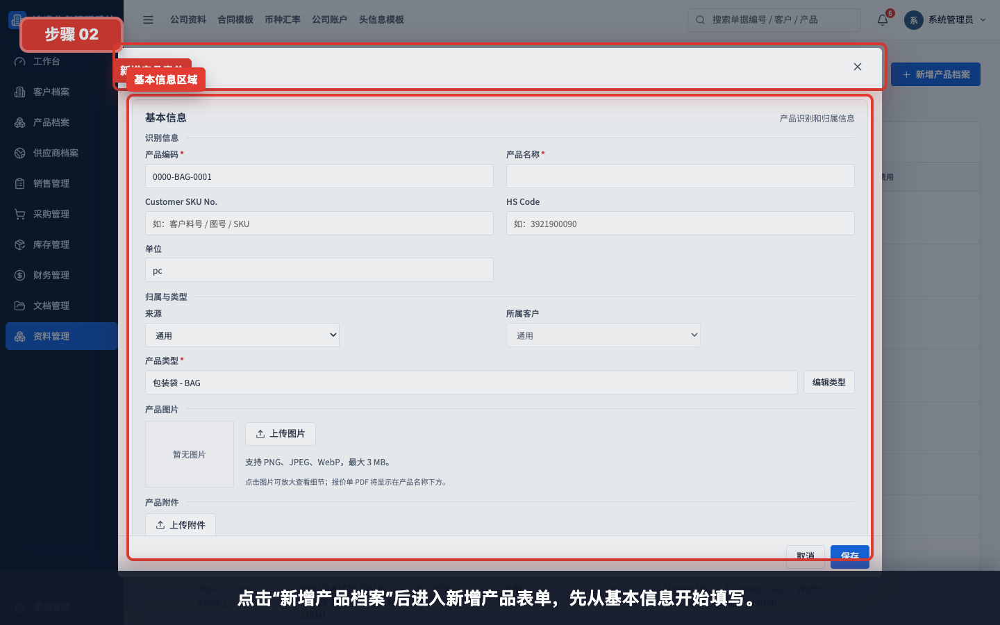
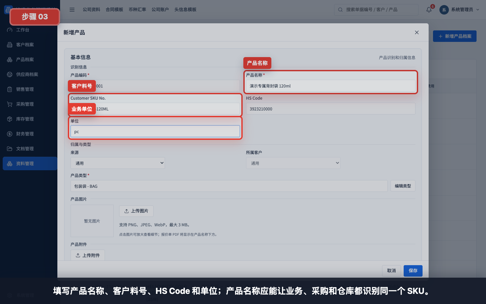
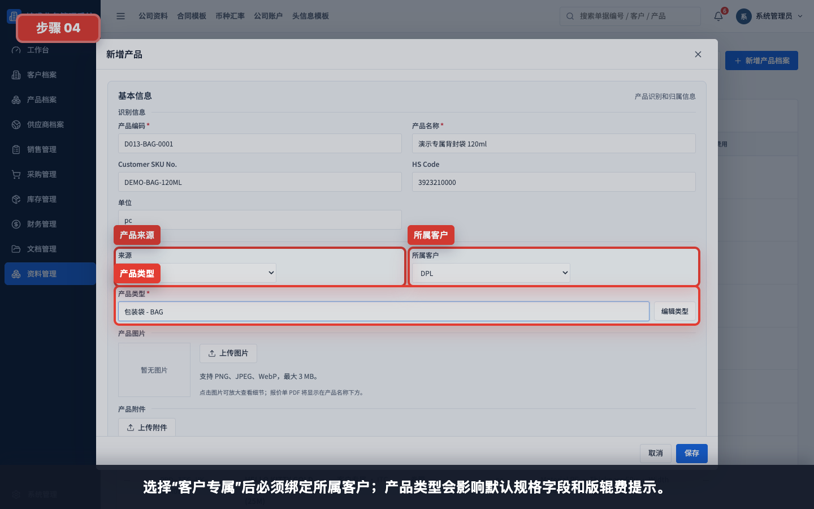
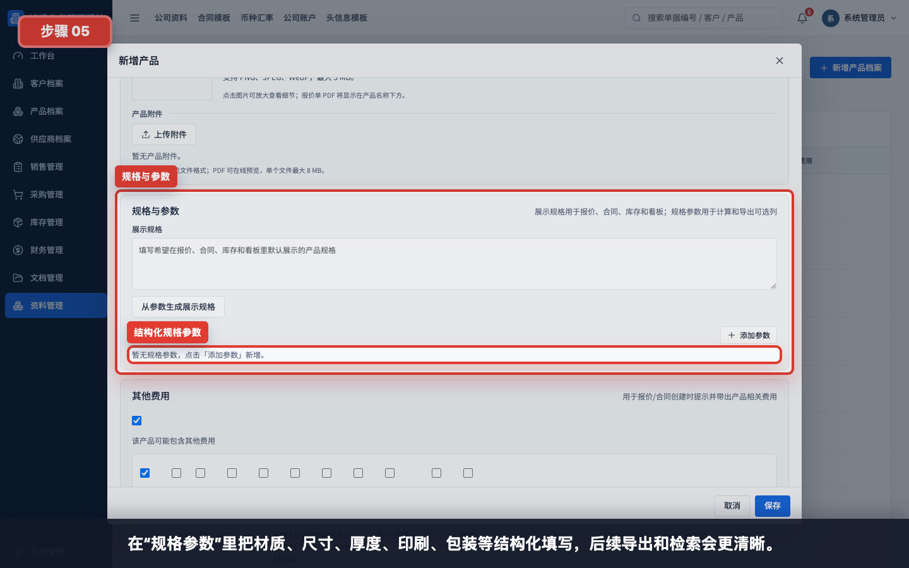
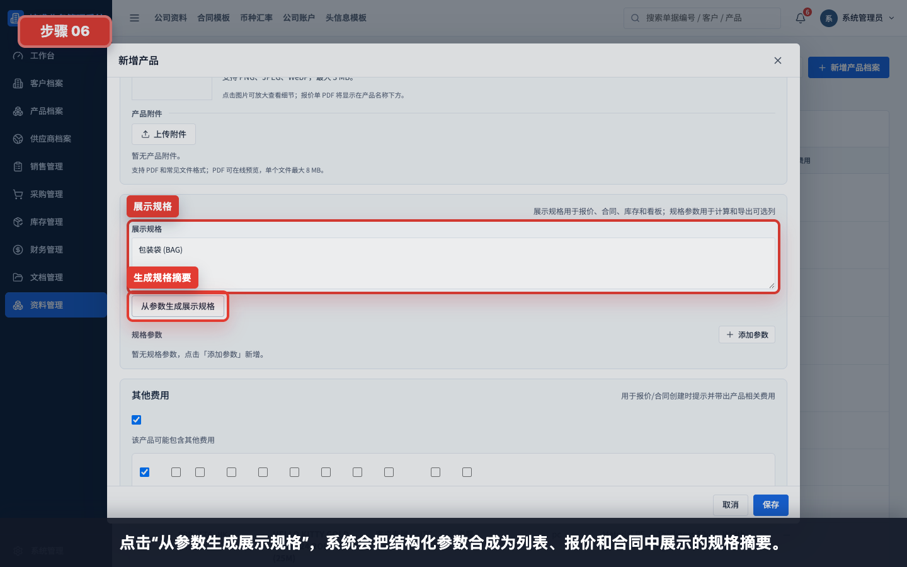
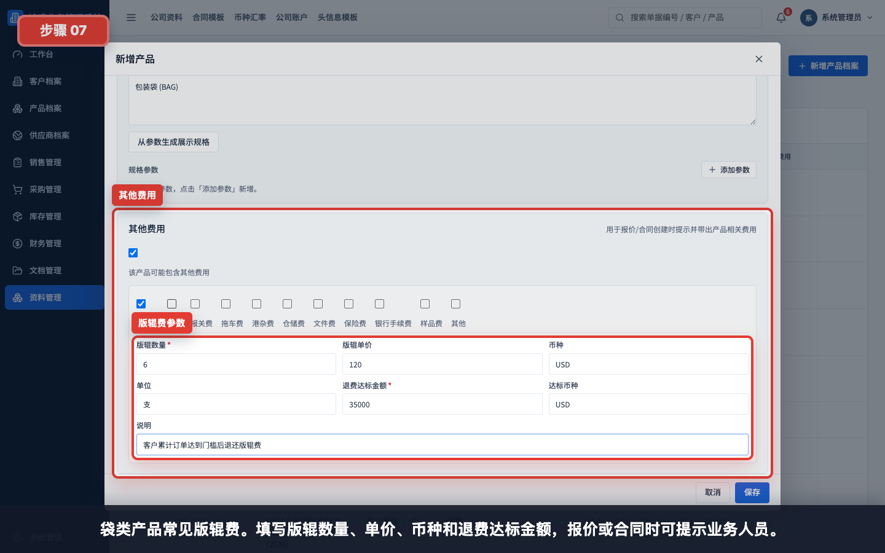
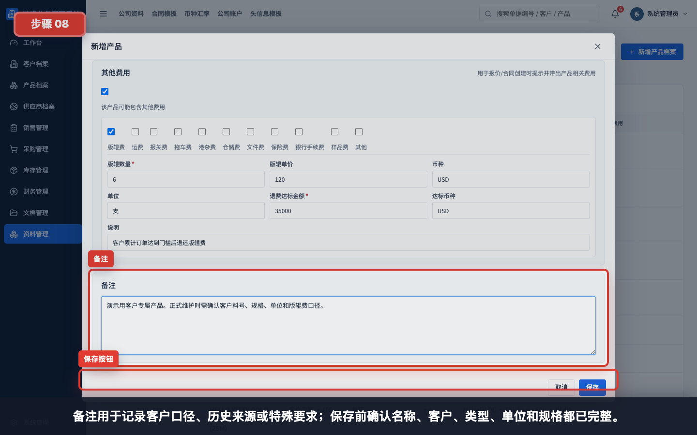
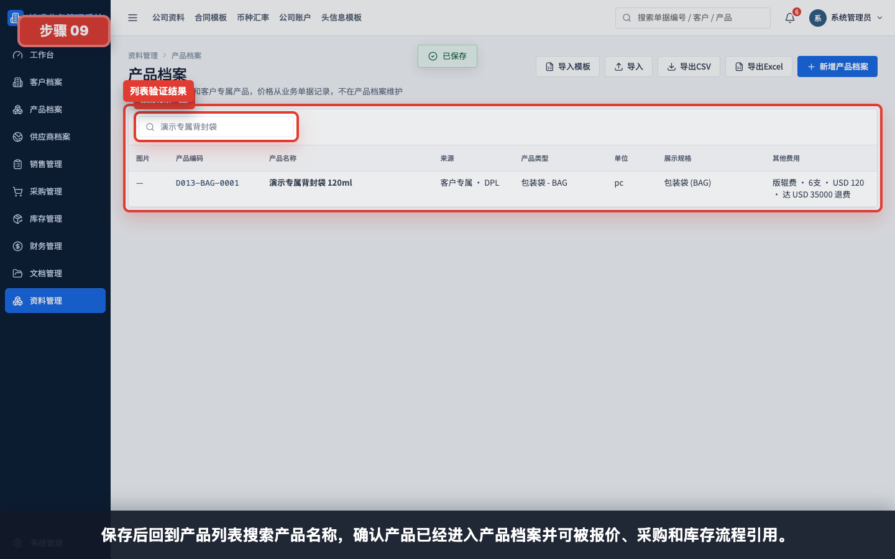

# 如何创建一个新产品

本指引用于培训新用户在产品档案中创建一个完整产品。示例使用“客户专属袋类产品”，覆盖产品名称、客户料号、来源、所属客户、产品类型、单位、规格参数、展示规格、版辊费和保存验证。

## 适用场景

- 新增通用产品。
- 新增客户专属产品。
- 新增需要维护规格参数的产品。
- 新增带版辊费、样品费或其他附加费用的产品。

## 字段填写说明

| 字段 | 是否必填 | 填写方式 | 影响 |
|---|---|---|---|
| 产品编码 | 系统生成 | 新增时系统按来源、客户和类型生成 | 列表、导入导出、SKU 识别使用 |
| 产品名称 | 必填 | 填能唯一识别产品的名称 | 报价、合同、采购、库存都会显示 |
| Customer SKU No. | 建议填写 | 填客户料号、图号或客户 SKU | 客户专属产品追溯和沟通使用 |
| HS Code | 按需填写 | 填海关编码 | 报价、合同、出口资料使用 |
| 单位 | 建议填写 | 如 pc、kg、sqm、roll | 影响单据数量口径 |
| 来源 | 必填 | 通用 / 客户专属 | 决定是否需要绑定客户 |
| 所属客户 | 条件必填 | 来源为客户专属时选择客户 | 限定客户专属 SKU 归属 |
| 产品类型 | 必填 | 如 BAG、FILM_ROLL、RAW_MATERIAL | 影响默认规格字段和版辊费提示 |
| 展示规格 | 建议填写 | 可手动写，也可从参数生成 | 列表、报价、合同、库存看板展示 |
| 规格参数 | 建议填写 | 按结构化字段填写材质、尺寸、厚度等 | 便于检索、导出和统一口径 |
| 其他费用 | 按需填写 | 勾选版辊费、运费、样品费等 | 报价或合同创建时提示并带出费用 |
| 备注 | 按需填写 | 填客户口径、特殊要求、历史来源 | 内部补充说明 |

## 步骤 01：进入产品档案

进入“资料管理 > 产品档案”。产品档案统一维护通用产品和客户专属产品，价格从业务单据记录，不在产品档案维护。

## 步骤 02：打开新增产品表单

点击“新增产品档案”进入新增产品表单。建议按从上到下的顺序填写，先完成基础识别信息。

## 步骤 03：填写识别信息

填写产品名称、客户料号、HS Code 和单位。产品名称应能让业务、采购和仓库识别同一个 SKU；单位应和报价、采购、入库、出库的数量口径一致。

示例：

| 字段 | 示例 |
|---|---|
| 产品名称 | 演示专属背封袋 120ml |
| Customer SKU No. | DEMO-BAG-120ML |
| HS Code | 3923210000 |
| 单位 | pc |

## 步骤 04：选择来源、所属客户和产品类型

如果产品只服务某个客户，选择“客户专属”并绑定所属客户。产品类型会影响默认规格字段，也会影响是否提示版辊费。

填写规则：

- 通用产品：来源选择“通用”，所属客户不用选。
- 客户专属产品：来源选择“客户专属”，必须选择所属客户。
- 袋类产品：类型通常选择 BAG。
- 卷膜产品：类型通常选择 FILM_ROLL。
- 原料、化工、香精等按实际产品类型选择。

## 步骤 05：填写规格参数

规格参数建议结构化填写，不要只写在备注里。结构化参数更适合导出、检索和统一展示。

袋类产品常见参数：

| 参数 | 示例 |
|---|---|
| Material | PE |
| Length | 120mm |
| Width | 80mm |
| Thickness | 55um |
| Color / Print | 8 colors |
| Packing | 50pcs/bag, 20bags/ctn |

卷膜产品常见参数：

| 参数 | 示例 |
|---|---|
| Material | PET / PE |
| Thickness | 12um / 55um |
| Width | 340mm |
| Roll Length | 1000m |
| Core Diameter | 3 inch |

## 步骤 06：生成展示规格

点击“从参数生成展示规格”后，系统会把结构化规格合成为一段展示规格。展示规格会出现在产品列表、报价、合同、库存和看板中。

建议：

- 参数字段负责结构化。
- 展示规格负责给用户快速阅读。
- 如果自动生成的文本不够清楚，可以手工调整展示规格。

## 步骤 07：填写其他费用和版辊费

袋类产品常见版辊费。填写版辊数量、单价、币种和退费达标金额后，报价或合同创建时可提示业务人员。

版辊费字段说明：

| 字段 | 填写方式 |
|---|---|
| 版辊数量 | 例如 6 |
| 版辊单价 | 例如 120 |
| 币种 | 例如 USD |
| 退费达标金额 | 例如 35000 |
| 达标币种 | 通常与版辊费币种一致 |
| 说明 | 写清楚退费条件 |

## 步骤 08：填写备注并保存

备注用于记录客户口径、历史来源或特殊要求。保存前确认产品名称、所属客户、产品类型、单位、规格参数和费用口径都已完整。

保存前检查：

- 产品名称是否清楚。
- 客户专属产品是否绑定客户。
- 产品类型是否正确。
- 单位是否与业务单据一致。
- 关键规格参数是否完整。
- 需要版辊费的产品是否已维护费用。

## 步骤 09：保存后回到列表验证

保存后回到产品列表，搜索产品名称确认产品已经进入产品档案。之后报价、销售合同、采购合同、库存入库和库存出库都可以引用这个产品。

## 常见错误

- 产品名称过于笼统，后续无法区分 SKU。
- 客户专属产品没有选择所属客户。
- 单位和业务单据不一致，例如档案写 kg，报价按 pc。
- 规格只写在备注里，导致列表和导出不清晰。
- 袋类产品漏填版辊费，报价时无法提示业务人员。
- 把价格维护在产品档案里。当前系统价格以业务单据为准，产品档案只维护基础资料、规格和附加费用提示。
