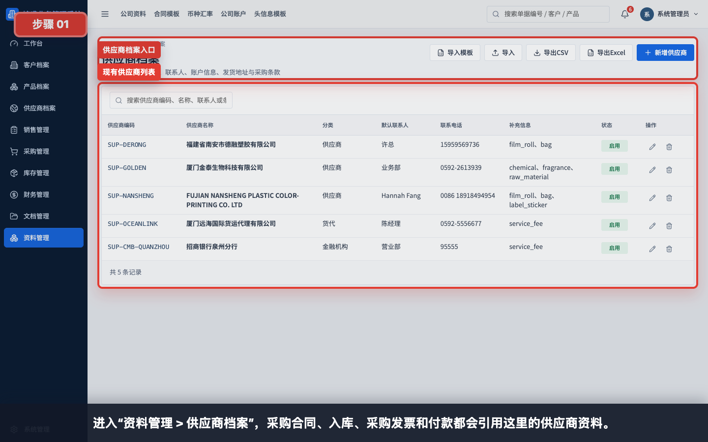
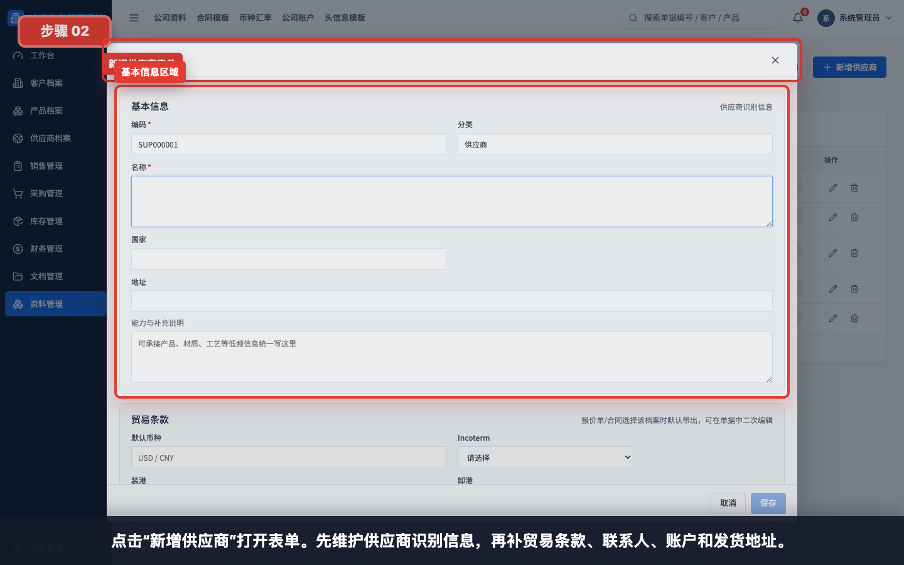
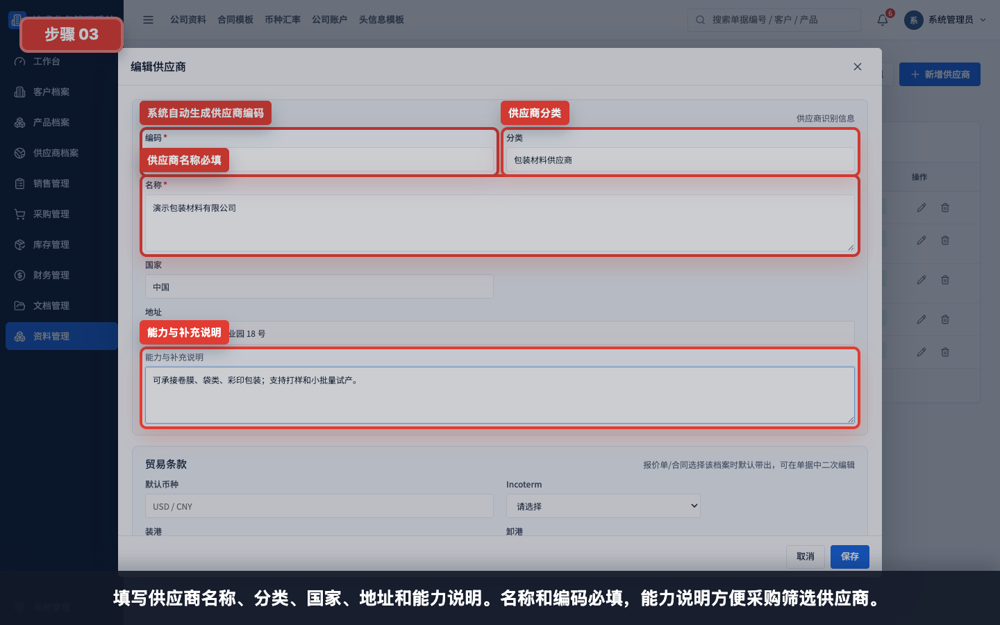
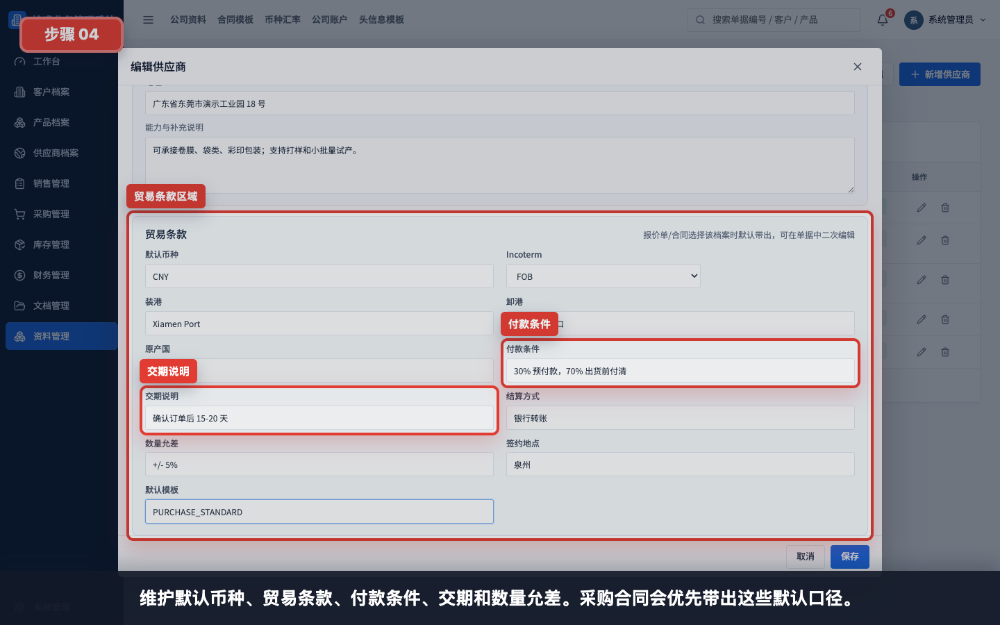
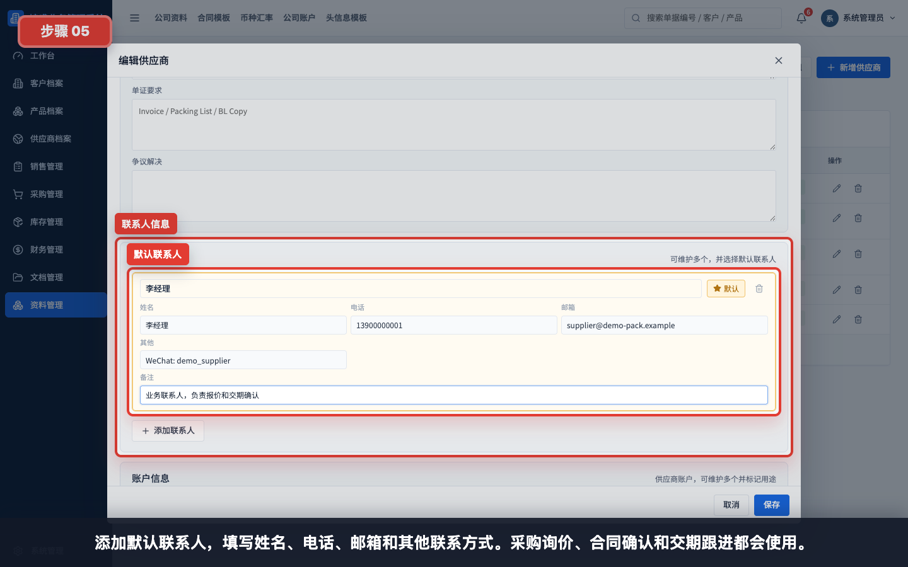
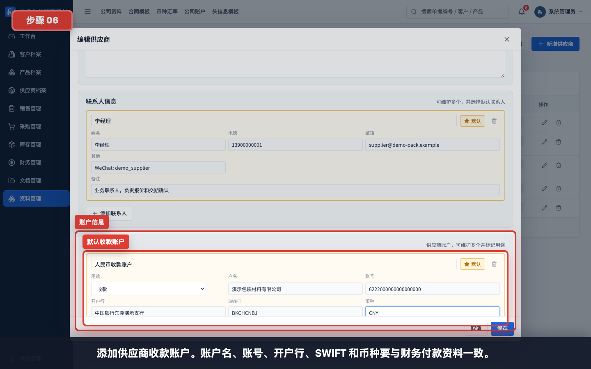
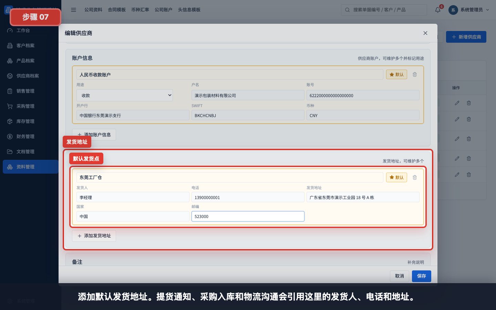
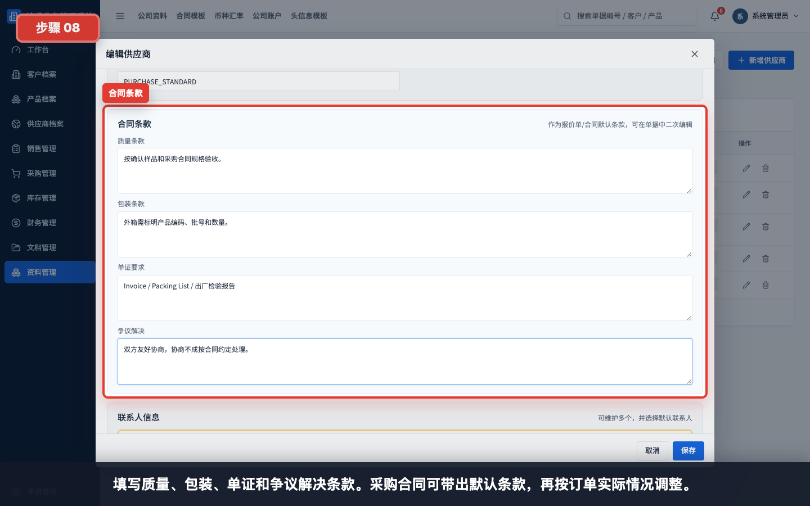
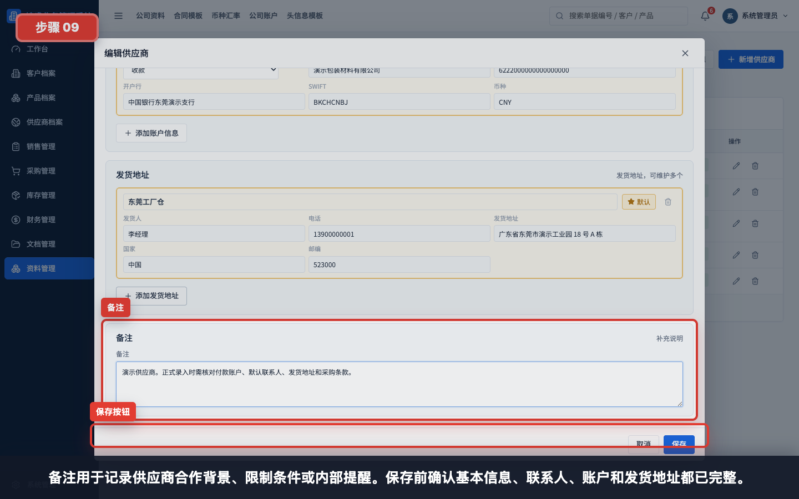
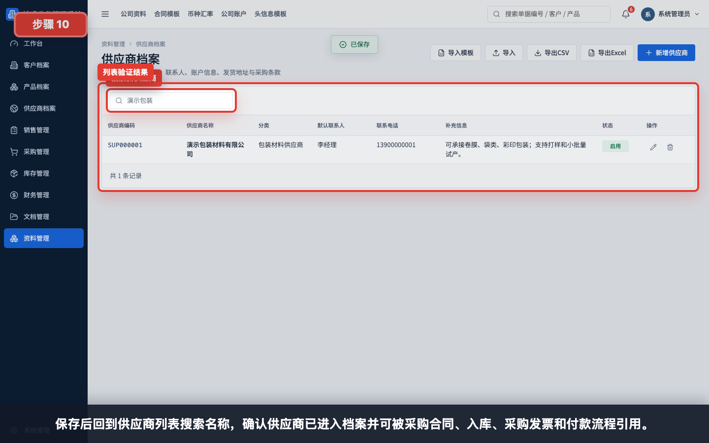

# 如何创建一个新供应商

本指引用于培训新用户在供应商档案中创建一个完整供应商。示例覆盖供应商编码、分类、名称、国家、地址、能力说明、贸易条款、合同条款、联系人、账户信息、发货地址、备注和保存验证。

## 适用场景

- 新供应商第一次询价或下采购合同前建档。
- 采购合同、提货通知、入库或付款流程找不到供应商时补建档。
- 供应商收款账户、默认联系人或发货地址需要标准化维护。
- 老供应商资料不完整，需要补充贸易条款、合同条款和账户信息。

## 字段填写说明

| 字段 | 是否必填 | 填写方式 | 影响 |
|---|---|---|---|
| 编码 | 系统生成，可调整 | 新增时自动生成供应商编码 | 列表、导入导出和采购识别使用 |
| 分类 | 建议填写 | 如包装材料供应商、原料供应商、物流供应商 | 采购筛选和供应商分析使用 |
| 名称 | 必填 | 填供应商完整公司名称 | 采购合同、入库、采购发票和付款都会显示 |
| 国家 | 建议填写 | 填供应商所在国家或地区 | 采购分析、贸易条款和合同参考 |
| 地址 | 建议填写 | 填注册地址、经营地址或主要工厂地址 | 合同、提货和物流沟通参考 |
| 能力与补充说明 | 建议填写 | 填可承接产品、材质、工艺、交付特点 | 采购选型和内部交接使用 |
| 默认币种 | 建议填写 | 如 CNY、USD | 采购合同和付款默认币种参考 |
| Incoterm | 建议填写 | 选择默认贸易条款 | 采购合同默认带出 |
| 装港 / 卸港 | 按需填写 | 采购或进口业务常用港口 | 物流和合同条款参考 |
| 付款条件 | 建议填写 | 如 30% 预付款，70% 出货前付清 | 采购合同和应付计划参考 |
| 交期说明 | 建议填写 | 如确认订单后 15-20 天 | 采购履约和交期跟进 |
| 结算方式 | 建议填写 | 银行转账、现金、票据等 | 财务付款参考 |
| 数量允差 | 按需填写 | 如 +/- 5% | 采购收货差异判断 |
| 合同条款 | 按需填写 | 质量、包装、单证、争议解决 | 采购合同默认条款 |
| 联系人信息 | 建议填写 | 可维护多个并设置默认联系人 | 询价、合同、提货和交期跟进 |
| 账户信息 | 财务付款前必填 | 户名、账号、开户行、SWIFT、币种 | 采购付款和对账使用 |
| 发货地址 | 入库前建议填写 | 可维护多个发货点 | 提货通知、采购入库和物流沟通 |
| 备注 | 按需填写 | 合作背景、限制条件、内部提醒 | 内部交接和风险提示 |

## 步骤 01：进入供应商档案

进入“资料管理 > 供应商档案”。采购合同、入库、采购发票和付款都会引用供应商档案。

## 步骤 02：打开新增供应商表单

点击“新增供应商”打开表单。建议按基本信息、贸易条款、联系人、账户、发货地址的顺序填写。

## 步骤 03：填写供应商基本信息

填写供应商名称、分类、国家、地址和能力说明。名称和编码必填，能力说明方便采购判断供应商适合哪些产品或工艺。

示例：

| 字段 | 示例 |
|---|---|
| 分类 | 包装材料供应商 |
| 名称 | 演示包装材料有限公司 |
| 国家 | 中国 |
| 地址 | 广东省东莞市演示工业园 18 号 |
| 能力与补充说明 | 可承接卷膜、袋类、彩印包装；支持打样和小批量试产 |

## 步骤 04：填写贸易条款

维护默认币种、贸易条款、付款条件、交期和数量允差。采购合同会优先带出这些默认口径，再按订单实际情况调整。

填写建议：

- 默认币种应和供应商报价及付款币种一致。
- 付款条件必须与采购和财务确认。
- 交期说明尽量写成可执行口径，例如“确认订单后 15-20 天”。
- 数量允差影响入库和结算差异判断，不能随意填写。

## 步骤 05：添加联系人

添加默认联系人，填写姓名、电话、邮箱和其他联系方式。可维护多个联系人，并设置默认联系人。

建议联系人分类：

| 联系人类型 | 用途 |
|---|---|
| 业务联系人 | 报价、合同、交期确认 |
| 财务联系人 | 发票、付款、对账 |
| 仓库或物流联系人 | 提货、发货、入库异常 |

## 步骤 06：添加账户信息

添加供应商收款账户。账户名、账号、开户行、SWIFT 和币种要与财务付款资料一致。

保存前必须核对：

- 户名是否与供应商主体一致。
- 账号是否完整。
- 开户行和 SWIFT 是否正确。
- 币种是否与合同和付款币种一致。
- 是否将常用账户设为默认。

## 步骤 07：添加发货地址

添加默认发货地址。提货通知、采购入库和物流沟通会引用这里的发货人、电话和地址。

发货地址建议写清：

- 发货点名称，例如东莞工厂仓。
- 发货人和电话。
- 详细地址。
- 国家和邮编。

## 步骤 08：填写合同条款

填写质量、包装、单证和争议解决条款。采购合同可带出默认条款，再按订单实际情况调整。

示例：

| 条款 | 示例 |
|---|---|
| 质量条款 | 按确认样品和采购合同规格验收 |
| 包装条款 | 外箱需标明产品编码、批号和数量 |
| 单证要求 | Invoice / Packing List / 出厂检验报告 |
| 争议解决 | 双方友好协商，协商不成按合同约定处理 |

## 步骤 09：填写备注并保存

备注用于记录供应商合作背景、限制条件或内部提醒。保存前确认基本信息、联系人、账户和发货地址都已完整。

保存前检查：

- 供应商名称是否和合同主体一致。
- 分类和能力说明是否便于采购筛选。
- 默认联系人是否可用。
- 默认收款账户是否经过财务核对。
- 默认发货地址是否完整。
- 默认付款条件、交期和数量允差是否经过采购确认。
- 合同条款是否适合该供应商。

## 步骤 10：保存后回到列表验证

保存后回到供应商列表，搜索名称确认供应商已经进入档案。之后采购合同、提货通知、采购入库、采购发票和付款流程都可以引用这个供应商。

## 常见错误

- 只维护供应商名称，没有维护联系人，采购跟进时找不到负责人。
- 账户信息未核对就保存，后续付款存在风险。
- 把多个供应商主体混在一个档案里，导致合同和付款主体不一致。
- 发货地址只写在备注中，提货通知无法结构化带出。
- 默认付款条件沿用旧口径，没有和供应商或采购确认。
- 合同条款过于笼统，无法支持后续质量、包装或单证争议处理。
