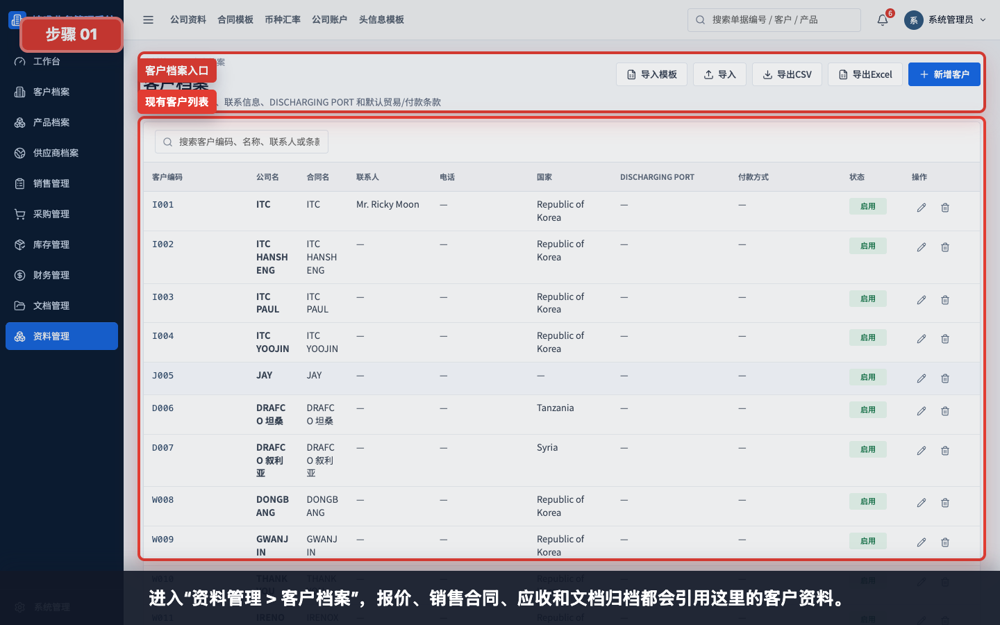
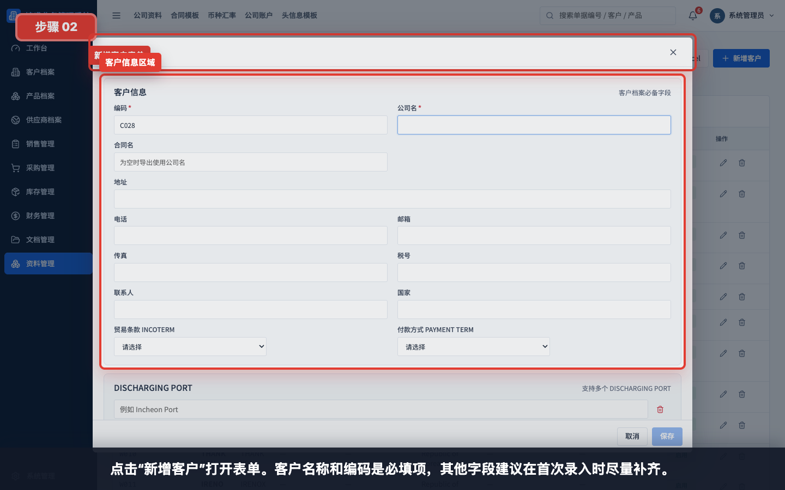
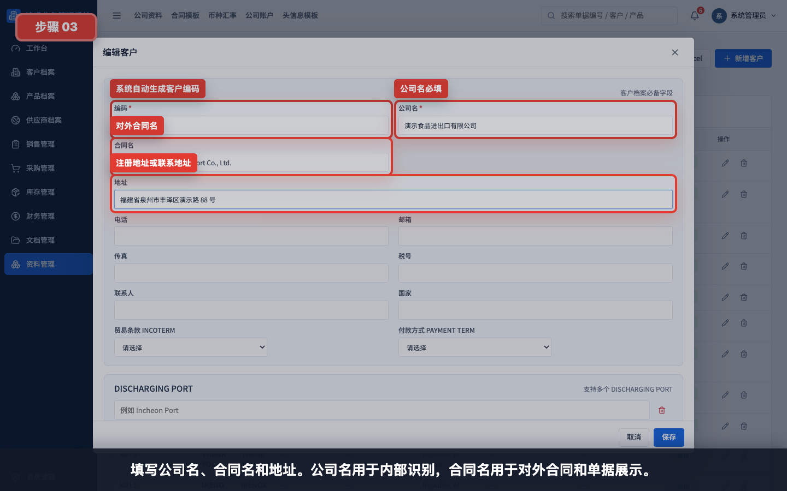
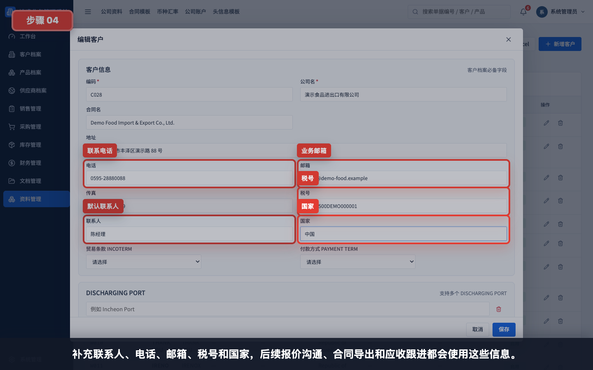
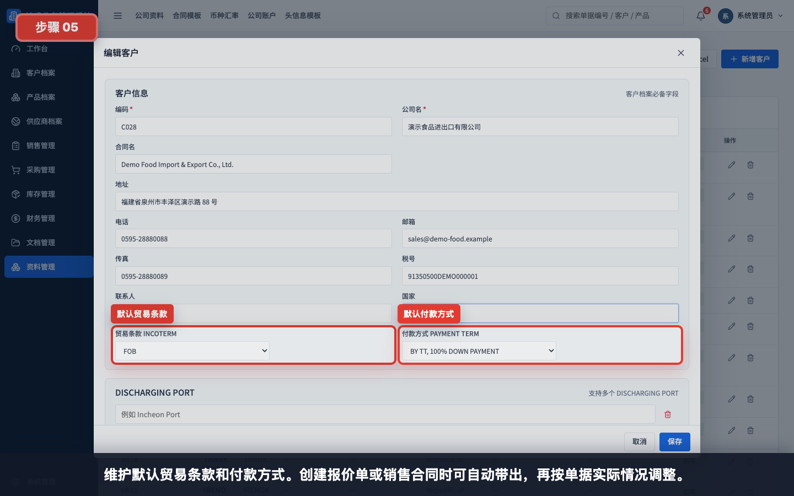
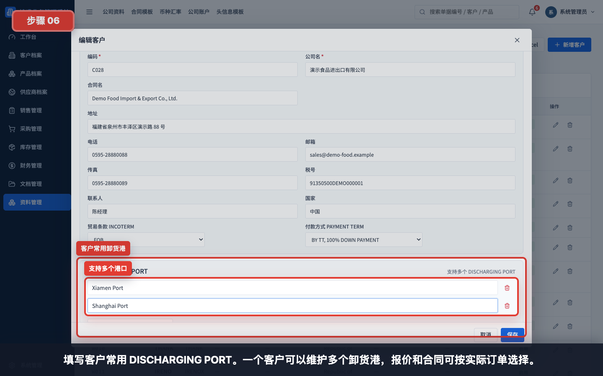
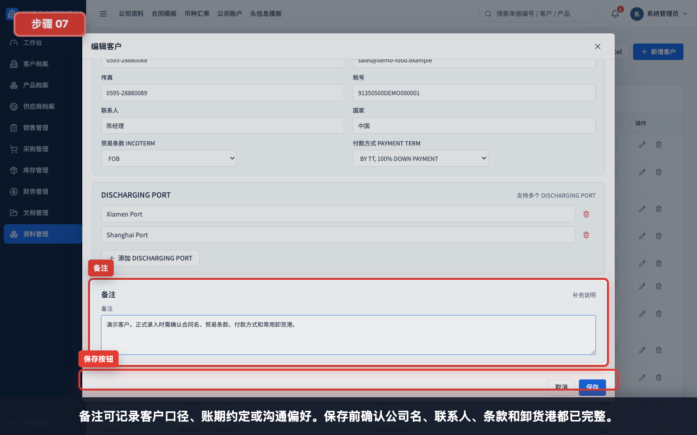
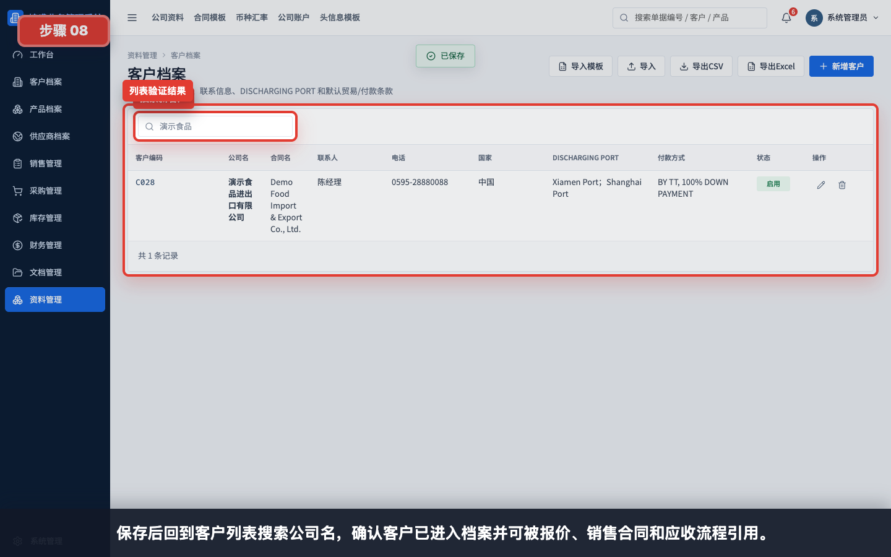

# 如何创建一个新客户

本指引用于培训新用户在客户档案中创建一个完整客户。示例覆盖客户编码、公司名、合同名、地址、联系人、电话、邮箱、税号、国家、贸易条款、付款方式、常用卸货港、备注和保存验证。

## 适用场景

- 新客户第一次成交前建档。
- 报价、销售合同或应收流程找不到客户时补建档。
- 客户合同名、默认条款或常用 DISCHARGING PORT 需要标准化维护。
- 从 Excel 初始化客户资料后，需要手工补充联系人和条款。

## 字段填写说明

| 字段 | 是否必填 | 填写方式 | 影响 |
|---|---|---|---|
| 编码 | 系统生成，可调整 | 新增时自动生成客户编码 | 列表、导入导出和客户识别使用 |
| 公司名 | 必填 | 填内部识别用客户公司名称 | 报价、销售合同、应收和搜索都会显示 |
| 合同名 | 建议填写 | 填对外合同、PI 或发票使用的英文/正式名称 | 导出合同和客户对账时使用 |
| 地址 | 建议填写 | 填注册地址、联系地址或合同地址 | 合同、发票和物流资料参考 |
| 电话 / 邮箱 | 建议填写 | 填默认业务联系方式 | 报价沟通、合同确认和催款跟进 |
| 传真 | 按需填写 | 客户仍使用传真时填写 | 合同或旧客户资料留档 |
| 税号 | 按需填写 | 填客户税务识别号 | 开票、合同和财务核对 |
| 联系人 | 建议填写 | 填默认业务联系人 | 报价、销售合同和应收跟进默认带出 |
| 国家 | 建议填写 | 填客户所在国家或地区 | 贸易条款、物流和销售分析使用 |
| 贸易条款 INCOTERM | 建议填写 | 选择 FOB、CIF、EXW 等默认条款 | 报价单和销售合同可自动带出 |
| 付款方式 PAYMENT TERM | 建议填写 | 选择客户默认付款方式 | 报价、合同和应收提醒参考 |
| DISCHARGING PORT | 建议填写 | 可维护多个常用卸货港 | 报价和销售合同按订单选择 |
| 备注 | 按需填写 | 填客户口径、账期约定、沟通偏好 | 内部提醒和交接使用 |

## 步骤 01：进入客户档案

进入“资料管理 > 客户档案”。报价、销售合同、应收和文档归档都会引用客户档案。

## 步骤 02：打开新增客户表单

点击“新增客户”打开表单。客户名称和编码是必填项，其他字段建议在首次录入时尽量补齐。

## 步骤 03：填写客户识别信息

填写公司名、合同名和地址。公司名用于内部识别，合同名用于对外合同和单据展示。

示例：

| 字段 | 示例 |
|---|---|
| 公司名 | 演示食品进出口有限公司 |
| 合同名 | Demo Food Import & Export Co., Ltd. |
| 地址 | 福建省泉州市丰泽区演示路 88 号 |

## 步骤 04：填写联系信息和国家

补充联系人、电话、邮箱、税号和国家。联系人建议填写最常用的业务对接人，避免后续报价或催款时找不到沟通对象。

## 步骤 05：填写贸易条款和付款方式

维护默认贸易条款和付款方式。创建报价单或销售合同时，系统可自动带出默认条款，再按具体订单调整。

填写建议：

- 有长期合作条款的客户，优先维护默认值。
- 如果每单变化较大，可以先留空，在报价单或合同里填写。
- 付款方式涉及账期、预付款、尾款条件，需和业务或财务确认。

## 步骤 06：填写卸货港

填写客户常用 DISCHARGING PORT。一个客户可以维护多个卸货港，报价和合同可按实际订单选择。

示例：

| 字段 | 示例 |
|---|---|
| DISCHARGING PORT 1 | Xiamen Port |
| DISCHARGING PORT 2 | Shanghai Port |

## 步骤 07：填写备注并保存

备注可记录客户口径、账期约定或沟通偏好。保存前确认公司名、联系人、条款和卸货港都已完整。

保存前检查：

- 公司名是否清楚且没有重复。
- 合同名是否符合客户对外文件要求。
- 默认联系人、电话、邮箱是否可用。
- 国家、贸易条款、付款方式是否与客户实际一致。
- 常用卸货港是否补齐。
- 备注中是否记录特殊付款、开票或沟通要求。

## 步骤 08：保存后回到列表验证

保存后回到客户列表，搜索公司名确认客户已经进入档案。之后报价、销售合同、应收和文档归档都可以引用这个客户。

## 常见错误

- 只填写公司名，漏填合同名，导致导出合同名称不符合客户要求。
- 联系人和邮箱为空，后续报价、合同确认和催款时无法快速定位负责人。
- 贸易条款或付款方式沿用旧客户口径，没有和当前客户确认。
- 卸货港只写在备注里，导致报价和合同无法结构化带出。
- 同一客户重复建档，后续单据和应收分散在多个客户名下。
