# 如何创建库存出库单

本指引用于培训新用户手工创建库存出库单。示例覆盖进入出库单列表、新增出库单、选择已确认销售合同作为来源、核对客户和合同追溯、核对销售产品、填写实际出库数量、仓库、件数、净重、毛重、保存确认、查看销售合同履约出库进度，以及确认后续销售发票入口。

## 适用场景

- 销售合同已确认，货物已经实际发出。
- 仓库需要登记本次实际出库数量和物流信息。
- 销售或财务需要用出库单作为销售发票和应收核对来源。
- 一张销售合同分批发货，需要按每次实际发货分别登记出库。

## 前置条件

- 销售合同已保存并已确认。
- 出库产品、规格、单位、销售单价已在销售合同中确认。
- 仓库已完成实际发货、包装件数和重量复核。
- 已明确本次出库仓库、数量、件数、净重和毛重。

## 字段填写说明

| 字段 | 是否必填 | 填写方式 | 影响 |
|---|---|---|---|
| 客户 | 必填 | 选择销售合同后自动带出 | 后续销售履约、销售发票和应收按客户追溯 |
| 单据日期 | 必填 | 默认当天，可按实际发货日期调整 | 库存扣减事实的日期 |
| 要求日期 | 必填 | 可理解为本次要求出库或交付日期 | 影响业务跟进和列表排序 |
| 来源单号 | 必填 | 选择已确认销售合同 | 出库单必须关联销售合同 |
| 关联销售合同 | 必填/自动 | 由来源销售合同自动带出 | 用于销售履约、应收和发票追溯 |
| 币种 | 建议保留 | 从销售合同带出 | 保持销售金额口径一致 |
| 产品 / 费用 | 必填 | 从销售合同带出 | 出库只应登记实际发货产品 |
| 数量 | 必填 | 填本次实际出库数量 | 直接影响库存扣减数量和履约出库进度 |
| 单价 | 必填 | 从销售合同带出，可按实际销售价核对 | 作为销售发票金额核对来源 |
| 价税合计 | 自动 | 由数量、单价和税率计算 | 作为出库金额和应收参考 |
| 件数 | 必填 | 填本次实际发货包装件数 | 发货物流统计和对账依据 |
| 净重(kg) | 必填 | 填实物净重 | 发货物流统计和对账依据 |
| 毛重(kg) | 必填 | 填含包装毛重 | 必须大于或等于净重 |
| 仓库 | 建议填写 | 填实际出库仓库，例如成品仓 | 库存按仓库维度统计 |
| 备注 | 按需填写 | 写销售合同、本次发货数量、重量和异常说明 | 便于销售、仓库和财务交接 |
| 保存状态 | 必填 | 草稿 / 已确认 | 已确认后形成库存扣减事实 |

关键规则：

```text
销售合同 = 客户订单和履约来源
库存出库单 = 库存扣减事实
销售发票 = 以库存出库单为核对来源确认正式应收
```

## 步骤 01：进入库存出库单列表

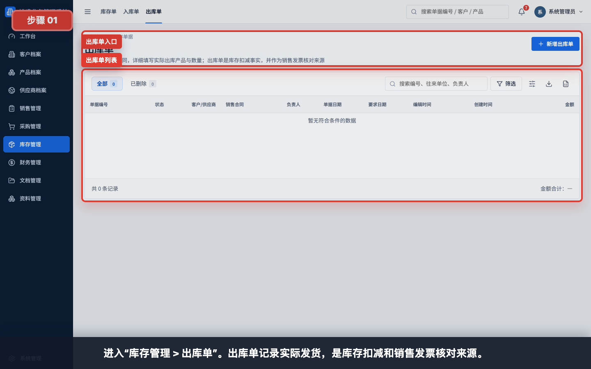

进入“库存管理 > 出库单”。出库单记录实际发货，是库存扣减和销售发票核对来源。

## 步骤 02：打开新增出库单

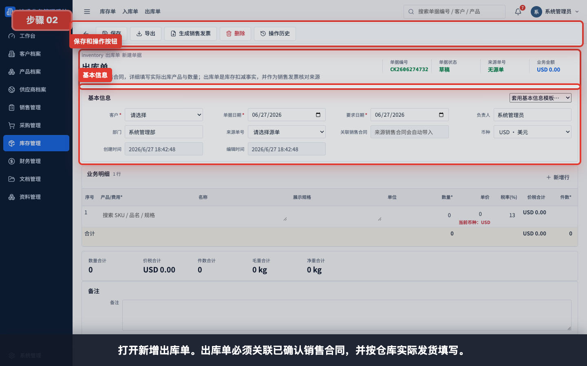

点击“新增出库单”打开新建页面。出库单必须关联已确认销售合同，并按仓库实际发货填写。

## 步骤 03：选择销售合同作为来源

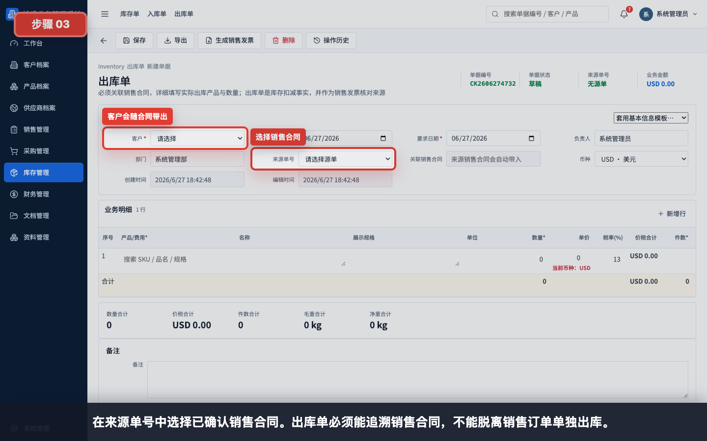

在“来源单号”中选择已确认销售合同。出库单不能脱离销售合同单独创建，否则后续履约和应收追溯会断开。

## 步骤 04：核对客户和关联销售合同

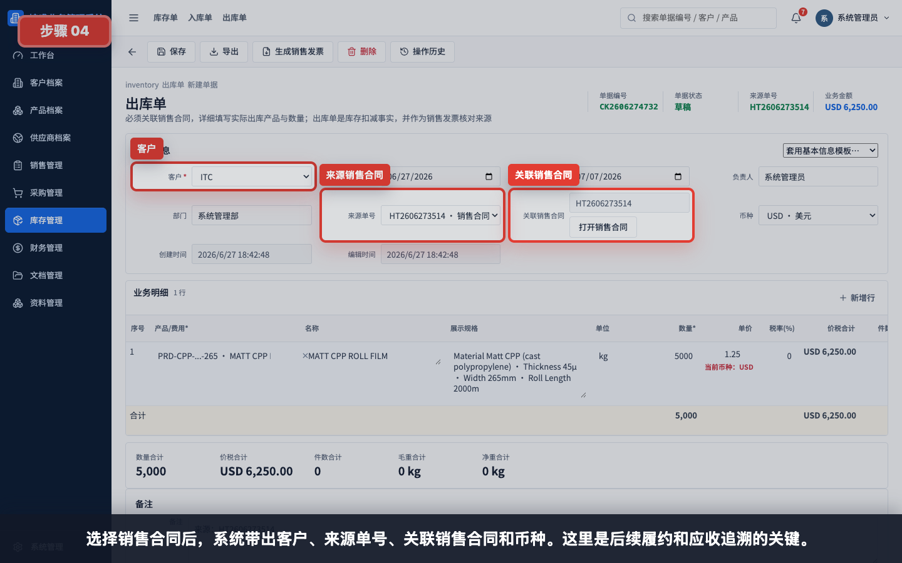

选择销售合同后，系统带出客户、来源单号、关联销售合同和币种。这里是后续销售履约、销售发票和收款追溯的关键。

## 步骤 05：核对带出的销售产品

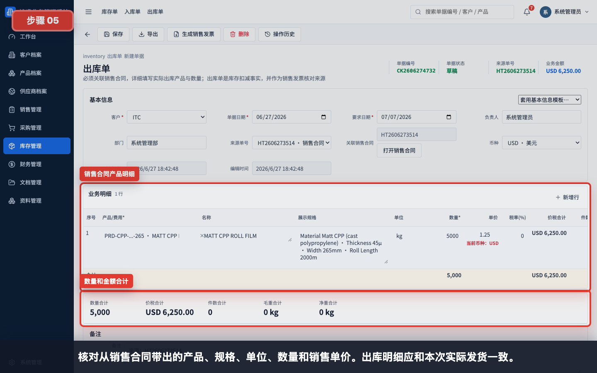

核对从销售合同带出的产品、规格、单位、数量和销售单价。出库明细应和本次实际发货一致。

## 步骤 06：填写实际出库数量、仓库、件数和重量

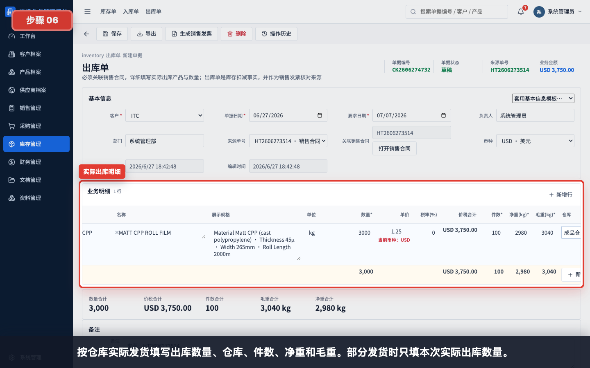

按仓库实际发货填写出库数量、仓库、件数、净重和毛重。部分发货时只填本次实际出库数量。

示例：

| 字段 | 示例 | 说明 |
|---|---|---|
| 销售合同数量 | 5,000 | 合同总数量 |
| 本次出库数量 | 3,000 | 本次实际发货数量 |
| 单价 | 1.25 | 从销售合同带出，保存前复核 |
| 件数 | 100 | 本次发货包装件数 |
| 净重(kg) | 2,980 | 不含包装重量 |
| 毛重(kg) | 3,040 | 含包装重量，不能小于净重 |
| 仓库 | 成品仓 | 实际出库仓库 |

## 步骤 07：核对出库数量和物流合计

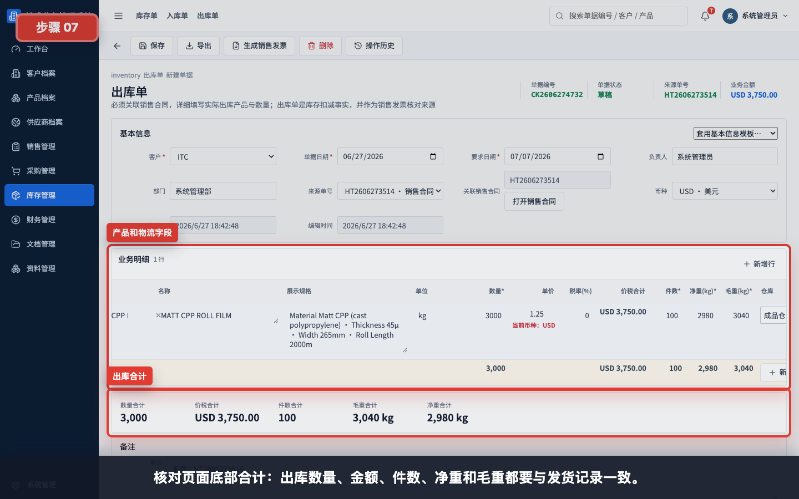

核对页面底部合计：出库数量、金额、件数、净重和毛重都要与发货记录一致。

## 步骤 08：填写备注并保存出库单

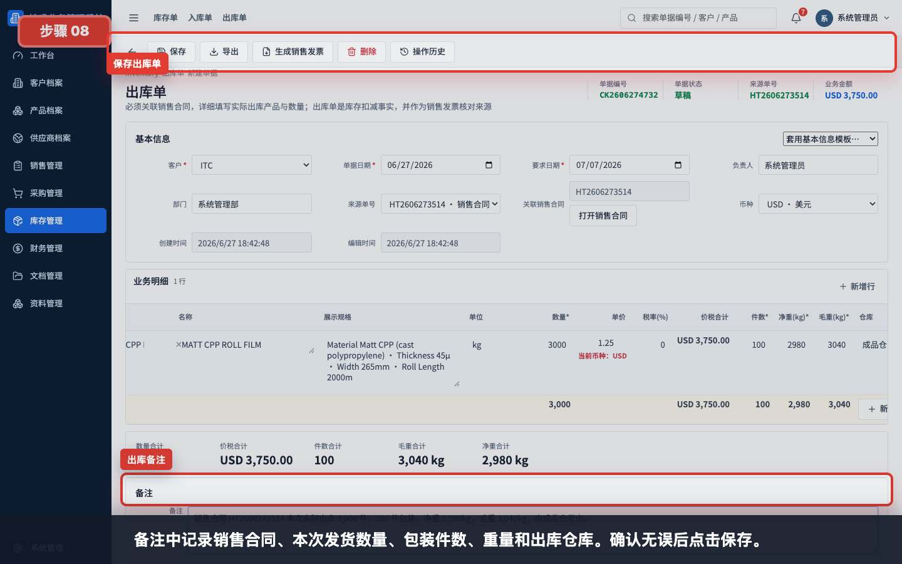

备注中记录销售合同、本次发货数量、包装件数、重量和出库仓库。确认无误后点击保存。

备注示例：

```text
销售合同 HT2606278937 本次实际出库 3,000 件，100 件包装，净重 2,980kg，毛重 3,040kg，由成品仓发出。
```

## 步骤 09：保存并确认出库单

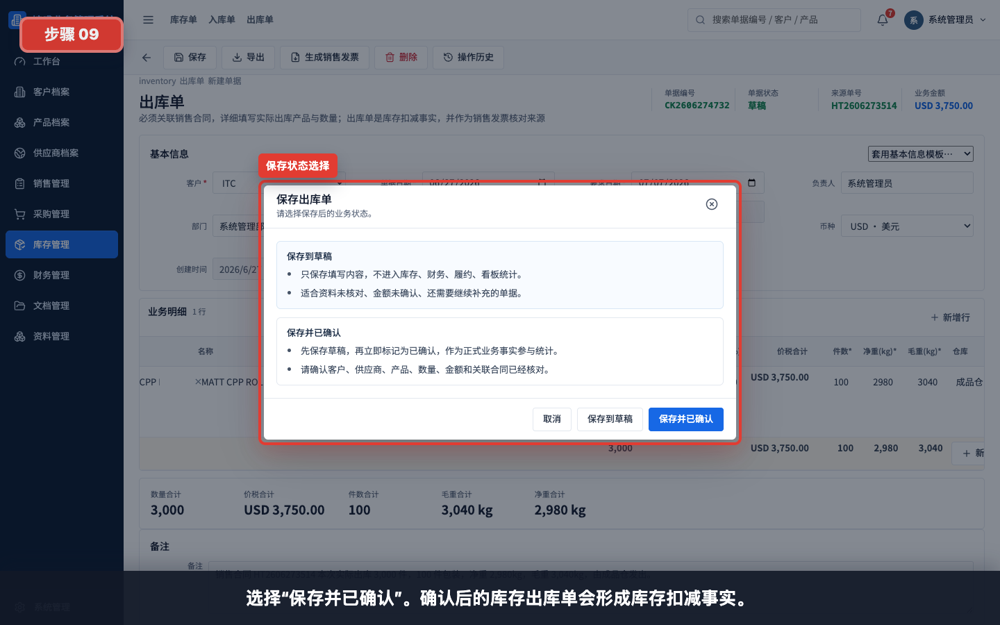

如果仓库数据还未复核，可以先保存到草稿；确认实际发货数量、仓库、件数和重量无误后，选择“保存并已确认”。

状态说明：

| 状态 | 适用情况 | 后续影响 |
|---|---|---|
| 保存到草稿 | 发货数据仍需复核 | 不形成库存扣减事实 |
| 保存并已确认 | 实际发货数量和物流数据已确认 | 形成库存扣减事实，可生成销售发票 |

## 步骤 10：回到出库单列表验证

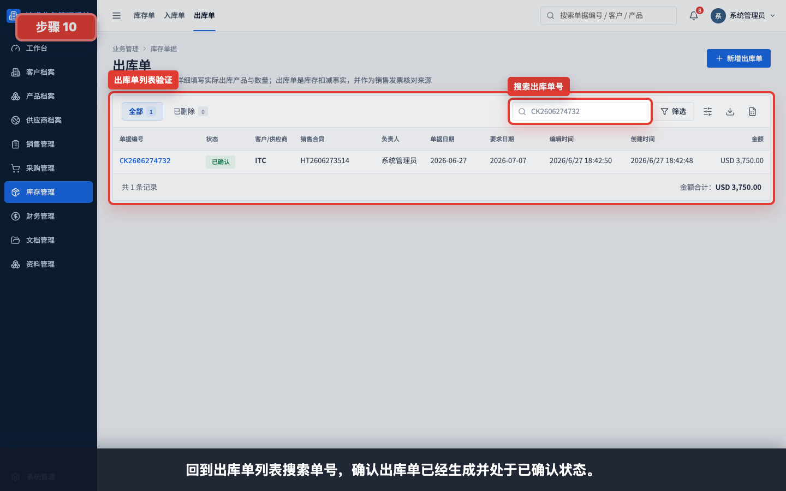

回到“库存管理 > 出库单”搜索单号，确认出库单已经生成并处于已确认状态。

## 步骤 11：查看销售合同履约出库进度

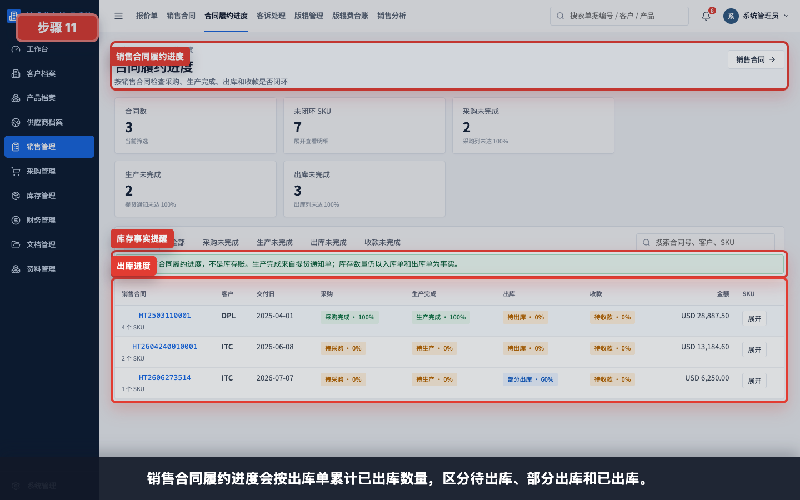

销售合同履约进度会按出库单累计已出库数量，区分待出库、部分出库和已出库。

进度理解：

- 合同数量：来自已确认销售合同。
- 已出库：来自已确认库存出库单。
- 待出库：合同数量减已出库数量。

## 步骤 12：确认后续销售发票入口

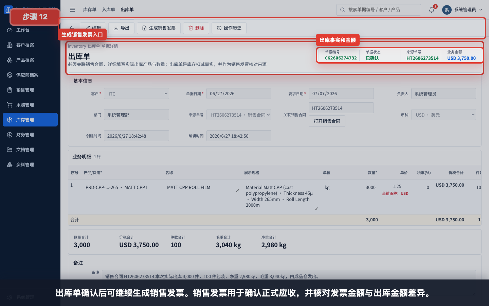

出库单确认后可继续生成销售发票。销售发票用于确认正式应收，并核对发票金额与出库金额差异。

## 常见错误

- 销售合同还是草稿就尝试创建出库单。
- 没有选择来源销售合同，导致出库单无法保存确认。
- 出库数量直接沿用销售合同全量，没有按本次实际发货填写。
- 件数、净重或毛重未填写，导致出库单无法保存或无法下推。
- 毛重小于净重。
- 仓库填错，导致库存分仓统计不准确。
- 单价未核对，后续销售发票差异难以解释。
- 出库单只保存到草稿，误以为库存已经扣减。
- 一张合同多次分批发货时，没有按每次实际出库分别登记。

## 保存前检查清单

- 销售合同状态为已确认。
- 客户、来源销售合同和关联销售合同正确。
- 产品、规格、单位和本次实际出库数量已核对。
- 单价、税率和价税合计已复核。
- 件数、净重、毛重已填写，且毛重大于或等于净重。
- 仓库填写为实际出库仓库。
- 备注已写清销售合同、本次发货数量、重量和异常说明。
- 如要形成库存扣减事实，保存时选择“保存并已确认”。
- 后续需要开票时，从出库单生成销售发票。
