# 如何从提货通知下推采购入库单

本指引用于培训新用户把已确认提货通知下推为采购入库单。示例覆盖查找提货通知、核对 ready / 待入库数量、阅读下推确认、生成入库单草稿、核对来源提货通知和采购合同、填写实际入库数量、仓库、件数、净重、毛重、保存确认、查看生产完成看板变化，以及确认后续采购发票入口。

## 适用场景

- 供应商已经生产完成，提货通知单已确认。
- 货物已经实际到库，仓库需要登记实收数量。
- 需要把“生产完成 / 待入库”转成真实库存增加。
- 财务后续需要以入库单核对采购发票和应付金额。

## 前置条件

- 提货通知单已保存并已确认。
- 提货通知由采购合同下推，或至少已经正确关联采购合同。
- 货物已经实际到库，仓库已完成实物清点。
- 已确认本次实际入库数量、仓库、件数、净重和毛重。

## 字段填写说明

| 字段 | 是否必填 | 填写方式 | 影响 |
|---|---|---|---|
| 供应商/货代 | 必填 | 从提货通知自动带出 | 后续入库、应付和采购发票按供应商追溯 |
| 单据日期 | 必填 | 默认当天，可按实际入库日期调整 | 库存增加事实的日期 |
| 要求日期 | 必填 | 可理解为本次入库或要求完成日期 | 影响业务跟进和列表排序 |
| 来源单号 | 必填 | 由提货通知下推自动带出 | 用于追溯 ready / 待入库来源 |
| 关联采购合同 | 必填/自动 | 从提货通知带出采购合同关系 | 入库单必须能追溯采购合同 |
| 关联销售合同 | 自动 | 如果采购链路来自销售合同，会自动带出 | 支持销售履约进度追溯 |
| 币种 | 建议保留 | 从来源单带出 | 保持采购金额口径一致 |
| 产品 / 费用 | 必填 | 从提货通知带出 | 入库只应登记实际入库产品 |
| 数量 | 必填 | 填本次实际入库数量 | 直接影响库存增加数量 |
| 买入单价 | 必填 | 从采购合同带出，可按实际采购价核对 | 作为采购发票金额核对来源 |
| 价税合计 | 自动 | 由数量、单价和税率计算 | 作为采购入库金额和应付参考 |
| 件数 | 必填 | 填仓库实收包装件数 | 入库物流统计和对账依据 |
| 净重(kg) | 必填 | 填实物净重 | 入库物流统计和对账依据 |
| 毛重(kg) | 必填 | 填含包装毛重 | 必须大于或等于净重 |
| 仓库 | 建议填写 | 填实际入库仓库，例如成品仓 | 库存按仓库维度统计 |
| 备注 | 按需填写 | 写来源提货通知、实收数量、重量和异常说明 | 便于采购、仓库和财务交接 |
| 保存状态 | 必填 | 草稿 / 已确认 | 已确认后形成库存增加事实 |

关键规则：

```text
提货通知 = 供应商生产完成 / 待入库
采购入库单 = 库存增加事实
采购发票 = 以采购入库单为核对来源确认正式应付
```

## 步骤 01：找到已确认提货通知

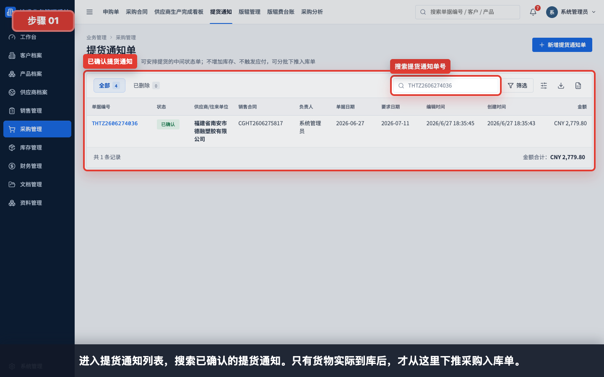

进入“采购管理 > 提货通知”，搜索已确认的提货通知。只有货物实际到库后，才从这里下推采购入库单。

## 步骤 02：打开提货通知详情

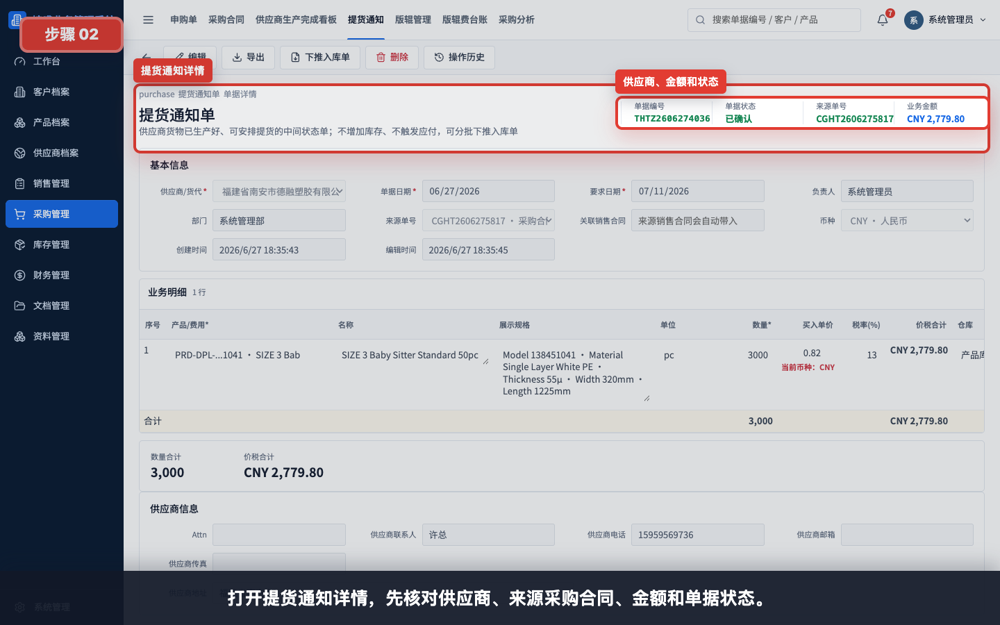

打开提货通知详情，先核对供应商、来源采购合同、金额和单据状态。提货通知必须已确认。

## 步骤 03：核对 ready / 待入库数量

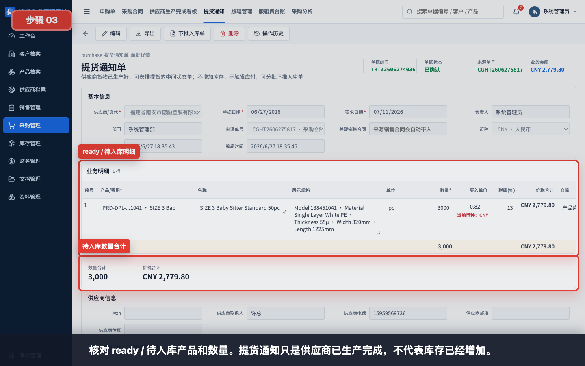

核对 ready / 待入库产品和数量。提货通知只是供应商已生产完成，不代表库存已经增加。

## 步骤 04：确认下推入库单入口

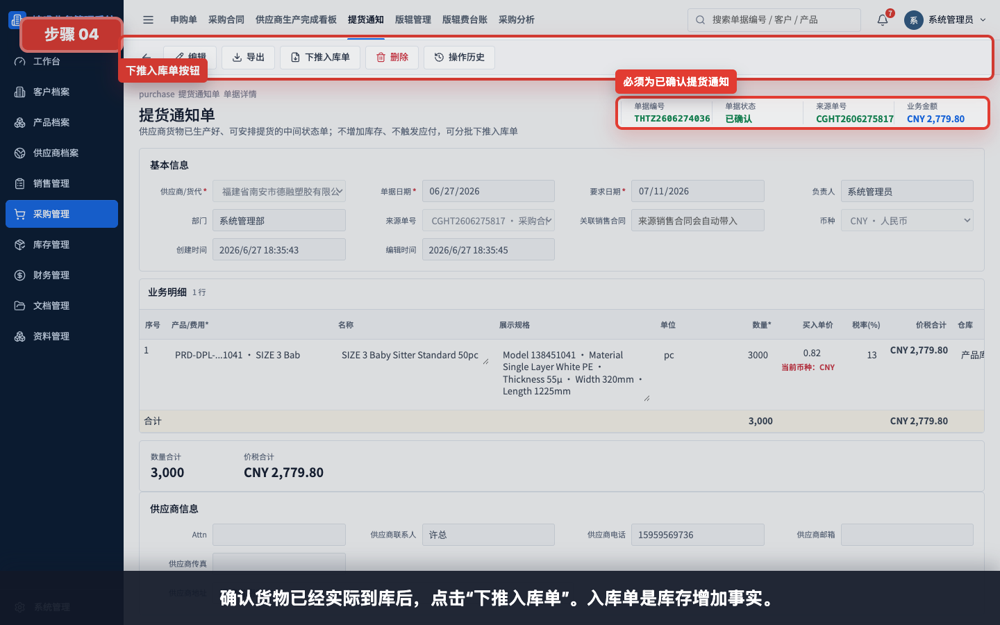

确认货物已经实际到库后，点击工具栏中的“下推入库单”。这一步会进入库存事实单据。

## 步骤 05：查看下推入库单确认

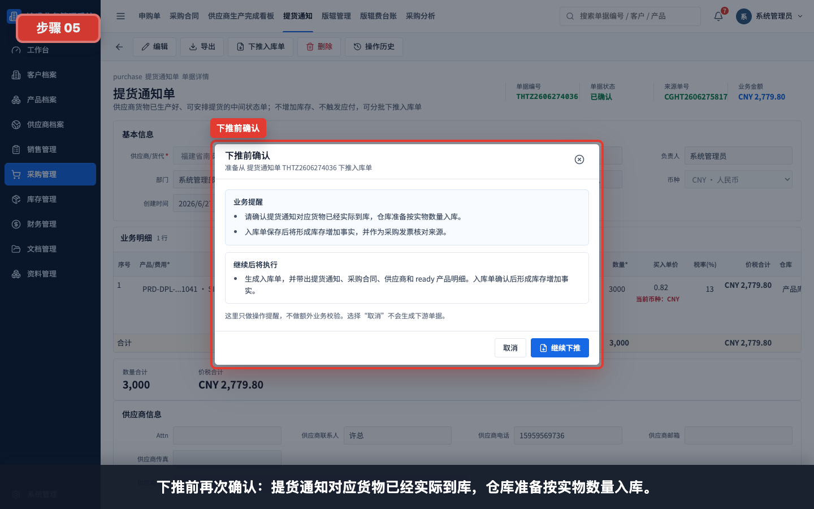

下推前再次确认：提货通知对应货物已经实际到库，仓库准备按实物数量入库。

## 步骤 06：确认入库单库存影响

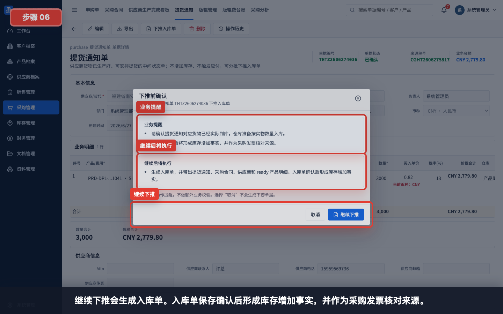

系统会提示入库单的业务影响：入库单保存确认后形成库存增加事实，并作为采购发票核对来源。

## 步骤 07：生成入库单草稿

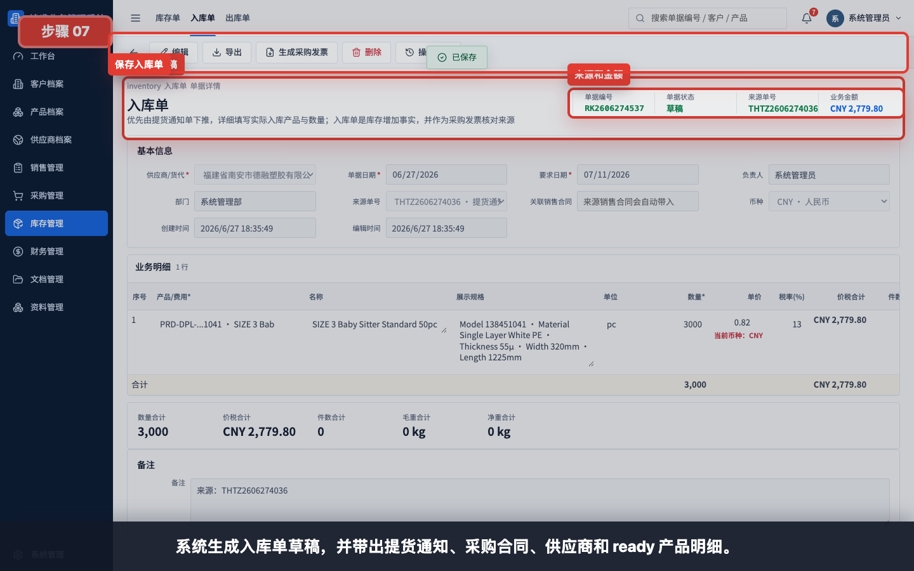

继续下推后，系统生成入库单草稿，并带出提货通知、采购合同、供应商和 ready 产品明细。

## 步骤 08：核对来源提货通知和采购合同

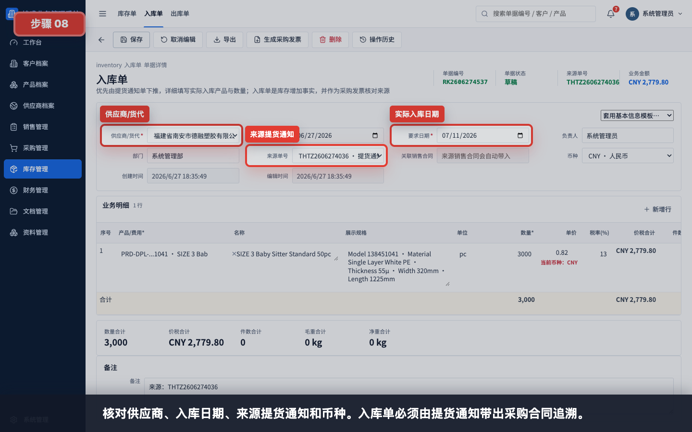

核对供应商、入库日期、来源提货通知和币种。入库单必须能追溯采购合同，否则后续采购发票、应付和履约进度会断开。

## 步骤 09：填写实际入库数量、仓库、件数和重量

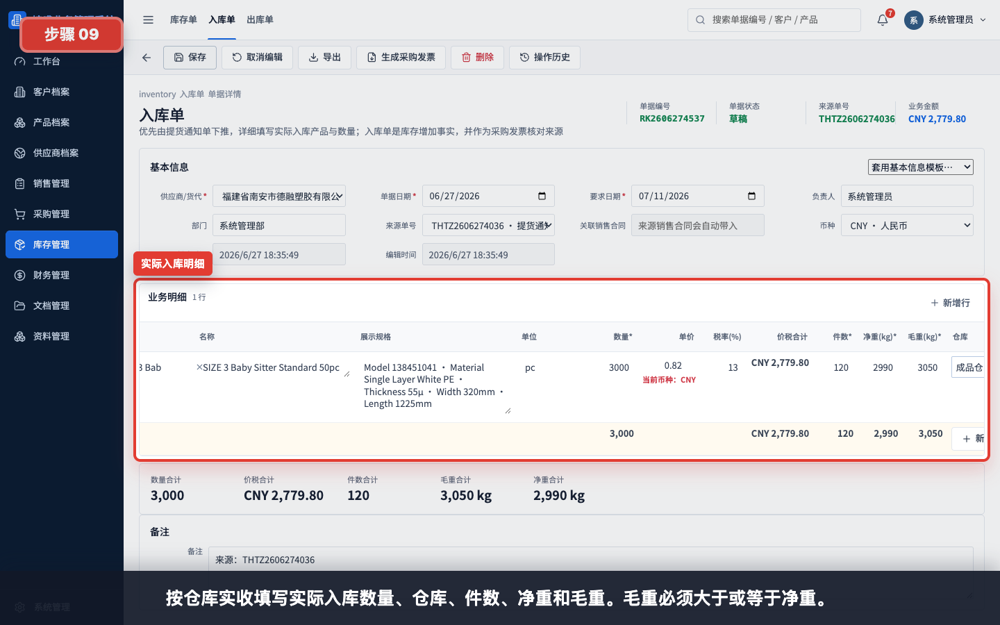

按仓库实收填写实际入库数量、仓库、件数、净重和毛重。毛重必须大于或等于净重。

示例：

| 字段 | 示例 | 说明 |
|---|---|---|
| 数量 | 3,000 | 本次实际入库数量 |
| 买入单价 | 0.82 | 从采购合同带出，保存前复核 |
| 件数 | 120 | 仓库实收包装件数 |
| 净重(kg) | 2,990 | 不含包装重量 |
| 毛重(kg) | 3,050 | 含包装重量，不能小于净重 |
| 仓库 | 成品仓 | 实际入库仓库 |

## 步骤 10：核对入库数量和物流合计

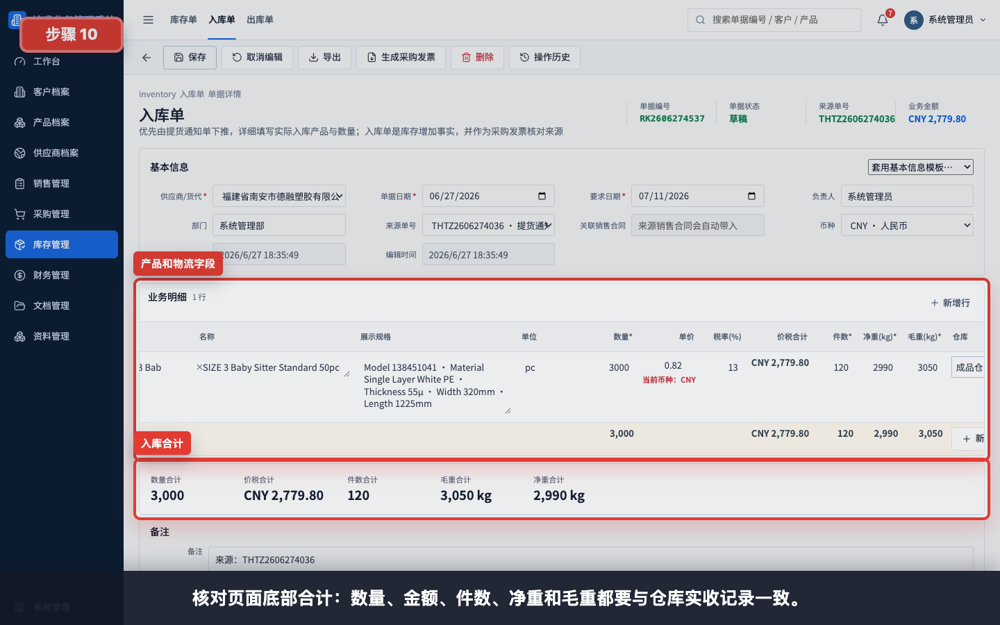

核对页面底部合计：数量、金额、件数、净重和毛重都要与仓库实收记录一致。

## 步骤 11：填写备注并保存入库单

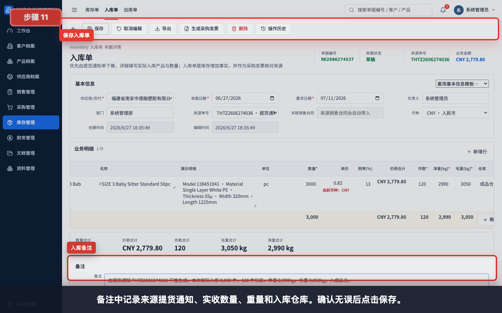

备注中记录来源提货通知、实收数量、重量和入库仓库。确认无误后点击保存。

备注示例：

```text
由提货通知 THTZ2606276755 下推生成。本次实际入库 3,000 件，120 件包装，净重 2,990kg，毛重 3,050kg，入成品仓。
```

## 步骤 12：保存并确认入库单

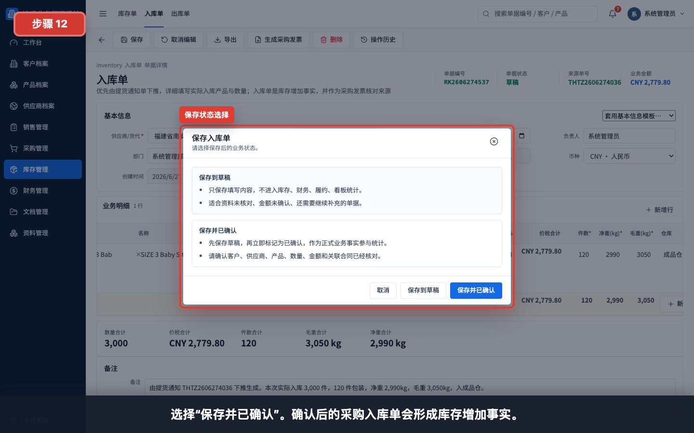

如果仓库数据还未复核，可以先保存到草稿；确认实收数量、仓库、件数和重量无误后，选择“保存并已确认”。

状态说明：

| 状态 | 适用情况 | 后续影响 |
|---|---|---|
| 保存到草稿 | 仓库实收数据仍需复核 | 不形成库存事实 |
| 保存并已确认 | 实收数量、金额和物流数据已确认 | 形成库存增加事实，可生成采购发票 |

## 步骤 13：回到入库单列表验证

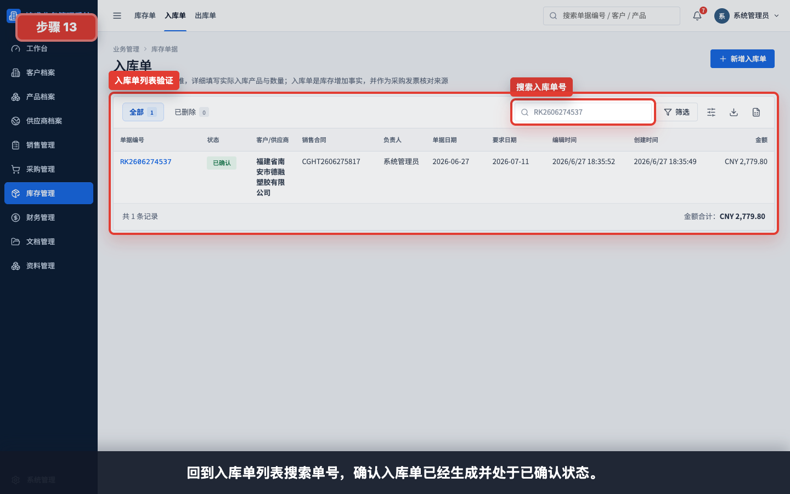

回到“库存管理 > 入库单”搜索单号，确认入库单已经生成并处于已确认状态。

## 步骤 14：查看供应商生产完成看板已入库变化

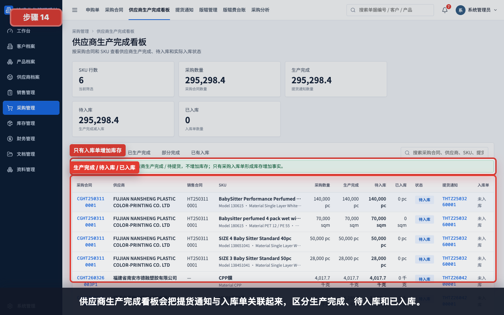

供应商生产完成看板会把提货通知与入库单关联起来，区分生产完成、待入库和已入库。

看板理解：

- 生产完成：来自已确认提货通知单。
- 待入库：生产完成数量减已入库数量。
- 已入库：来自已确认采购入库单。

## 步骤 15：确认后续采购发票入口

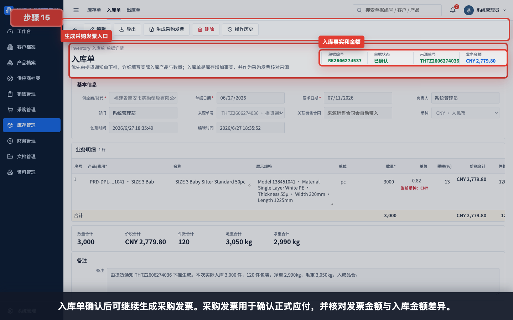

入库单确认后可继续生成采购发票。采购发票用于确认正式应付，并核对发票金额与入库金额差异。

## 常见错误

- 提货通知还是草稿就尝试下推入库单。
- 货物尚未实际到库，就提前生成并确认入库单。
- 入库数量直接沿用提货通知数量，没有按仓库实收数量复核。
- 件数、净重或毛重未填写，导致入库单无法保存或无法下推。
- 毛重小于净重。
- 仓库填错，导致库存分仓统计不准确。
- 买入单价未核对，后续采购发票差异难以解释。
- 来源提货通知或采购合同关系丢失，导致应付和履约追溯断开。
- 入库单只保存到草稿，误以为库存已经增加。

## 保存前检查清单

- 提货通知状态为已确认。
- 货物已经实际到库并完成仓库清点。
- 供应商、来源提货通知和采购合同正确。
- 产品、规格、单位和实际入库数量已核对。
- 买入单价、税率和价税合计已复核。
- 件数、净重、毛重已填写，且毛重大于或等于净重。
- 仓库填写为实际入库仓库。
- 备注已写清来源提货通知、实收数量、重量和异常说明。
- 如要形成库存事实，保存时选择“保存并已确认”。
- 后续收到供应商发票时，从入库单生成采购发票。
