# 如何上传和预览合同附件

本指引用于培训销售、财务和管理层在销售合同 folder 中上传、预览、下载和删除附件。示例使用演示客户 PO 文件，覆盖进入合同 folder、上传附件、核对附件信息、在线预览、下载入口、在销售合同中查看附件，以及删除错误附件。

## 适用场景

- 销售合同已经有 folder，需要上传盖章合同、客户 PO、补充协议或往来确认材料。
- 财务或审计需要在同一销售合同下查看附件。
- 上传后需要确认文件内容是否正确。
- 发现附件传错，需要删除并重新上传。

## 附件操作说明

| 操作 | 说明 | 注意事项 |
|---|---|---|
| 上传附件 | 在销售合同 folder 中点击“上传附件”，可选择一个或多个文件 | 上传前确认当前 folder 的合同号和客户 |
| 预览 | 图片和 PDF 支持在线预览 | 预览用于确认内容，不替代下载存档 |
| 下载 | 下载原始附件 | 适合离线查看、转发或归档 |
| 删除 | 删除错误附件 | 删除前必须核对文件名，删除后 folder 和销售合同附件区都会同步移除 |

建议归档的文件：

```text
盖章销售合同
客户 PO
补充协议
往来确认邮件截图
装箱资料或交付确认文件
其他与该销售合同直接相关的资料
```

## 步骤 01：进入合同 folder

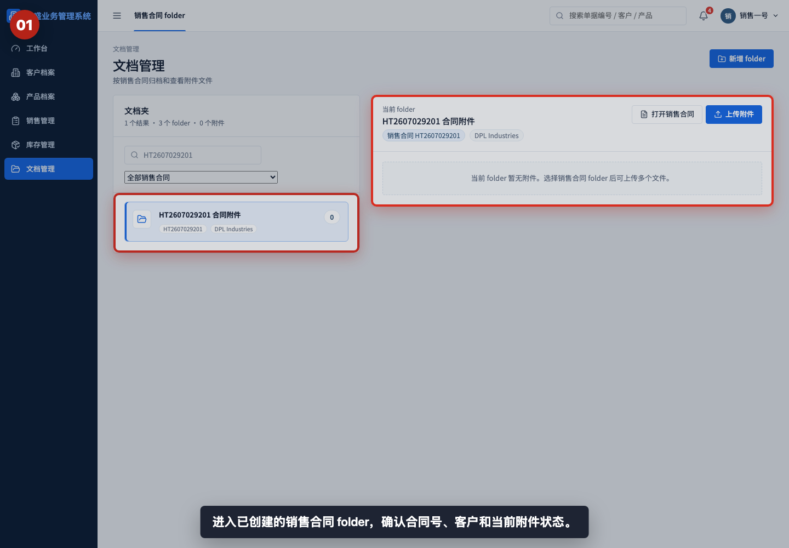

进入已创建的销售合同 folder，先确认合同号、客户名称和当前附件状态。上传前必须确保当前 folder 不是其他合同。

## 步骤 02：点击上传附件

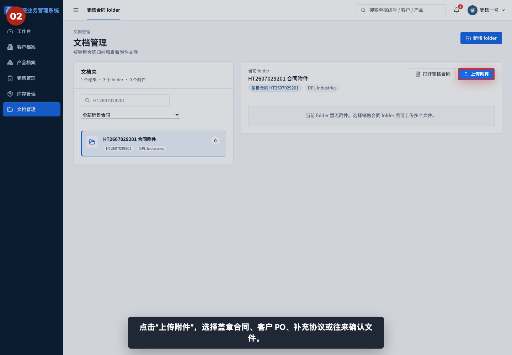

点击“上传附件”，选择盖章合同、客户 PO、补充协议或往来确认文件。系统支持一次选择多个文件。

## 步骤 03：上传成功提示

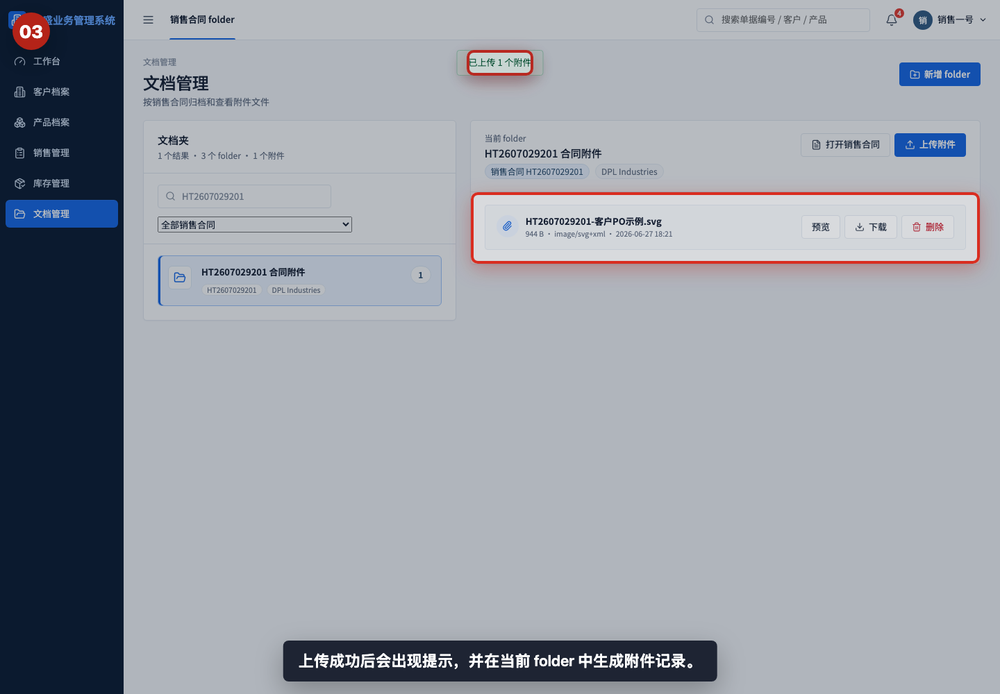

上传成功后会出现提示，并在当前 folder 中生成附件记录。左侧 folder 的附件数量也会同步更新。

## 步骤 04：阅读附件信息

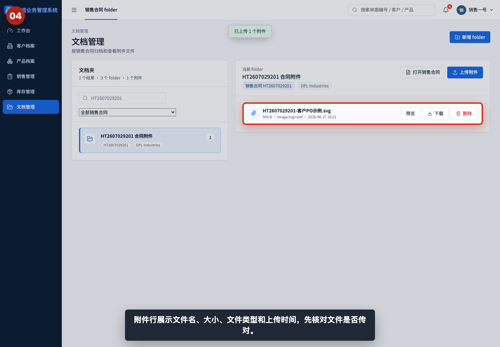

附件行展示文件名、大小、文件类型和上传时间。上传后第一步应核对文件名是否对应当前合同。

## 步骤 05：查看预览、下载和删除入口

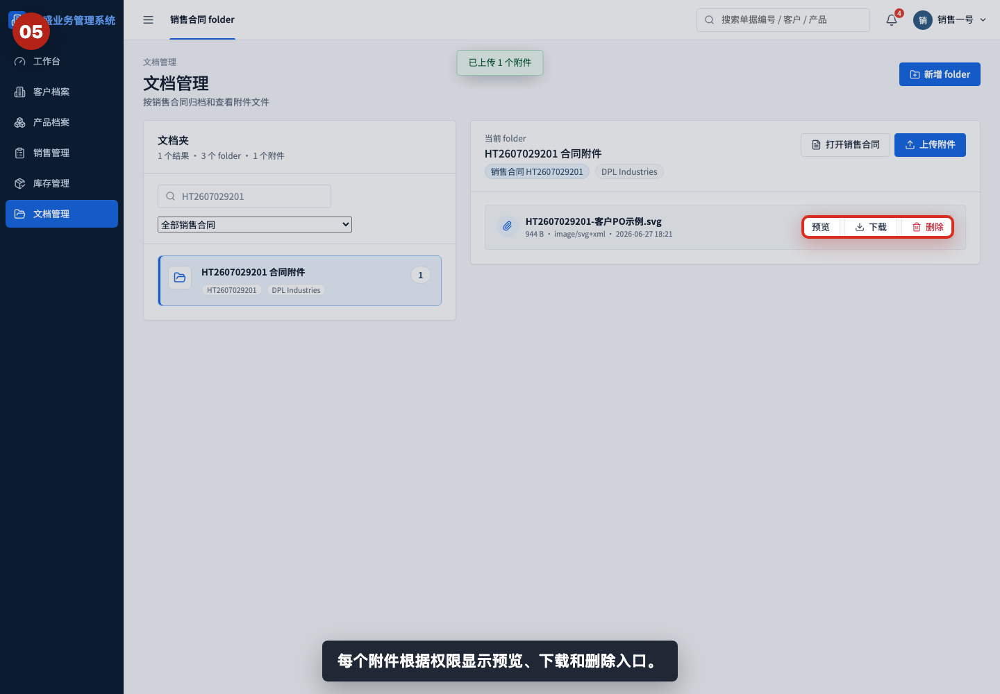

每个附件根据用户权限显示预览、下载和删除入口。只读角色通常只能查看和下载，不能上传或删除。

## 步骤 06：打开附件预览

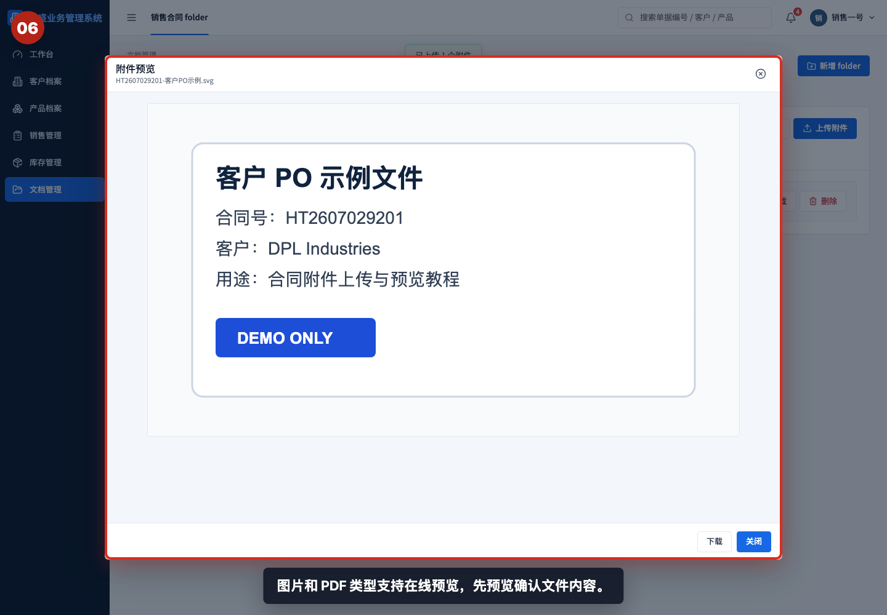

图片和 PDF 类型支持在线预览。上传后建议先预览，确认文件内容、合同号和客户信息正确。

## 步骤 07：返回附件列表

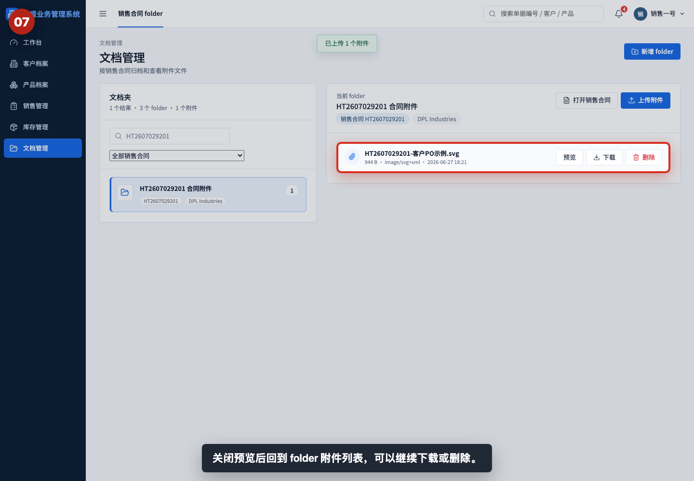

关闭预览后回到 folder 附件列表，可以继续下载、删除或上传其他文件。

## 步骤 08：确认下载入口

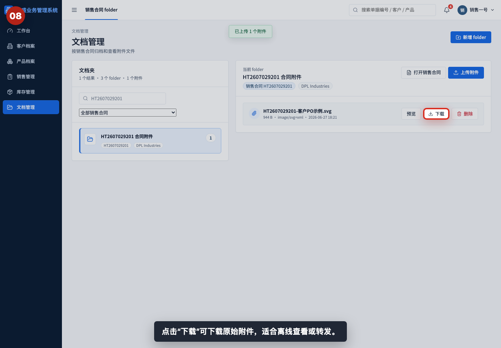

点击“下载”可下载原始附件。需要离线查看、转发或留存时使用下载入口。

## 步骤 09：在销售合同中查看附件

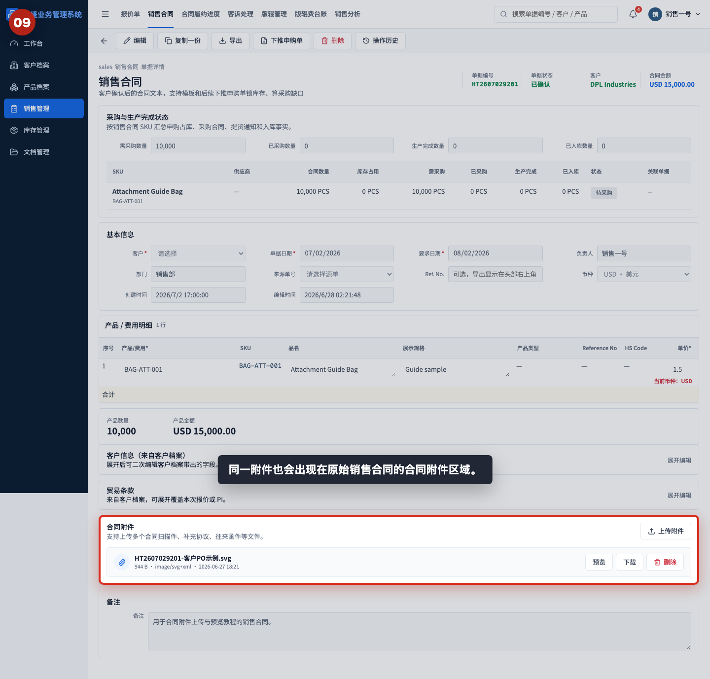

同一附件也会出现在原始销售合同的合同附件区域。文档管理 folder 和销售合同附件区指向同一份附件记录。

## 步骤 10：准备删除错误附件

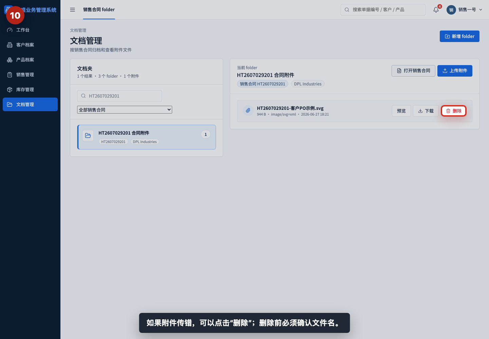

如果附件传错，可以点击“删除”。删除前必须确认文件名，避免删除正确资料。

## 步骤 11：验证附件已删除

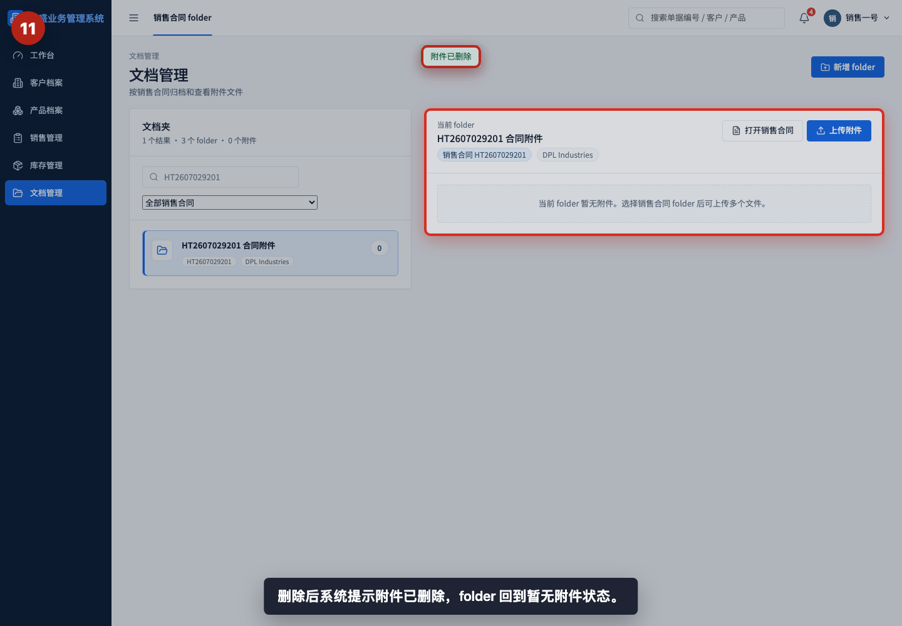

删除后系统提示附件已删除，folder 回到暂无附件状态。此时可重新上传正确文件。

## 相关教程

- [如何创建销售合同 folder](../创建销售合同folder/README.md)
- [如何创建销售合同](../../销售管理/创建销售合同/README.md)
- [协作与管理截图指引](../../collaboration-admin/README.md)

## 常见错误

- 没有先确认 folder 合同号就上传，导致附件归属错误。
- 上传文件名不清晰，后续难以判断内容。建议文件名包含合同号、文件类型和日期。
- 上传后不预览，直到审计或对账时才发现文件传错。
- 把无关资料上传到销售合同 folder。folder 应只存放与该销售合同直接相关的附件。
- 删除附件前没有确认文件名。删除后需要重新上传，容易造成归档遗漏。
- 以为只在文档管理中可见。销售合同详情页也会显示同一批合同附件。

## 上传前检查清单

- 是否进入了正确销售合同 folder。
- 左侧 folder 和右侧详情的合同号、客户名称是否一致。
- 文件名是否清晰，是否包含合同号或文件类型。
- 文件是否属于该销售合同。
- 是否已预览确认内容正确。
- 是否需要下载留存原始附件。
- 删除前是否再次确认文件名和合同号。
