# 如何创建销售合同 folder

本指引用于培训销售、财务和管理层在文档管理中为销售合同创建独立 folder。示例覆盖进入文档管理、搜索销售合同、理解默认 folder、打开新增窗口、选择关联销售合同、填写 folder 名称和备注、保存后验证，以及从 folder 返回原始销售合同。

## 适用场景

- 销售合同已经创建，需要集中归档盖章合同、客户 PO、补充协议和往来确认文件。
- 业务、财务或审计后续需要按销售合同快速查找附件。
- 某张销售合同还没有正式 folder，需要从系统默认文档夹视图转成正式 folder。
- 需要保证附件归属到正确合同，而不是散落在个人电脑或聊天记录里。

## 字段填写说明

| 字段 | 是否必填 | 填写方式 | 用途 |
|---|---|---|---|
| 关联销售合同编号 | 必填 | 从下拉框选择已确认且未作废的销售合同 | 决定 folder 归属的合同、客户和附件范围 |
| Folder 名称 | 建议填写 | 建议使用“合同号 + 归档用途”，例如 `HT2607019101 合同归档` | 方便搜索和识别 |
| 备注 | 选填 | 写明需要收集的文件类型，例如盖章合同、客户 PO、补充协议 | 给后续上传附件的人提供说明 |

## 核心规则

```text
文档管理只围绕销售合同创建 folder
每个 folder 必须关联销售合同编号
系统会为未建正式 folder 的销售合同显示默认文档夹视图
保存正式 folder 后，可以继续上传、预览、下载或删除附件
只读角色可查看和下载，不能新增 folder、上传或删除附件
```

## 步骤 01：进入文档管理

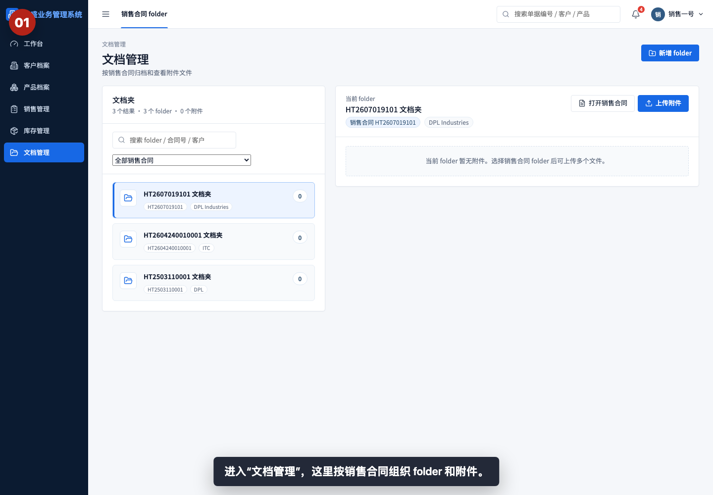

进入“文档管理”，这里按销售合同组织 folder 和附件。新用户查找合同资料时，应优先从销售合同 folder 进入。

## 步骤 02：搜索销售合同 folder

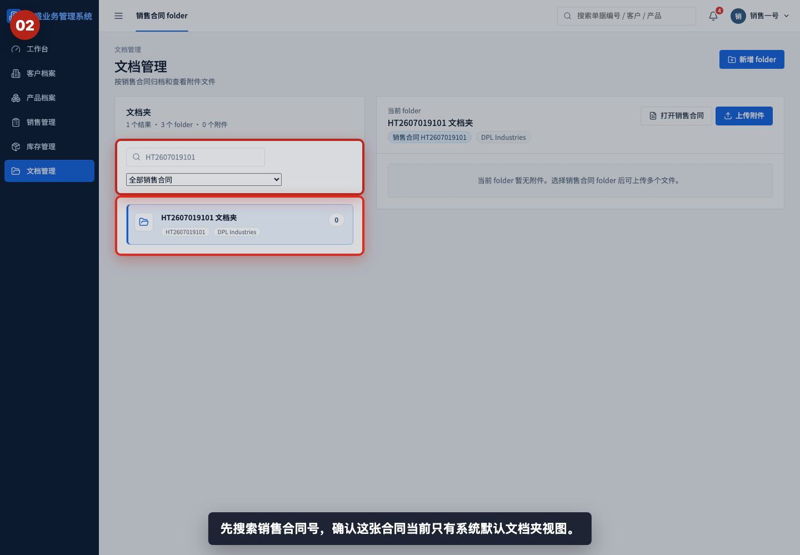

在搜索框输入销售合同号，先确认目标合同是否已有正式 folder。搜索支持 folder 名称、合同号和客户名称。

## 步骤 03：查看默认 folder 详情

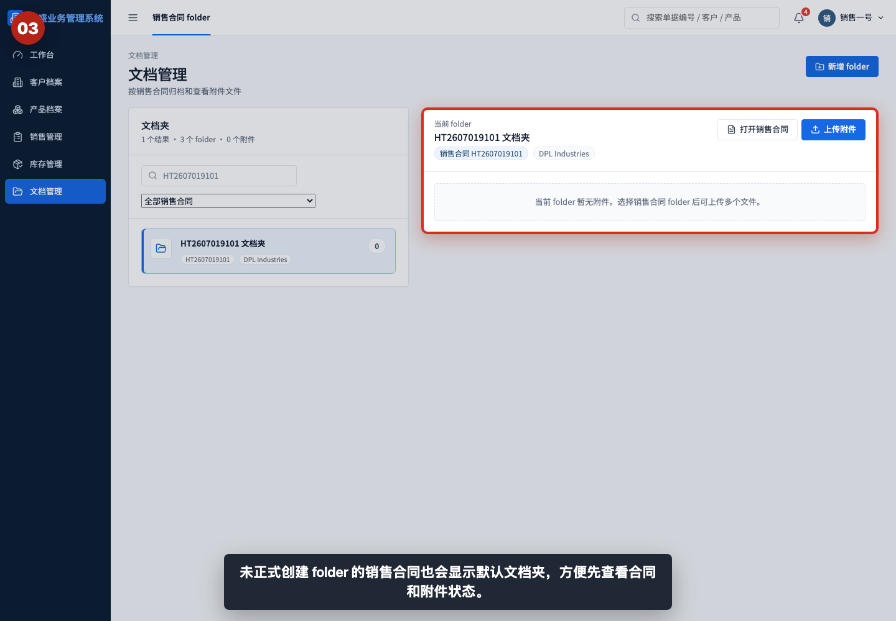

如果销售合同还没有正式 folder，系统会显示默认文档夹视图。默认视图可以查看合同和附件状态，但建议为正式归档创建明确 folder。

## 步骤 04：打开新增 folder 窗口

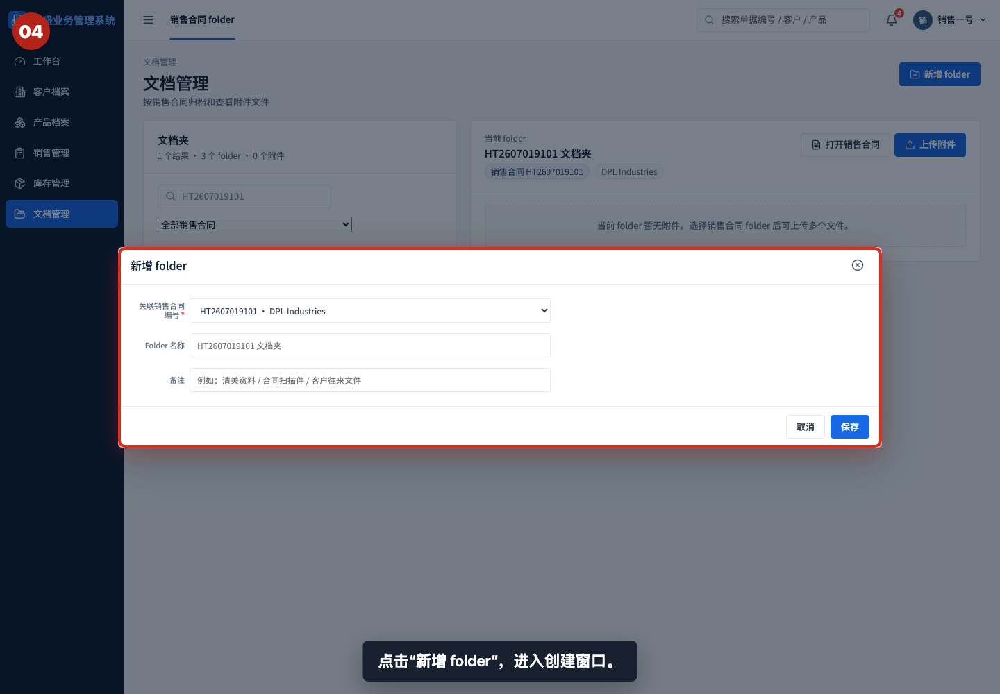

点击“新增 folder”，进入创建窗口。窗口中需要选择销售合同，并可填写 folder 名称和备注。

## 步骤 05：选择关联销售合同

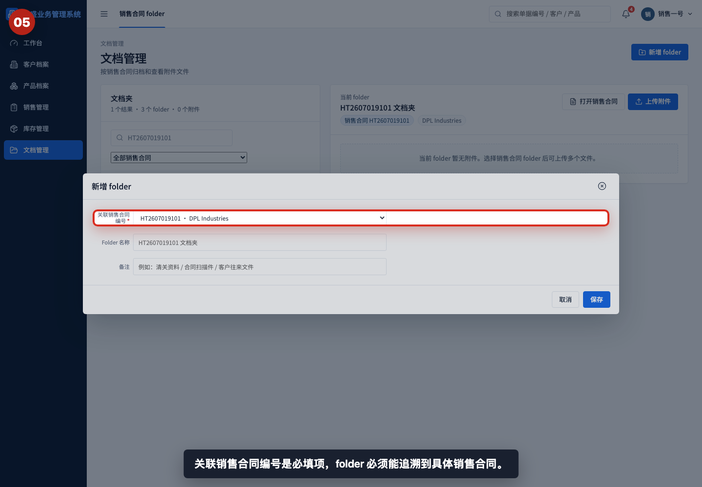

关联销售合同编号是必填项。选择后，folder 会自动带出合同编号和客户名称，用于后续附件归档和查找。

## 步骤 06：填写 folder 名称

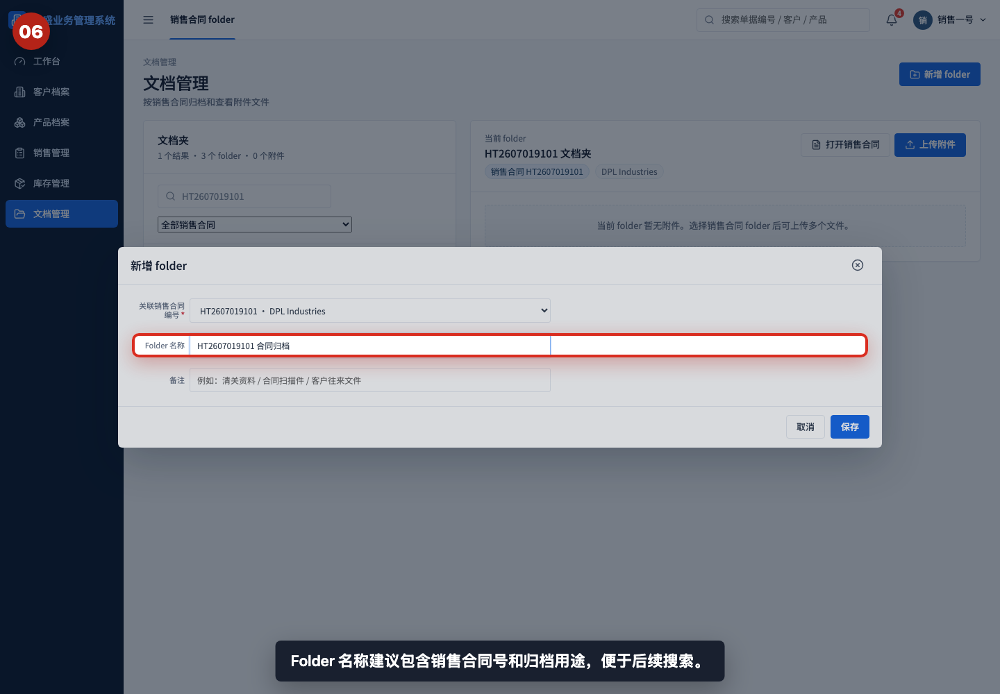

Folder 名称建议包含销售合同号和用途，例如“HT2607019101 合同归档”。如果不填写，系统会使用默认的合同号文档夹名称。

## 步骤 07：填写 folder 备注

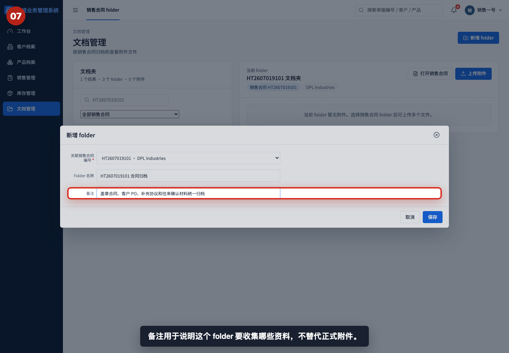

备注用于说明该 folder 计划收集哪些资料，例如盖章合同、客户 PO、补充协议和往来确认材料。备注不是正式附件，正式文件仍需上传。

## 步骤 08：保存 folder

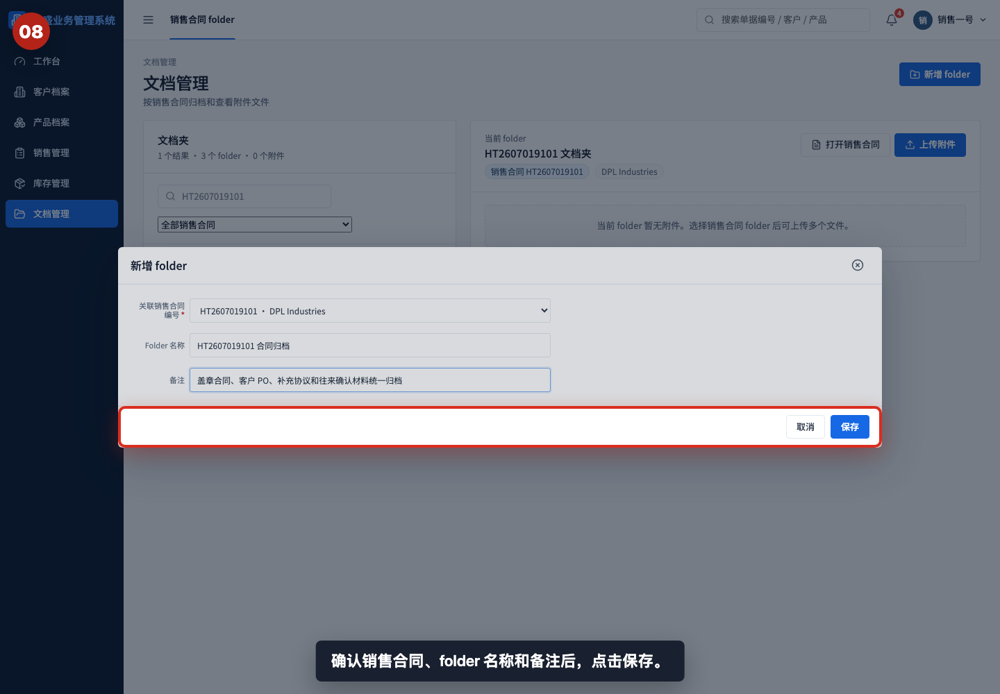

确认销售合同、folder 名称和备注后，点击“保存”。保存前重点检查销售合同是否选对。

## 步骤 09：验证 folder 已创建

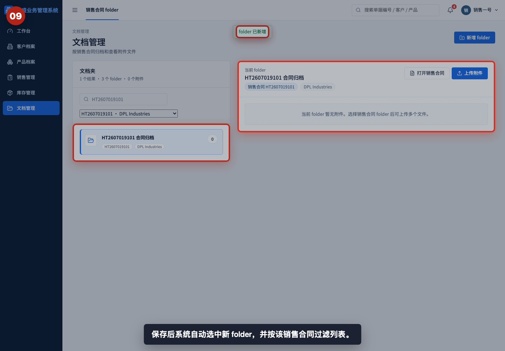

保存后系统会提示“folder 已新增”，并自动选中新 folder。左侧列表和右侧详情应显示同一个合同号和客户名称。

## 步骤 10：用名称搜索 folder

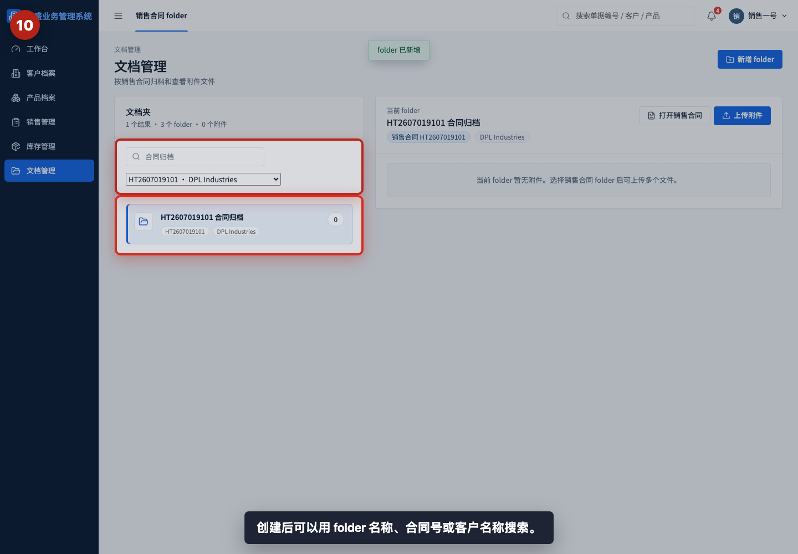

创建后可以用 folder 名称、销售合同号或客户名称搜索。培训时建议让用户确认自己能重新找到刚创建的 folder。

## 步骤 11：查看 folder 详情操作

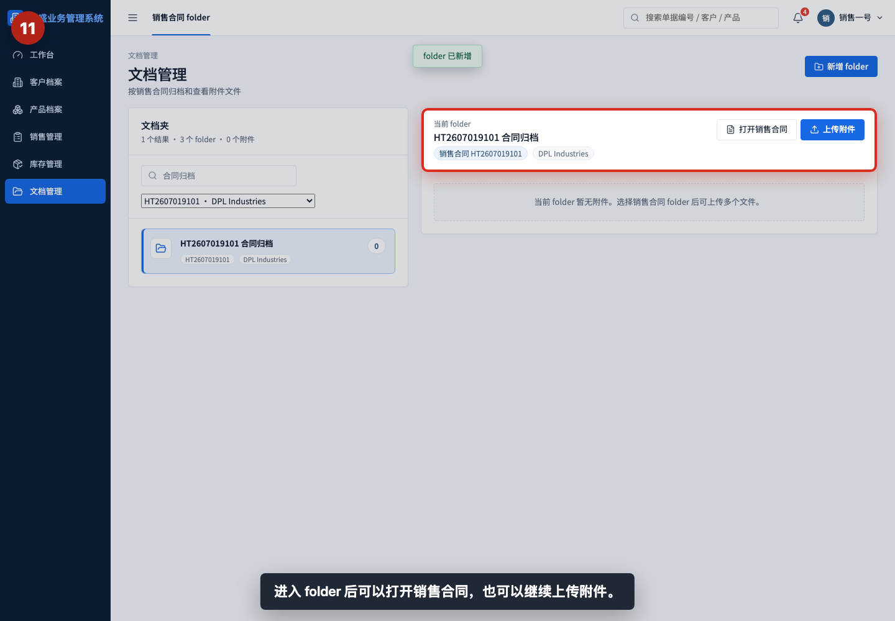

进入 folder 后，可以打开销售合同，也可以继续上传附件。附件上传、预览、下载和删除会在后续教程中单独讲解。

## 步骤 12：打开关联销售合同

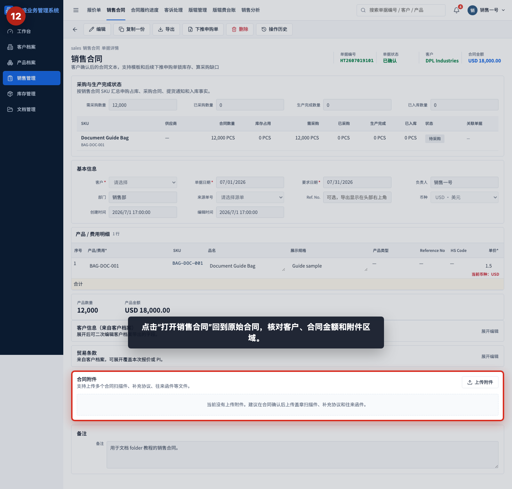

点击“打开销售合同”回到原始合同，核对客户、合同金额和附件区域。发现 folder 关联错合同，应重新创建正确 folder 并避免继续上传文件。

## 相关教程

- [如何创建销售合同](../../销售管理/创建销售合同/README.md)
- [如何从报价单下推销售合同](../../销售管理/报价单下推销售合同/README.md)
- [如何上传和预览合同附件](../上传和预览合同附件/README.md)
- [协作与管理截图指引](../../collaboration-admin/README.md)

## 常见错误

- 选错销售合同编号。附件会归属到错误合同，后续查找和审计都会混乱。
- Folder 名称过于笼统，例如只写“合同资料”。建议包含合同号和用途。
- 把备注当作附件。备注只是说明，盖章合同、客户 PO、补充协议仍需要上传文件。
- 创建 folder 后不验证。保存后应检查左侧列表和右侧详情是否显示同一个合同号。
- 在默认文档夹视图中误以为已经完成正式归档。默认视图可查看，但正式管理建议创建明确 folder。

## 保存前检查清单

- 是否进入了“文档管理”。
- 是否已经搜索并确认目标销售合同。
- 是否选择了正确的关联销售合同编号。
- Folder 名称是否包含合同号或明确用途。
- 备注是否说明需要收集的文件类型。
- 保存后是否看到“folder 已新增”提示。
- 左侧列表和右侧详情的合同号、客户名称是否一致。
- 是否能通过 folder 名称、合同号或客户名称重新搜索到该 folder。
