# 如何创建版辊记录

本指引用于培训销售、采购和财务用户创建版辊记录。版辊记录用于绑定客户、产品和供应商，追踪客户版辊收费、供应商版辊应付、累计达标返还以及最终闭环状态。

## 适用场景

- 客户首单需要收取版辊费。
- 供应商制作版辊后需要形成应付或付款。
- 需要按销售合同、出库或收款金额累计返还门槛。
- 达到门槛后需要提醒客户返还或供应商追返。
- 需要把版辊费用从销售、采购和财务三个视角统一追踪。

## 字段填写说明

| 字段 | 是否必填 | 填写方式 | 影响 |
|---|---|---|---|
| 版辊编号 | 必填 | 使用唯一编号 | 列表搜索和后续单据追溯 |
| 版辊名称 | 必填 | 写清客户、产品或图稿 | 便于业务识别 |
| 客户 | 必填 | 选择客户档案 | 客户收费和返还归属 |
| 产品 | 必填 | 搜索 SKU、品名或规格 | 累计销售金额和版辊归属 |
| 供应商 | 建议填写 | 选择制作版辊的供应商 | 后续生成版辊应付、供应商追返 |
| 状态 | 必填 | 待客户收费、跟踪中、达标、已返还等 | 列表筛选和提醒 |
| 客户收取金额 | 建议填写 | 按销售确认金额填写 | 客户版辊费收入 |
| 供应商应付金额 | 建议填写 | 按采购确认金额填写 | 供应商版辊应付 |
| 币种 | 必填 | 如 USD、CNY | 金额展示和汇总 |
| 返还门槛 | 建议填写 | 按协议累计金额填写 | 判断是否达到返还条件 |
| 门槛币种 | 建议填写 | 与门槛金额口径一致 | 返还进度计算 |
| 累计口径 | 必填 | 销售合同、出库或收款 | 决定按哪类业务事实累计 |
| 版辊数量 | 按需填写 | 填版辊支数 | 规格追溯 |
| 收费/付款/返还日期 | 按实际发生填写 | 日期为空表示未发生 | 影响列表提示和闭环判断 |
| 规格说明 / 备注 | 建议填写 | 写图稿、颜色、返还协议和后续安排 | 便于交接和复盘 |

## 步骤 01：进入版辊管理

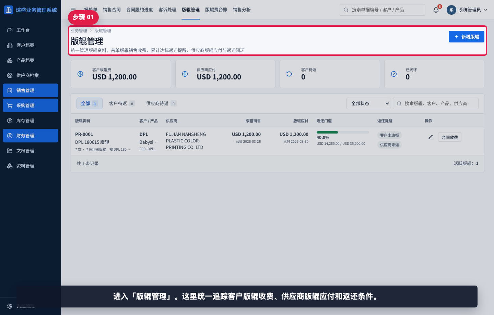

进入“版辊管理”。这里统一追踪客户版辊收费、供应商版辊应付和返还条件。

## 步骤 02：查看版辊列表和汇总

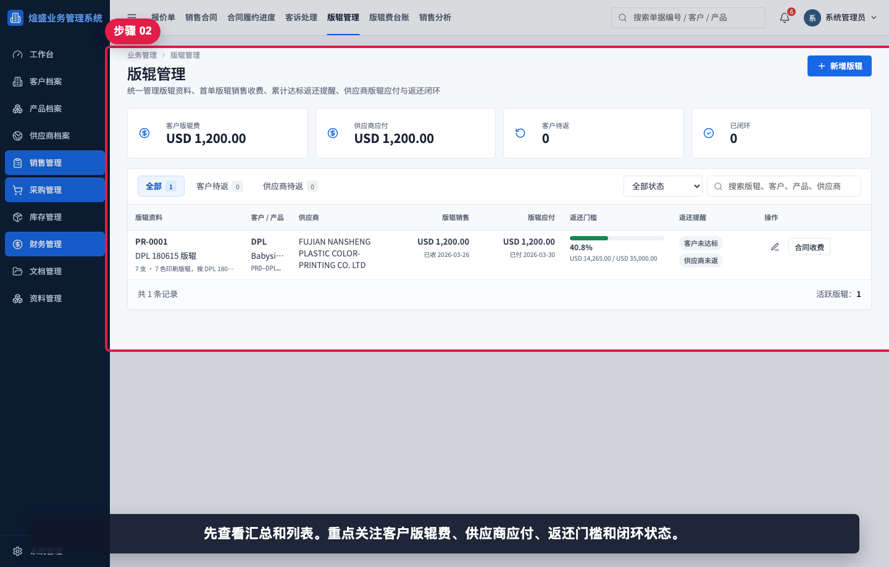

先查看汇总和列表。重点关注客户版辊费、供应商应付、返还门槛和闭环状态。

## 步骤 03：打开新增版辊

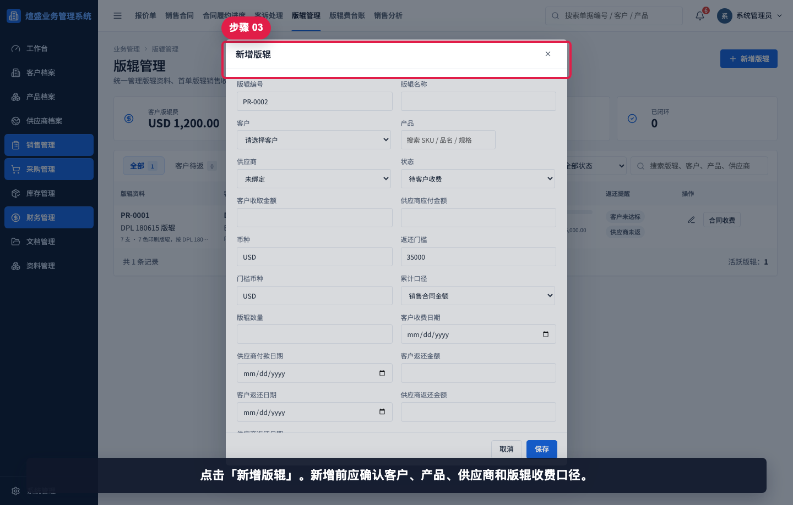

点击“新增版辊”。新增前应确认客户、产品、供应商和版辊收费口径。

## 步骤 04：填写版辊编号名称客户

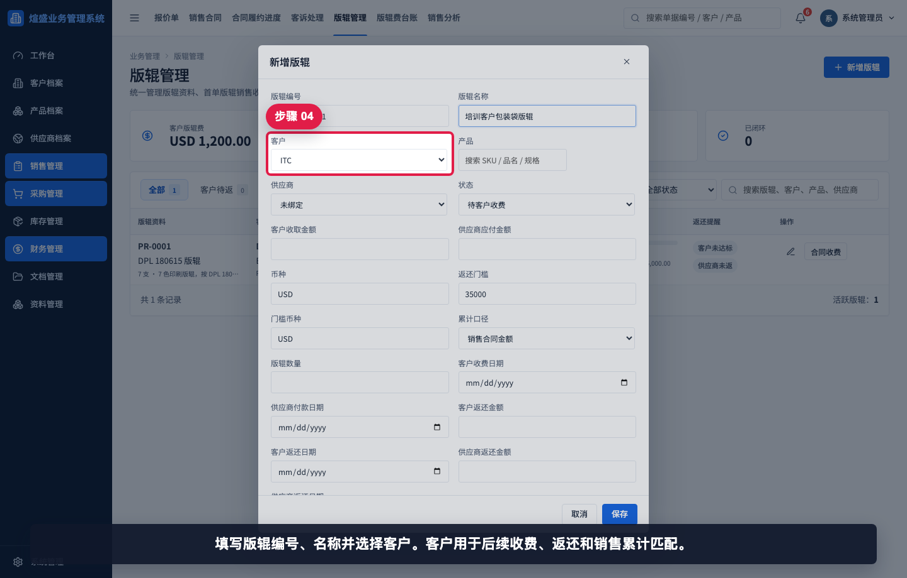

填写版辊编号、名称并选择客户。客户用于后续收费、返还和销售累计匹配。

## 步骤 05：选择产品和供应商

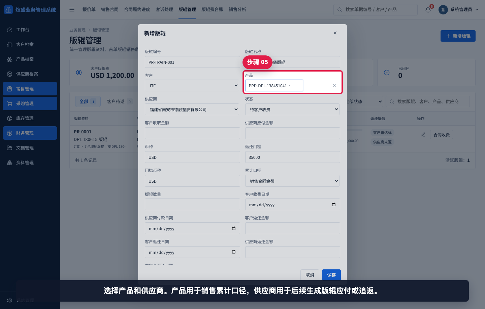

选择产品和供应商。产品用于销售累计口径，供应商用于后续生成版辊应付或追返。

## 步骤 06：填写收费和应付金额

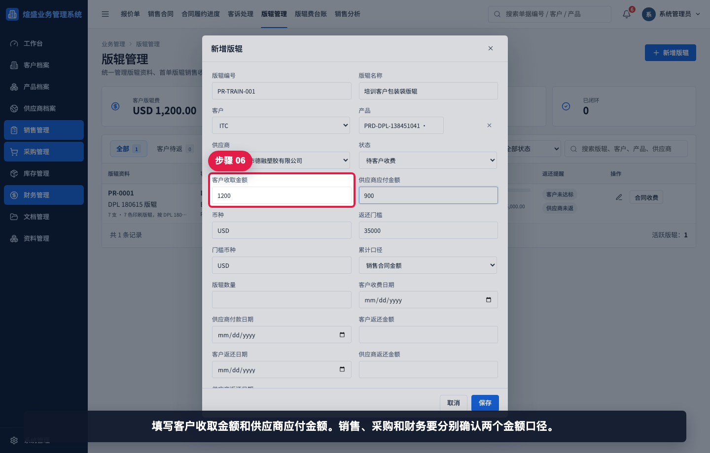

填写客户收取金额和供应商应付金额。销售、采购和财务要分别确认两个金额口径。

## 步骤 07：填写币种和返还门槛

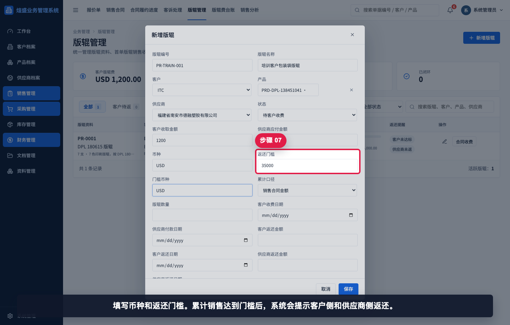

填写币种和返还门槛。累计销售达到门槛后，系统会提示客户侧和供应商侧返还。

## 步骤 08：选择累计口径和数量

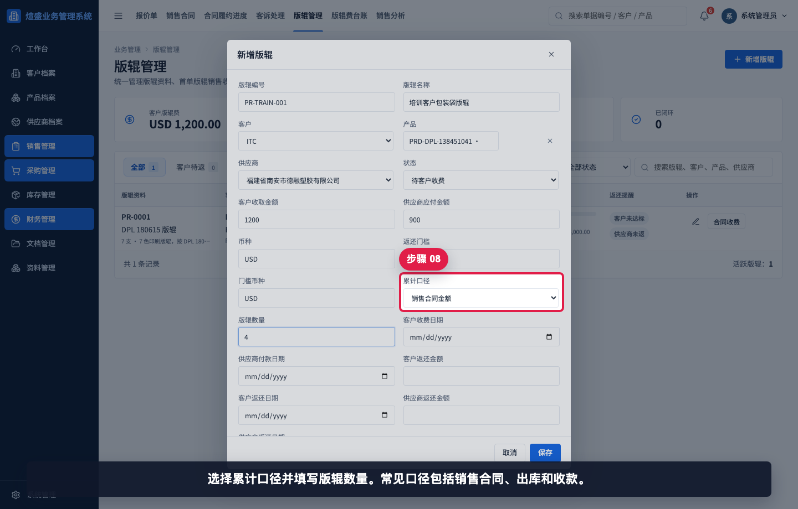

选择累计口径并填写版辊数量。常见口径包括销售合同、出库和收款。

## 步骤 09：填写收费付款日期

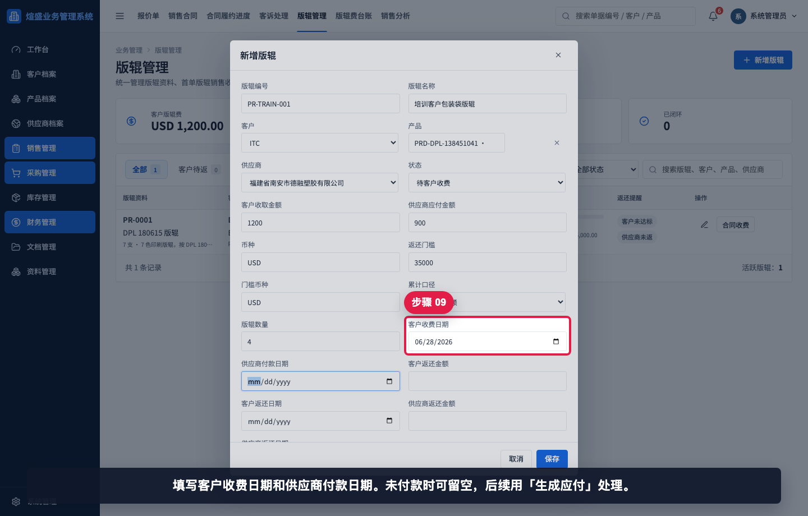

填写客户收费日期和供应商付款日期。未付款时可留空，后续用“生成应付”处理。

## 步骤 10：填写规格说明和备注

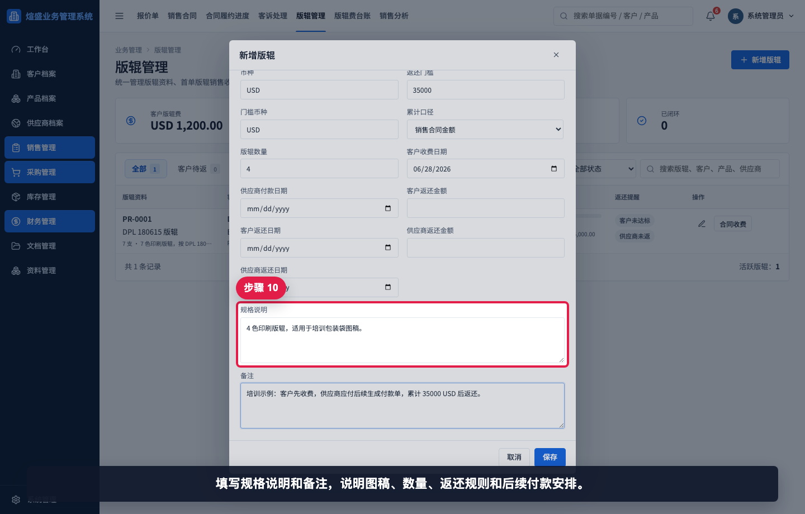

填写规格说明和备注，说明图稿、数量、返还规则和后续付款安排。

## 步骤 11：保存后查看版辊记录

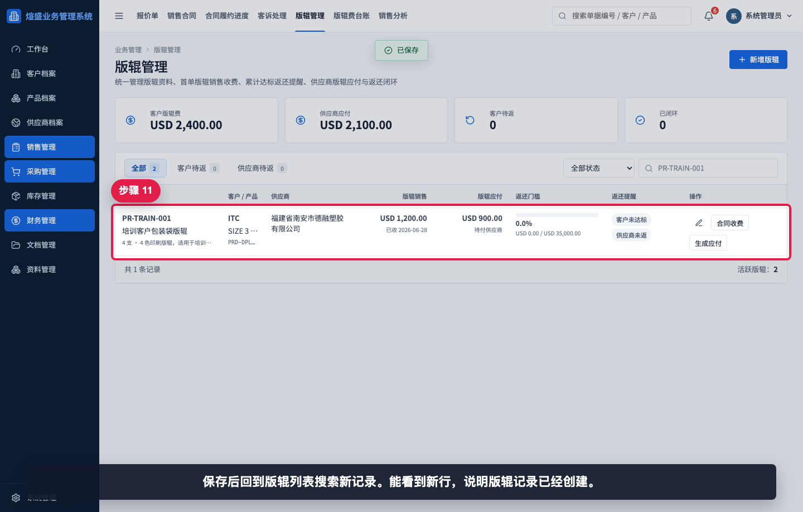

保存后回到版辊列表搜索新记录。能看到新行，说明版辊记录已经创建。

## 相关教程

- [如何创建新产品](../../基础资料/创建新产品/README.md)
- [如何创建销售合同](../../销售管理/创建销售合同/README.md)
- [如何从销售发票生成收款单](../../财务管理/销售发票生成收款单/README.md)
- [如何从采购发票生成付款单](../../财务管理/采购发票生成付款单/README.md)
- [例外业务与专题报表截图指引](../../exceptions-reports/README.md)

## 常见错误

- 只在产品档案写了版辊费，没有创建版辊记录，导致返还和供应商应付无法跟踪。
- 产品选错，后续累计金额无法匹配实际销售。
- 客户收取金额和供应商应付金额混用。
- 返还门槛币种和业务金额币种不一致。
- 供应商未绑定，后续无法生成版辊应付或追返。
- 未填写规格说明，后续无法确认版辊对应图稿或数量。

## 保存前检查清单

- 客户、产品、供应商是否正确。
- 版辊编号和名称是否唯一、易识别。
- 客户收取金额、供应商应付金额、币种是否已确认。
- 返还门槛、门槛币种和累计口径是否与协议一致。
- 版辊数量、规格说明和备注是否足够支持后续追溯。
