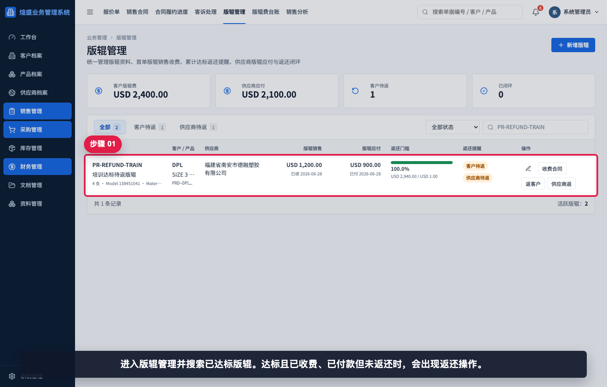
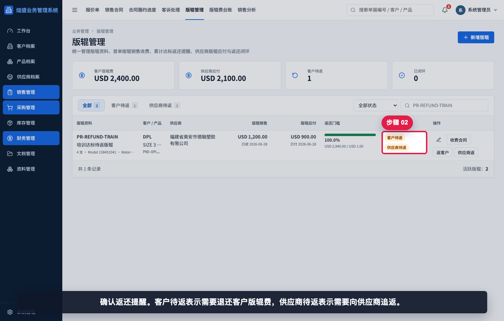
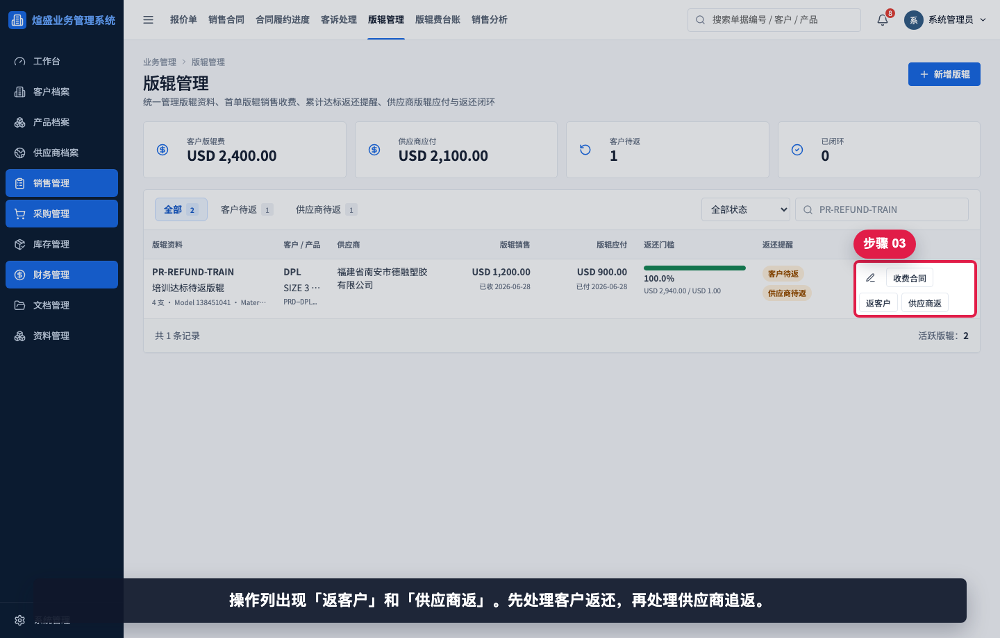
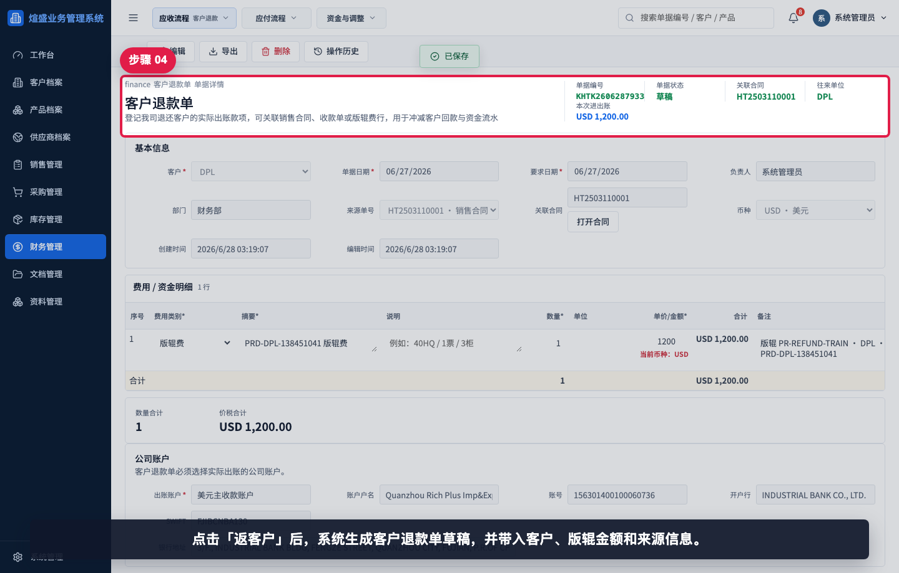
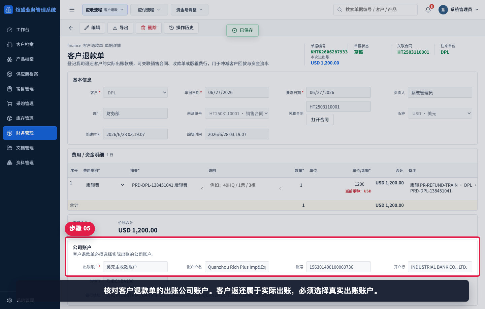
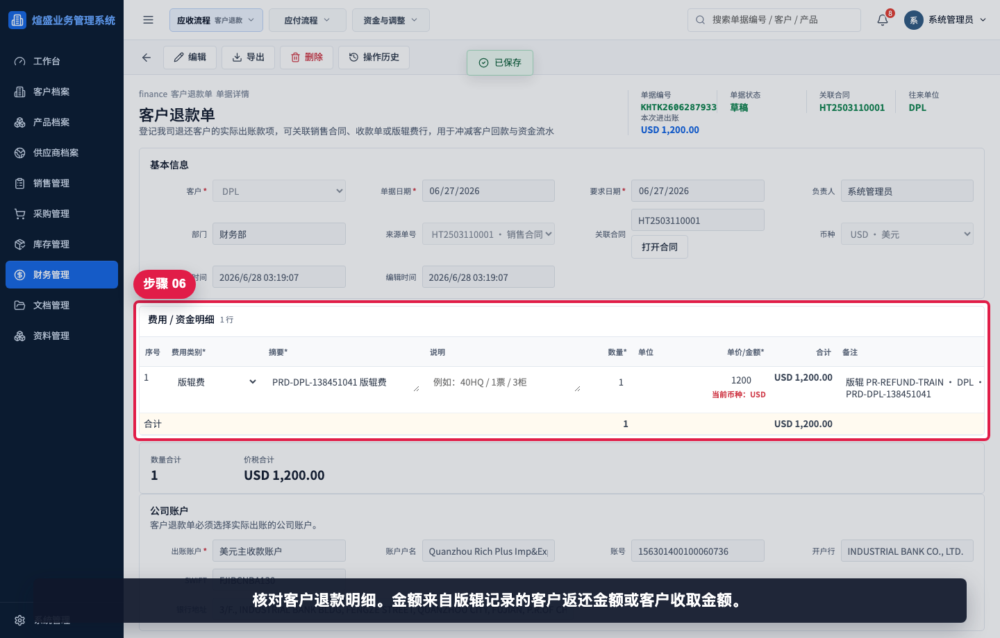
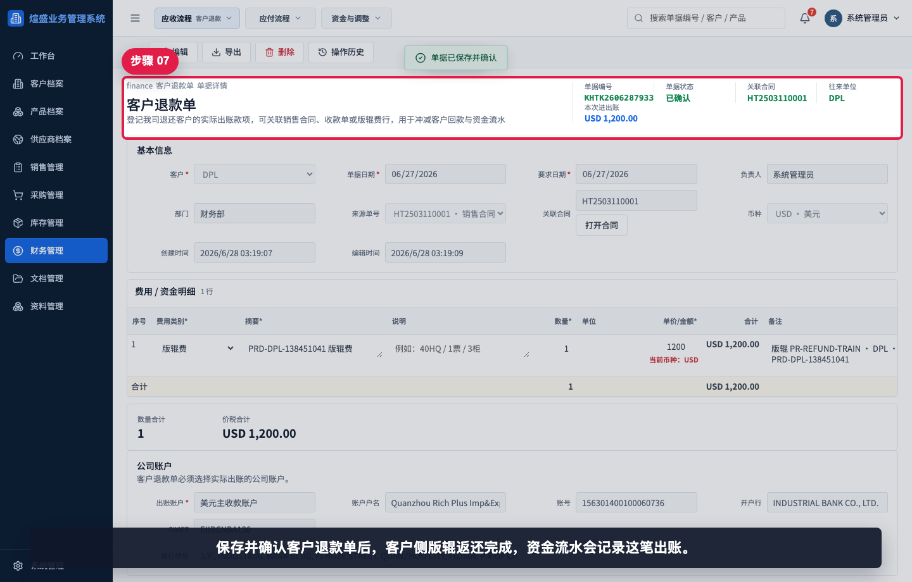
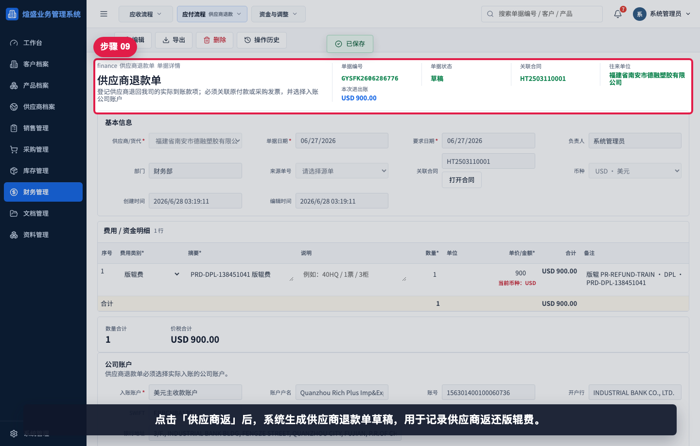
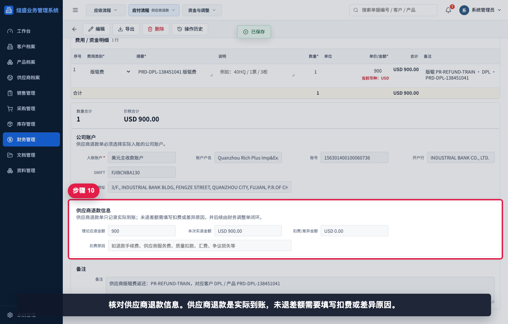
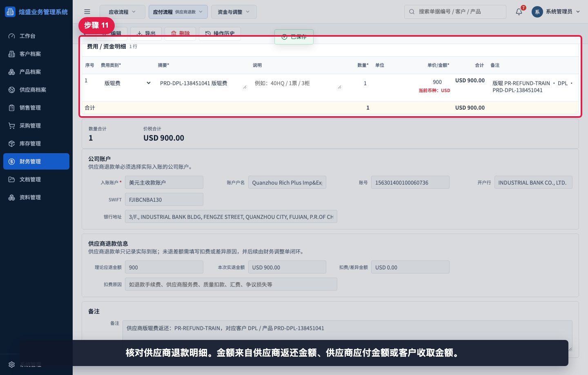

# 如何处理版辊返还

本指引用于培训销售、采购和财务用户处理版辊返还。版辊达到返还门槛后，系统会提示客户待返和供应商待返；客户返还通常生成客户退款单，供应商追返通常生成供应商退款单。

## 适用场景

- 客户累计销售金额已达到版辊返还门槛。
- 客户侧需要退还已收取的版辊费。
- 供应商侧需要追返已支付的版辊费。
- 财务需要分别记录客户出账和供应商入账。
- 管理层需要检查版辊是否真正闭环。

## 返还方向说明

| 方向 | 生成单据 | 资金方向 | 说明 |
|---|---|---|---|
| 返客户 | 客户退款单 | 我司出账 | 退还客户版辊费 |
| 供应商返 | 供应商退款单 | 我司入账 | 供应商退回或返还版辊费 |

## 步骤 01：进入并搜索达标版辊

进入版辊管理并搜索已达标版辊。达标且已收费、已付款但未返还时，会出现返还操作。

## 步骤 02：确认客户和供应商返还提醒

确认返还提醒。客户待返表示需要退还客户版辊费，供应商待返表示需要向供应商追返。

## 步骤 03：确认返还操作按钮

操作列出现“返客户”和“供应商返”。先处理客户返还，再处理供应商追返。

## 步骤 04：生成客户退款单草稿

点击“返客户”后，系统生成客户退款单草稿，并带入客户、版辊金额和来源信息。

## 步骤 05：核对客户退款金额和账户

核对客户退款单的出账公司账户。客户返还属于实际出账，必须选择真实出账账户。

## 步骤 06：核对客户退款明细

核对客户退款明细。金额来自版辊记录的客户返还金额或客户收取金额。

## 步骤 07：保存客户退款单

保存并确认客户退款单后，客户侧版辊返还完成，资金流水会记录这笔出账。

## 步骤 08：回到版辊管理处理供应商返还

回到版辊管理。客户返还完成后，继续处理供应商追返。

## 步骤 09：生成供应商退款单草稿

点击“供应商返”后，系统生成供应商退款单草稿，用于记录供应商返还版辊费。

## 步骤 10：核对供应商退款信息

核对供应商退款信息。供应商退款是实际到账，未退差额需要填写扣费或差异原因。

## 步骤 11：核对供应商退款明细

核对供应商退款明细。金额来自供应商返还金额、供应商应付金额或客户收取金额。

## 步骤 12：保存供应商退款单

保存并确认供应商退款单后，供应商侧追返完成，后续可回版辊管理检查闭环状态。

## 相关教程

- [如何创建版辊记录](../创建版辊记录/README.md)
- [如何生成版辊应付](../生成版辊应付/README.md)
- [如何创建客户退款单](../../财务管理/创建客户退款单/README.md)
- [如何创建供应商退款单](../../财务管理/创建供应商退款单/README.md)
- [如何查看资金流水](../../看板报表/查看资金流水/README.md)

## 常见错误

- 只处理客户返还，忘记向供应商追返。
- 客户退款单或供应商退款单保存为草稿，未进入资金流水。
- 公司账户选择错误，导致资金流水账户不准确。
- 达标依据未核对，就直接发起返还。
- 供应商未退全额但没有填写扣费或差异原因。

## 保存前检查清单

- 版辊是否已达到返还门槛。
- 客户返还金额是否与协议一致。
- 供应商返还金额是否与供应商应付或追返协议一致。
- 两张退款单的公司账户是否正确。
- 客户退款单和供应商退款单是否都保存并确认。
