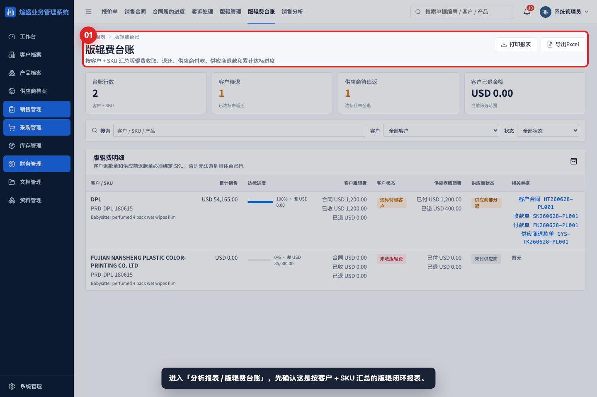
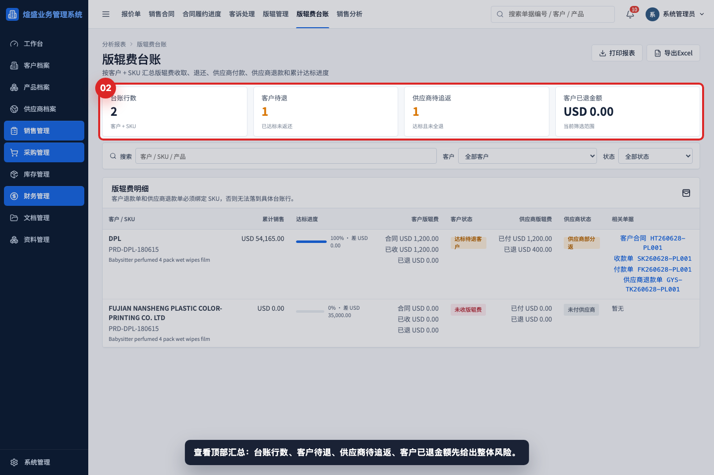
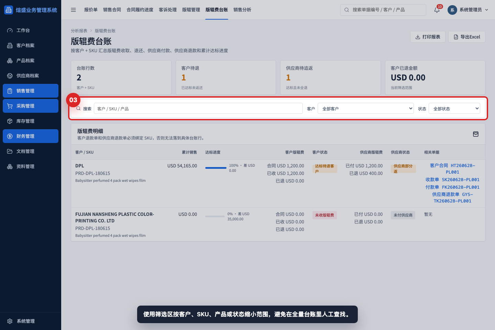
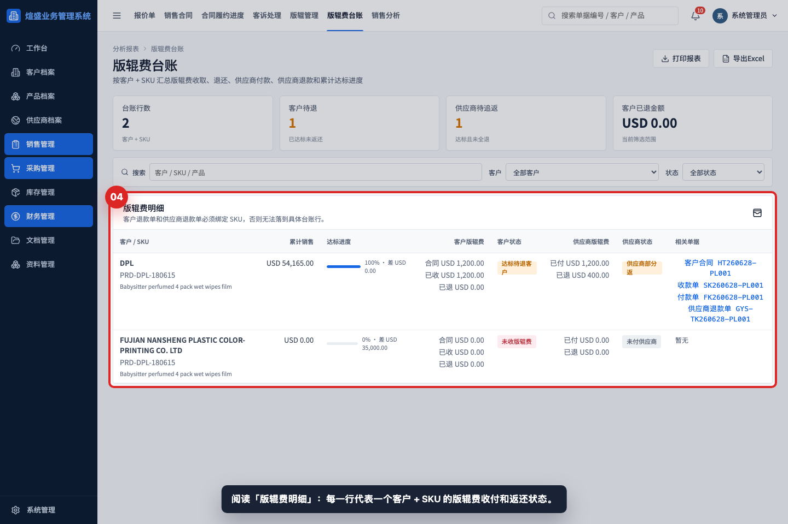
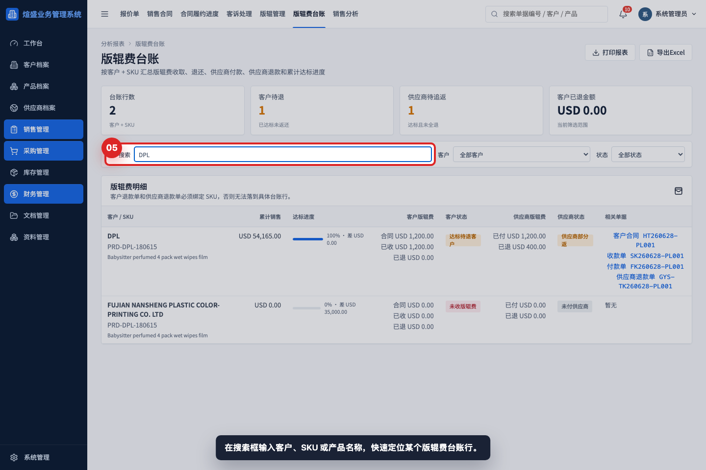
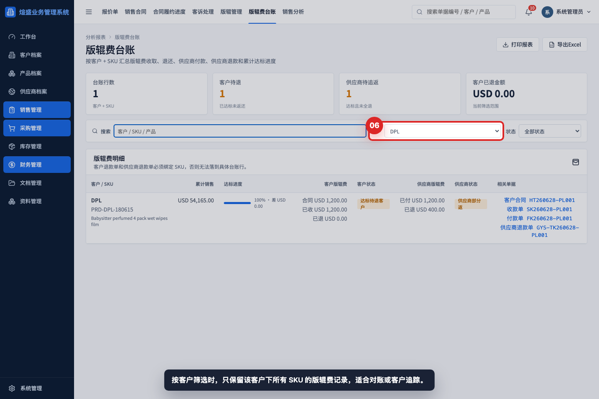
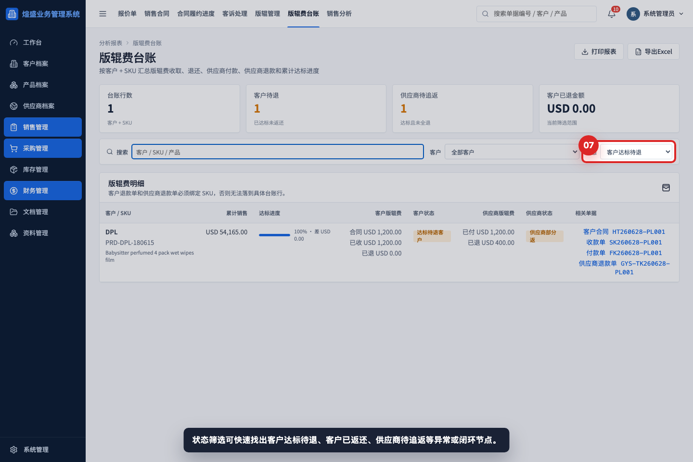
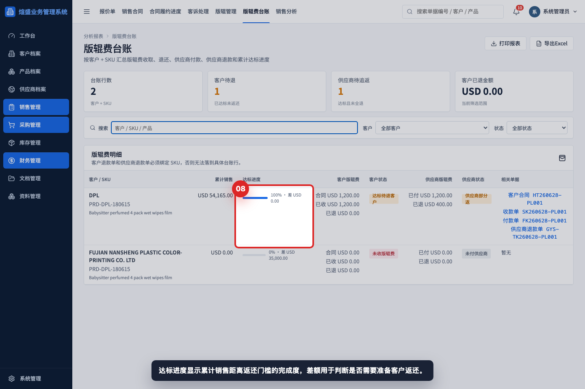
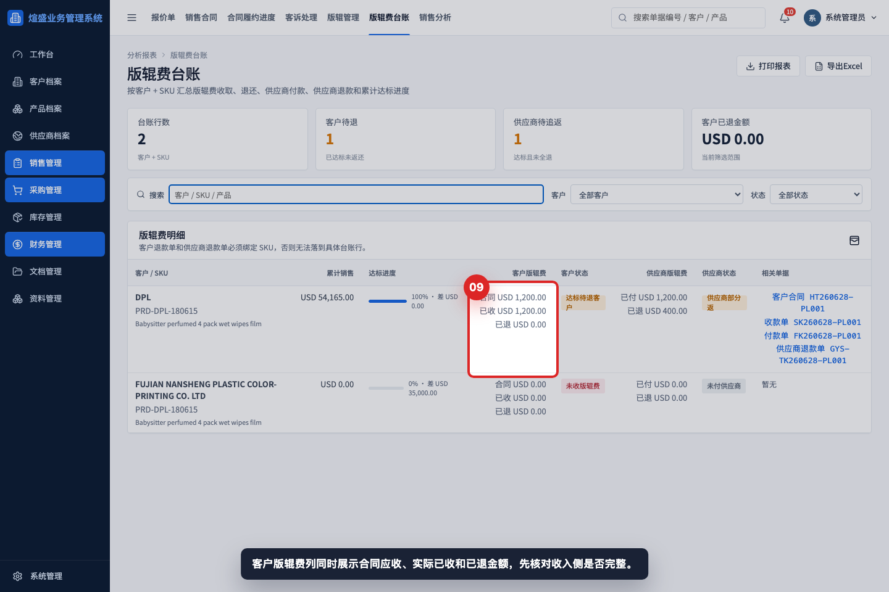
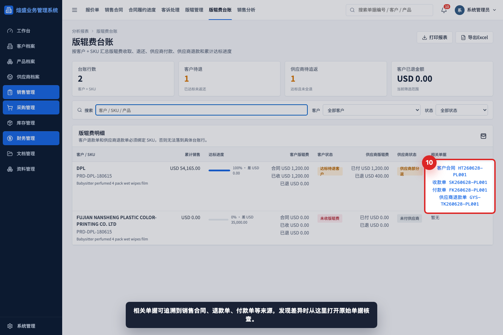

# 如何查看版辊费台账

本教程用于指导销售、采购、财务和管理层查看版辊费收入、供应商支出、返还门槛和未闭环项目。版辊费台账不是录入入口，而是核对入口；录入动作应分别在销售合同、收款单、付款单、客户退款单、供应商退款单或版辊记录里完成。

## 适用场景

- 客户订单累计达到返还门槛，需要确认是否应退还客户版辊费。
- 已向供应商支付版辊费，需要确认是否可以向供应商追返。
- 财务月末核对版辊费收取、付款、退款和未闭环差额。
- 业务或采购发现版辊费状态异常，需要追溯来源单据。
- 管理层查看版辊专题风险：客户待退、供应商待追返、客户已退金额。

## 字段说明

| 区域 | 字段 | 填写或查看方式 |
|---|---|---|
| 汇总指标 | 台账行数 | 当前筛选条件下的客户 + SKU 行数。 |
| 汇总指标 | 客户待退 | 产品已达标、客户版辊费已收或已列入合同，但尚未返还客户的行数。 |
| 汇总指标 | 供应商待追返 | 已向供应商支付版辊费，且达标后尚未完全追回的行数。 |
| 汇总指标 | 客户已退金额 | 当前筛选范围内客户退款单已登记的版辊返还金额。 |
| 筛选区 | 搜索 | 可输入客户、SKU、产品名称或状态关键字。 |
| 筛选区 | 客户 | 只查看某个客户下所有 SKU 的版辊费记录。 |
| 筛选区 | 状态 | 可筛选客户达标待退、客户已返还、供应商待追返、供应商已返、未收版辊费。 |
| 明细表 | 客户 / SKU | 一行代表一个客户 + 一个产品 SKU。 |
| 明细表 | 累计销售 | 有效客户合同中该 SKU 的累计销售金额。 |
| 明细表 | 达标进度 | 累计销售金额 / 产品版辊返还门槛。 |
| 明细表 | 客户版辊费 | 合同已列、客户已收、客户已退三类金额。 |
| 明细表 | 客户状态 | 判断客户侧是否未收、已收、达标待退、部分返还或已返还。 |
| 明细表 | 供应商版辊费 | 已付供应商和供应商已退金额。 |
| 明细表 | 供应商状态 | 判断供应商侧是否未付、已付未达标、待追返、部分返或已返。 |
| 明细表 | 相关单据 | 打开来源销售合同、收款单、付款单、退款单继续核查。 |

## 操作步骤

### 步骤 01：进入版辊费台账

从分析报表进入「版辊费台账」。页面标题下方说明本报表按客户 + SKU 汇总版辊费收取、退还、供应商付款、供应商退款和累计达标进度。

### 步骤 02：查看汇总指标

先看顶部四个指标。客户待退和供应商待追返通常是优先处理对象；客户已退金额用于核对当前筛选范围内已经返还客户的总额。

### 步骤 03：查看筛选条件

筛选区用于缩小核对范围。常用顺序是先输入客户或 SKU，再根据客户和状态进一步收窄。

### 步骤 04：查看版辊费明细

明细表按客户 + SKU 展示。不要只看客户名称，同一客户可能有多个 SKU，每个 SKU 的版辊门槛、收费和返还状态都可能不同。

### 步骤 05：搜索客户、SKU 或产品

在搜索框输入客户名、SKU 编码或产品名称。适合快速定位某一个版辊费项目，例如客户来问某个产品是否已达到返还条件。

### 步骤 06：按客户筛选

选择客户后，页面只显示该客户相关 SKU。客户对账时建议先使用客户筛选，再导出 Excel 或逐行打开相关单据。

### 步骤 07：按状态筛选

状态筛选用于处理待办和异常。优先查看「客户达标待退」和「供应商待追返」，这两类通常表示业务已经触发返还条件但尚未完全闭环。

### 步骤 08：查看达标进度

达标进度显示累计销售距离返还门槛的完成度。达到 100% 后，如果客户版辊费已收或合同已列，应继续核对是否需要创建客户退款单。

### 步骤 09：核对客户版辊费

客户版辊费需要同时看三项：合同、已收、已退。合同金额说明销售合同中已列版辊费；已收金额说明收款单已登记；已退金额说明客户退款单已返还。

### 步骤 10：追溯相关单据

相关单据用于追溯来源。金额异常时先打开销售合同、收款单、付款单或退款单核查 SKU、版辊费行和状态，不要直接在台账页修改。

## 状态判断

- 未收版辊费：产品需要版辊费，但客户合同或收款单没有登记版辊费行。
- 已收/已列版辊费：客户合同或收款单已有版辊费，但累计销售尚未达到返还门槛。
- 达标待退客户：累计销售已达到门槛，且客户侧尚未登记客户退款单。
- 客户部分返还：已有客户退款单，但退款金额小于应返金额。
- 客户已返还：客户侧已登记退款。
- 未付供应商：尚未登记供应商版辊付款。
- 已付未达标：供应商版辊费已支付，但客户累计销售还未达门槛。
- 供应商待追返：已达标且已付供应商，但尚未登记供应商退款。
- 供应商部分返：供应商已退部分金额，仍有差额。
- 供应商已返：供应商侧退款已登记。

## 常见错误

- 只创建版辊记录，没有在产品中维护版辊费配置，台账可能无法判断返还门槛。
- 客户退款单或供应商退款单没有绑定 SKU 或版辊费行，金额无法落到具体台账行。
- 把客户返还登记成收款单或费用单，导致客户状态不闭环。
- 只看客户待退，忽略供应商待追返，造成供应商侧资金未追回。
- 同一客户多个 SKU 混在一起核对，误把一个 SKU 的达标进度当成全部产品达标。
- 未确认单据状态。草稿或作废单据不会作为有效台账来源。

## 保存前检查清单

- 产品档案已维护版辊费、币种、数量、单价和返还门槛。
- 销售合同或收款单中的版辊费行已绑定正确 SKU。
- 付款单中的版辊费行已绑定正确 SKU，并能关联到客户合同。
- 客户退款单用于登记退还客户的版辊费。
- 供应商退款单用于登记供应商返还我司的版辊费。
- 台账中客户状态和供应商状态与实际处理结果一致。
- 需要对外或内部留档时，导出 Excel 前先确认筛选范围。

## 相关教程

- [如何创建版辊记录](../创建版辊记录/README.md)
- [如何生成版辊应付](../生成版辊应付/README.md)
- [如何处理版辊返还](../处理版辊返还/README.md)
- [如何创建客户退款单](../../财务管理/创建客户退款单/README.md)
- [如何创建供应商退款单](../../财务管理/创建供应商退款单/README.md)
