# 如何生成版辊应付

本指引用于培训采购、财务或管理用户从版辊管理生成供应商付款单。版辊记录绑定供应商并维护供应商应付金额后，可以直接生成付款单草稿，再由财务核对公司账户并保存确认。

## 适用场景

- 供应商已制作版辊，需要形成应付或付款单。
- 版辊记录中已维护供应商和供应商应付金额。
- 财务需要从版辊管理追溯付款来源。
- 需要把版辊费纳入资金流水和应付闭环。

## 前置条件

- 版辊记录已创建。
- 版辊记录已绑定供应商。
- 供应商应付金额和币种已确认。
- 公司账户已维护，并能按币种带出实际出账账户。

## 步骤 01：进入版辊管理

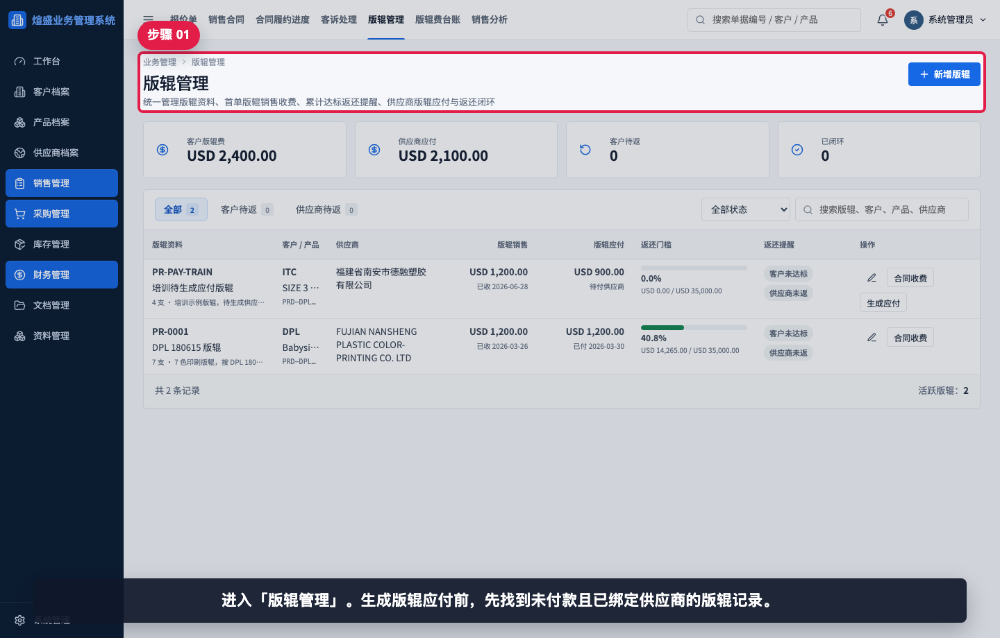

进入“版辊管理”。生成版辊应付前，先找到未付款且已绑定供应商的版辊记录。

## 步骤 02：搜索待生成应付版辊

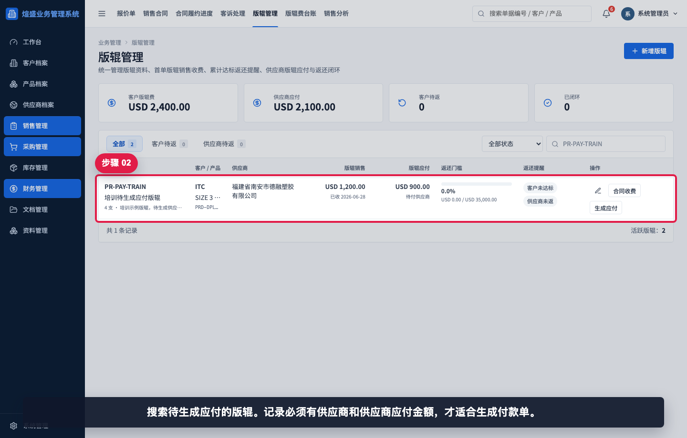

搜索待生成应付的版辊。记录必须有供应商和供应商应付金额，才适合生成付款单。

## 步骤 03：确认生成应付按钮

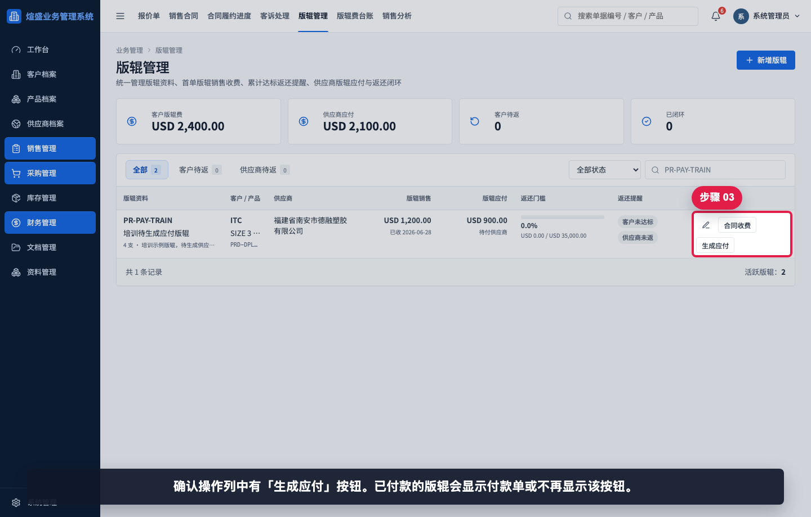

确认操作列中有“生成应付”按钮。已付款的版辊会显示付款单或不再显示该按钮。

## 步骤 04：生成付款单草稿

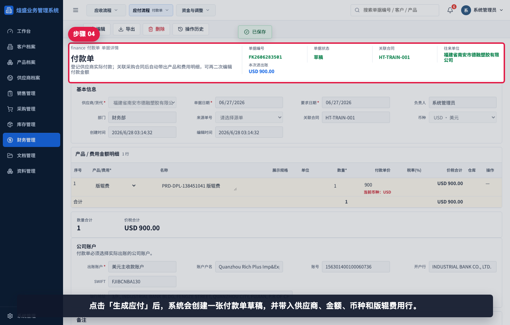

点击“生成应付”后，系统会创建一张付款单草稿，并带入供应商、金额、币种和版辊费用行。

## 步骤 05：核对付款单基本信息

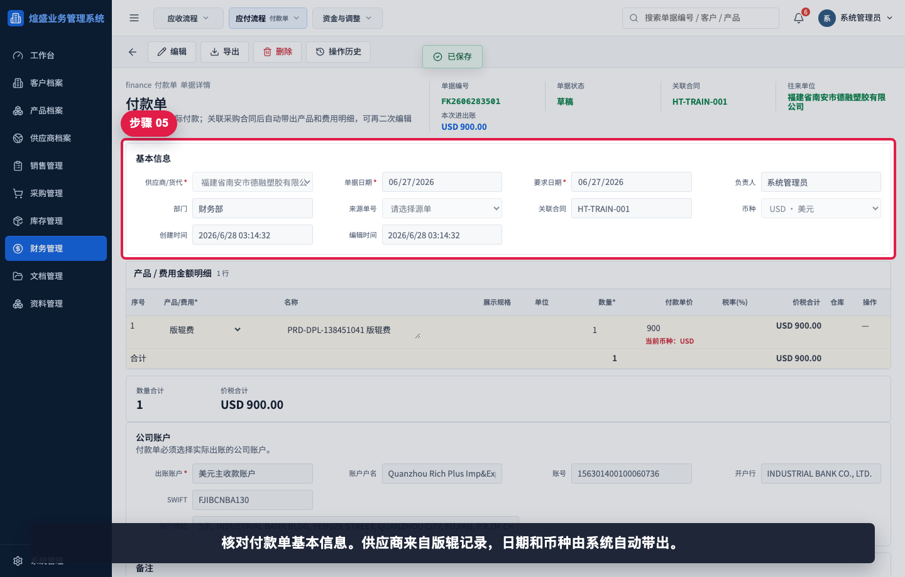

核对付款单基本信息。供应商来自版辊记录，日期和币种由系统自动带出。

## 步骤 06：核对公司账户

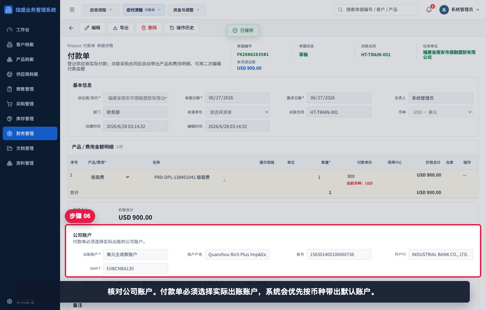

核对公司账户。付款单必须选择实际出账账户，系统会优先按币种带出默认账户。

## 步骤 07：核对版辊费用行

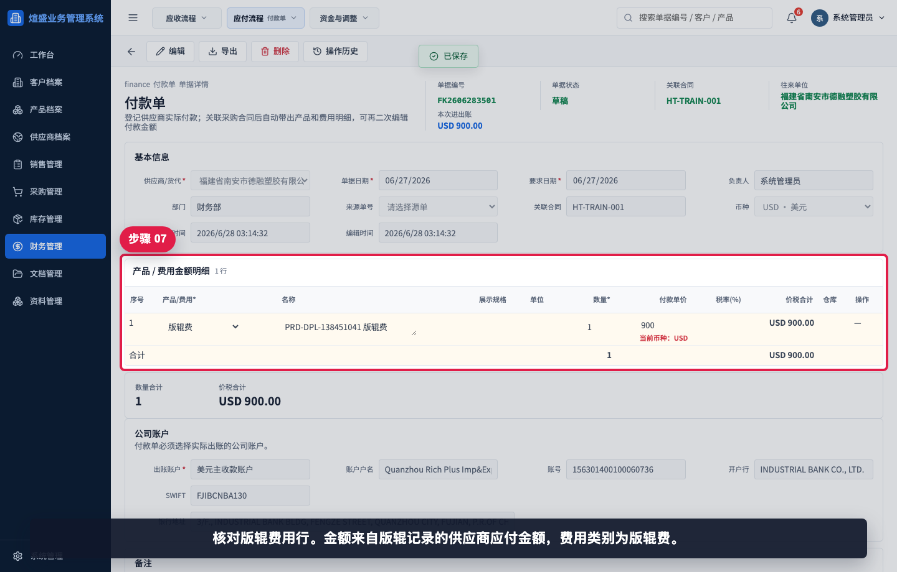

核对版辊费用行。金额来自版辊记录的供应商应付金额，费用类别为版辊费。

## 步骤 08：核对备注和来源

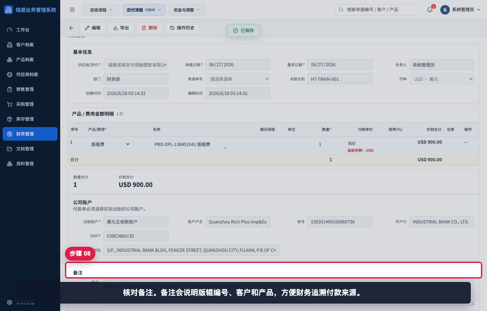

核对备注。备注会说明版辊编号、客户和产品，方便财务追溯付款来源。

## 步骤 09：进入付款单编辑模式

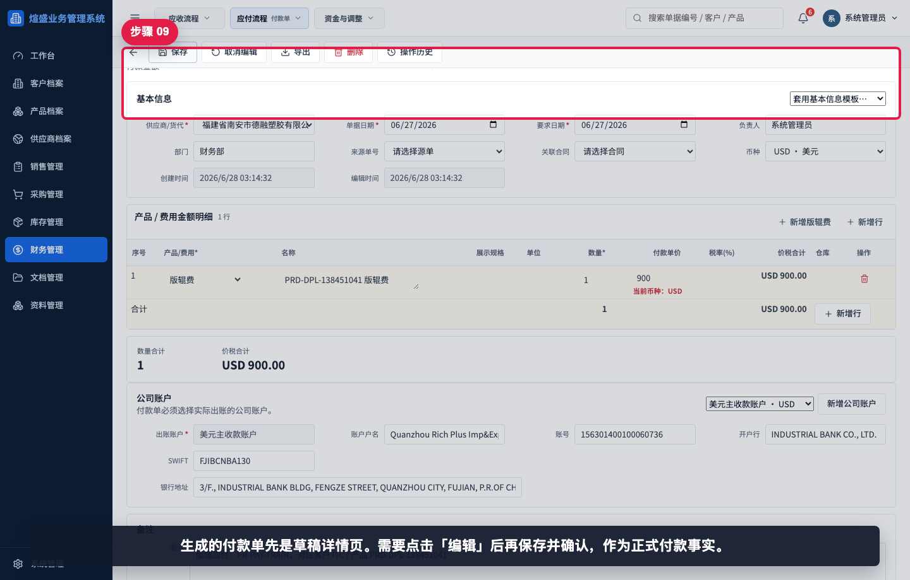

生成的付款单先是草稿详情页。需要点击“编辑”后再保存并确认，作为正式付款事实。

## 步骤 10：选择保存状态

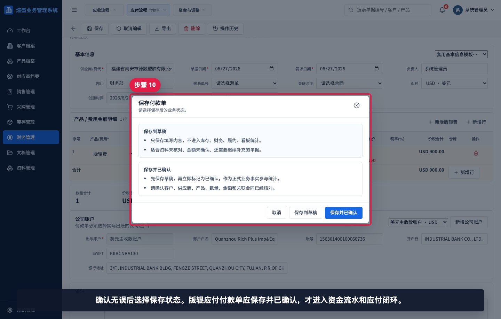

确认无误后选择保存状态。版辊应付付款单应保存并已确认，才进入资金流水和应付闭环。

## 步骤 11：保存后确认付款单

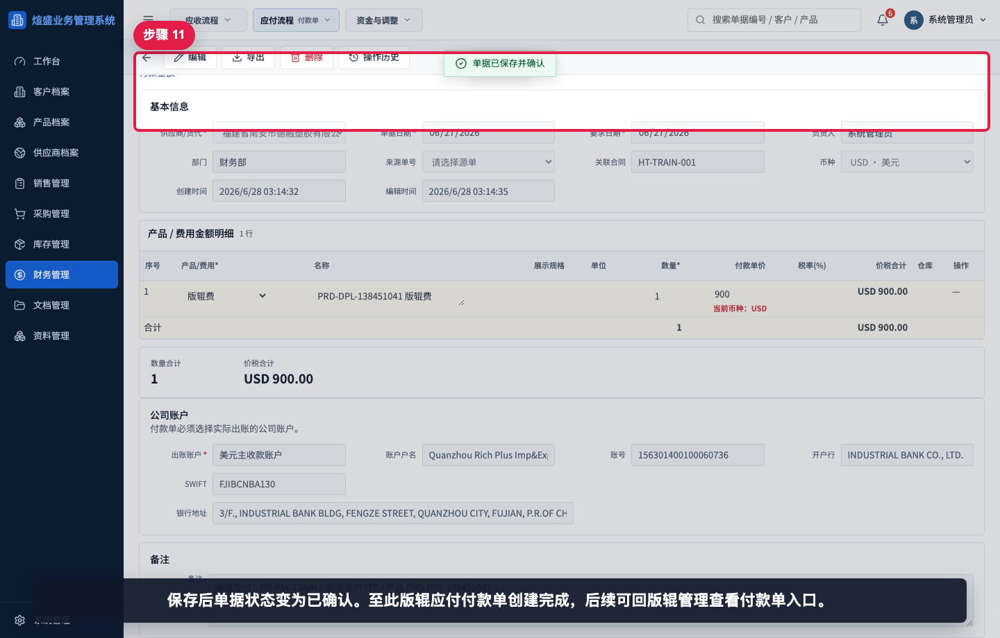

保存后单据状态变为已确认。至此版辊应付付款单创建完成，后续可回版辊管理查看付款单入口。

## 相关教程

- [如何创建版辊记录](../创建版辊记录/README.md)
- [如何维护公司账户](../../资料管理/维护公司账户/README.md)
- [如何从采购发票生成付款单](../../财务管理/采购发票生成付款单/README.md)
- [如何查看资金流水](../../看板报表/查看资金流水/README.md)

## 常见错误

- 版辊没有绑定供应商，无法生成供应商付款单。
- 供应商应付金额未维护，生成后金额口径不正确。
- 生成付款单后未核对公司账户。
- 付款单仍停留在草稿，未保存并确认，导致没有进入资金流水。
- 把客户版辊收费和供应商应付金额混用。

## 保存前检查清单

- 版辊记录是否绑定正确供应商。
- 供应商应付金额、币种是否已由采购和财务确认。
- 付款单公司账户是否为实际出账账户。
- 费用行是否为版辊费，金额是否正确。
- 备注是否能追溯版辊编号、客户和产品。
