# 如何查看供应商生产完成看板

本指引用于培训采购、仓库和管理层查看供应商生产完成、待入库和已入库状态。示例采用德融采购合同，覆盖进入供应商生产完成看板、理解生产完成口径、使用筛选和搜索、读取采购数量/生产完成/待入库/已入库、打开提货通知单、打开采购入库单，以及回到采购合同追溯来源。

## 适用场景

- 供应商通知货物已生产完成，需要采购登记或跟进提货。
- 仓库需要知道哪些货已经 ready，但还没有实际入库。
- 采购需要区分“供应商已完成生产”和“仓库已入库”。
- 管理层查看采购合同中哪些 SKU 仍处于待入库状态。
- 从看板追溯提货通知、采购入库单和采购合同原始记录。

## 核心口径

| 看板项 | 含义 | 数据来源 |
|---|---|---|
| SKU 行数 | 当前筛选条件下的采购 SKU 行数 | 采购合同明细 |
| 采购数量 | 采购合同中的采购数量 | 已确认采购合同 |
| 生产完成 | 供应商已 ready / 可提货数量 | 已确认提货通知单 |
| 待入库 | 生产完成数量减去已入库数量 | 提货通知单 - 采购入库单 |
| 已入库 | 仓库已经实际入库数量 | 已确认采购入库单 |

关键规则：

```text
提货通知单 = 供应商已生产完成 / 待提货
待入库 = 生产完成数量 - 已入库数量
采购入库单 = 库存增加事实
```

## 步骤 01：进入供应商生产完成看板

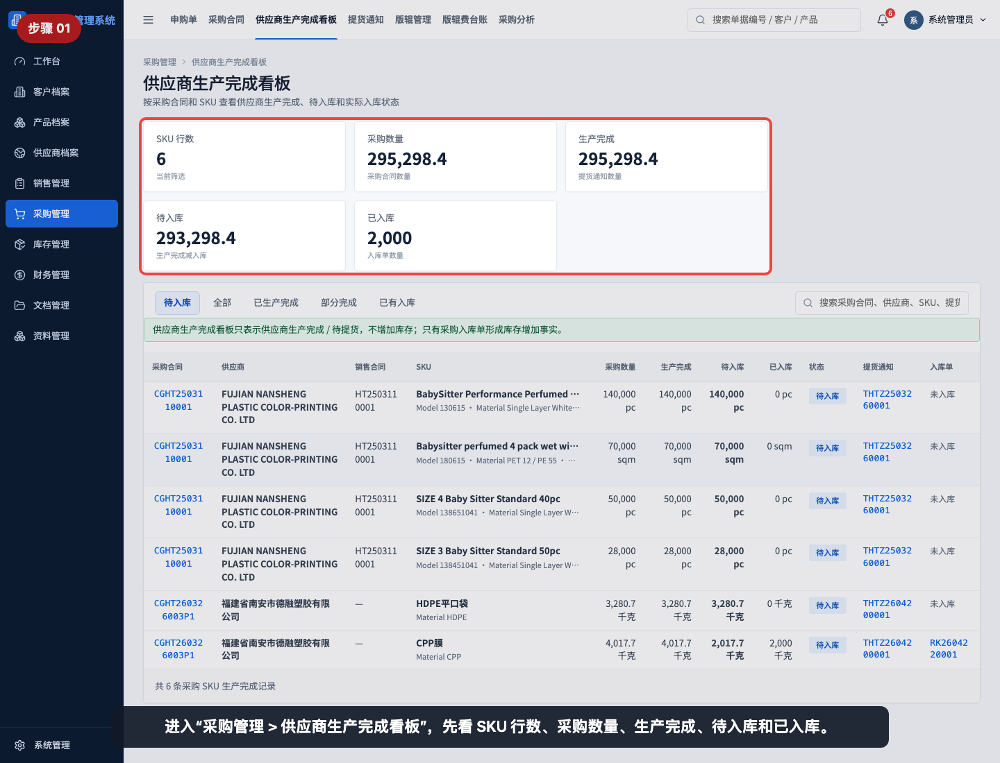

进入“采购管理 > 供应商生产完成看板”，先看 SKU 行数、采购数量、生产完成、待入库和已入库。

## 步骤 02：理解生产完成口径

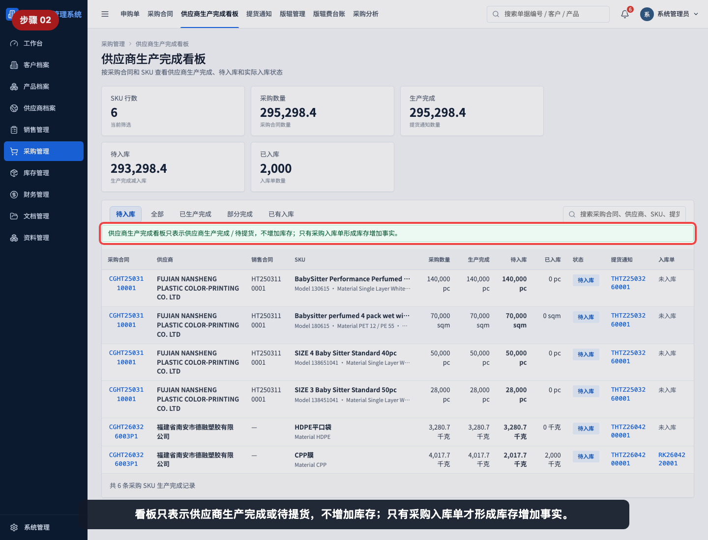

注意页面提示：供应商生产完成看板只表示供应商生产完成或待提货，不增加库存；只有采购入库单才形成库存增加事实。

## 步骤 03：查看筛选标签

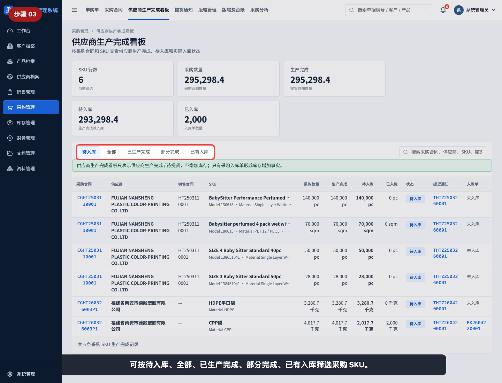

可按“待入库、全部、已生产完成、部分完成、已有入库”筛选采购 SKU。

筛选说明：

| 筛选 | 适合查看 |
|---|---|
| 待入库 | 已有提货通知但还没完全入库的 SKU |
| 全部 | 所有已确认采购合同 SKU |
| 已生产完成 | 已有提货通知的 SKU |
| 部分完成 | 生产完成数量小于采购数量的 SKU |
| 已有入库 | 已经产生采购入库单的 SKU |

## 步骤 04：搜索供应商或采购合同

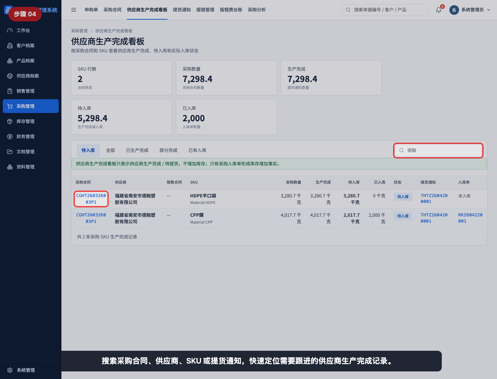

搜索采购合同、供应商、SKU 或提货通知，可以快速定位需要跟进的供应商生产完成记录。

## 步骤 05：读取采购和生产完成数量

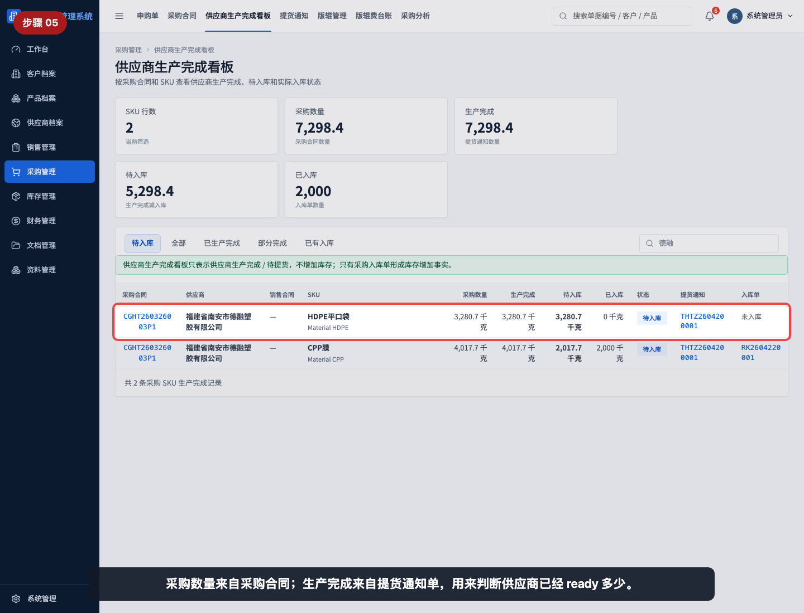

采购数量来自采购合同；生产完成来自提货通知单。采购可以用这两列判断供应商已经 ready 多少。

## 步骤 06：区分待入库和已入库

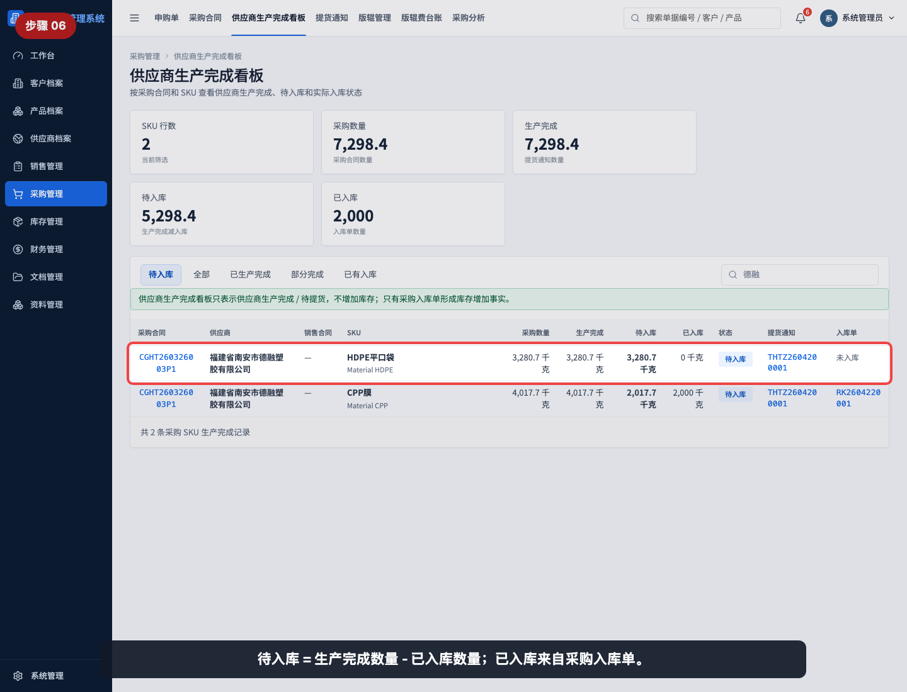

待入库 = 生产完成数量 - 已入库数量；已入库来自采购入库单。截图中同一采购合同下可以看到未入库和部分入库的 SKU 差异。

## 步骤 07：筛选已有入库记录

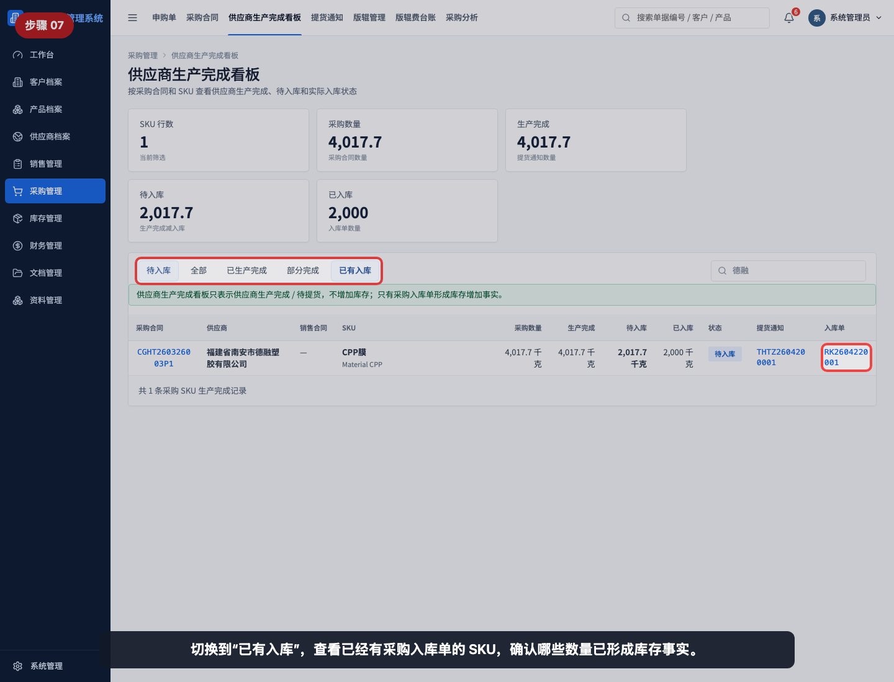

切换到“已有入库”，查看已经有采购入库单的 SKU，确认哪些数量已经形成库存事实。

## 步骤 08：筛选已生产完成记录

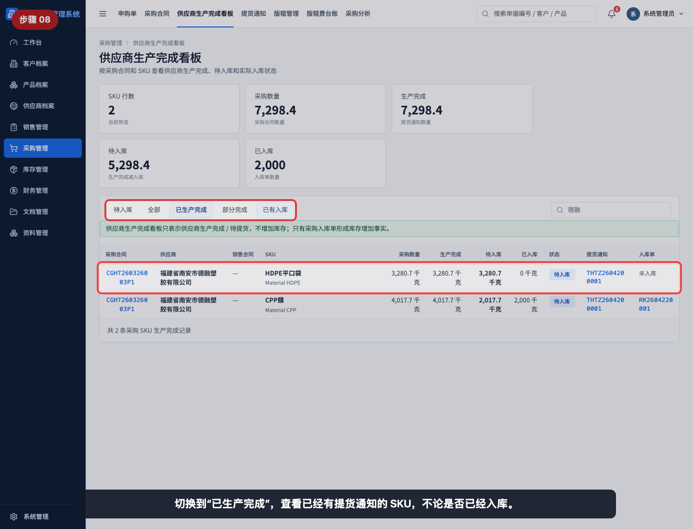

切换到“已生产完成”，查看已经有提货通知的 SKU，不论是否已经入库。

## 步骤 09：打开提货通知单

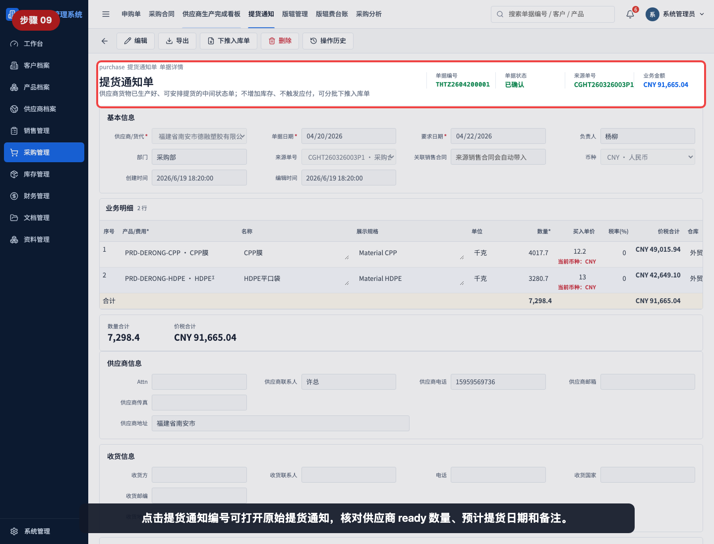

点击提货通知编号可打开原始提货通知，核对供应商 ready 数量、预计提货日期和备注。

## 步骤 10：打开采购入库单

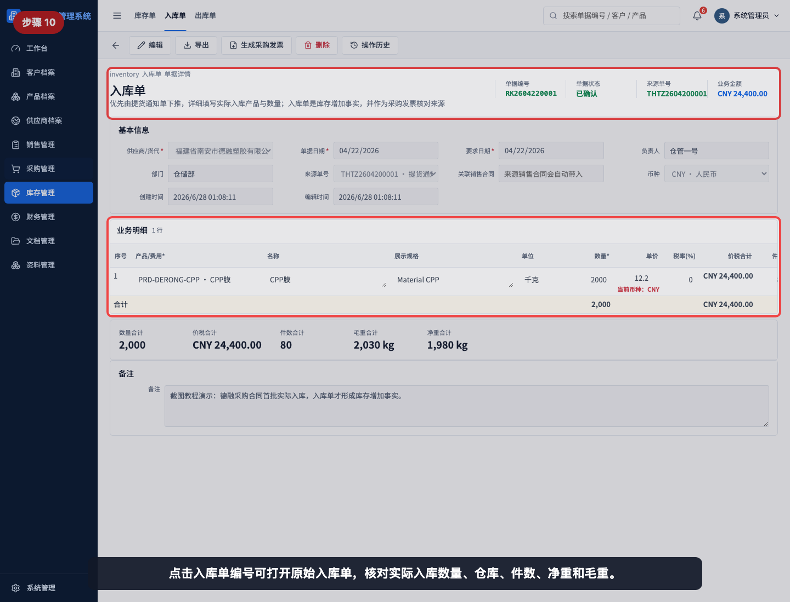

点击入库单编号可打开原始入库单，核对实际入库数量、仓库、件数、净重和毛重。

## 步骤 11：打开采购合同追溯来源

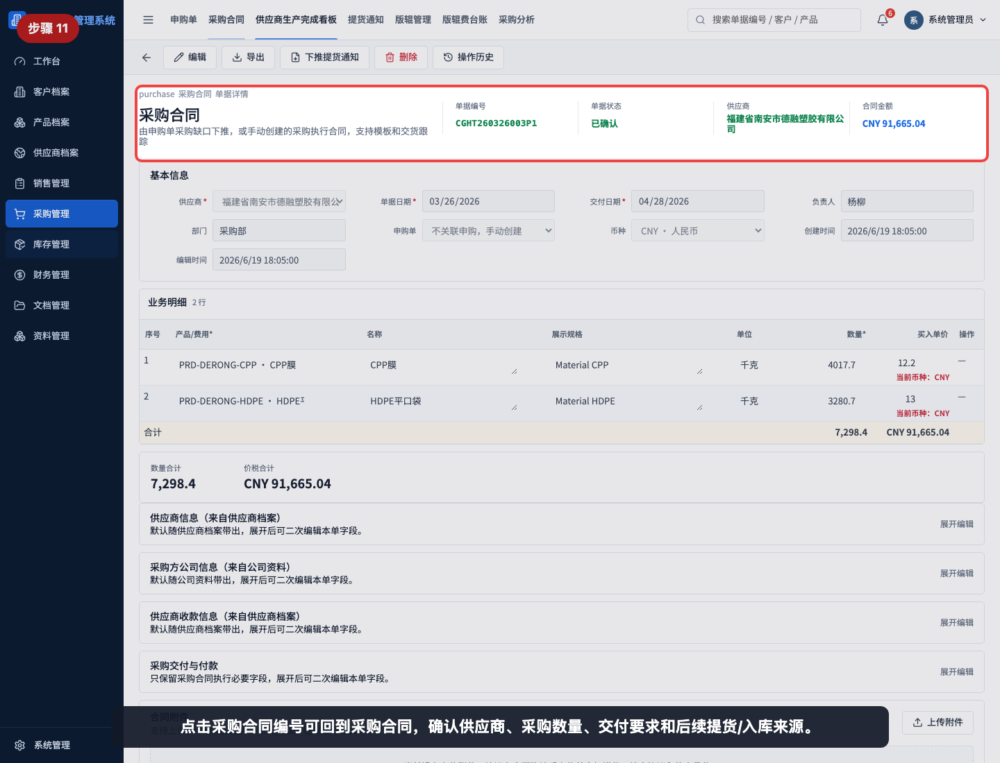

点击采购合同编号可回到采购合同，确认供应商、采购数量、交付要求和后续提货/入库来源。

## 常见误读

- 把“生产完成”理解为已经入库。生产完成只来自提货通知单，不增加库存。
- 看到“待入库”就认为仓库已经收货。待入库表示已 ready 但尚未完全形成入库单。
- 只看供应商维度，不按 SKU 判断某一项产品是否已经 ready。
- 不打开提货通知单核对预计提货日期和备注，导致采购、仓库交接不清楚。
- 不打开入库单核对实际入库数量、仓库和重量，导致库存事实无法确认。
- 在库存问题上只看生产完成看板，没有回到库存看板或采购入库单确认。

## 查看前检查清单

- 是否选择了正确筛选标签。
- 是否用供应商、采购合同或 SKU 搜索到目标记录。
- 是否区分采购数量、生产完成、待入库和已入库。
- 是否打开提货通知单核对 ready 来源。
- 是否打开采购入库单核对实际入库事实。
- 如果要确认库存数量，是否继续查看库存看板或库存单据。
