# 如何查看发票差异看板

本指引用于培训财务、销售、采购和管理层核对发票金额与源单金额是否一致。示例包含销售发票多开、采购发票少开、差异处理中和已闭环场景，帮助新用户理解差异金额、处理状态和后续闭环方式。

## 适用场景

- 销售发票金额与库存出库单金额不一致。
- 采购发票金额与采购入库单金额不一致。
- 需要跟进客户补款、客户退款、供应商折让、补开发票或红冲重开。
- 需要确认差异是否已经通过费用、退款或财务调整闭环。
- 月末结账前，需要导出发票差异明细给业务、采购或管理层复核。

## 核心口径

| 看板项 | 含义 | 数据来源 |
|---|---|---|
| 差异发票 | 当前筛选条件下存在差异或处理中状态的发票数量 | 销售发票、采购发票 |
| 发票多开 | 发票金额大于源单金额的合计 | 发票金额 - 源单金额 > 0 |
| 发票少开 | 发票金额小于源单金额的合计 | 发票金额 - 源单金额 < 0 |
| 处理中 | 状态为金额异常或差异处理中的发票数量 | 发票处理状态 |
| 发票类型 | 按销售发票或采购发票筛选 | 页面筛选项 |
| 差异明细 | 每张差异发票对应的源单、合同、往来单位、金额和处理方式 | 发票与源单关联关系 |

系统的差异计算公式：

```text
差异金额 = 发票金额 - 源单金额
正数：发票金额更高，通常叫发票多开
负数：发票金额更低，通常叫发票少开
销售发票对比库存出库单
采购发票对比采购入库单
```

顶部指标是当前筛选结果的合计，明细表显示每一张发票的单笔差异。两者口径一致，但数字不一定相同。

## 步骤 01：进入发票差异看板


进入“财务管理 > 发票差异看板”，先确认页面说明、打印报表和导出 Excel 入口。

## 步骤 02：理解差异统计口径

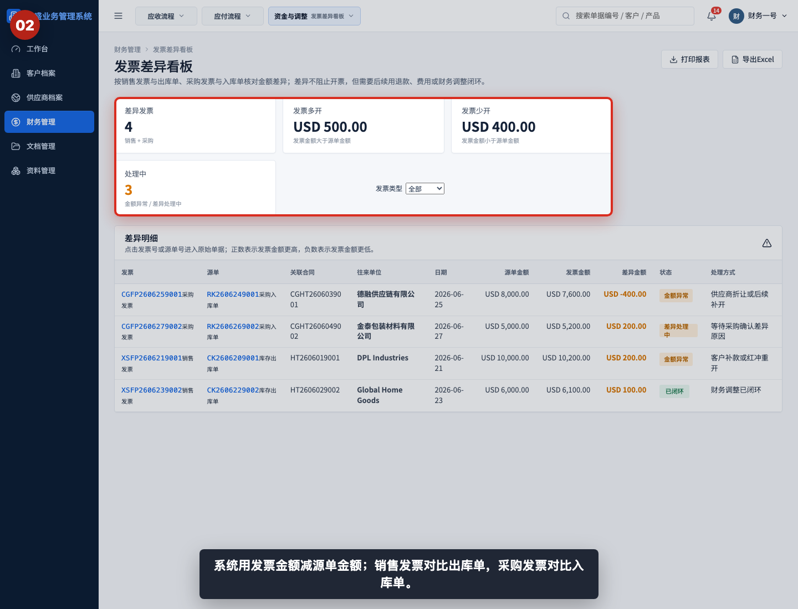

发票差异不是现金流，也不是应收应付余额。它只回答一个问题：发票金额是否等于对应出库单或入库单金额。

## 步骤 03：查看差异发票数量

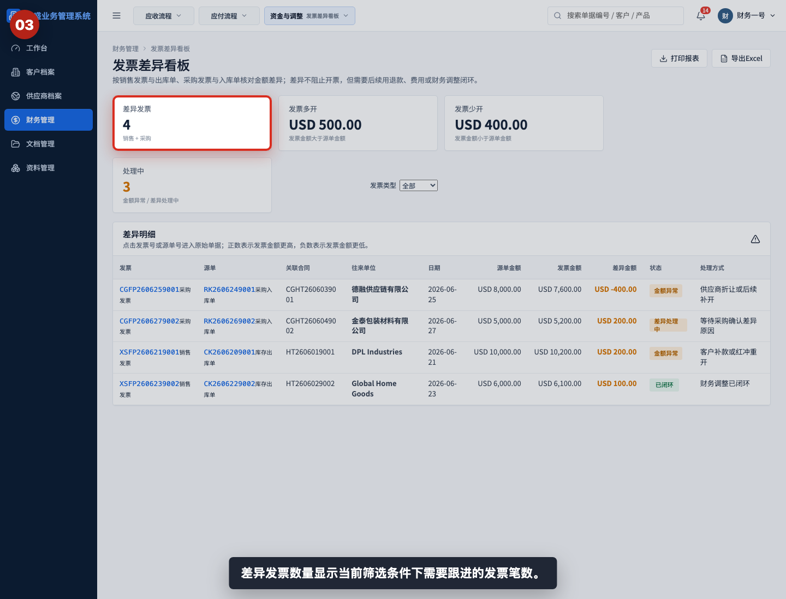

差异发票数量表示当前筛选条件下需要跟进的发票笔数。销售发票和采购发票都可能进入这个数量。

## 步骤 04：识别发票多开

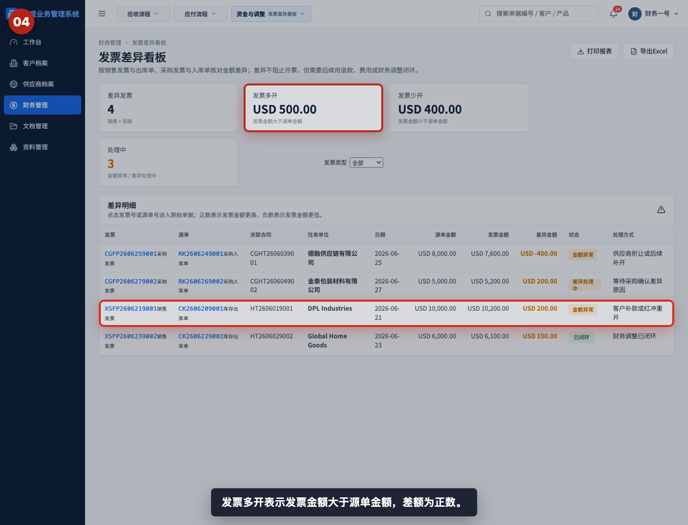

发票多开表示发票金额大于源单金额，差异金额为正数。销售侧常见处理方式包括客户补款、红冲重开或财务调整；采购侧常见处理方式包括补充费用或确认供应商差异原因。

## 步骤 05：识别发票少开

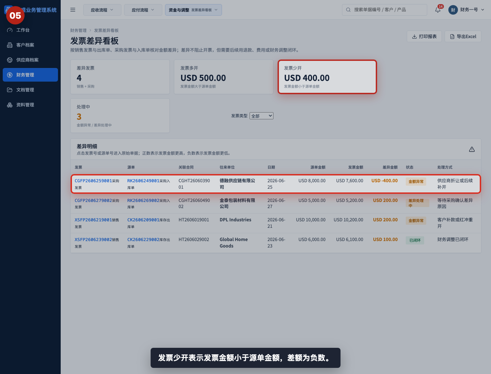

发票少开表示发票金额小于源单金额，差异金额为负数。采购侧常见原因包括供应商折让、少开发票或后续补开。

## 步骤 06：查看处理中数量

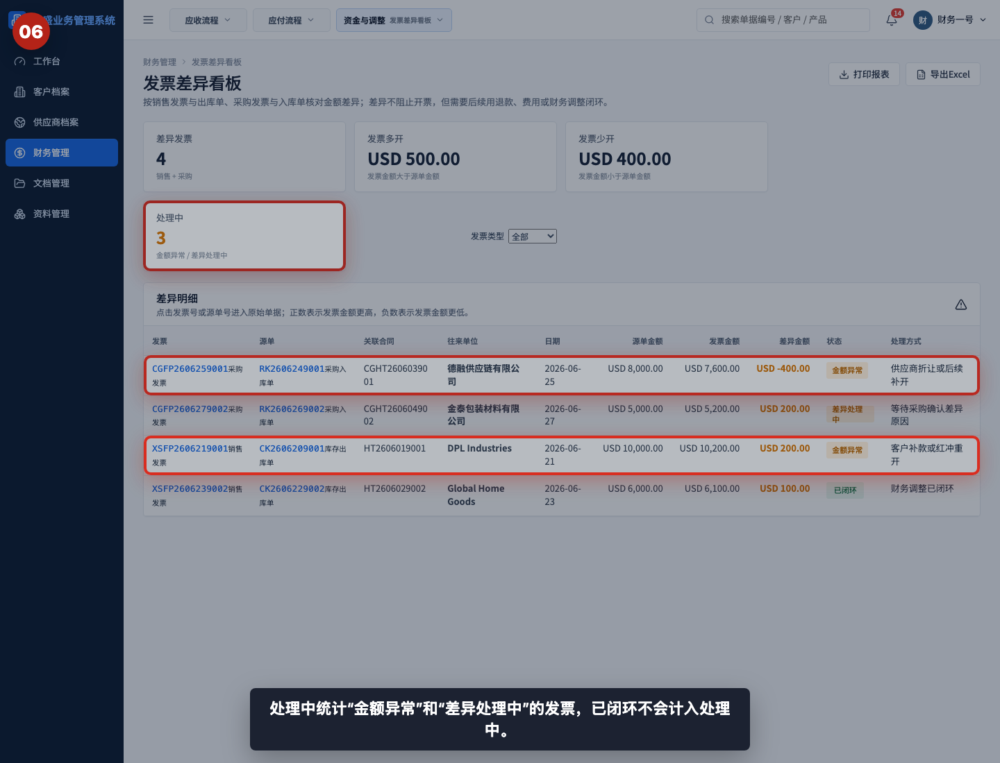

处理中统计状态为“金额异常”和“差异处理中”的发票。已闭环发票仍会出现在明细中，但不再计入处理中数量。

## 步骤 07：筛选销售发票差异

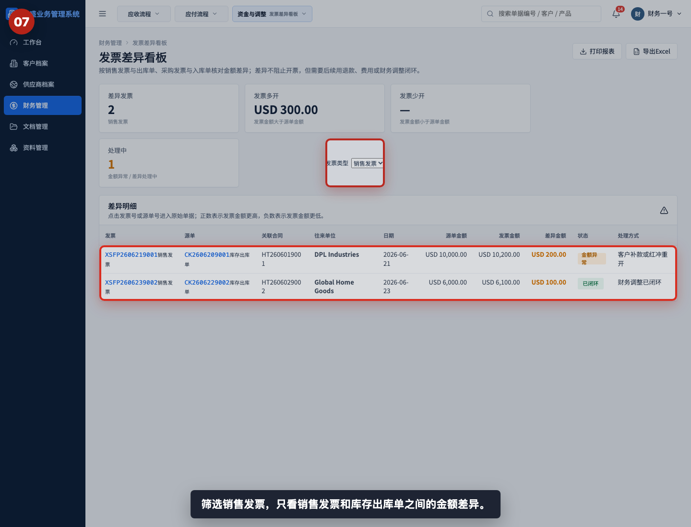

选择“销售发票”后，只查看销售发票和库存出库单之间的金额差异。销售和财务可以据此确认是否需要客户补款、客户退款或重开发票。

## 步骤 08：筛选采购发票差异

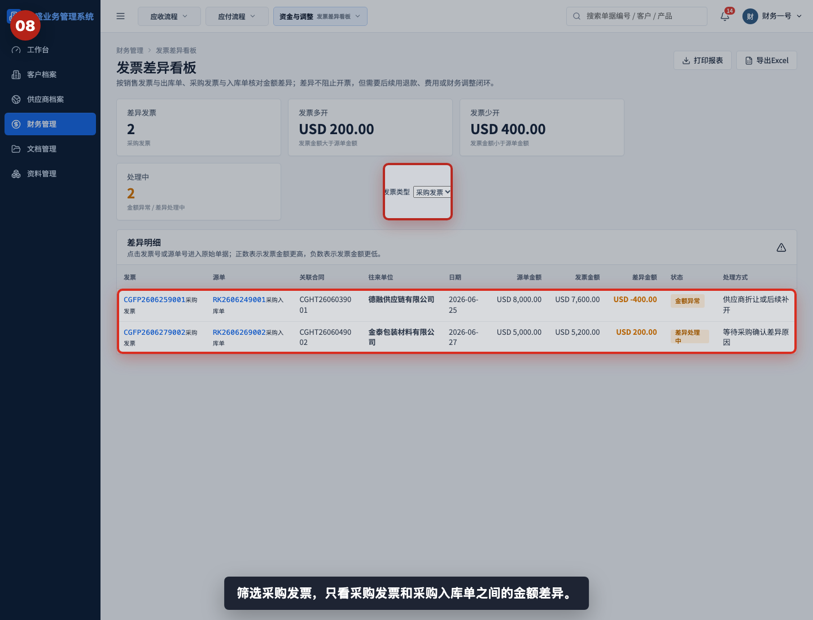

选择“采购发票”后，只查看采购发票和采购入库单之间的金额差异。采购和财务可以据此确认供应商折让、少开、多开或补开安排。

## 步骤 09：阅读差异明细

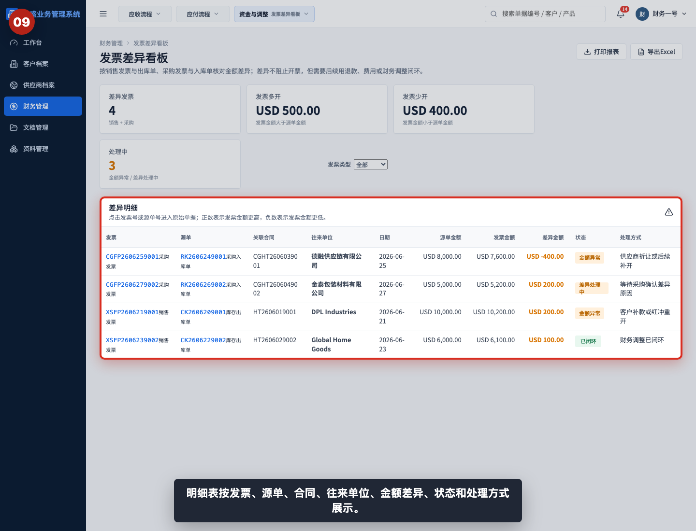

差异明细按发票、源单、关联合同、往来单位、日期、源单金额、发票金额、差异金额、状态和处理方式展示。核对时先看金额差异，再看状态和处理方式。

## 步骤 10：打开差异发票

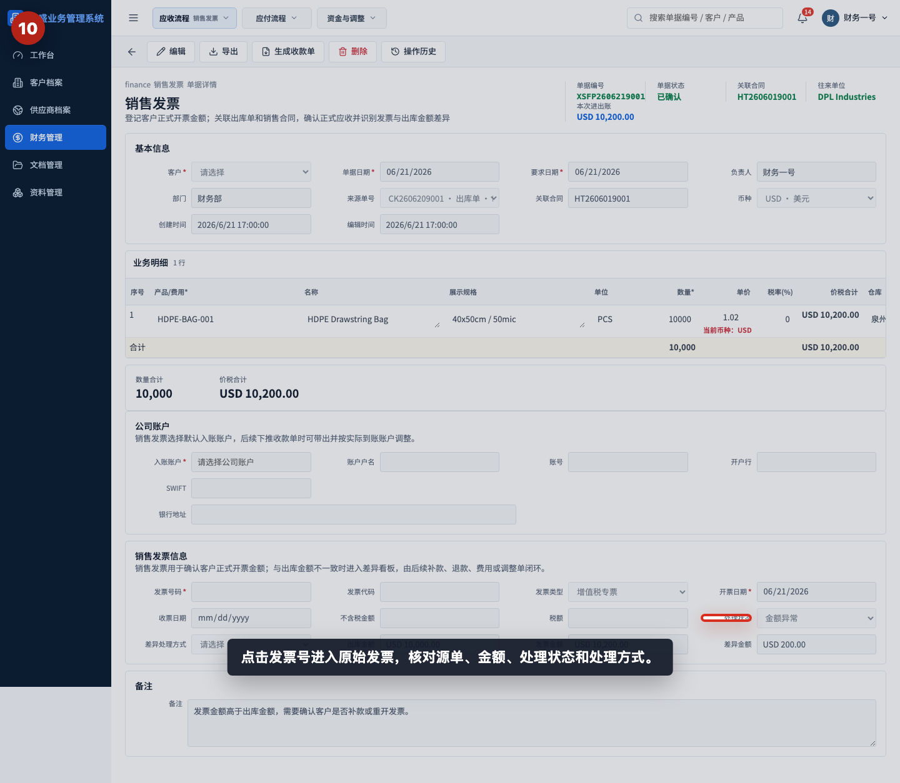

点击发票号进入原始发票，核对来源单号、关联合同、开票金额、处理状态和差异处理方式。发票页面是更新处理状态的主要位置。

## 步骤 11：打开差异源单

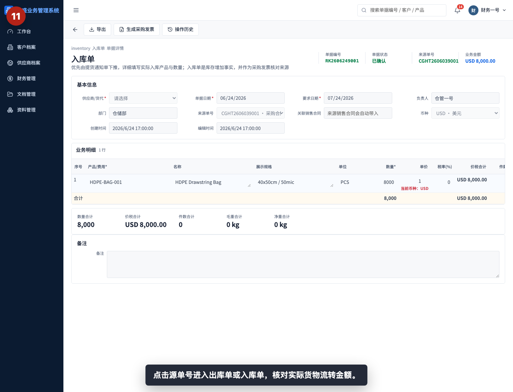

点击源单号进入库存出库单或采购入库单，核对实际货物流转金额。判断发票差异时，不要只看发票，还要回到源单确认数量、单价和金额。

## 步骤 12：打印或导出发票差异

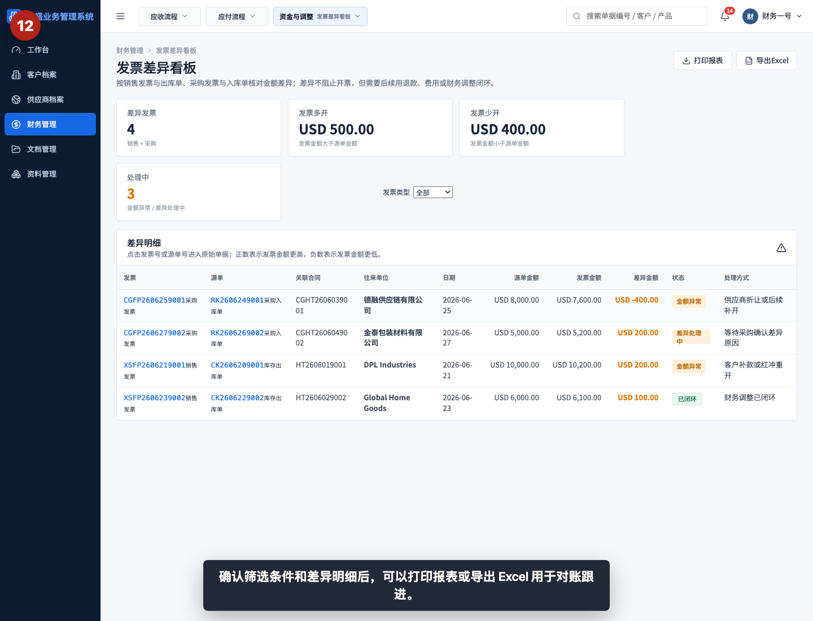

确认筛选条件和差异明细后，可以打印报表或导出 Excel。导出前应明确本次是全部差异、销售差异还是采购差异。

## 相关教程

- [如何从出库单生成销售发票](../../财务管理/出库单生成销售发票/README.md)
- [如何从入库单生成采购发票](../../财务管理/入库单生成采购发票/README.md)
- [如何创建客户退款单](../../财务管理/创建客户退款单/README.md)
- [如何创建供应商退款单](../../财务管理/创建供应商退款单/README.md)
- [如何创建费用单](../../财务管理/创建费用单/README.md)
- [如何创建财务调整单](../../财务管理/创建财务调整单/README.md)
- [如何查看资金流水](../查看资金流水/README.md)

## 常见误读

- 把发票差异当成付款或收款差异。发票差异只比较发票和源单金额，资金流水才看真实收付。
- 看到正数就认为一定要收款。正数只是发票金额更高，具体处理要看业务原因和处理方式。
- 看到负数就认为一定要退款。负数也可能是供应商折让、少开发票或后续补开。
- 只看顶部合计，不看单笔明细。顶部是汇总，处理时必须回到每张发票和源单。
- 忽略已闭环状态。已闭环表示差异已经有处理结论，但仍建议保留明细用于追溯。
- 没有关联源单就直接判断差异。没有源单或源单选错，会导致差异金额失真。

## 查看前检查清单

- 是否进入了“财务管理 > 发票差异看板”。
- 是否确认当前筛选为全部、销售发票或采购发票。
- 是否理解差异金额等于发票金额减源单金额。
- 是否区分正数差异和负数差异。
- 是否查看状态是金额异常、差异处理中还是已闭环。
- 是否打开原始发票核对处理状态和处理方式。
- 是否打开源单核对实际出库或入库金额。
- 导出前是否确认筛选条件符合本次对账范围。
