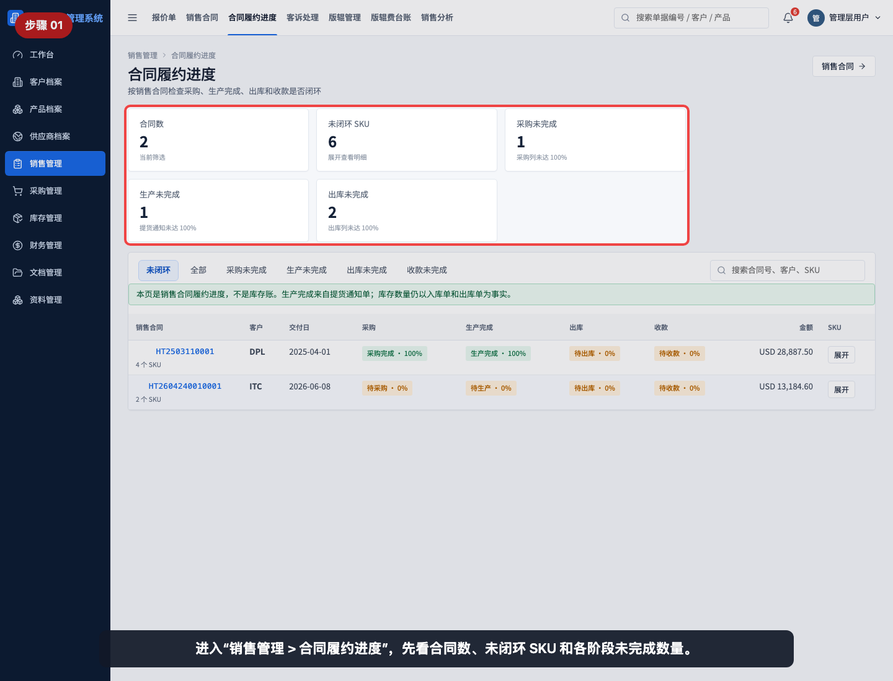
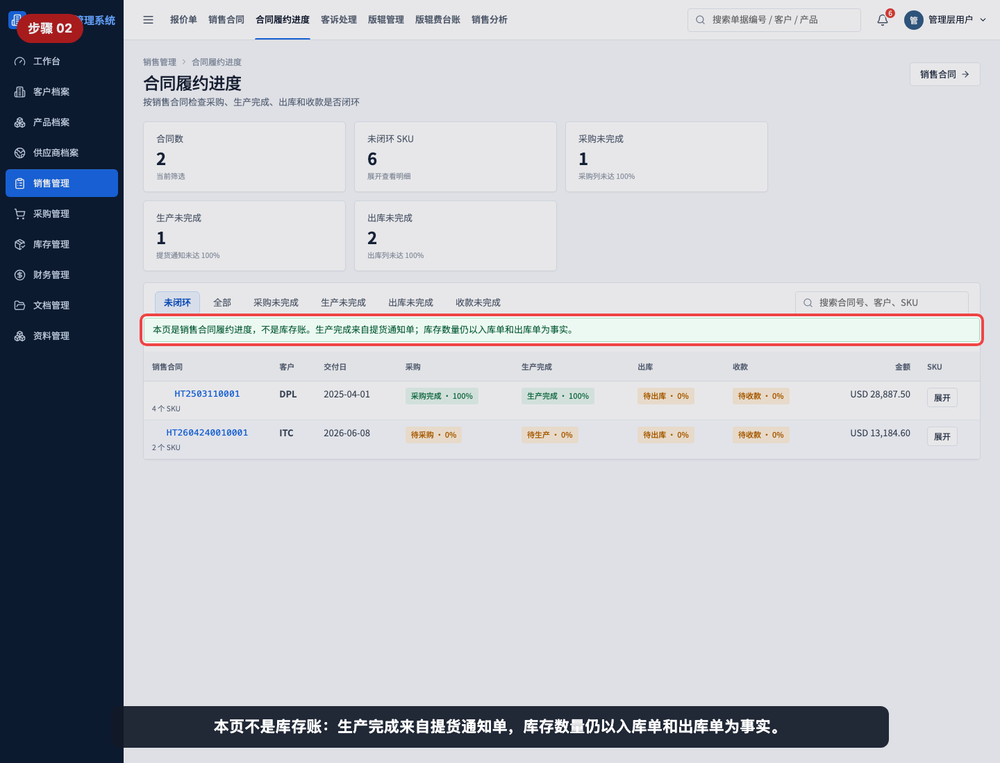
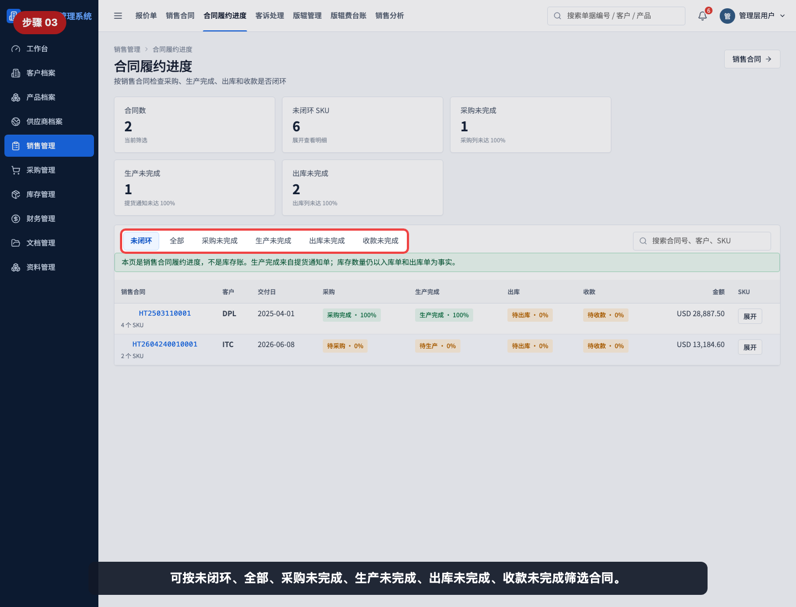
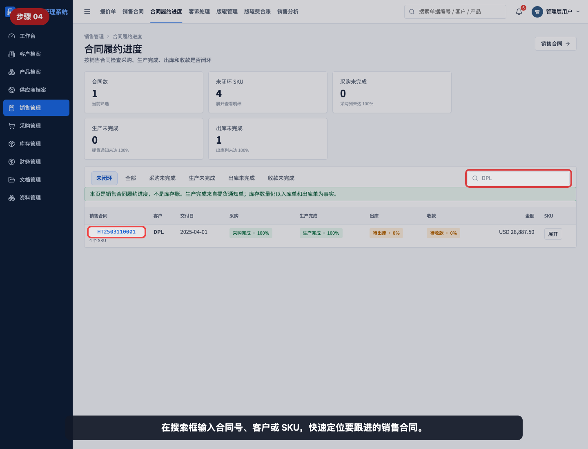
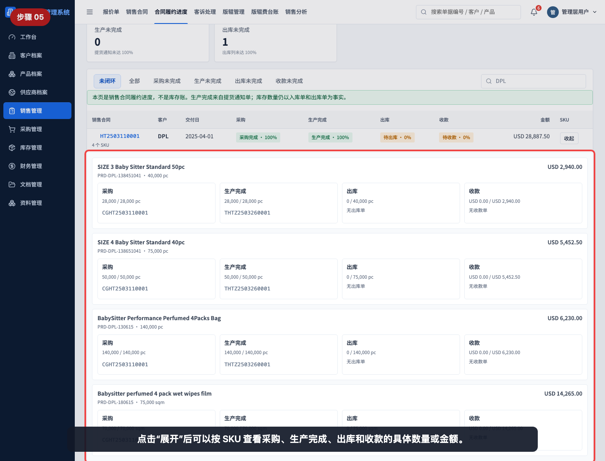
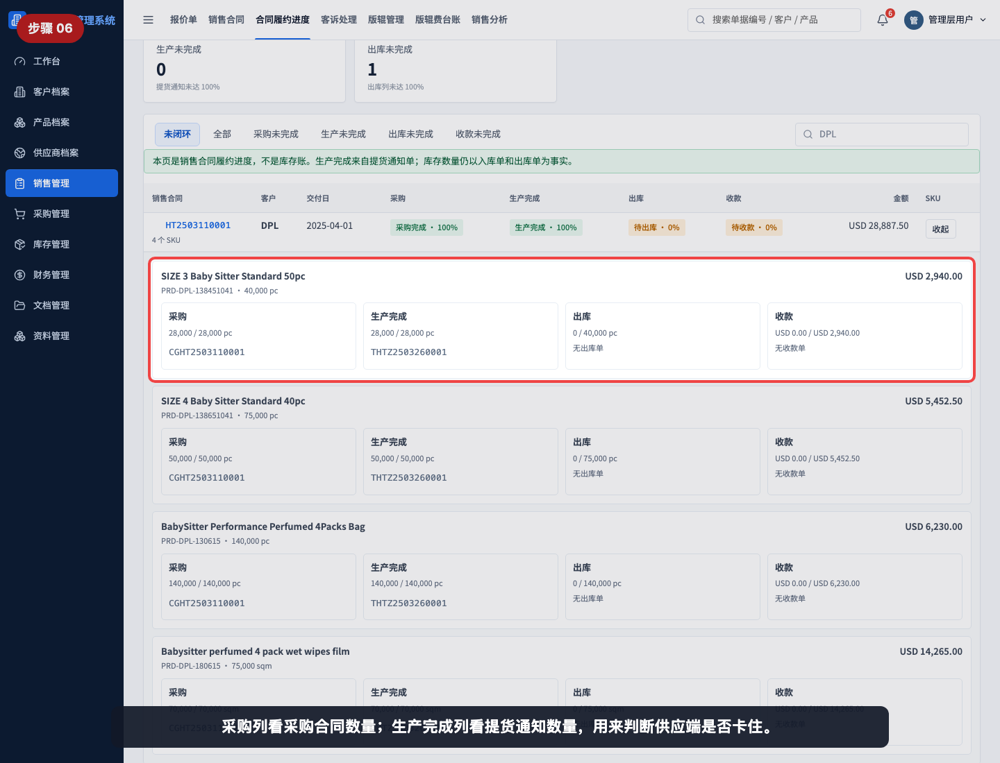
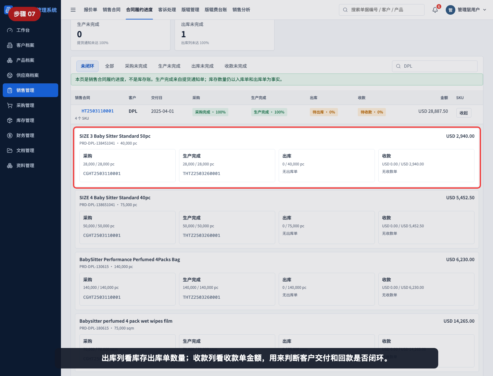
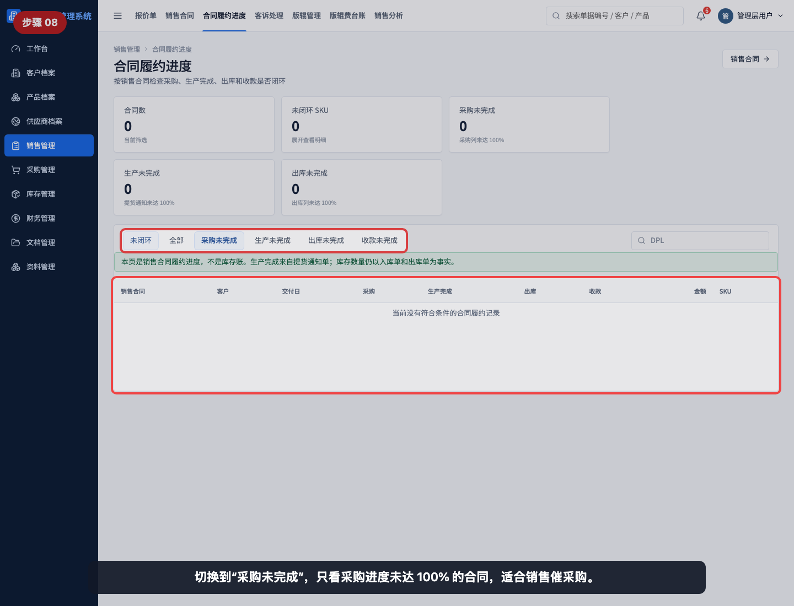
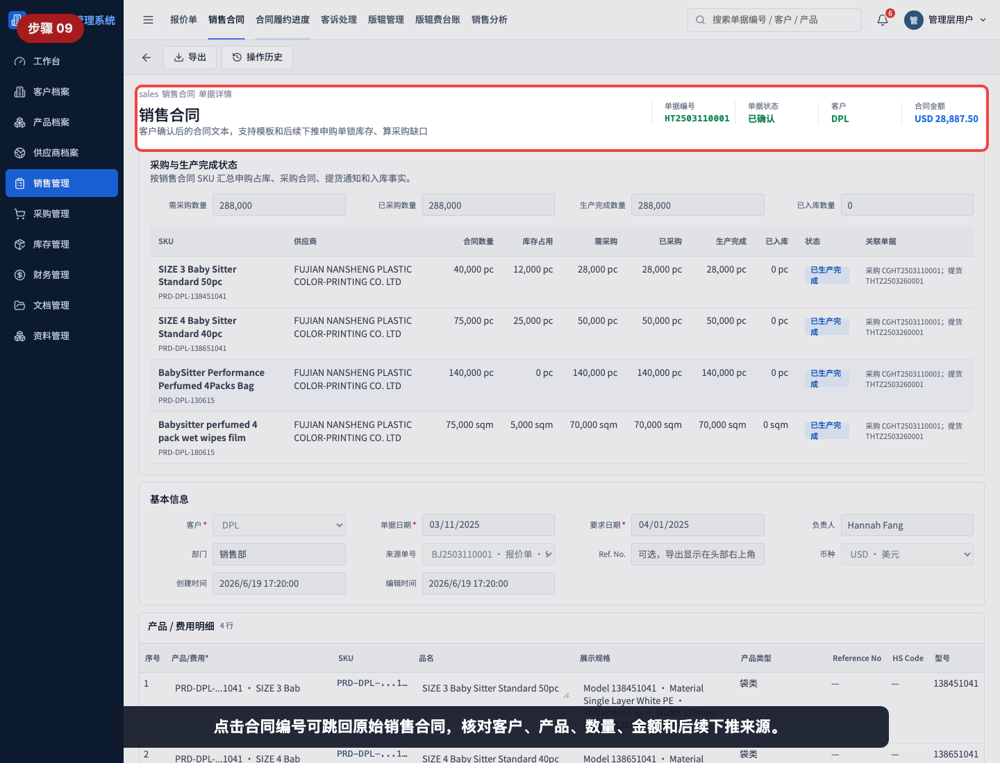
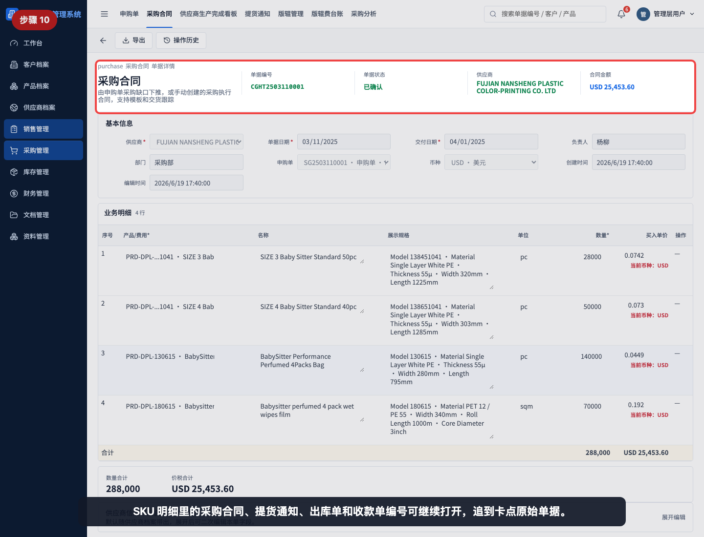

# 如何查看合同履约进度

本指引用于培训销售、管理层和跨部门协作用户查看销售合同是否闭环。示例使用 DPL 销售合同，覆盖进入合同履约进度、理解指标口径、使用筛选和搜索、展开 SKU 明细、读取采购/生产完成/出库/收款进度，以及从看板跳回原始销售合同和关联业务单据。

## 适用场景

- 销售跟进客户订单是否完成采购、生产、出库和收款。
- 管理层查看当前销售合同中哪些 SKU 未闭环。
- 销售需要判断卡点在采购、供应商生产、仓库出库还是财务收款。
- 采购、仓库、财务需要从销售合同追溯到各自负责的原始单据。
- 周会或复盘时，需要按合同展示履约状态。

## 核心口径

| 看板项 | 含义 | 数据来源 |
|---|---|---|
| 合同数 | 当前筛选条件下的销售合同数量 | 已确认客户合同 |
| 未闭环 SKU | 任一阶段未完成的 SKU 数量 | 合同明细和后续单据 |
| 采购未完成 | 采购进度未达到 100% 的合同数量 | 申购单、采购合同 |
| 生产未完成 | 生产完成进度未达到 100% 的合同数量 | 提货通知单 |
| 出库未完成 | 出库进度未达到 100% 的合同数量 | 库存出库单 |
| 收款未完成 | 收款进度未达到 100% 的合同数量 | 收款单 |

关键规则：

```text
合同履约进度 = 销售合同执行闭环
生产完成 = 来自提货通知单，不代表已经入库
库存数量 = 仍以入库单和出库单为事实
```

## 步骤 01：进入合同履约进度



进入“销售管理 > 合同履约进度”，先看合同数、未闭环 SKU、采购未完成、生产未完成和出库未完成。

## 步骤 02：理解履约口径提示



注意页面提示：本页不是库存账。生产完成来自提货通知单；库存数量仍以入库单和出库单为事实。

## 步骤 03：查看筛选标签



可按“未闭环、全部、采购未完成、生产未完成、出库未完成、收款未完成”筛选合同。

筛选建议：

| 筛选 | 适合查看 |
|---|---|
| 未闭环 | 当前仍有任一环节未完成的合同 |
| 全部 | 所有已确认销售合同 |
| 采购未完成 | 销售催采购或判断缺口是否下单 |
| 生产未完成 | 采购跟进供应商生产或提货通知 |
| 出库未完成 | 仓库安排发货或销售跟进交付 |
| 收款未完成 | 财务催收或销售跟进尾款 |

## 步骤 04：搜索指定客户或合同



在搜索框输入合同号、客户名称或 SKU，可以快速定位要跟进的销售合同。

## 步骤 05：展开合同查看 SKU



点击“展开”后，可以按 SKU 查看采购、生产完成、出库和收款的具体数量或金额。

## 步骤 06：读取采购和生产完成进度



采购列看采购合同数量；生产完成列看提货通知数量。若采购完成但生产未完成，通常需要采购继续跟进供应商。

## 步骤 07：读取出库和收款进度



出库列看库存出库单数量；收款列看收款单金额。若出库完成但收款未完成，通常需要财务和销售跟进回款。

## 步骤 08：筛选采购未完成合同



切换到“采购未完成”，只看采购进度未达 100% 的合同，适合销售和采购对齐采购缺口。

## 步骤 09：打开原始销售合同



点击销售合同编号可跳回原始销售合同，核对客户、产品、数量、金额和后续下推来源。

## 步骤 10：打开关联业务单据



SKU 明细里的采购合同、提货通知、出库单和收款单编号可继续打开，追到卡点原始单据。

## 常见误读

- 把生产完成当成已经入库。生产完成来自提货通知单，只有采购入库单才增加库存。
- 只看合同级百分比，不展开 SKU，导致忽略某个 SKU 的卡点。
- 看到采购完成就认为可以发货，实际还要看生产完成、入库和出库。
- 看到出库完成就认为订单闭环，实际还要看收款是否完成。
- 在库存问题上只看履约看板，不回到库存看板或出入库单核对事实数量。
- 点击关联单据后没有回到原始单据确认状态、数量和金额。

## 查看前检查清单

- 是否已选择正确筛选标签。
- 是否用合同号、客户或 SKU 搜索到目标合同。
- 是否展开到 SKU 明细。
- 是否分别查看采购、生产完成、出库和收款。
- 是否点开相关原始单据确认真实状态。
- 如果要核对库存数量，是否回到库存看板、入库单或出库单。
