# 如何查看库存看板

本指引用于培训仓管、销售、采购和管理层查看库存单。示例使用 DPL 的 SIZE 3 产品，覆盖进入库存看板、理解统计口径、搜索 SKU、读取当前库存/已锁定/可用库存/待入库/待出库、使用风险筛选、导出库存数据，以及确认何时需要切换到合同履约进度追溯来源。

## 适用场景

- 仓库需要判断某个 SKU 当前还有多少库存。
- 销售需要确认是否有可用库存可以承诺客户。
- 采购需要跟进已经生产完成但尚未入库的数量。
- 管理层需要快速查看库存风险、待入库和待出库压力。
- 需要导出库存单给仓库、业务或管理层离线核对。

## 核心口径

| 看板项 | 含义 | 数据来源 |
|---|---|---|
| SKU 数 | 当前筛选条件下的 SKU 行数 | 有效销售合同中的实物产品行 |
| 当前库存 | 已入库数量减去已出库数量 | 采购入库单 - 库存出库单 |
| 已锁定 | 已被申购单占用、尚未释放的库存 | 申购单锁定数量 - 已出库数量 |
| 可用库存 | 当前库存减去已锁定 | 当前库存 - 已锁定 |
| 待入库 | 供应商已生产完成但尚未实际入库 | 提货通知单 - 采购入库单 |
| 生产完成 | 供应商 ready / 可提货数量 | 已确认提货通知单 |
| 待出库 | 销售合同需求尚未出库的数量 | 销售合同数量 - 库存出库单 |

关键公式：

```text
当前库存 = 采购入库单数量 - 库存出库单数量
可用库存 = 当前库存 - 已锁定
待入库 = 提货通知单数量 - 采购入库单数量
待出库 = 销售合同数量 - 库存出库单数量
```

## 步骤 01：进入库存看板

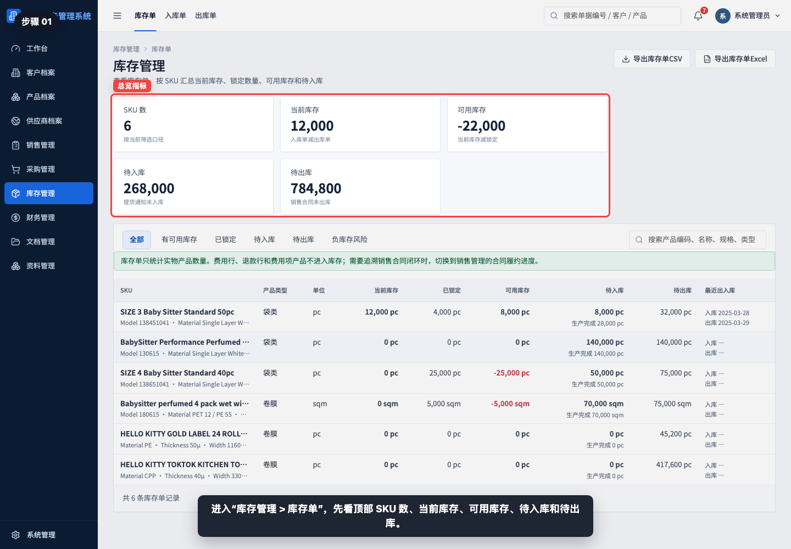

进入“库存管理 > 库存单”，先看顶部 SKU 数、当前库存、可用库存、待入库和待出库。

## 步骤 02：理解库存统计口径

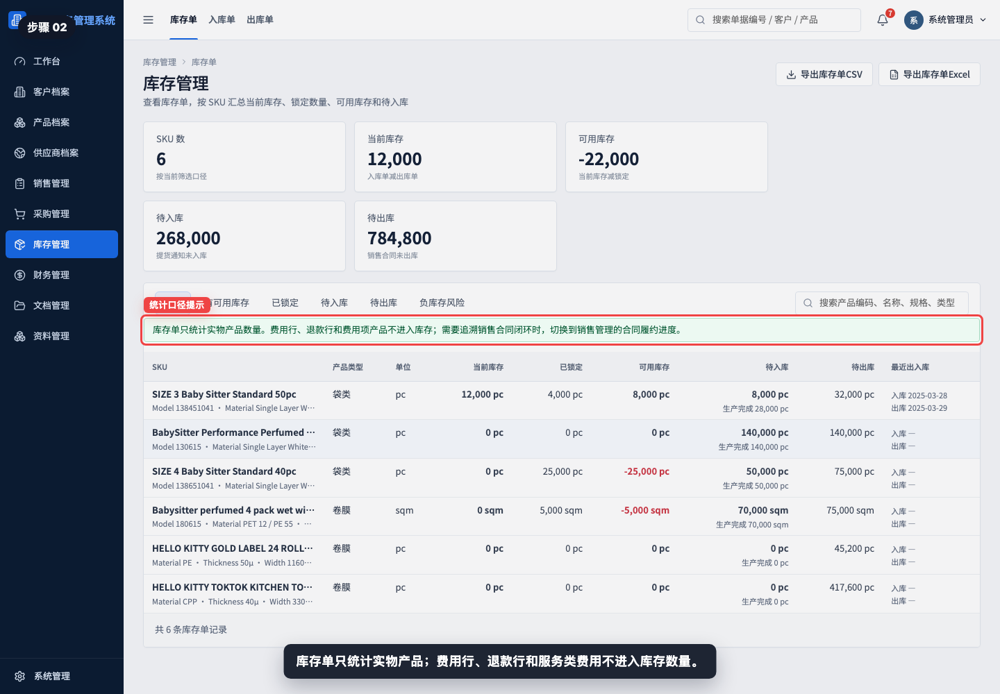

注意页面提示：库存单只统计实物产品。费用行、退款行和费用项产品不进入库存数量。

## 步骤 03：查看筛选标签

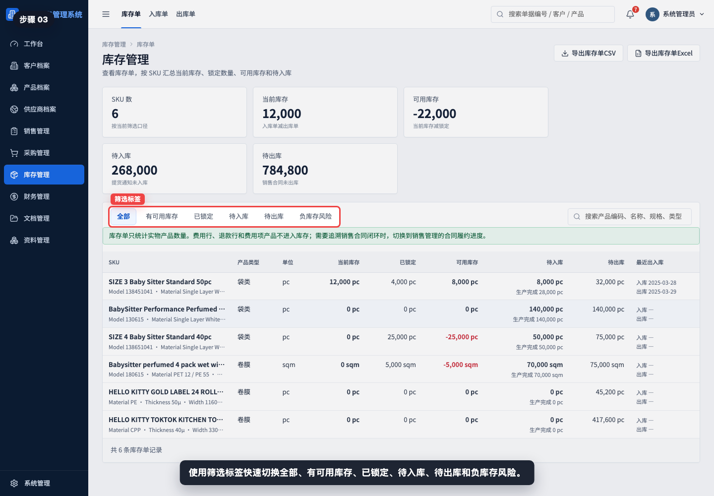

库存看板提供“全部、有可用库存、已锁定、待入库、待出库、负库存风险”筛选。

筛选说明：

| 筛选 | 适合查看 |
|---|---|
| 全部 | 当前所有可计算库存的 SKU |
| 有可用库存 | 可用库存大于 0 的 SKU |
| 已锁定 | 已被申购占用的 SKU |
| 待入库 | 已有提货通知但尚未完全入库的 SKU |
| 待出库 | 销售合同尚未完全出库的 SKU |
| 负库存风险 | 当前库存或可用库存为负的 SKU |

## 步骤 04：搜索 SKU 或产品

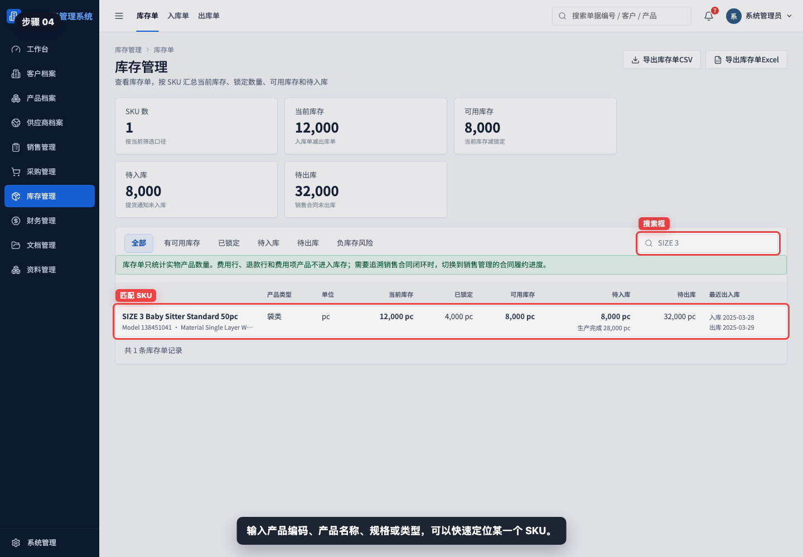

输入产品编码、产品名称、规格或类型，可以快速定位某一个 SKU。

## 步骤 05：读取当前库存和锁定


示例中 SIZE 3 的当前库存为 12,000 pc，已锁定为 4,000 pc。当前库存来自实际入库和实际出库，已锁定来自申购占用。

## 步骤 06：读取可用库存

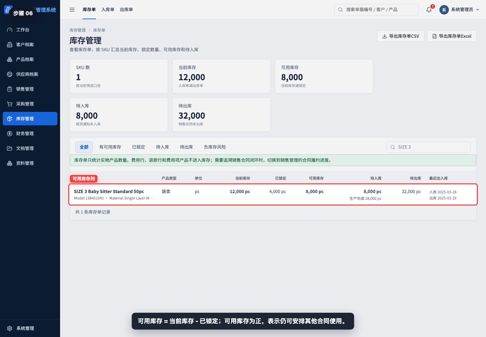

可用库存 = 当前库存 - 已锁定。示例中当前库存 12,000 pc，已锁定 4,000 pc，因此可用库存为 8,000 pc。

## 步骤 07：读取待入库和生产完成

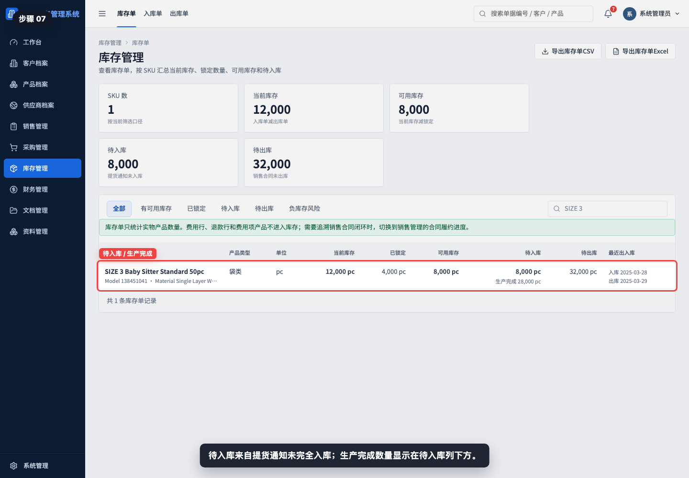

待入库表示供应商已经生产完成或可提货，但仓库尚未完全入库。生产完成数量显示在待入库列下方。

## 步骤 08：读取待出库

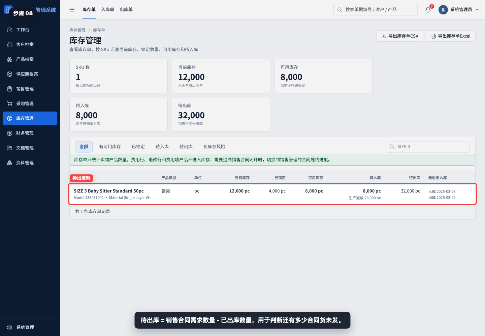

待出库表示销售合同还有多少数量没有形成库存出库单。它适合用来判断后续发货压力。

## 步骤 09：筛选有可用库存

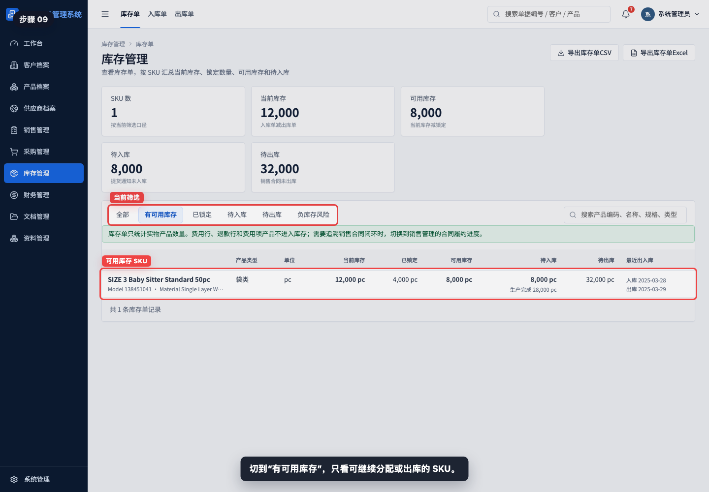

切到“有可用库存”，只看还能继续分配或出库的 SKU。

## 步骤 10：筛选已锁定 SKU

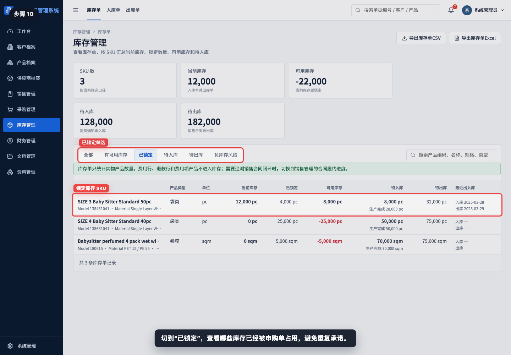

切到“已锁定”，查看哪些库存已经被申购单占用，避免同一批库存被重复承诺。

## 步骤 11：筛选待入库 SKU

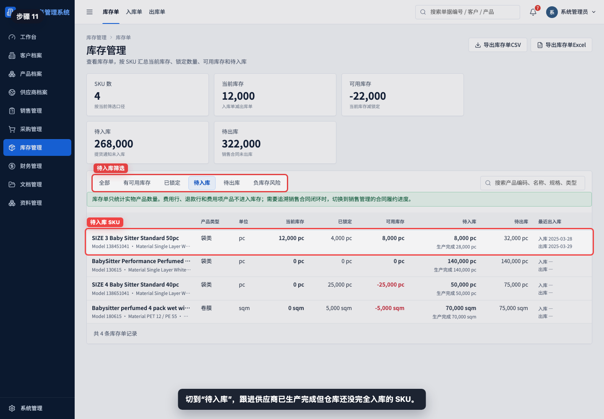

切到“待入库”，跟进供应商已经 ready 但仓库还没完全入库的 SKU。需要核对来源时，应查看提货通知单和采购入库单。

## 步骤 12：筛选负库存风险

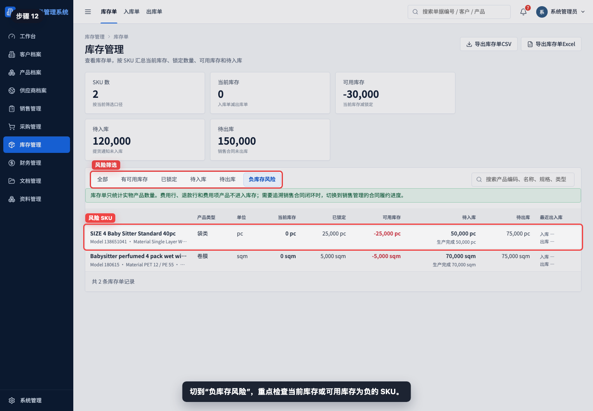

切到“负库存风险”，重点检查当前库存或可用库存为负的 SKU。常见原因是库存已被锁定但还没有实际入库，或出库事实已经超过当前可用库存。

## 步骤 13：导出库存数据

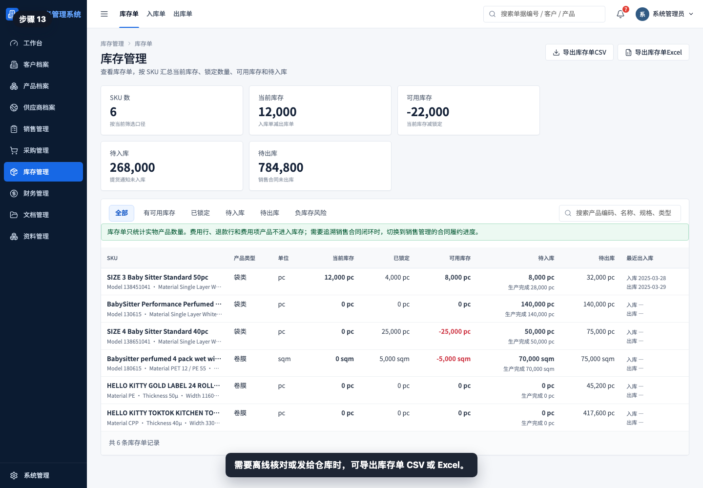

需要离线核对或发给仓库时，可以导出库存单 CSV 或 Excel。导出内容按当前筛选和搜索结果生成。

## 步骤 14：确认追溯边界

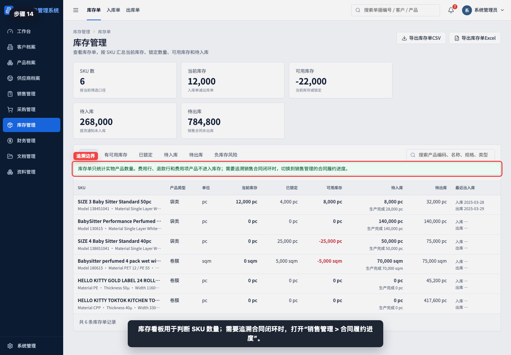

库存看板用于判断 SKU 数量，不展开每一张来源单据。需要追溯销售合同闭环时，进入“销售管理 > 合同履约进度”；需要追溯采购 ready 时，进入“采购管理 > 供应商生产完成看板”。

相关教程：

- [如何查看合同履约进度](../查看合同履约进度/README.md)
- [如何查看供应商生产完成看板](../查看供应商生产完成看板/README.md)
- [如何从提货通知下推采购入库单](../../库存管理/提货通知下推采购入库单/README.md)
- [如何创建库存出库单](../../库存管理/创建库存出库单/README.md)

## 常见误读

- 把提货通知当成库存。提货通知只表示供应商 ready，不增加库存。
- 只看当前库存，不看已锁定。已经被申购锁定的库存不能随意承诺给其他合同。
- 把可用库存为负理解为系统错误。通常是库存锁定或出库已经发生，但入库事实尚未补齐，需要回源单核对。
- 只看待入库总数，不看具体 SKU。不同 SKU 的 ready 和入库进度必须分开判断。
- 用库存看板替代合同履约追溯。库存看板看数量，合同履约进度看销售合同闭环。
- 忽略筛选条件后导出。导出文件会按当前筛选和搜索结果生成。

## 查看前检查清单

- 是否进入了“库存管理 > 库存单”。
- 是否确认当前筛选标签和搜索条件。
- 是否区分当前库存、已锁定和可用库存。
- 是否区分生产完成、待入库和已入库事实。
- 是否检查待出库，判断销售合同尚未发货数量。
- 是否用“负库存风险”筛选检查异常 SKU。
- 如需追溯来源，是否继续查看合同履约进度、提货通知、采购入库单或库存出库单。
