# 如何查看应付看板

本指引用于培训财务、采购和管理层查看供应商应付。示例包含一笔德融待付款和一笔金泰已结清记录，覆盖进入应付看板、理解立账口径、读取顶部指标、核对财务明细、判断待付/已结清状态、打开源入库单，以及打印或导出报表。

## 适用场景

- 财务需要安排供应商付款计划。
- 采购需要确认某张入库单是否已经付款。
- 管理层需要查看当前应付总额、已付金额和未结单据数量。
- 财务需要从应付明细打开源入库单，核对供应商、采购合同、产品和金额。
- 需要导出应付看板用于付款排程、供应商对账或经营分析。

## 核心口径

| 看板项 | 含义 | 数据来源 |
|---|---|---|
| 单据数量 | 当前有效入库立账单据数量 | 已确认采购入库单 |
| 立账金额 | 正式应付金额 | 已确认采购发票优先；未收票时按入库单金额 |
| 累计付款 | 已登记供应商实际付款 | 已确认付款单 |
| 待付金额 | 尚未支付的余额 | 立账金额 - 累计付款 |
| 未结单据 | 仍有待付余额的入库单 | 待付金额大于 0 的行 |
| 收付款记录数 | 与该入库单或采购发票关联的现金单据数量 | 付款单等结算记录 |

关键公式：

```text
立账金额 = 采购发票金额；如果没有采购发票，则暂按采购入库单金额
累计付款 = 已确认付款单金额
待付金额 = 立账金额 - 累计付款
```

## 步骤 01：进入应付看板

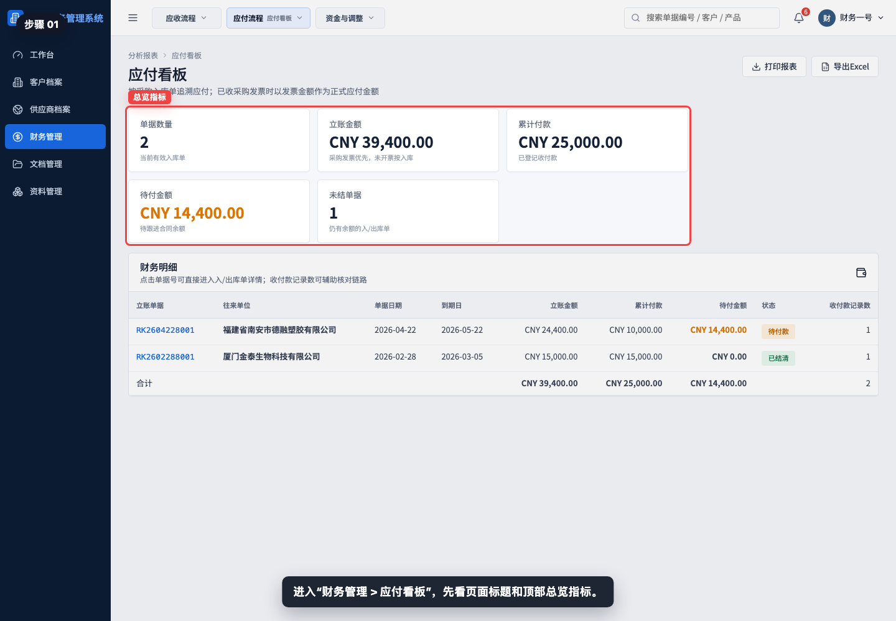

进入“财务管理 > 应付看板”，先看页面标题、说明和顶部总览指标。

## 步骤 02：理解应付立账口径

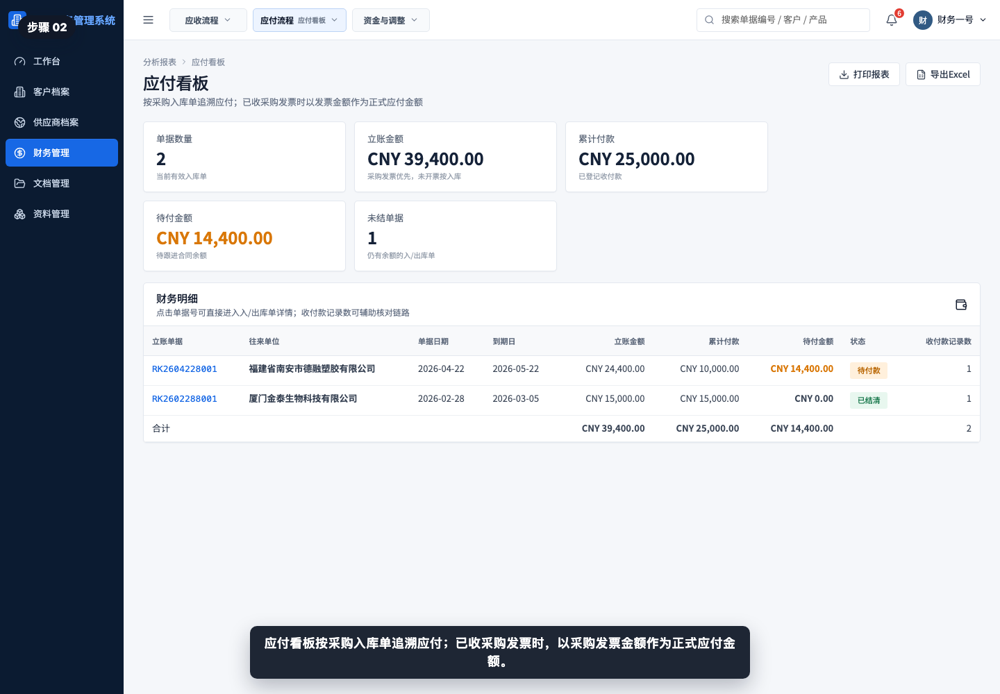

应付看板按采购入库单追溯应付；已收采购发票时，以采购发票金额作为正式应付金额。

## 步骤 03：查看单据数量和立账金额

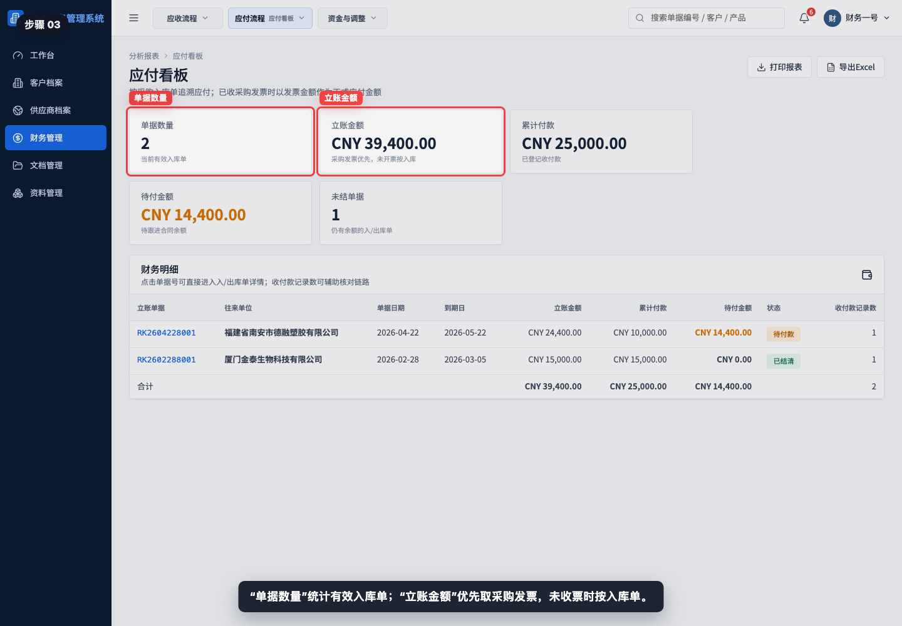

“单据数量”统计有效入库单；“立账金额”汇总每张入库单对应的正式应付金额。

## 步骤 04：查看累计付款和待付金额

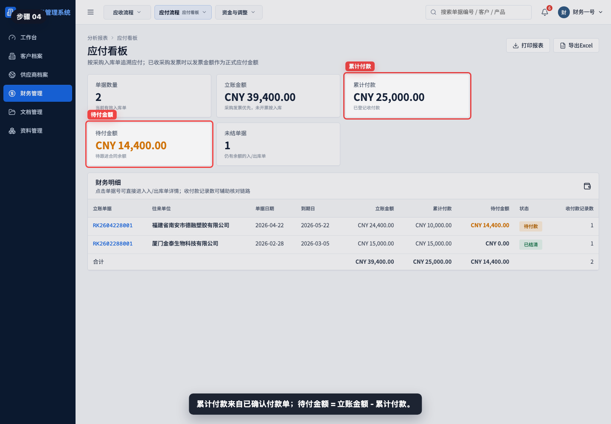

累计付款来自已确认付款单。待付金额 = 立账金额 - 累计付款，是财务需要继续安排付款的余额。

## 步骤 05：查看未结单据数量

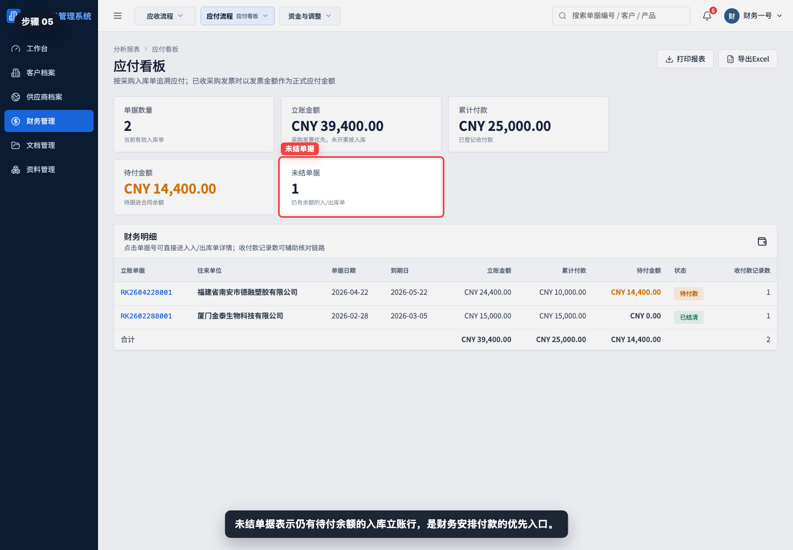

未结单据表示仍有待付余额的入库立账行。该指标适合财务做付款排程。

## 步骤 06：阅读财务明细表

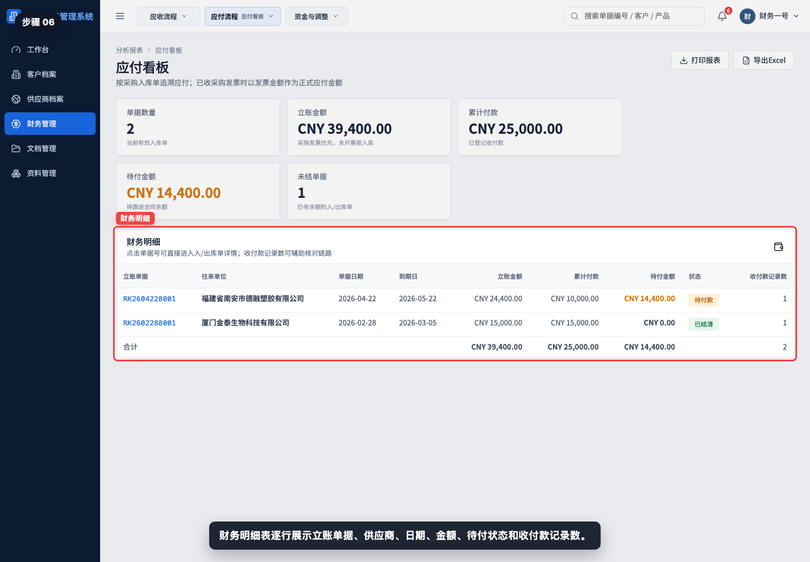

财务明细表逐行展示立账单据、往来单位、单据日期、到期日、立账金额、累计付款、待付金额、状态和收付款记录数。

## 步骤 07：读取待付款行

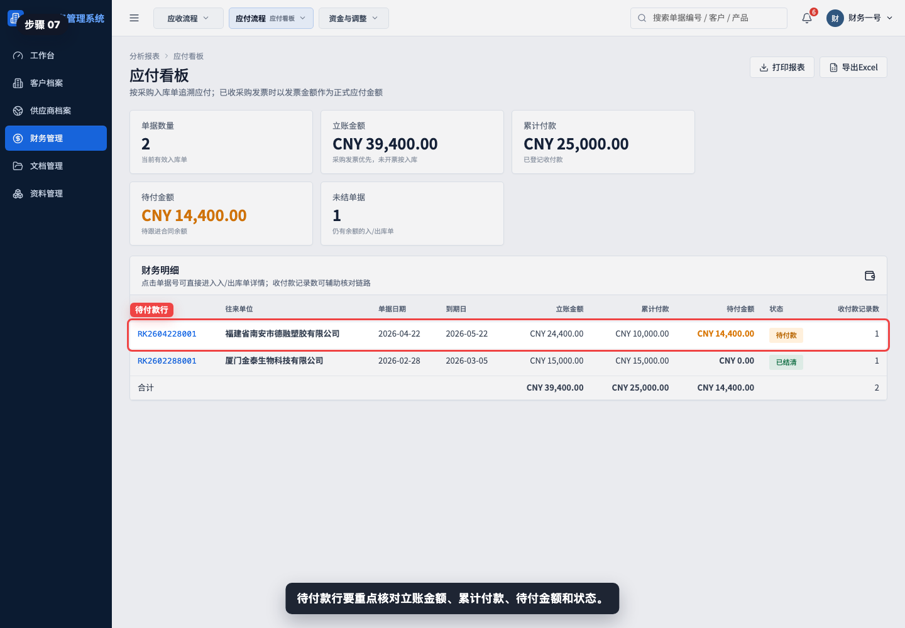

待付款行要重点核对立账金额、累计付款、待付金额和状态。示例中德融已付 CNY 10,000.00，仍待付 CNY 14,400.00。

## 步骤 08：读取已结清行

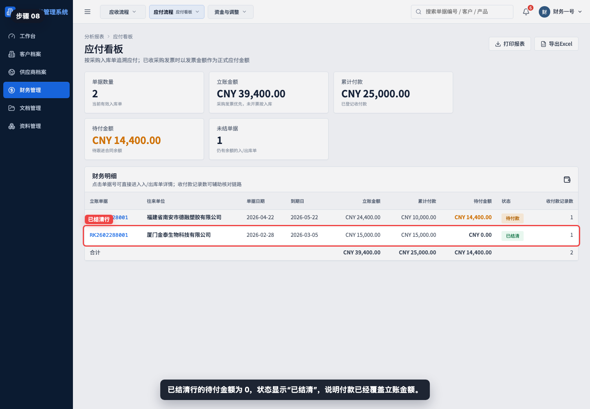

已结清行的待付金额为 0，状态显示“已结清”，说明付款已经覆盖立账金额。

## 步骤 09：核对收付款记录数

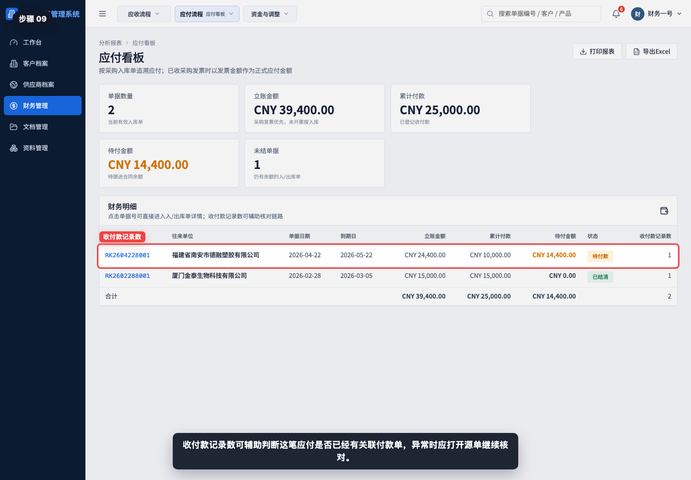

收付款记录数可辅助判断这笔应付是否已经有关联付款单。如果金额异常，应打开付款单、采购发票或源入库单继续核对。

## 步骤 10：打开立账入库单

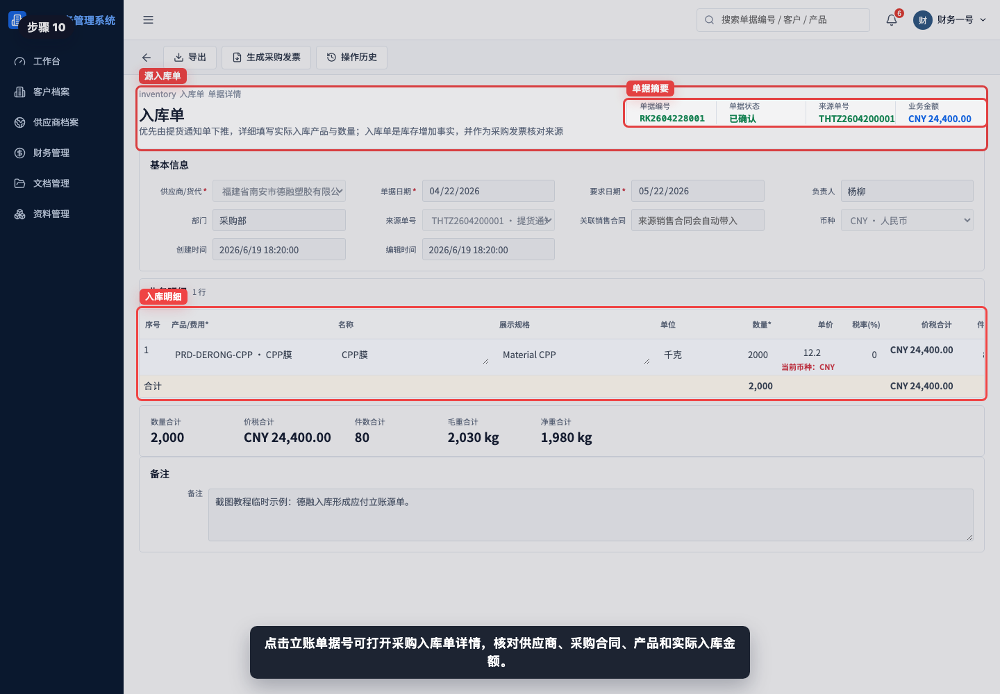

点击立账单据号可打开采购入库单详情，核对供应商、采购合同、产品明细、实际入库数量和入库金额。

## 步骤 11：打印或导出应付看板

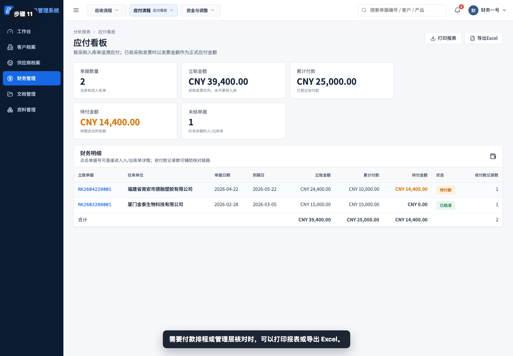

需要付款排程、供应商对账或管理层核对时，可以打印报表或导出 Excel。

## 相关教程

- [如何从入库单生成采购发票](../../财务管理/入库单生成采购发票/README.md)
- [如何从采购发票生成付款单](../../财务管理/采购发票生成付款单/README.md)
- [如何创建供应商退款单](../../财务管理/创建供应商退款单/README.md)
- 如何查看应付账龄（后续 P3-7 制作）

## 常见误读

- 把应付看板当成付款页面。付款需要进入付款单流程，应付看板只汇总余额。
- 只看入库单金额，不看采购发票金额。已收票时，正式应付以采购发票为准。
- 看到收付款记录数大于 0 就认为已结清。必须同时看待付金额是否为 0。
- 忽略到期日。待付金额相同的情况下，应结合到期日和供应商付款安排排序。
- 用应付看板替代账龄分析。应付看板看单据余额，应付账龄看逾期结构。
- 供应商退款、折让或发票差异未闭环时，只看付款单可能无法解释余额，需要回到源单和调整流程核对。

## 查看前检查清单

- 是否进入了“财务管理 > 应付看板”。
- 是否确认立账金额按采购发票优先、未收票按入库单。
- 是否核对累计付款和待付金额。
- 是否重点查看状态为“待付款”的行。
- 是否打开源入库单核对供应商、采购合同、产品和入库金额。
- 是否需要继续查看采购发票、付款单、供应商退款单或应付账龄。
- 导出前是否确认当前页面就是需要交付给付款排程或供应商对账的口径。
