# 如何查看应付账龄

本指引用于培训财务、采购和管理层查看供应商未付余额的账龄结构。示例包含德融和金泰两个供应商，覆盖进入应付账龄分析、理解基准日、读取未结余额和逾期金额、查看不同账龄区间、判断供应商占比、查看余额汇总、调整期间起，以及打印或导出报表。

## 适用场景

- 财务需要安排供应商付款优先级。
- 采购需要确认供应商账款是否逾期。
- 管理层需要查看未付余额中有多少已经超过 60 天。
- 需要按供应商和币种拆分付款风险，而不只是看应付明细。
- 需要导出账龄报表用于付款排程、供应商对账或经营复盘。

## 核心口径

| 看板项 | 含义 | 数据来源 |
|---|---|---|
| 未结余额 | 截至基准日仍未支付的余额 | 入库单/采购发票 - 付款单 |
| 逾期金额 | 账龄 60 天以上的未结余额 | 61-90 天、91-180 天、180 天以上 |
| 供应商数量 | 存在未结余额的供应商数量 | 按供应商和币种汇总 |
| 基准日 | 账龄计算截止日期 | 页面日期选择 |
| 账龄分布 | 未结余额按到期日到基准日的天数分桶 | 应付未结余额 |
| 余额汇总 | 期初、本期发生、本期结算、期末余额 | 按期间起和基准日统计 |

账龄桶：

```text
0-30天
31-60天
61-90天
91-180天
180天以上
```

## 步骤 01：进入应付账龄分析

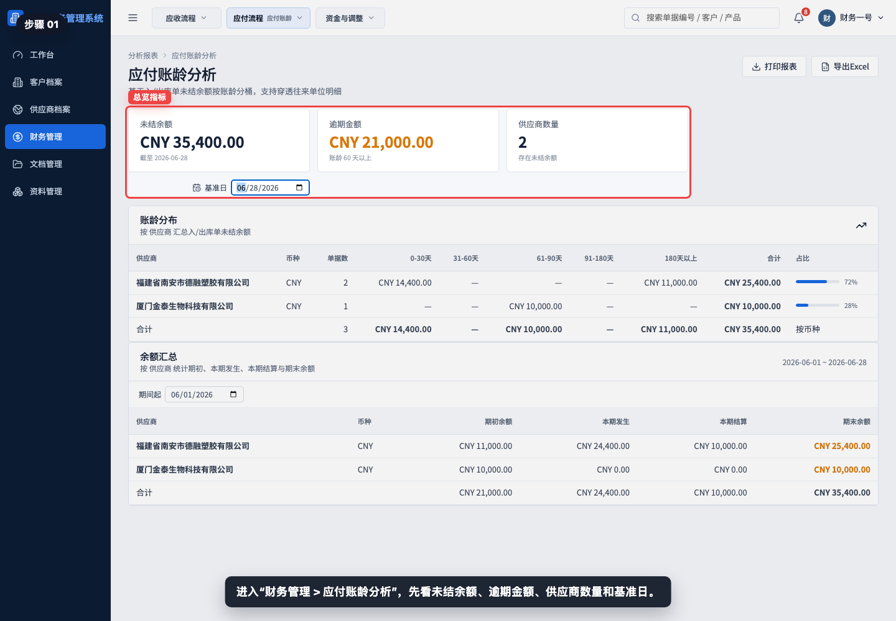

进入“财务管理 > 应付账龄分析”，先看未结余额、逾期金额、供应商数量和基准日。

## 步骤 02：理解基准日

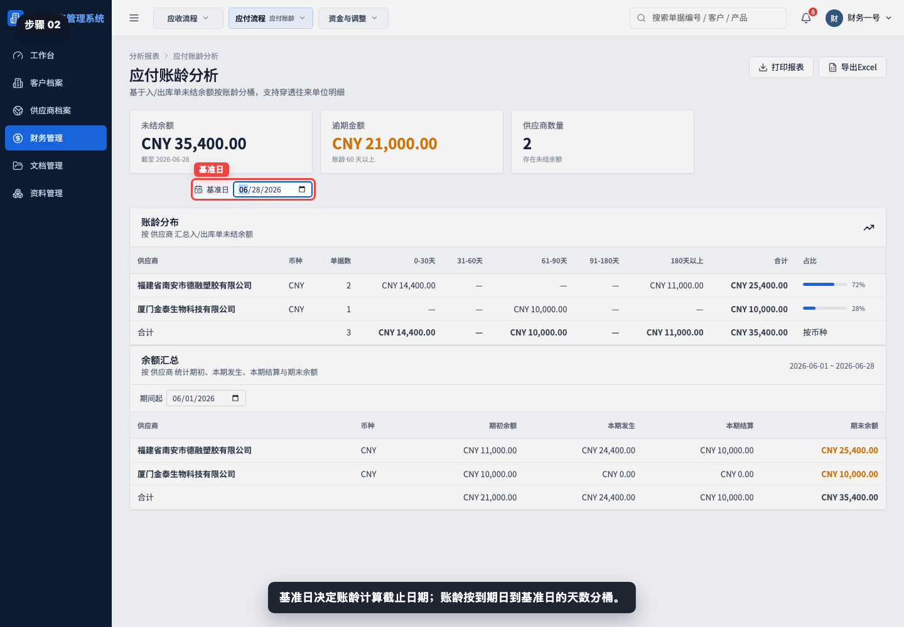

基准日决定账龄计算截止日期。系统按每笔应付到期日到基准日的天数，把未结余额放入不同账龄桶。

## 步骤 03：查看未结余额和逾期金额

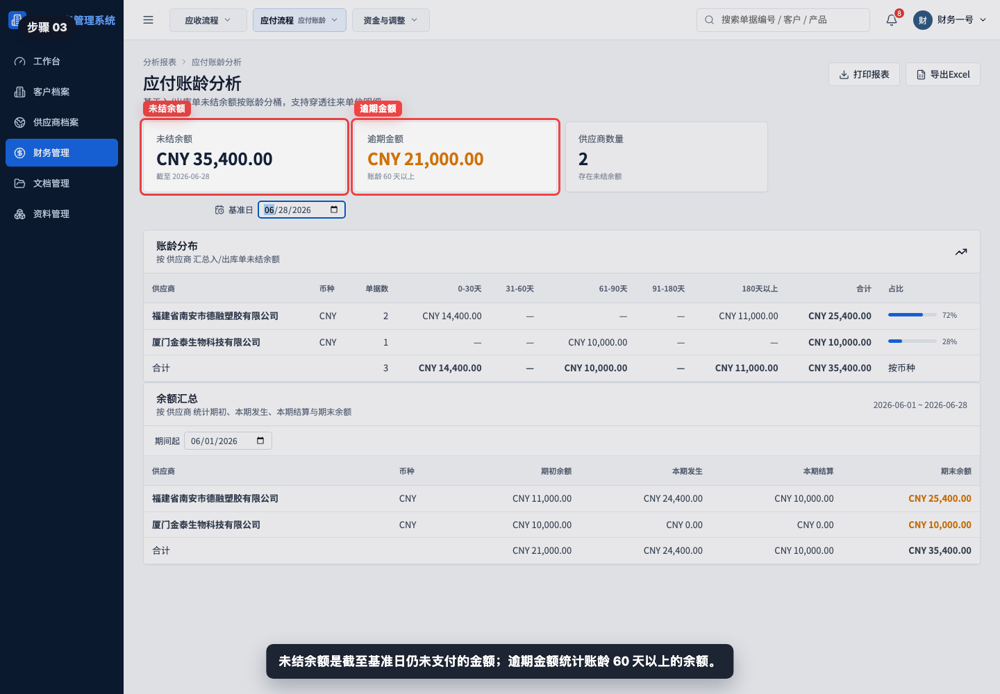

未结余额表示截至基准日尚未支付的供应商余额；逾期金额统计 60 天以上的未结余额。

## 步骤 04：阅读账龄分布表

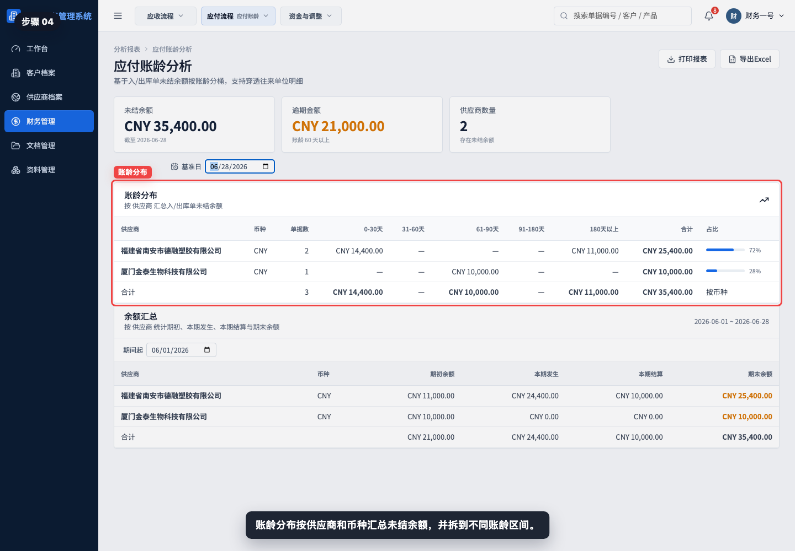

账龄分布按供应商和币种汇总未结余额，并拆分到 0-30 天、31-60 天、61-90 天、91-180 天和 180 天以上。

## 步骤 05：读取 0-30 天账龄

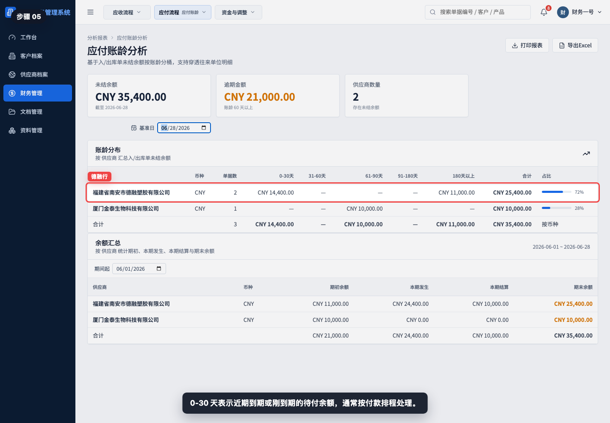

0-30 天表示近期到期或刚到期的待付余额。通常按付款排程处理，并结合供应商信用和合同条款确认付款时间。

## 步骤 06：读取 61-90 天账龄

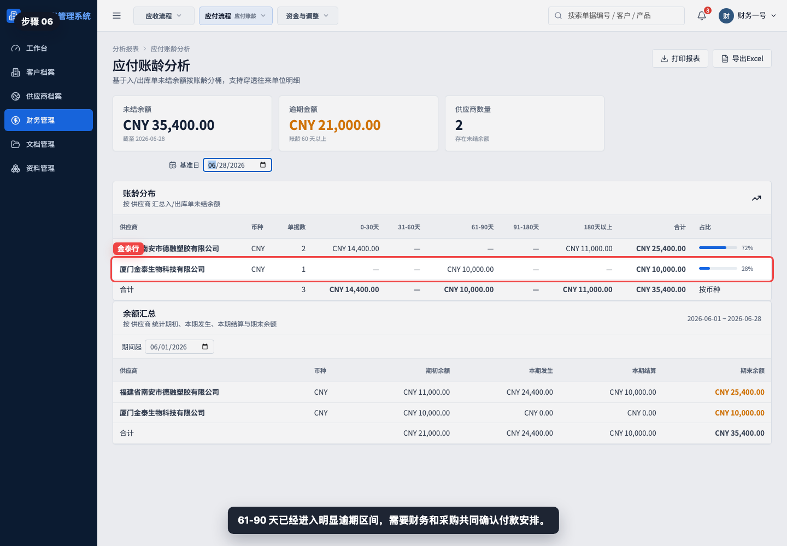

61-90 天已经进入明显逾期区间，需要财务和采购共同确认是否存在发票、质量、扣款或付款审批问题。

## 步骤 07：读取 180 天以上账龄

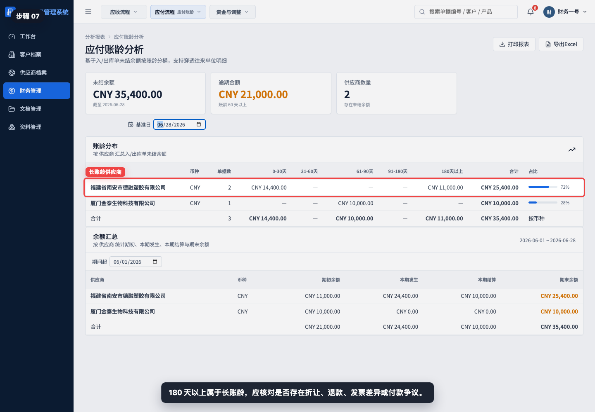

180 天以上属于长账龄，应核对是否存在折让、退款、发票差异、付款争议或需要财务调整。

## 步骤 08：查看合计和占比

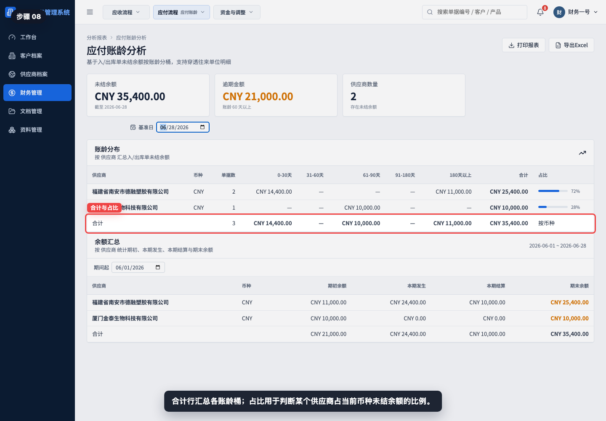

合计行汇总各账龄桶；占比用于判断某个供应商占当前币种未结余额的比例。

## 步骤 09：查看余额汇总

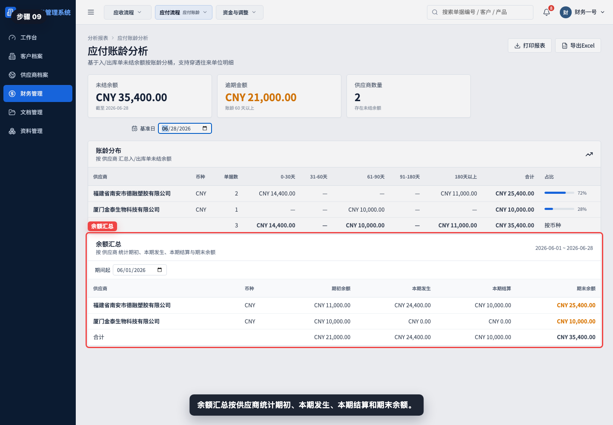

余额汇总按供应商统计期初余额、本期发生、本期结算和期末余额。它适合解释“待付余额为什么变化”。

## 步骤 10：调整期间起

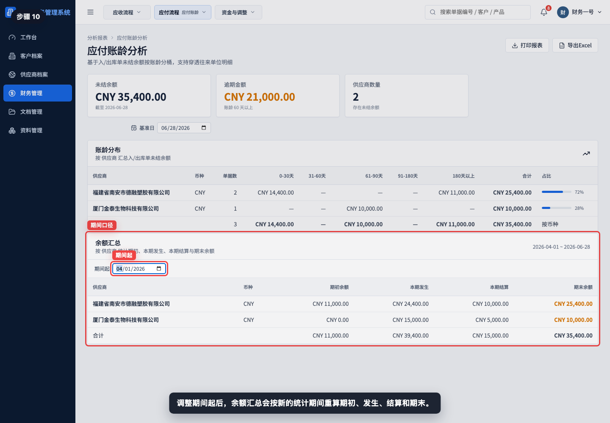

调整期间起后，余额汇总会按新的统计期间重算期初、本期发生、本期结算和期末余额。

## 步骤 11：打印或导出应付账龄

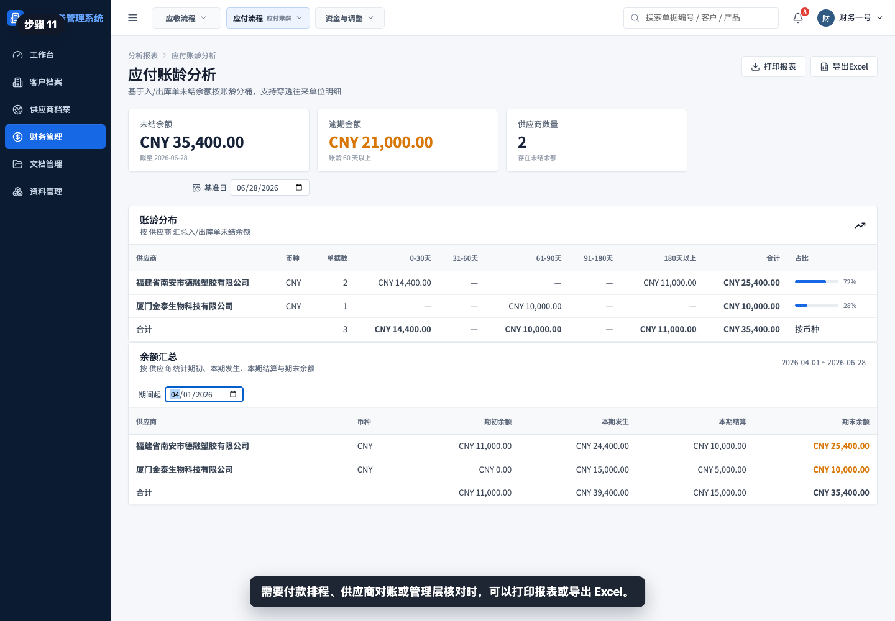

需要付款排程、供应商对账或管理层核对时，可以打印报表或导出 Excel。

## 相关教程

- [如何查看应付看板](../查看应付看板/README.md)
- [如何从入库单生成采购发票](../../财务管理/入库单生成采购发票/README.md)
- [如何从采购发票生成付款单](../../财务管理/采购发票生成付款单/README.md)
- [如何创建供应商退款单](../../财务管理/创建供应商退款单/README.md)

## 常见误读

- 把应付账龄当成应付明细。应付看板看单据余额，应付账龄看逾期结构。
- 只看未结余额，不看逾期金额。逾期金额更能反映付款风险和供应商关系压力。
- 忽略基准日。基准日不同，账龄桶和余额汇总都会变化。
- 只看供应商占比，不看具体账龄桶。同一供应商可能同时有近期应付和长账龄应付。
- 看到 0-30 天就认为无需处理。仍需结合付款条件、发票状态和资金计划判断。
- 看到 180 天以上仍按普通付款处理。长账龄通常需要先核对差异、争议或调整原因。

## 查看前检查清单

- 是否进入了“财务管理 > 应付账龄分析”。
- 是否确认基准日正确。
- 是否区分未结余额和逾期金额。
- 是否重点查看 61 天以上账龄桶。
- 是否识别 180 天以上的长账龄供应商。
- 是否查看供应商占比，判断风险集中度。
- 是否查看余额汇总解释期初、本期发生、本期结算和期末余额。
- 导出前是否确认基准日和期间起符合本次付款排程或供应商对账口径。
