# 如何查看应收看板

本指引用于培训财务、销售和管理层查看客户应收。示例包含一笔 DPL 待收款和一笔 ITC 已结清记录，覆盖进入应收看板、理解立账口径、读取顶部指标、核对财务明细、判断待收/已结清状态、打开源出库单，以及打印或导出报表。

## 适用场景

- 财务需要跟进哪些客户还有待收余额。
- 销售需要确认某张出库单是否已经回款。
- 管理层需要查看当前应收总额、已收金额和未结单据数量。
- 财务需要从应收明细打开源出库单，核对客户、合同、产品和金额。
- 需要导出应收看板给催收、对账或经营分析使用。

## 核心口径

| 看板项 | 含义 | 数据来源 |
|---|---|---|
| 单据数量 | 当前有效出库立账单据数量 | 已确认库存出库单 |
| 立账金额 | 正式应收金额 | 已确认销售发票优先；未开票时按出库单金额 |
| 累计收款 | 已登记客户实际回款 | 已确认收款单 |
| 待收金额 | 尚未收回的余额 | 立账金额 - 累计收款 |
| 未结单据 | 仍有待收余额的出库单 | 待收金额大于 0 的行 |
| 收付款记录数 | 与该出库单或销售发票关联的现金单据数量 | 收款单等结算记录 |

关键公式：

```text
立账金额 = 销售发票金额；如果没有销售发票，则暂按库存出库单金额
累计收款 = 已确认收款单金额
待收金额 = 立账金额 - 累计收款
```

## 步骤 01：进入应收看板

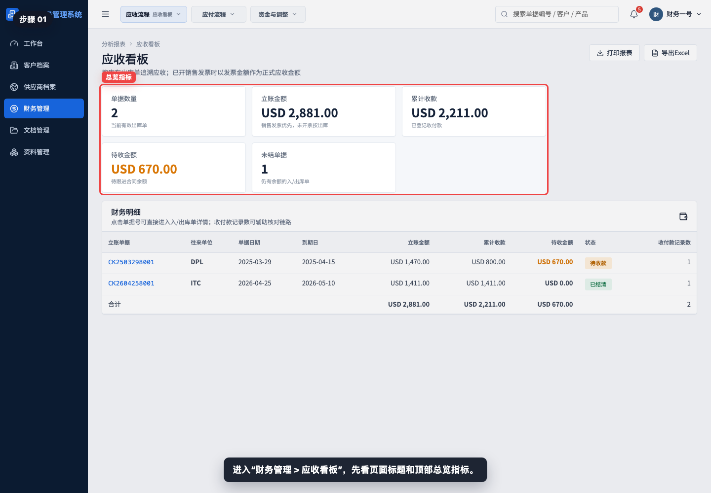

进入“财务管理 > 应收看板”，先看页面标题、说明和顶部总览指标。

## 步骤 02：理解应收立账口径

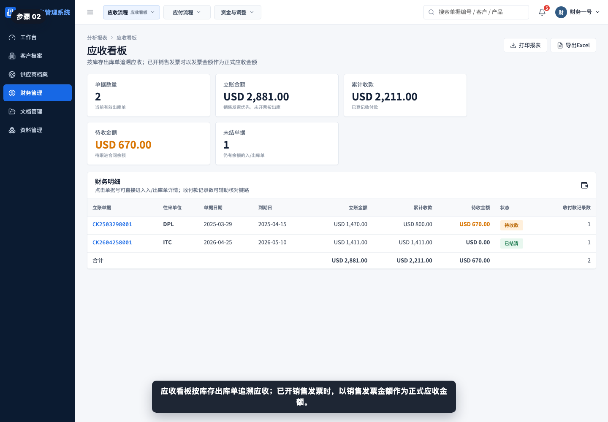

应收看板按库存出库单追溯应收；已开销售发票时，以销售发票金额作为正式应收金额。

## 步骤 03：查看单据数量和立账金额

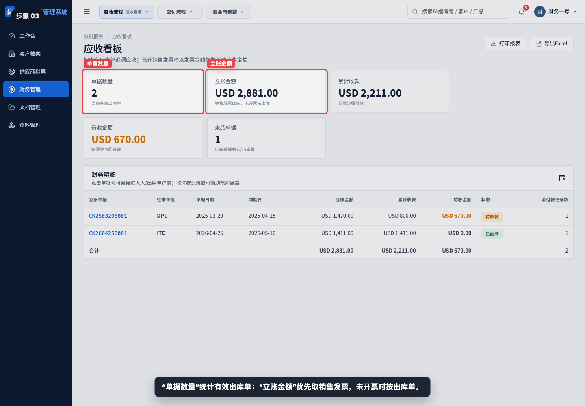

“单据数量”统计有效出库单；“立账金额”汇总每张出库单对应的正式应收金额。

## 步骤 04：查看累计收款和待收金额

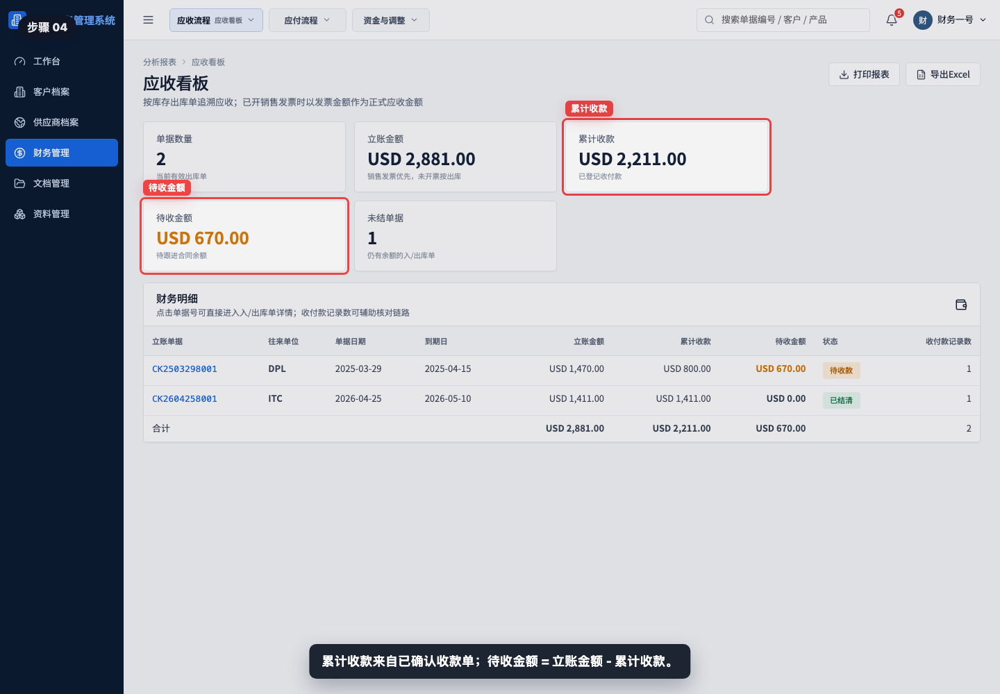

累计收款来自已确认收款单。待收金额 = 立账金额 - 累计收款，是财务需要继续跟进的余额。

## 步骤 05：查看未结单据数量

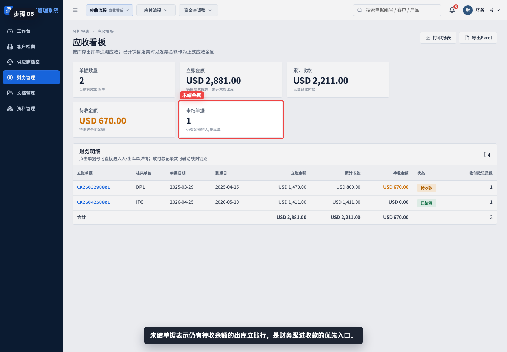

未结单据表示仍有待收余额的出库立账行。该指标适合财务每日检查。

## 步骤 06：阅读财务明细表

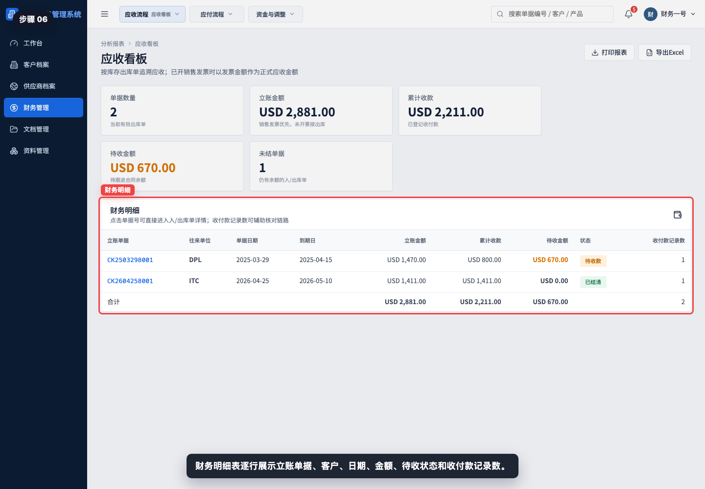

财务明细表逐行展示立账单据、往来单位、单据日期、到期日、立账金额、累计收款、待收金额、状态和收付款记录数。

## 步骤 07：读取待收款行

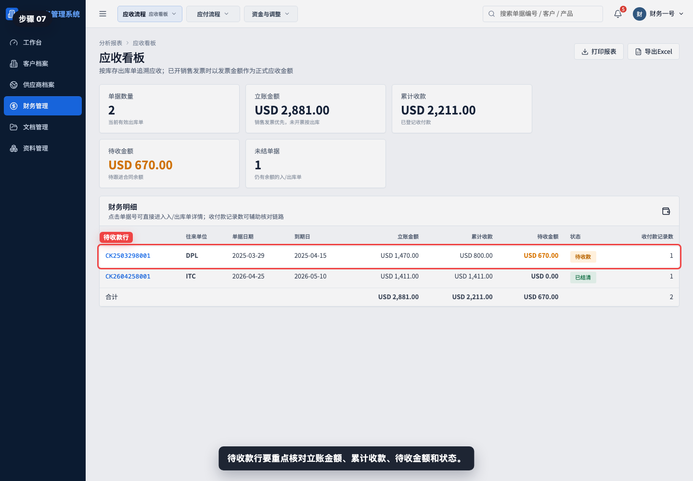

待收款行要重点核对立账金额、累计收款、待收金额和状态。示例中 DPL 已收 USD 800.00，仍待收 USD 670.00。

## 步骤 08：读取已结清行

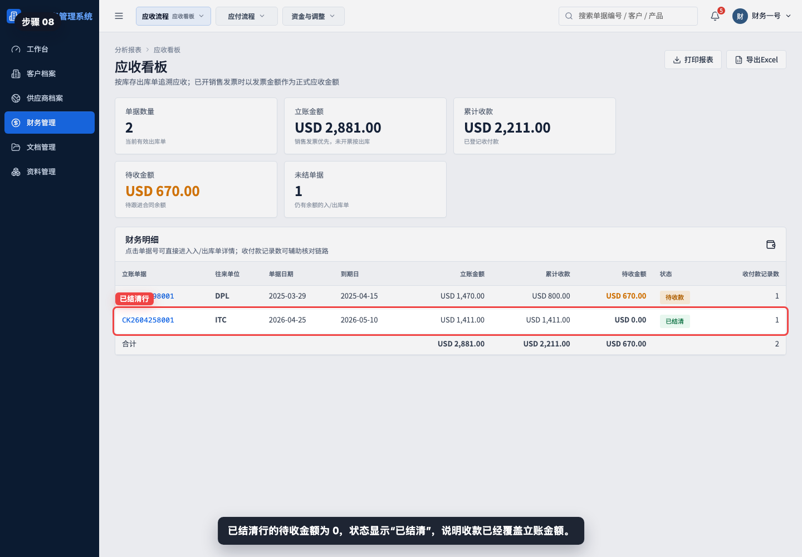

已结清行的待收金额为 0，状态显示“已结清”，说明收款已经覆盖立账金额。

## 步骤 09：核对收付款记录数

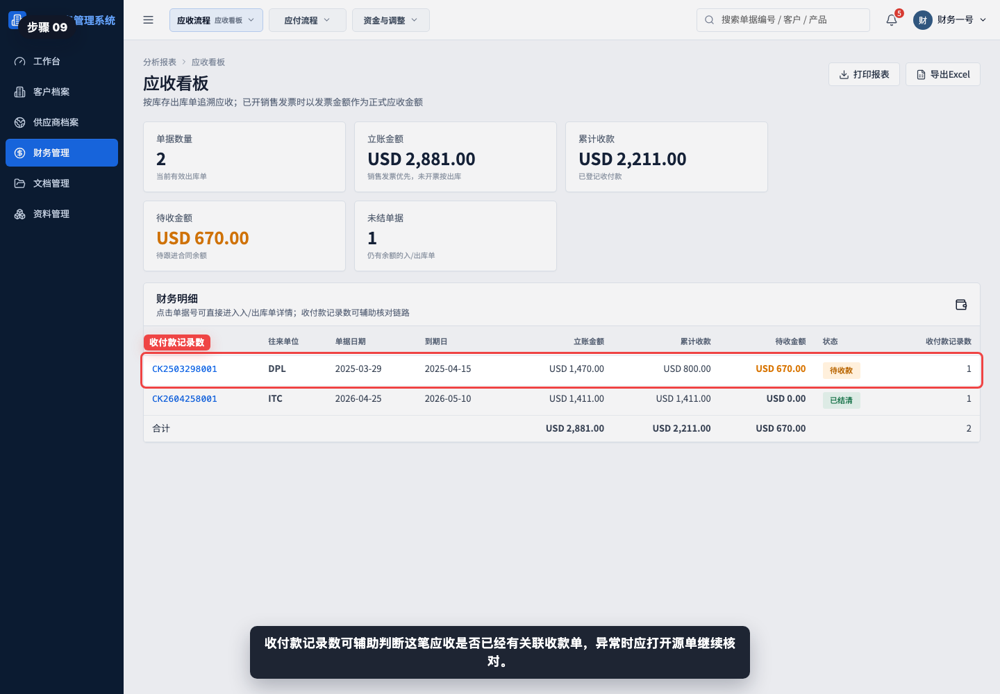

收付款记录数可辅助判断这笔应收是否已经有关联收款单。如果金额异常，应打开收款单、销售发票或源出库单继续核对。

## 步骤 10：打开立账出库单

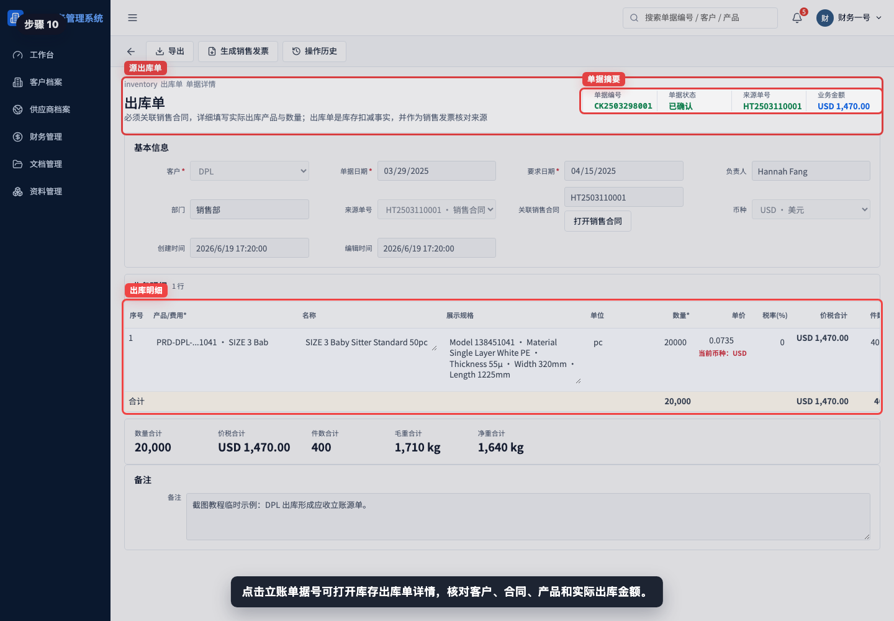

点击立账单据号可打开库存出库单详情，核对客户、销售合同、产品明细、实际出库数量和出库金额。

## 步骤 11：打印或导出应收看板

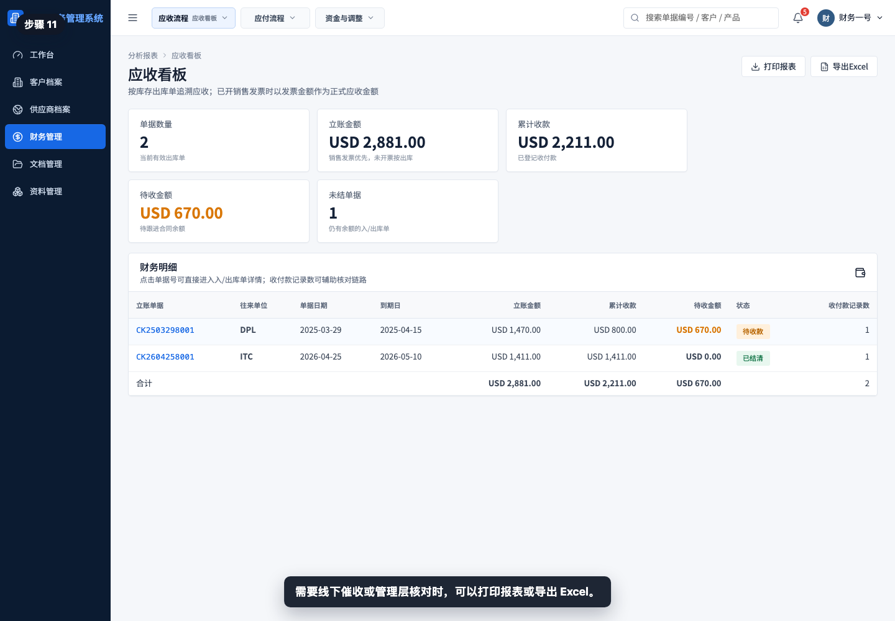

需要线下催收、客户对账或管理层核对时，可以打印报表或导出 Excel。

## 相关教程

- [如何从出库单生成销售发票](../../财务管理/出库单生成销售发票/README.md)
- [如何从销售发票生成收款单](../../财务管理/销售发票生成收款单/README.md)
- [如何创建客户退款单](../../财务管理/创建客户退款单/README.md)
- 如何查看应收账龄（后续 P3-6 制作）

## 常见误读

- 把应收看板当成开票页面。开票需要进入销售发票流程，应收看板只汇总余额。
- 只看出库单金额，不看销售发票金额。已开票时，正式应收以销售发票为准。
- 看到收付款记录数大于 0 就认为已结清。必须同时看待收金额是否为 0。
- 忽略到期日。待收金额相同的情况下，越早到期的单据优先跟进。
- 用应收看板替代账龄分析。应收看板看单据余额，应收账龄看逾期结构。
- 退款、扣款或差异未闭环时，只看收款单可能无法解释余额，需要回到源单和调整流程核对。

## 查看前检查清单

- 是否进入了“财务管理 > 应收看板”。
- 是否确认立账金额按销售发票优先、未开票按出库单。
- 是否核对累计收款和待收金额。
- 是否重点查看状态为“待收款”的行。
- 是否打开源出库单核对客户、合同、产品和出库金额。
- 是否需要继续查看销售发票、收款单、客户退款单或应收账龄。
- 导出前是否确认当前页面就是需要交付给对账或催收人员的口径。
