# 如何查看应收账龄

本指引用于培训财务、销售和管理层查看客户未收余额的账龄结构。示例包含 DPL 和 ITC 两个客户，覆盖进入应收账龄分析、理解基准日、读取未结余额和逾期金额、查看不同账龄区间、判断客户占比、查看余额汇总、调整期间起，以及打印或导出报表。

## 适用场景

- 财务需要判断哪些客户应收已经逾期。
- 销售需要配合财务跟进长账龄客户。
- 管理层需要查看未结余额中有多少已经超过 60 天。
- 需要按客户和币种拆分应收风险，而不只是看单据明细。
- 需要导出账龄报表用于催收会议、客户对账或经营复盘。

## 核心口径

| 看板项 | 含义 | 数据来源 |
|---|---|---|
| 未结余额 | 截至基准日仍未收回的余额 | 出库单/销售发票 - 收款单 |
| 逾期金额 | 账龄 60 天以上的未结余额 | 61-90 天、91-180 天、180 天以上 |
| 客户数量 | 存在未结余额的客户数量 | 按客户和币种汇总 |
| 基准日 | 账龄计算截止日期 | 页面日期选择 |
| 账龄分布 | 未结余额按到期日到基准日的天数分桶 | 应收未结余额 |
| 余额汇总 | 期初、本期发生、本期结算、期末余额 | 按期间起和基准日统计 |

账龄桶：

```text
0-30天
31-60天
61-90天
91-180天
180天以上
```

## 步骤 01：进入应收账龄分析

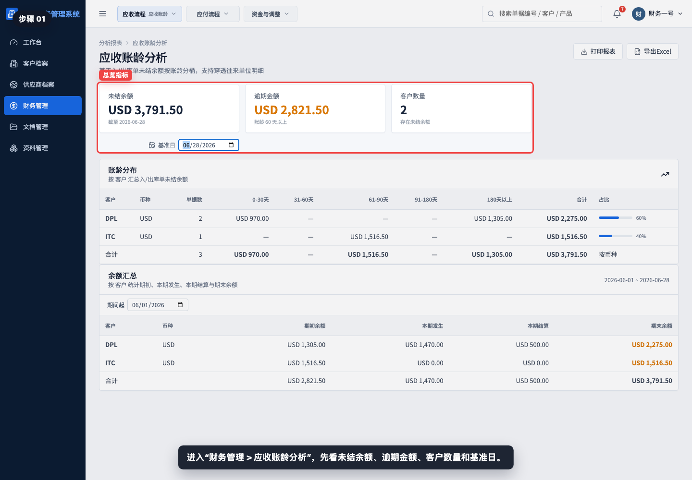

进入“财务管理 > 应收账龄分析”，先看未结余额、逾期金额、客户数量和基准日。

## 步骤 02：理解基准日

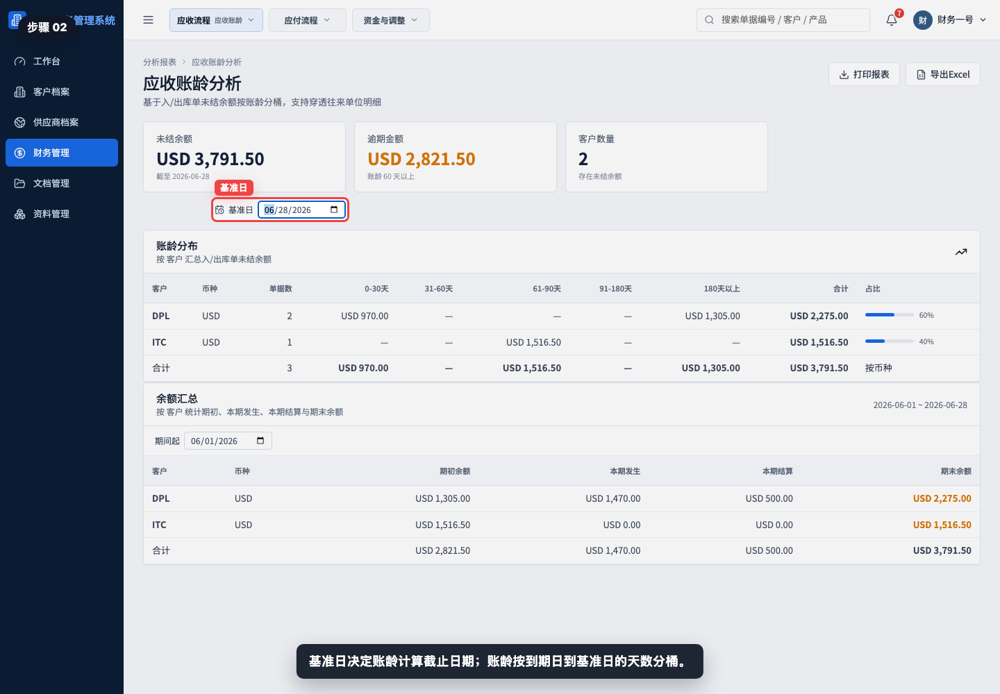

基准日决定账龄计算截止日期。系统按每笔应收到期日到基准日的天数，把未结余额放入不同账龄桶。

## 步骤 03：查看未结余额和逾期金额

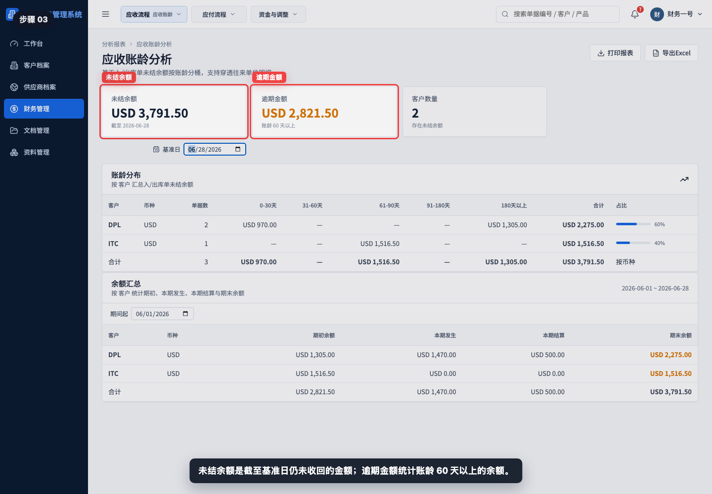

未结余额表示截至基准日尚未收回的客户余额；逾期金额统计 60 天以上的未结余额。

## 步骤 04：阅读账龄分布表

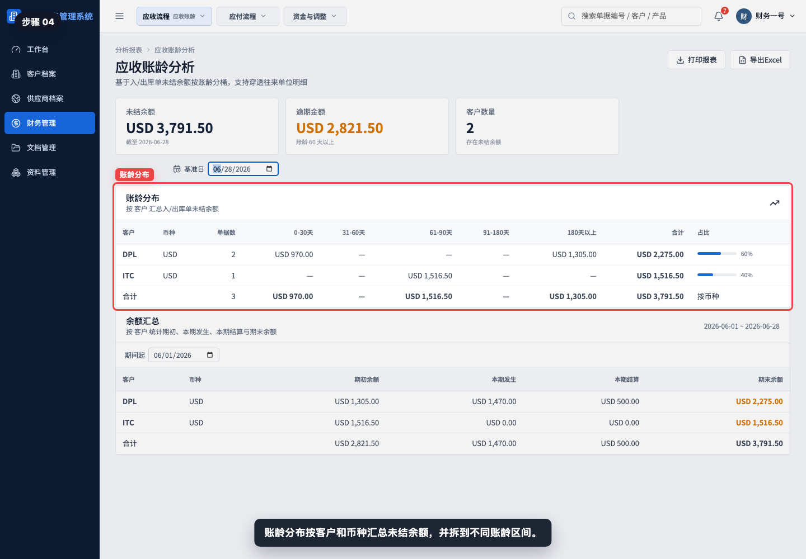

账龄分布按客户和币种汇总未结余额，并拆分到 0-30 天、31-60 天、61-90 天、91-180 天和 180 天以上。

## 步骤 05：读取 0-30 天账龄

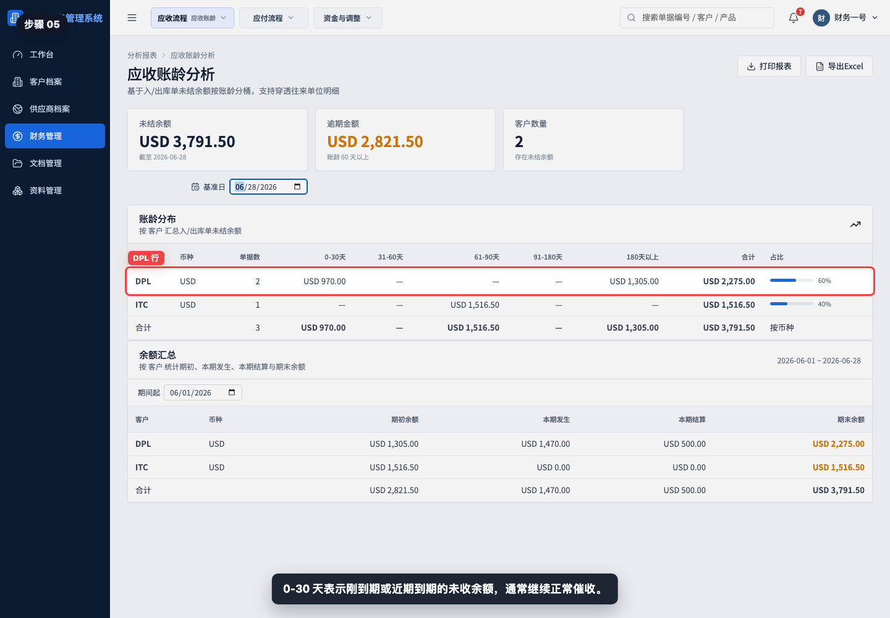

0-30 天表示刚到期或近期到期的未收余额。一般先按正常催收节奏跟进，并确认客户付款计划。

## 步骤 06：读取 61-90 天账龄

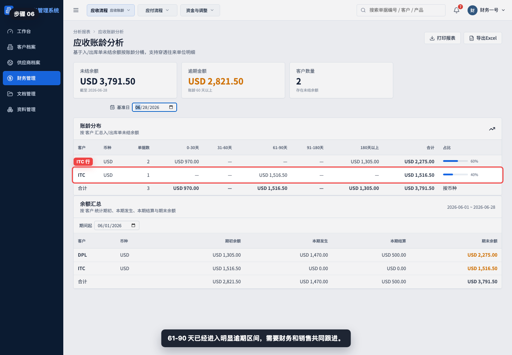

61-90 天已经进入明显逾期区间，需要财务和销售共同跟进，确认是否存在质量、扣款、单证或客户资金问题。

## 步骤 07：读取 180 天以上账龄

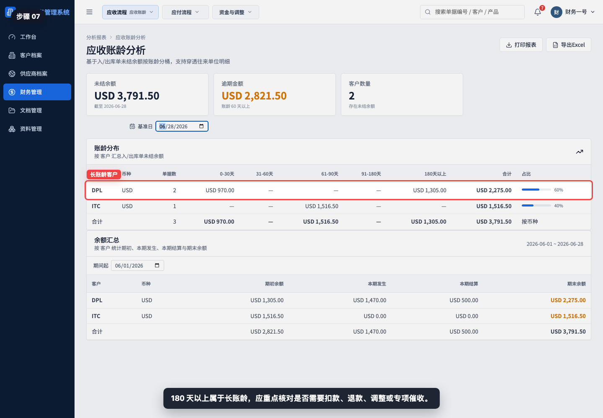

180 天以上属于长账龄，应重点核对是否需要客户扣款、退款、财务调整、坏账评估或专项催收。

## 步骤 08：查看合计和占比

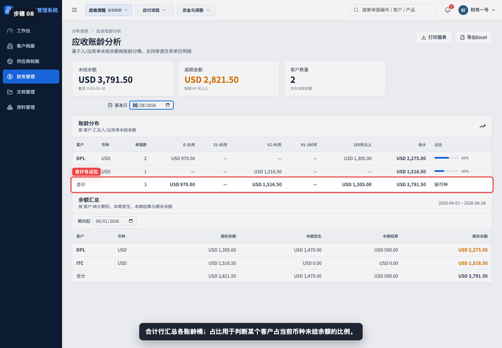

合计行汇总各账龄桶；占比用于判断某个客户占当前币种未结余额的比例。

## 步骤 09：查看余额汇总

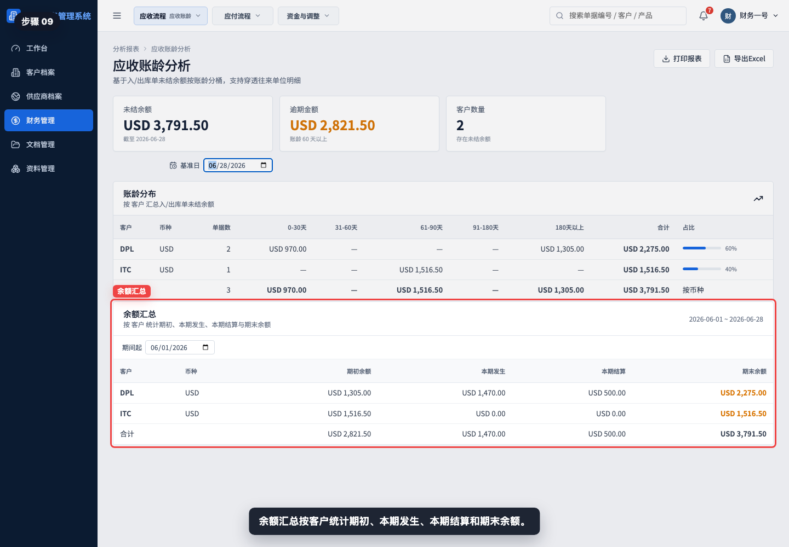

余额汇总按客户统计期初余额、本期发生、本期结算和期末余额。它适合解释“余额为什么变化”。

## 步骤 10：调整期间起

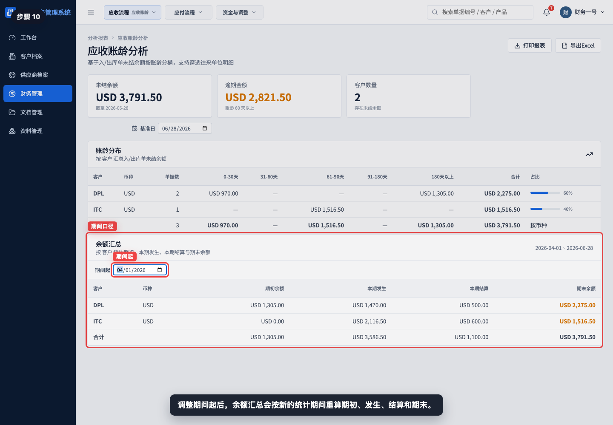

调整期间起后，余额汇总会按新的统计期间重算期初、本期发生、本期结算和期末余额。

## 步骤 11：打印或导出应收账龄

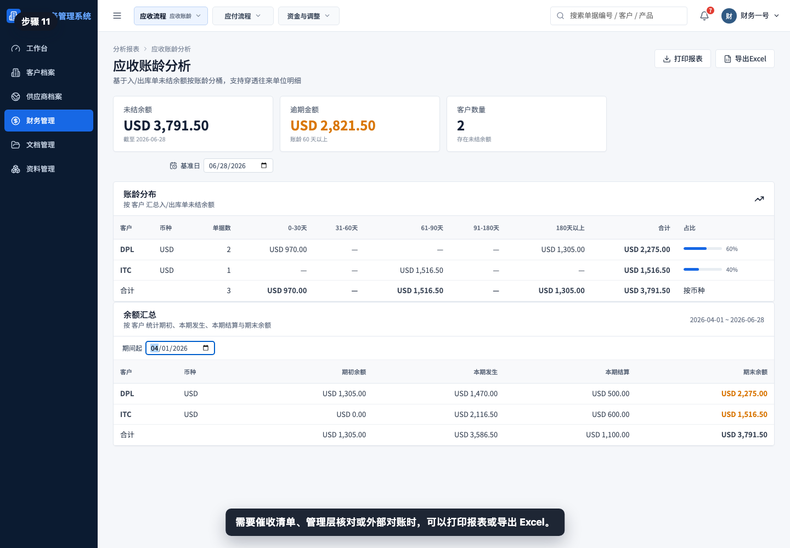

需要催收清单、管理层核对或外部对账时，可以打印报表或导出 Excel。

## 相关教程

- [如何查看应收看板](../查看应收看板/README.md)
- [如何从出库单生成销售发票](../../财务管理/出库单生成销售发票/README.md)
- [如何从销售发票生成收款单](../../财务管理/销售发票生成收款单/README.md)
- [如何创建客户退款单](../../财务管理/创建客户退款单/README.md)

## 常见误读

- 把应收账龄当成应收明细。应收看板看单据余额，应收账龄看逾期结构。
- 只看未结余额，不看逾期金额。逾期金额更能反映催收风险。
- 忽略基准日。基准日不同，账龄桶和余额汇总都会变化。
- 只看客户占比，不看具体账龄桶。同一客户可能同时有近期余额和长账龄余额。
- 看到 0-30 天就认为没有风险。仍需结合客户付款习惯和合同条款判断。
- 看到 180 天以上仍只做普通催收。长账龄通常需要销售、财务和管理层共同处理。

## 查看前检查清单

- 是否进入了“财务管理 > 应收账龄分析”。
- 是否确认基准日正确。
- 是否区分未结余额和逾期金额。
- 是否重点查看 61 天以上账龄桶。
- 是否识别 180 天以上的长账龄客户。
- 是否查看客户占比，判断风险集中度。
- 是否查看余额汇总解释期初、本期发生、本期结算和期末余额。
- 导出前是否确认基准日和期间起符合本次对账或催收口径。
