# 如何查看资金流水

本指引用于培训财务和管理层按公司账户核对现金流入、现金流出和净现金流。示例覆盖收款单、供应商退款单、付款单、客户退款单、费用单和已付款报销单，并说明销售发票、采购发票和财务调整单为什么不会直接进入资金流水。

## 适用场景

- 财务需要按账户核对一段时间内的收款、付款、退款和费用。
- 管理层需要查看公司实际现金流入、现金流出和净现金流。
- 需要区分“已经开票”和“已经收付现金”。
- 需要按 USD、EUR 等不同币种和公司账户拆分现金流。
- 月末对账时，需要从资金流水追溯到原始收款单或付款单。

## 核心口径

| 看板项 | 含义 | 数据来源 |
|---|---|---|
| 现金流入 | 实际进入公司账户的金额 | 收款单、供应商退款单 |
| 现金流出 | 实际从公司账户支出的金额 | 付款单、客户退款单、费用单、已付款报销单 |
| 净现金流 | 现金流入减现金流出 | 按币种分别计算 |
| 公司账户 | 实际收付使用的公司银行账户 | 财务单据的公司账户字段 |
| 日期区间 | 统计现金事件发生日期 | 单据日期 |
| 账户汇总 | 按公司账户汇总流入、流出和净额 | 资金流水明细聚合 |
| 流水明细 | 每一笔现金事件的来源单据 | 有效状态的资金类单据 |

资金流水只统计真实现金事件：

```text
流入：收款单、供应商退款单
流出：付款单、客户退款单、费用单、已付款报销单
不进入资金流水：销售发票、采购发票、财务调整单、草稿单据
```

## 步骤 01：进入资金流水

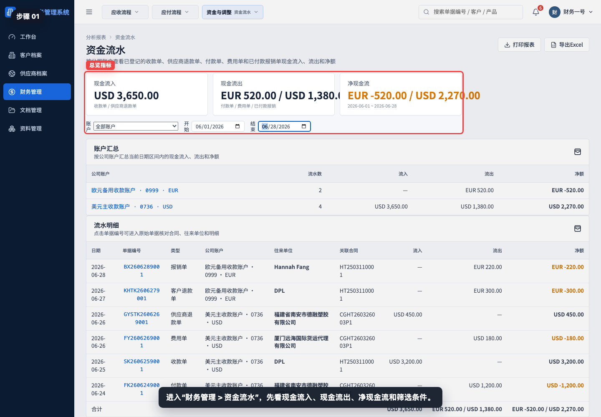

进入“财务管理 > 资金流水”，先确认页面标题、日期区间、账户筛选和右侧操作按钮。

## 步骤 02：理解资金流水口径

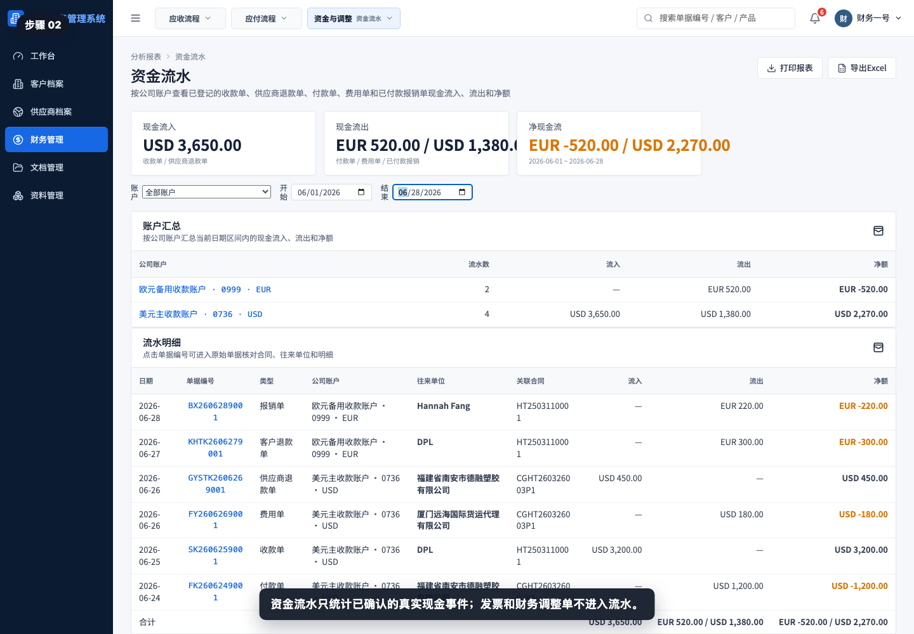

资金流水的核心不是发票金额，而是公司账户实际发生的收款、付款、退款和费用。培训时先讲清楚统计口径，避免把应收应付误认为现金流。

## 步骤 03：查看流入流出和净额

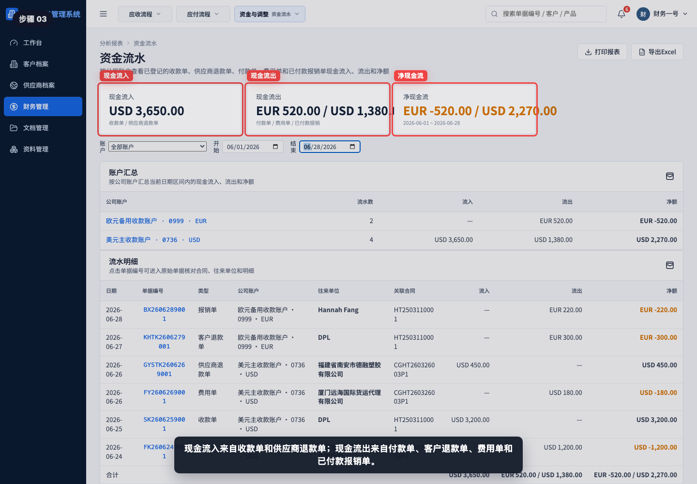

顶部指标展示现金流入、现金流出和净现金流。多币种会分别显示，不应把 USD、EUR 直接相加。

## 步骤 04：设置账户和日期筛选

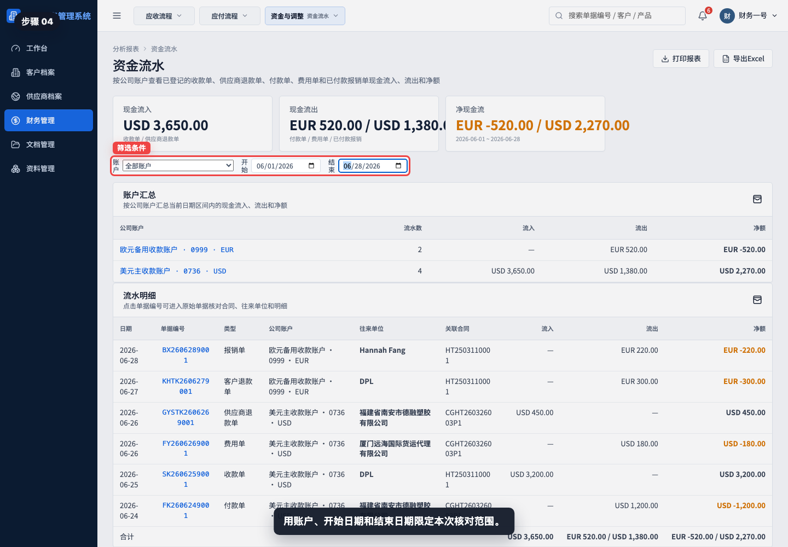

先选择公司账户，再设置开始日期和结束日期。月末对账通常按银行账单期间设置日期。

## 步骤 05：查看账户汇总

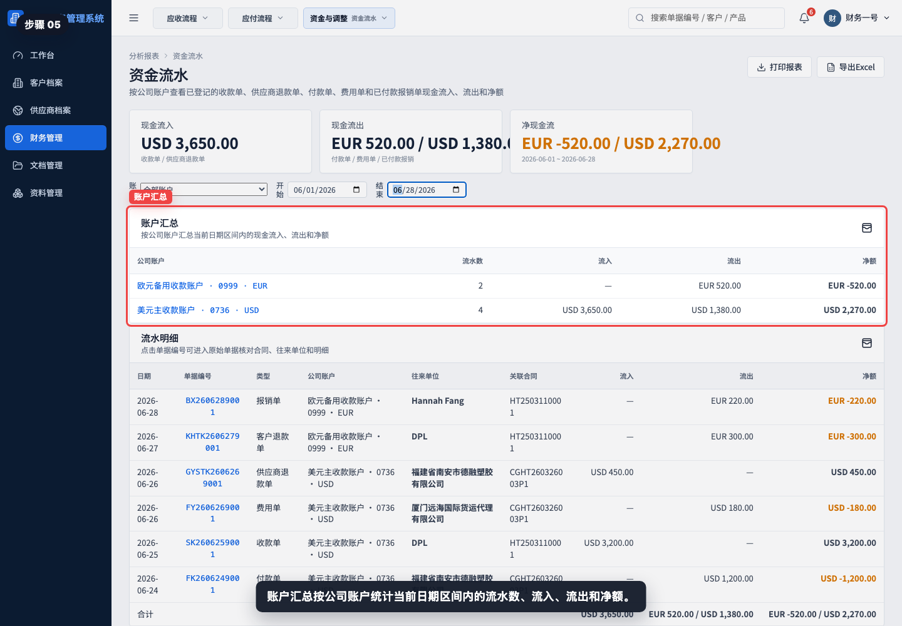

账户汇总按公司银行账户显示本期流入、流出和净额，适合快速判断哪个账户现金增加或减少。

## 步骤 06：按账户筛选流水

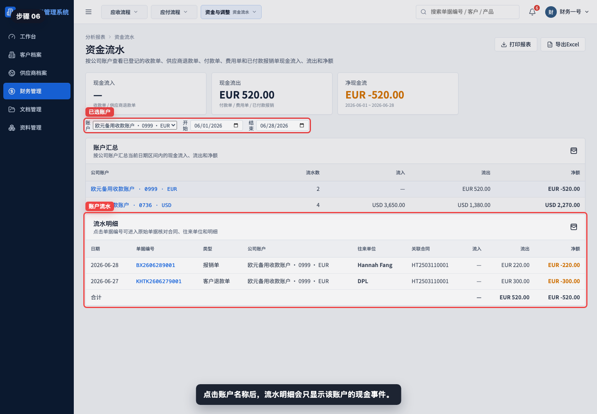

选择某一个公司账户后，页面只保留该账户相关流水。核对单个银行账号时，应先使用账户筛选。

## 步骤 07：阅读流水明细

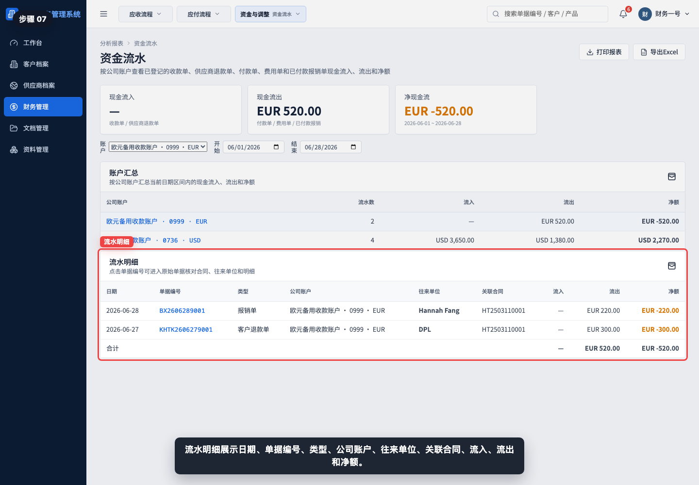

流水明细展示日期、类型、单号、往来单位、公司账户、流入、流出和关联业务。发现差异时，从这里定位原始单据。

## 步骤 08：识别现金流入

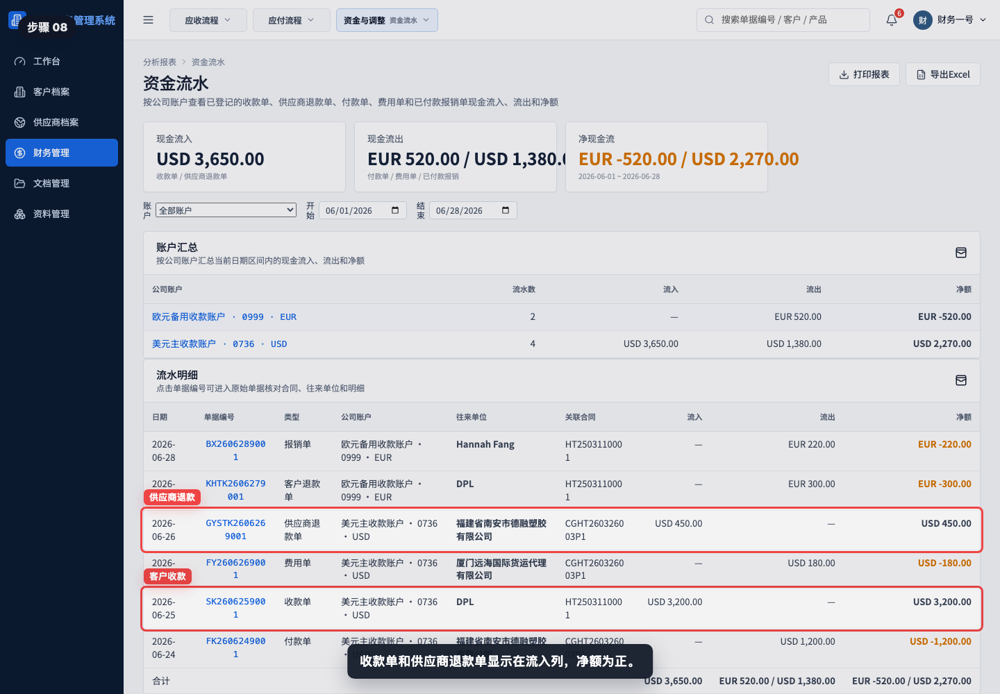

收款单和供应商退款单显示在流入列。它们代表公司账户收到客户款项或供应商退回款项。

## 步骤 09：识别现金流出

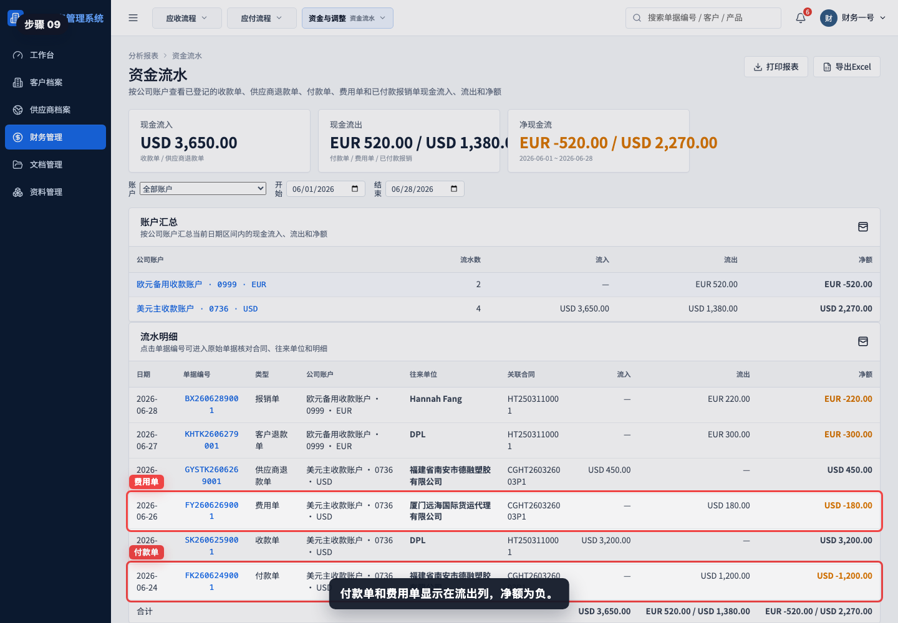

付款单、客户退款单、费用单和已付款报销单显示在流出列。它们代表公司账户实际支出。

## 步骤 10：打开原始收款单

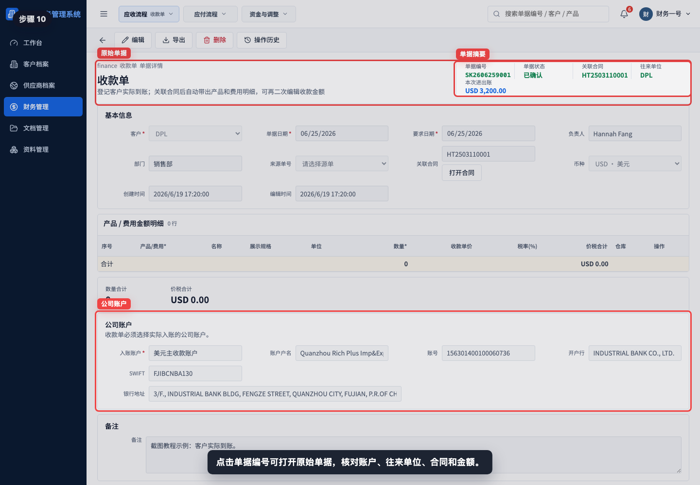

点击流水单号可以回到原始单据。核对到账账户、金额、客户、关联合同或来源单据是否一致。

## 步骤 11：调整日期区间

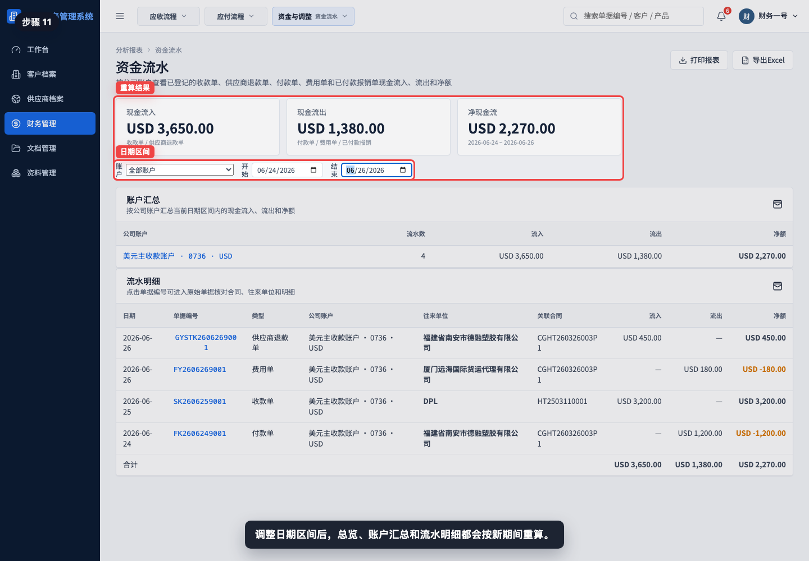

修改日期区间后，顶部指标、账户汇总和流水明细都会重新计算。导出前应再次确认日期范围。

## 步骤 12：打印或导出资金流水

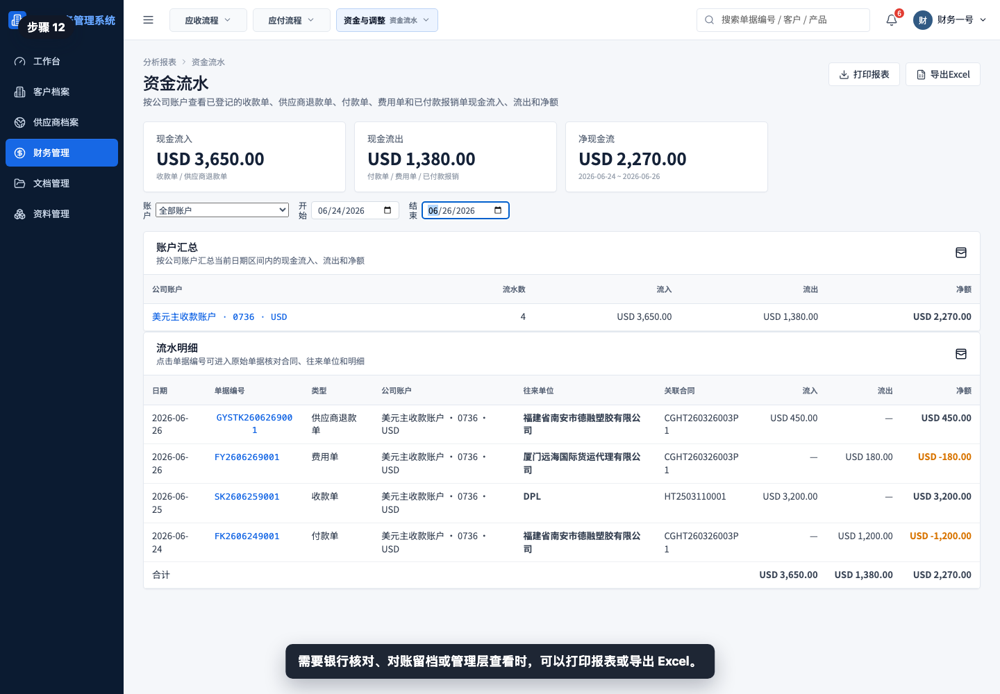

需要做银行对账、月末结账或管理层汇报时，可以打印或导出资金流水。导出前确认账户和日期筛选符合本次对账口径。

## 相关教程

- [如何从销售发票生成收款单](../../财务管理/销售发票生成收款单/README.md)
- [如何从采购发票生成付款单](../../财务管理/采购发票生成付款单/README.md)
- [如何创建客户退款单](../../财务管理/创建客户退款单/README.md)
- [如何创建供应商退款单](../../财务管理/创建供应商退款单/README.md)
- [如何创建费用单](../../财务管理/创建费用单/README.md)
- [如何创建报销单](../../财务管理/创建报销单/README.md)
- [如何创建财务调整单](../../财务管理/创建财务调整单/README.md)

## 常见误读

- 把销售发票当成现金流入。销售发票确认应收，只有收款单才代表实际到账。
- 把采购发票当成现金流出。采购发票确认应付，只有付款单才代表实际付款。
- 忽略公司账户。资金流水按实际账户归集，账户选错会影响银行对账。
- 混合不同币种看净额。系统按币种分别展示，不能直接跨币种相加。
- 把财务调整单当成资金流水。财务调整单用于修正余额或差异，不代表公司账户真实收付。
- 只看顶部净现金流，不看流水明细。净额异常时必须回到具体单据确认原因。

## 查看前检查清单

- 是否进入了“财务管理 > 资金流水”。
- 是否确认日期区间与银行账单或月末期间一致。
- 是否选择了正确公司账户，或确认当前为全部账户。
- 是否区分现金流入、现金流出和净现金流。
- 是否按币种分别核对金额。
- 是否知道收款单、供应商退款单进入流入列。
- 是否知道付款单、客户退款单、费用单和已付款报销单进入流出列。
- 是否确认销售发票、采购发票和财务调整单不会直接进入资金流水。
- 导出前是否检查账户汇总和流水明细没有漏项。
