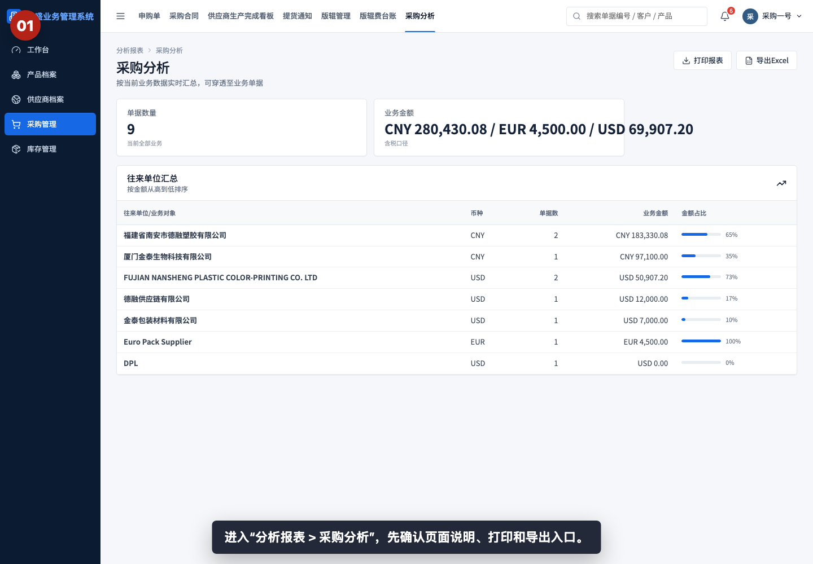
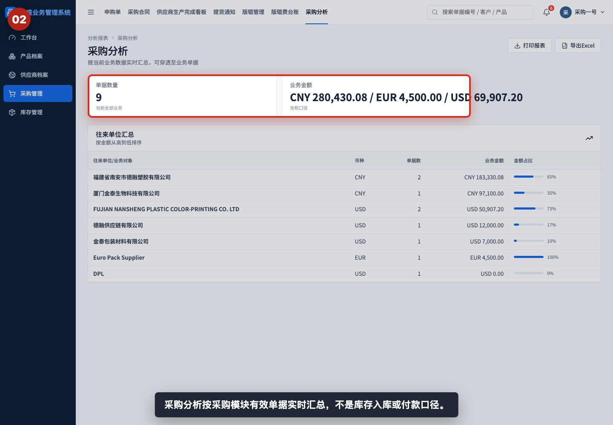
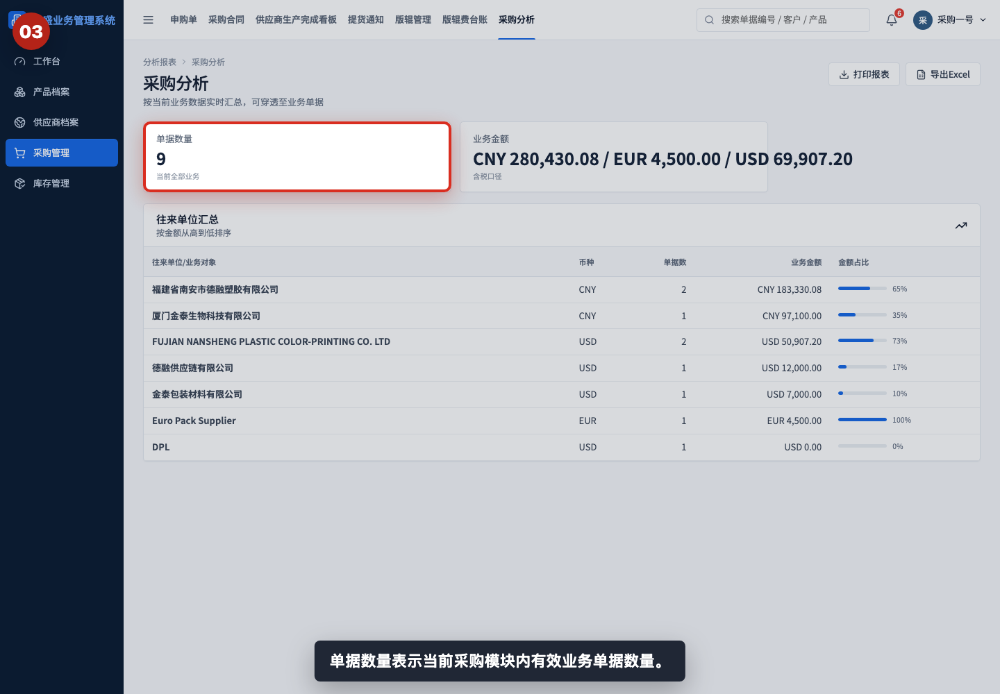
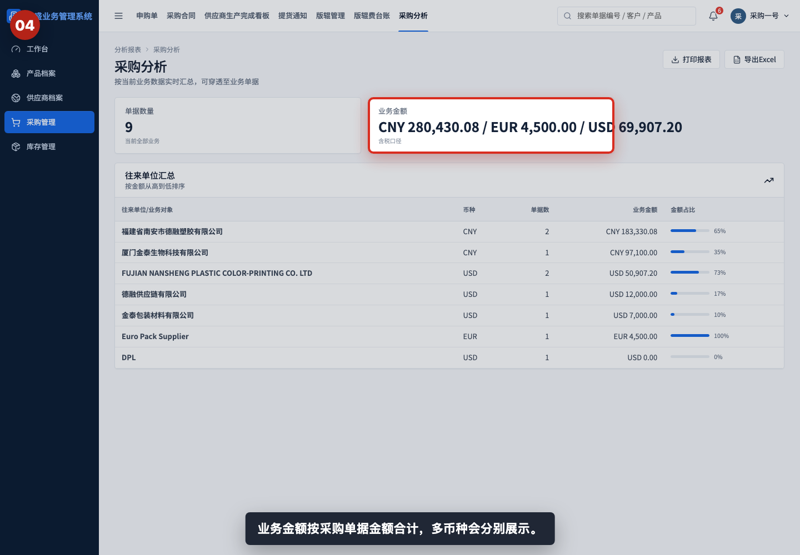
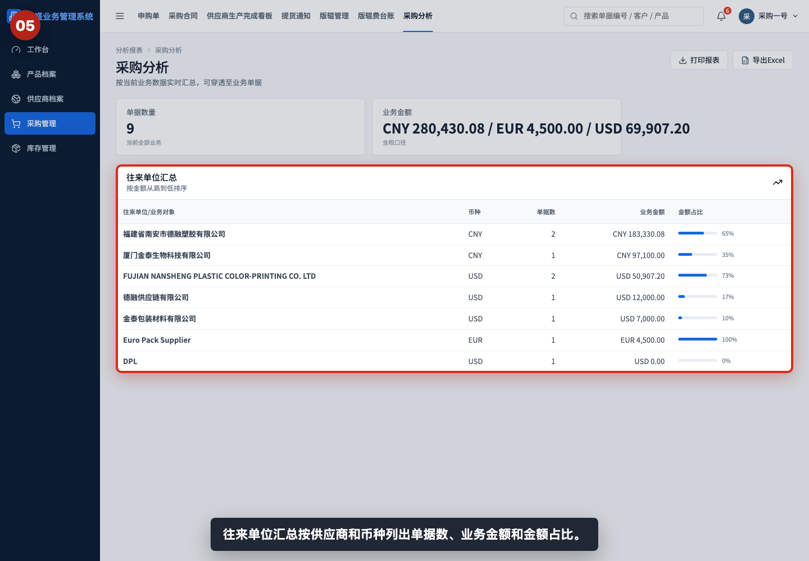
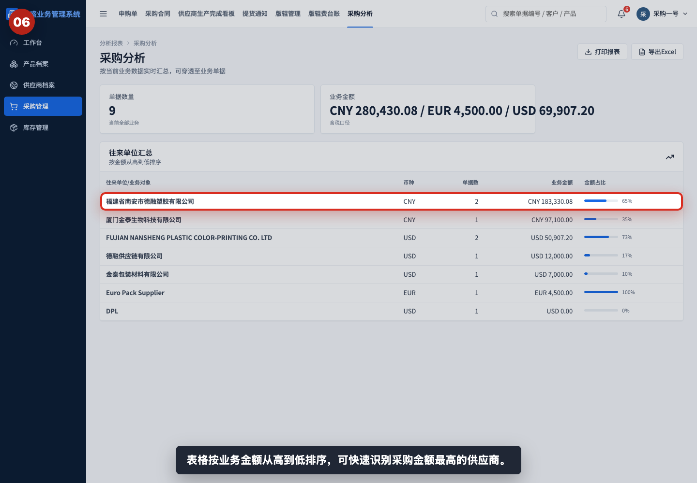
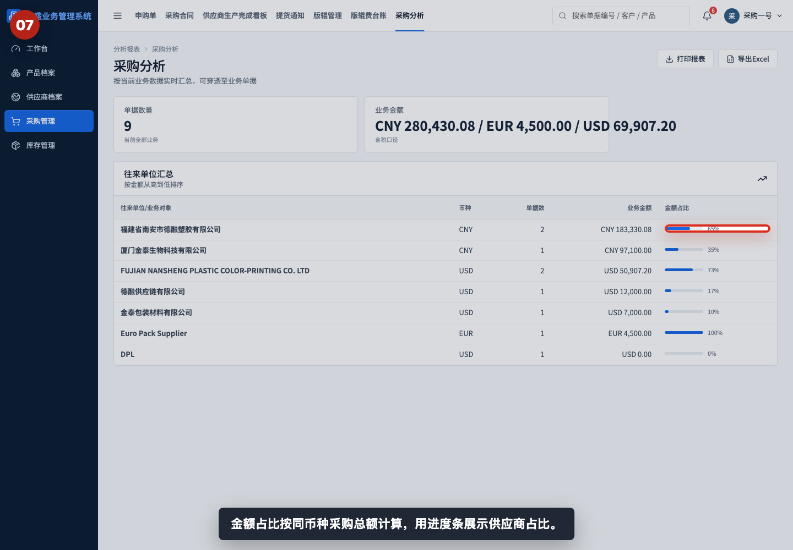
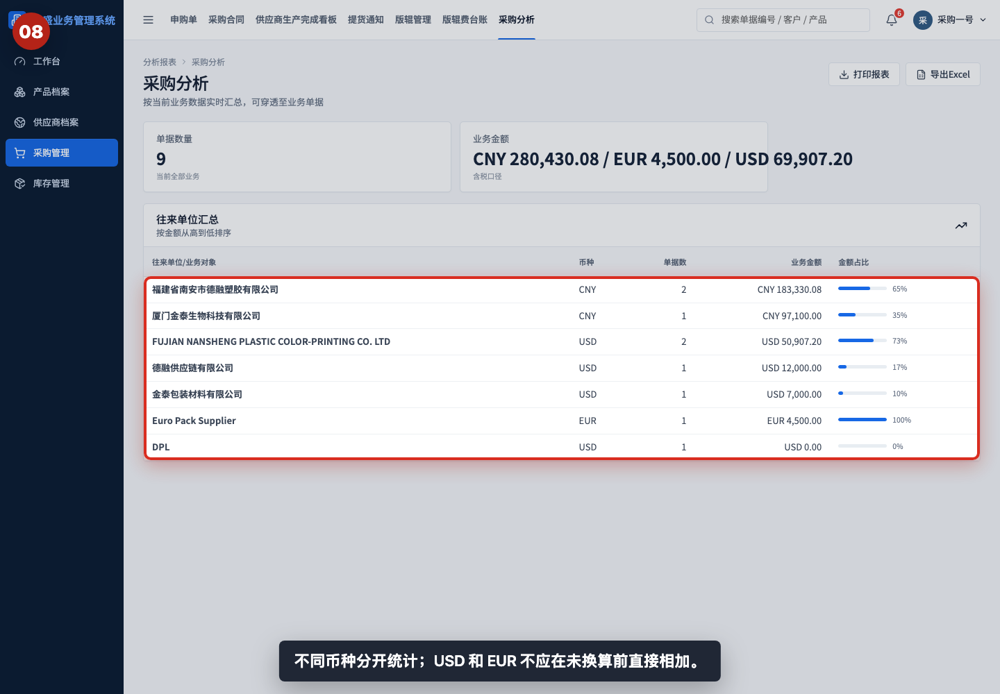
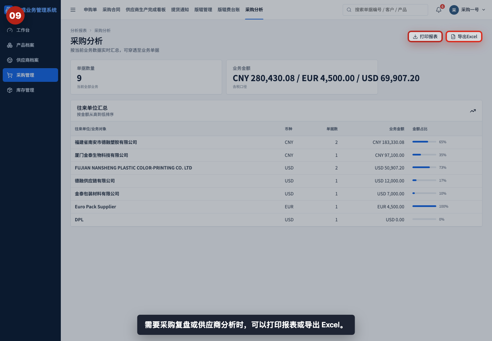

# 如何查看采购分析

本指引用于培训采购、管理层和财务查看采购模块的业务金额结构。示例覆盖进入采购分析、理解统计口径、查看单据数量和业务金额、查看供应商汇总、识别主要供应商、查看金额占比、区分不同币种，以及打印或导出报表。

## 适用场景

- 采购需要复盘当前采购业务金额和供应商结构。
- 管理层需要查看采购金额主要集中在哪些供应商。
- 财务需要辅助核对采购模块的业务金额口径。
- 需要按币种区分 USD、EUR、CNY 等采购金额。
- 需要导出供应商采购金额和占比用于月度复盘。

## 核心口径

| 看板项 | 含义 | 数据来源 |
|---|---|---|
| 单据数量 | 当前采购模块内有效业务单据数量 | 采购模块单据 |
| 业务金额 | 当前采购模块有效单据金额合计 | 采购模块单据金额 |
| 往来单位汇总 | 按供应商/业务对象和币种分组 | 采购模块单据 |
| 单据数 | 某供应商在某币种下的有效单据数量 | 采购模块单据 |
| 业务金额 | 某供应商在某币种下的采购业务金额 | 采购模块单据金额 |
| 金额占比 | 某供应商金额占同币种总金额的比例 | 同币种业务金额 |

采购分析是采购模块的整体业务汇总：

```text
统计对象：purchase 模块内的有效单据
排序规则：按业务金额从高到低
占比口径：按同一币种内的采购总额计算
不等同于：库存入库金额、采购发票金额、付款金额
```

## 步骤 01：进入采购分析



进入“分析报表 > 采购分析”，先确认页面说明、打印报表和导出 Excel 入口。

## 步骤 02：理解采购分析口径



采购分析按采购模块有效单据实时汇总，不是库存入库、采购发票或付款口径。培训时应先说明它用于采购业务结构复盘。

## 步骤 03：查看采购单据数量



单据数量表示当前采购模块内有效业务单据数量。它反映采购业务规模，但不代表供应商数量。

## 步骤 04：查看采购业务金额



业务金额按采购单据金额合计。多币种会分别展示，不应在未换算前直接相加。

## 步骤 05：查看供应商汇总表



往来单位汇总按供应商和币种列出单据数、业务金额和金额占比。它是采购分析的主要阅读区域。

## 步骤 06：识别主要供应商



表格按业务金额从高到低排序，可以快速识别采购金额最高的供应商。复盘时通常先看排名靠前的供应商。

## 步骤 07：查看金额占比



金额占比按同币种采购总额计算，用进度条展示供应商占比。占比越高，说明采购金额越集中。

## 步骤 08：区分不同币种



不同币种分开统计。查看采购结构时，应按币种分别分析，或在外部按统一汇率换算后再做合计。

## 步骤 09：打印或导出采购分析



需要采购复盘、供应商分析或管理层汇报时，可以打印报表或导出 Excel。

## 相关教程

- [如何创建采购合同](../../采购管理/创建采购合同/README.md)
- [如何从申购单下推采购合同](../../采购管理/申购单下推采购合同/README.md)
- [如何从采购合同下推提货通知](../../采购管理/采购合同下推提货通知/README.md)
- [如何从提货通知下推采购入库单](../../库存管理/提货通知下推采购入库单/README.md)
- [如何查看应付看板](../查看应付看板/README.md)
- [如何查看发票差异看板](../查看发票差异看板/README.md)

## 常见误读

- 把采购分析当成库存入库分析。采购分析看采购模块业务金额，库存入库要看入库单和库存看板。
- 把采购分析当成付款分析。付款金额应查看应付看板、付款单和资金流水。
- 跨币种直接相加。不同币种金额应分开分析，或按统一汇率换算。
- 只看业务金额，不看单据数。高金额可能来自少量大单，也可能来自多笔小单。
- 看到供应商占比高就直接判断异常。还需要结合供应商类型、采购品类、合同周期和业务背景判断。
- 忽略零金额或低金额记录。零金额通常需要回到原始采购单据确认是否为待补价、样品或数据未完善。

## 查看前检查清单

- 是否进入了“分析报表 > 采购分析”。
- 是否理解采购分析统计的是采购模块有效单据。
- 是否区分采购业务金额、入库金额、发票金额和付款金额。
- 是否按币种分别查看业务金额和占比。
- 是否查看供应商排名和金额占比。
- 是否关注单据数，判断金额集中是否来自少量大单。
- 导出前是否确认当前报表适合本次采购复盘或供应商分析。
