# 如何查看销售分析

本指引用于培训销售、管理层和财务查看销售合同明细的统计结果。示例覆盖进入销售分析、理解筛选条件、查看合同数量和销售金额、查看客户销售排行、查看品类销售结构、阅读销售明细、按日期/客户/品类筛选、打开原始销售合同，以及打印或导出报表。

## 适用场景

- 销售需要复盘一段时间内的客户销售金额和产品结构。
- 管理层需要查看销售额、销售数量、客户覆盖和品类覆盖。
- 财务需要按客户或品类辅助核对销售合同金额。
- 需要从汇总数据穿透到原始销售合同，核对产品、数量、单价和金额。
- 需要导出销售明细用于月报、客户复盘或产品分析。

## 核心口径

| 看板项 | 含义 | 数据来源 |
|---|---|---|
| 合同数量 | 当前筛选条件下的有效销售合同数量 | 客户合同 |
| 销售金额 | 当前筛选条件下销售合同产品行的含税金额合计 | 客户合同明细 |
| 销售数量 | 当前筛选条件下产品行数量合计 | 客户合同明细 |
| 客户 / 品类 | 当前筛选结果覆盖的客户数和品类数 | 客户合同明细 |
| 客户销售排行 | 按客户和币种汇总销售金额、数量和占比 | 客户合同明细 |
| 品类销售结构 | 按产品品类汇总销售金额、数量和占比 | 产品档案/合同明细 |
| 销售明细 | 每条合同产品行的客户、品类、产品、数量和金额 | 客户合同明细 |

销售分析只统计有效状态的客户合同明细行：

```text
销售金额 = 产品行数量 x 销售单价 x 税率
作废合同不进入统计
筛选条件会同时影响顶部指标、排行、结构、明细和导出
```

## 步骤 01：进入销售分析

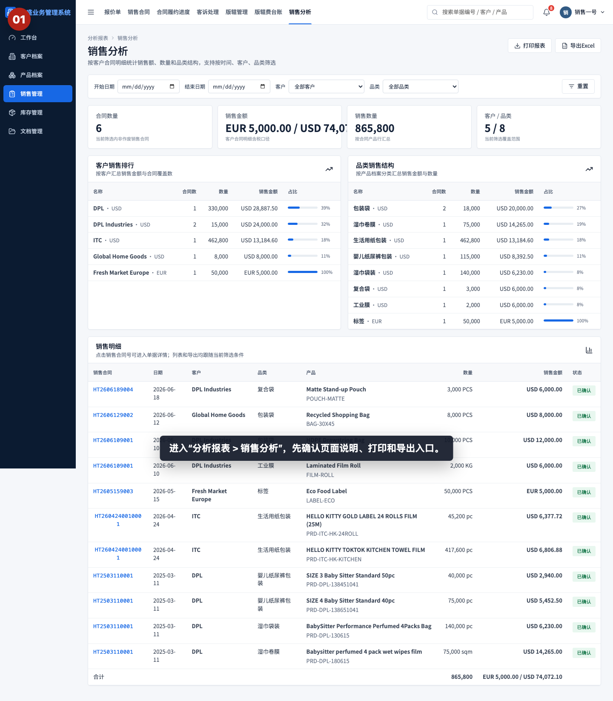

进入“分析报表 > 销售分析”，先确认页面说明、打印报表和导出 Excel 入口。

## 步骤 02：查看筛选条件

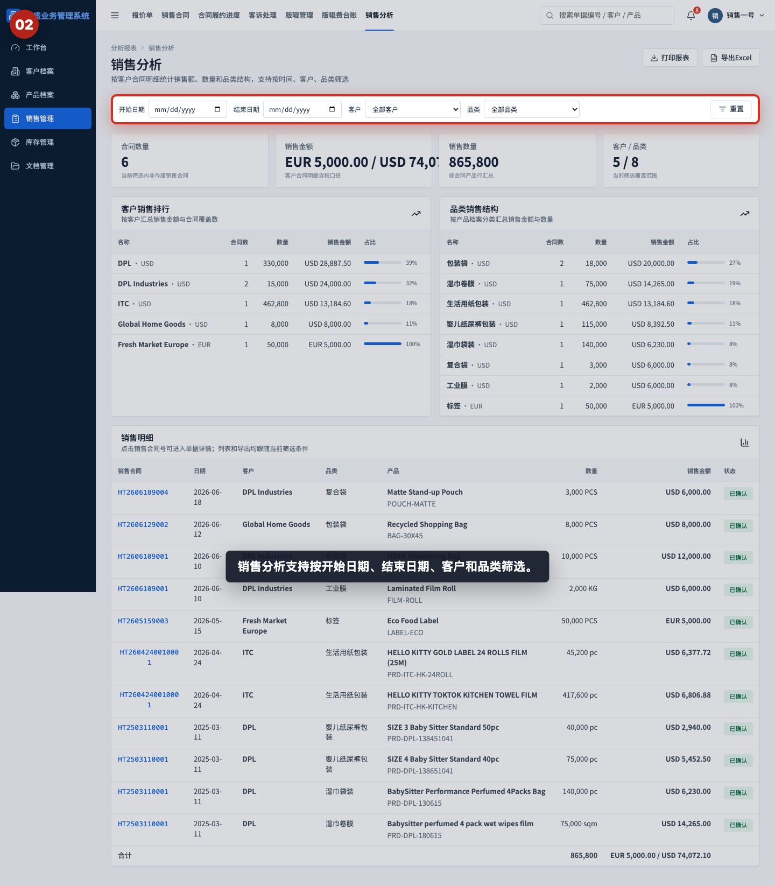

销售分析支持按开始日期、结束日期、客户和品类筛选。培训时先说明：筛选条件会影响页面上所有统计结果。

## 步骤 03：查看销售核心指标

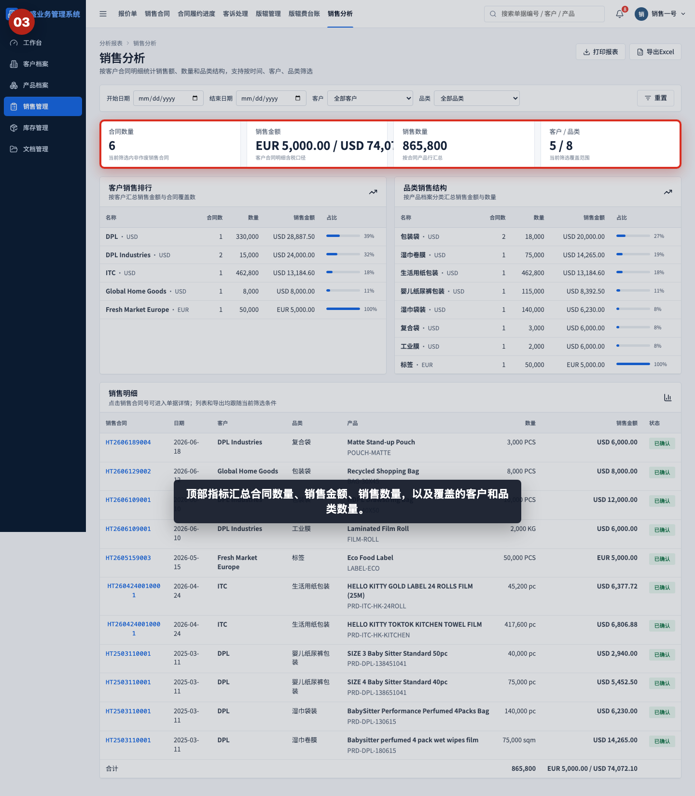

顶部指标汇总合同数量、销售金额、销售数量，以及覆盖的客户和品类数量。多币种会分别显示，不应直接跨币种相加。

## 步骤 04：查看客户销售排行

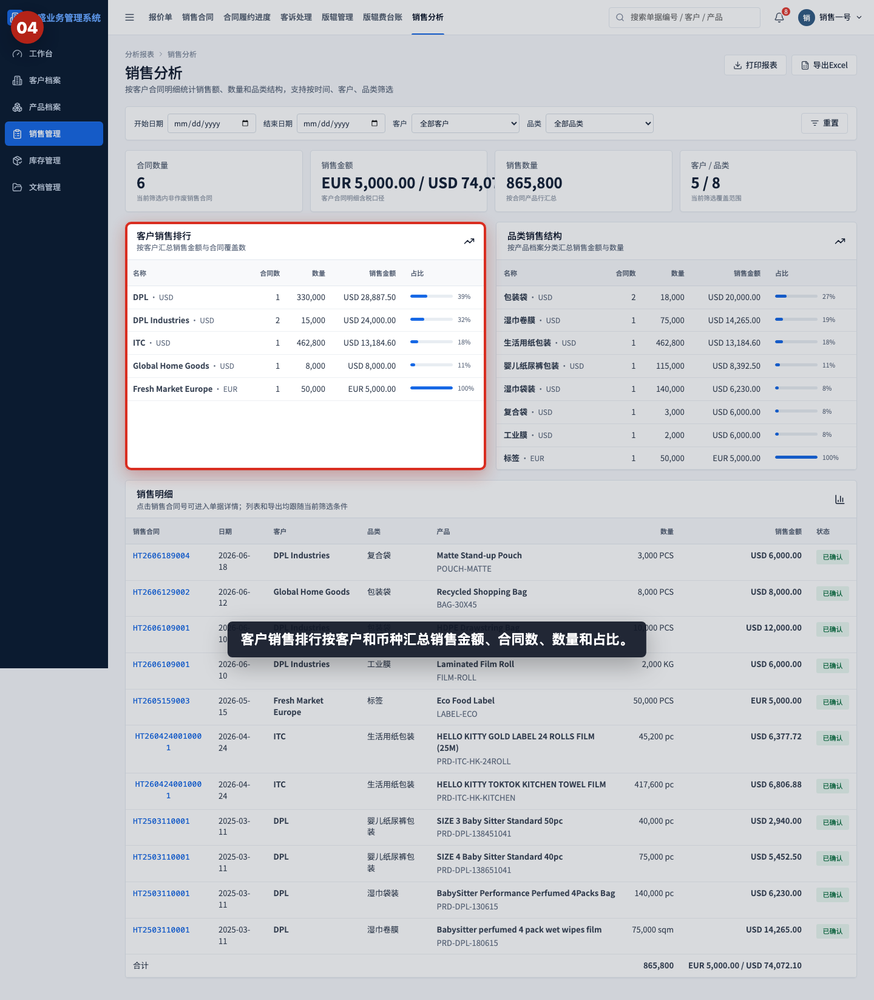

客户销售排行按客户和币种汇总销售金额、合同数、数量和占比。它适合回答“哪个客户贡献了最多销售额”。

## 步骤 05：查看品类销售结构

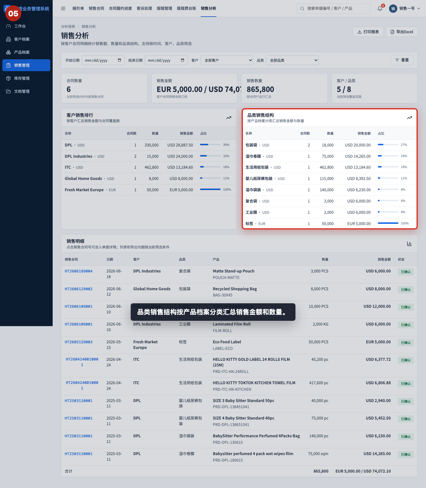

品类销售结构按产品分类汇总销售金额和数量。它适合回答“哪些产品品类卖得最多”。

## 步骤 06：阅读销售明细

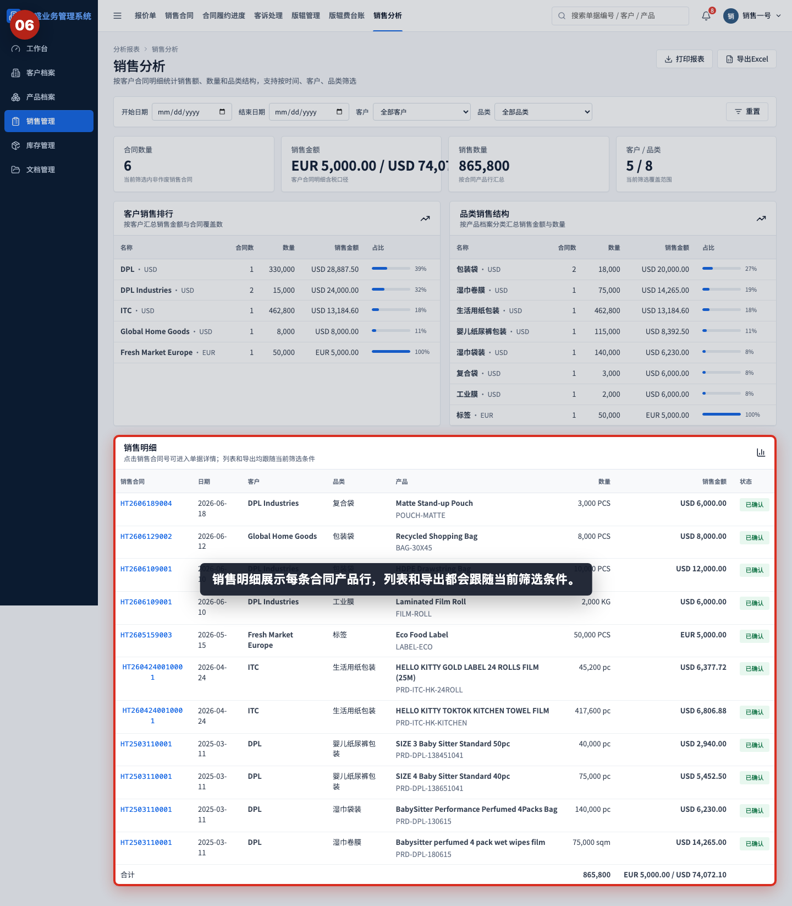

销售明细展示每条合同产品行，包括销售合同号、日期、客户、品类、产品、数量、销售金额和状态。导出 Excel 也跟随当前明细口径。

## 步骤 07：按日期筛选销售

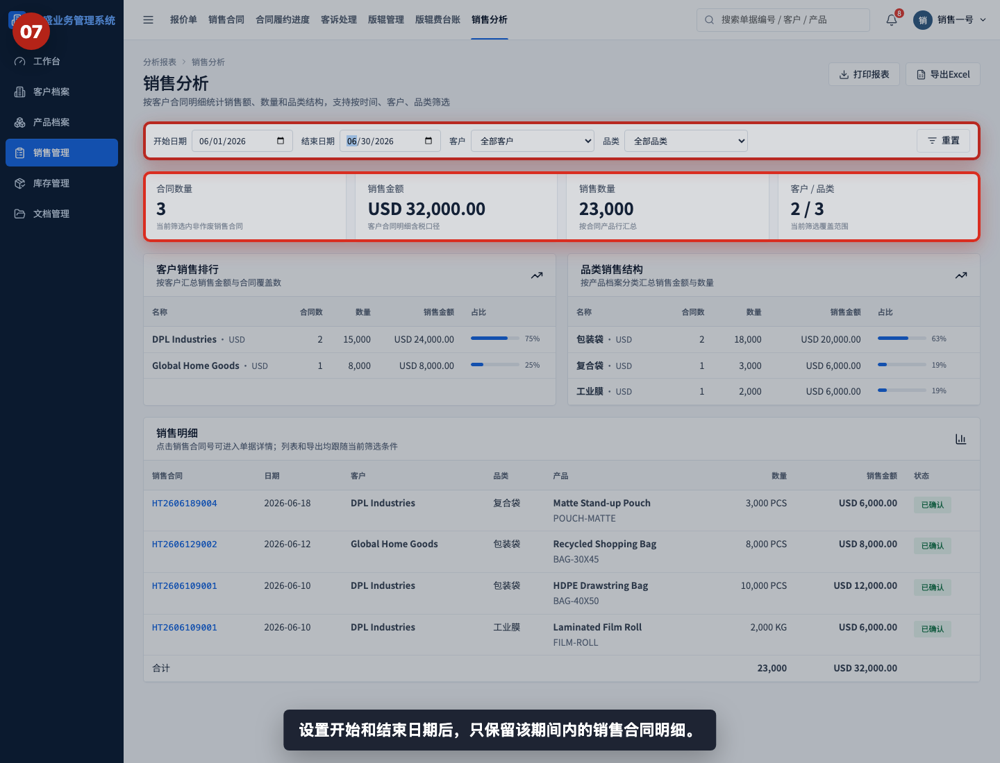

设置开始日期和结束日期后，系统只统计该期间内的销售合同明细。月报通常按自然月设置日期范围。

## 步骤 08：按客户筛选销售

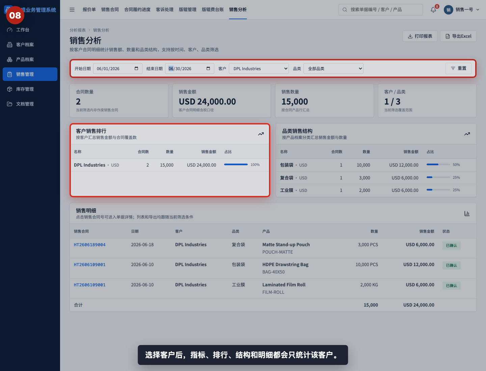

选择客户后，顶部指标、客户排行、品类结构和销售明细都会只统计该客户。适合做客户复盘和客户对账。

## 步骤 09：按品类筛选销售

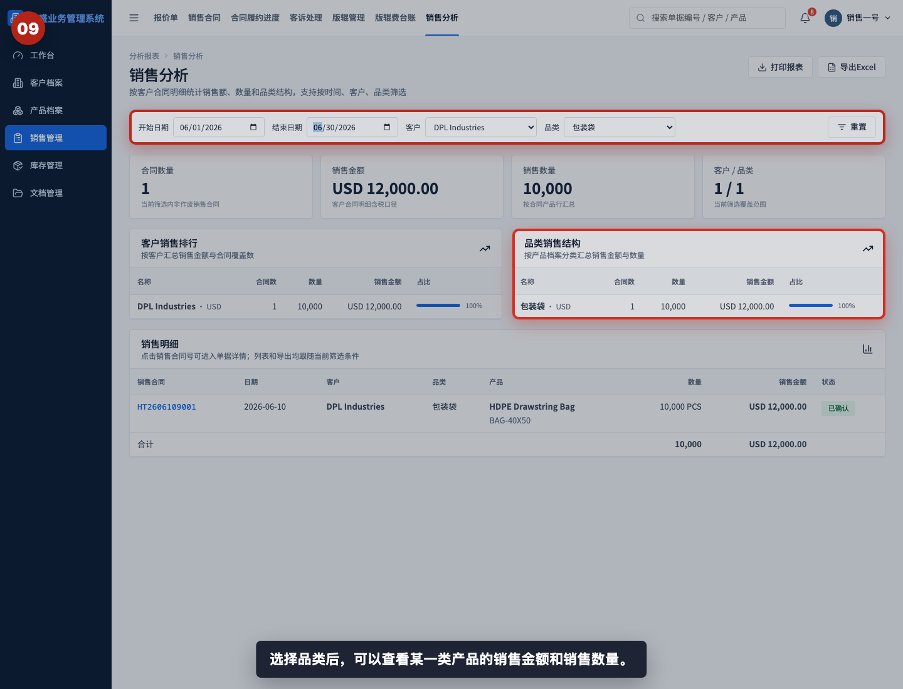

选择品类后，可以查看某一类产品的销售金额和销售数量。适合做产品结构分析或备货参考。

## 步骤 10：重置筛选条件

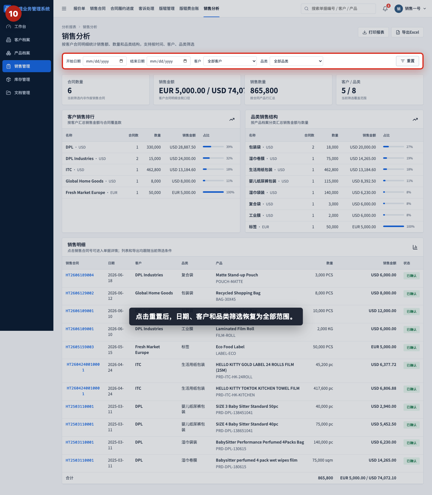

点击“重置”后，日期、客户和品类筛选恢复为全部范围。导出前应确认是否需要重置，避免导出范围不符合预期。

## 步骤 11：打开销售合同明细

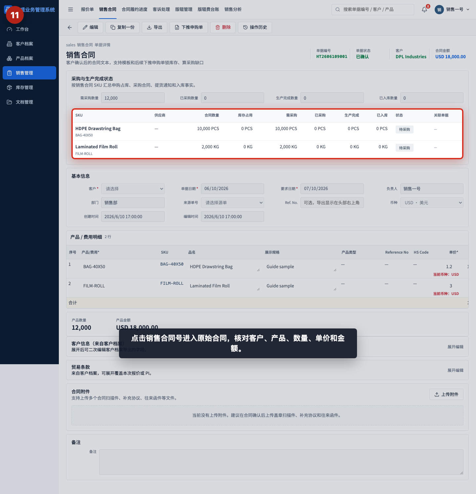

点击销售合同号进入原始销售合同，核对客户、产品、数量、单价和金额。发现统计异常时，应回到原始合同确认明细。

## 步骤 12：打印或导出销售分析

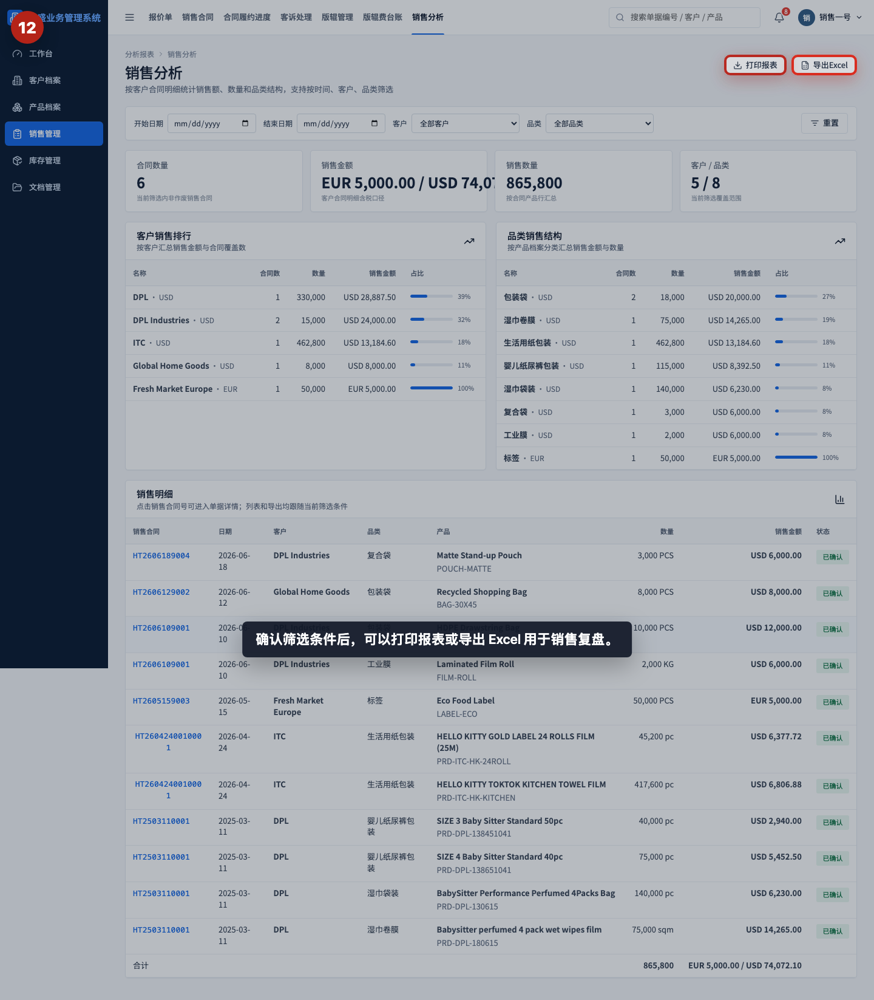

确认筛选条件后，可以打印报表或导出 Excel。导出结果会跟随当前筛选条件，不一定是全量销售数据。

## 相关教程

- [如何创建销售合同](../../销售管理/创建销售合同/README.md)
- [如何从报价单下推销售合同](../../销售管理/报价单下推销售合同/README.md)
- [如何查看合同履约进度](../查看合同履约进度/README.md)
- [如何查看应收看板](../查看应收看板/README.md)
- [如何查看发票差异看板](../查看发票差异看板/README.md)

## 常见误读

- 把销售分析当成开票分析。销售分析看客户合同明细，销售发票和收款需要去财务看板核对。
- 忽略筛选条件。页面上的指标、排行、结构、明细和导出都会受筛选影响。
- 跨币种直接相加。系统会分别展示不同币种金额，管理层复盘时应按币种或汇率口径处理。
- 只看客户排行，不看品类结构。同一客户可能贡献多个品类，需要结合产品结构判断。
- 只看销售金额，不看销售数量。高金额可能来自高单价，也可能来自大数量，需要回到明细判断。
- 发现异常后只改报表理解。报表来自原始销售合同，真正要修正数据应回到销售合同。

## 查看前检查清单

- 是否进入了“分析报表 > 销售分析”。
- 是否确认开始日期和结束日期。
- 是否确认当前客户筛选是全部客户还是指定客户。
- 是否确认当前品类筛选是全部品类还是指定品类。
- 是否按币种分别查看销售金额。
- 是否查看客户销售排行和品类销售结构。
- 是否阅读销售明细，确认合同、客户、产品、数量和金额。
- 导出前是否确认筛选条件符合本次复盘范围。
