# 如何新增用户并分配角色

本指引用于培训系统管理员新增账号、设置初始密码、填写姓名和部门、分配角色、设置启停状态，并验证用户是否创建成功。示例创建一个财务角色账号，说明角色权限范围会如何影响可见模块、敏感字段和操作限制。

## 适用场景

- 新员工入职，需要创建系统账号。
- 员工岗位变化，需要调整角色和权限。
- 临时协作人员需要只读审计权限。
- 账号需要停用或恢复启用。
- 管理员需要确认用户首次登录是否仍需修改初始密码。

## 字段填写说明

| 字段 | 是否必填 | 填写方式 | 用途 |
|---|---|---|---|
| 账号 | 必填 | 3-32 位字母、数字、下划线、点或横线，例如 `finance02` | 用户登录名，创建后不可在编辑窗口修改 |
| 初始密码 | 新增时必填 | 至少 10 位，且包含字母和数字 | 用户首次登录使用；应通过安全渠道单独告知 |
| 姓名 | 必填 | 填真实姓名或内部常用姓名 | 审计日志、负责人和协作识别 |
| 部门 | 必填 | 填销售部、采购部、财务部等 | 便于管理和审计 |
| 角色 | 必填 | 按岗位选择系统管理员、销售、采购、财务等 | 控制菜单、敏感字段和可操作范围 |
| 状态 | 必填 | 启用或停用 | 停用账号不能登录 |

## 角色选择原则

```text
系统管理员：用户管理、系统设置和全模块权限
管理层：只读查看全局业务和经营报表
销售/业务员：客户、报价、销售合同和销售相关库存
采购员：供应商、采购单据和采购相关库存
仓管员：产品、库存看板、入库和出库
财务：收付款、费用、合同应收应付、账龄、资金流水和财务主数据
只读审计：按授权范围只读查看，不新增、不编辑、不删除
```

## 步骤 01：进入用户管理

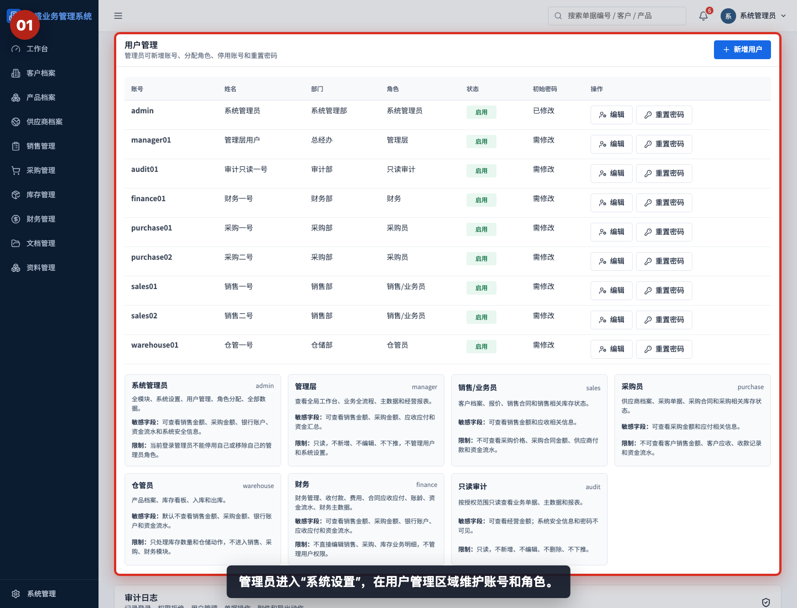

管理员进入“系统设置”，在用户管理区域维护账号、角色和状态。普通业务角色不能进入用户管理。

## 步骤 02：查看用户列表

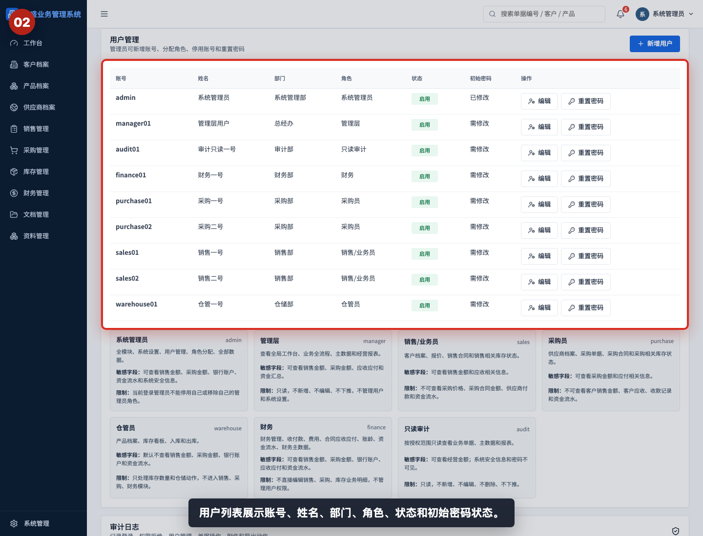

用户列表展示账号、姓名、部门、角色、状态和初始密码状态。新增前先确认是否已有同名账号。

## 步骤 03：查看角色权限说明

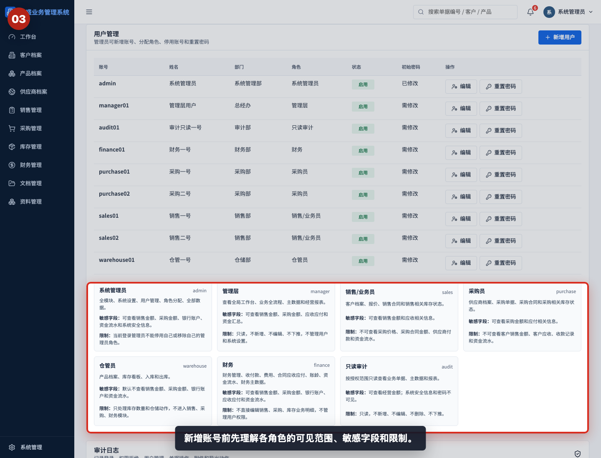

新增账号前先理解各角色的可见范围、敏感字段和限制。角色决定用户可以看什么、改什么和不能进入哪些模块。

## 步骤 04：打开新增用户窗口

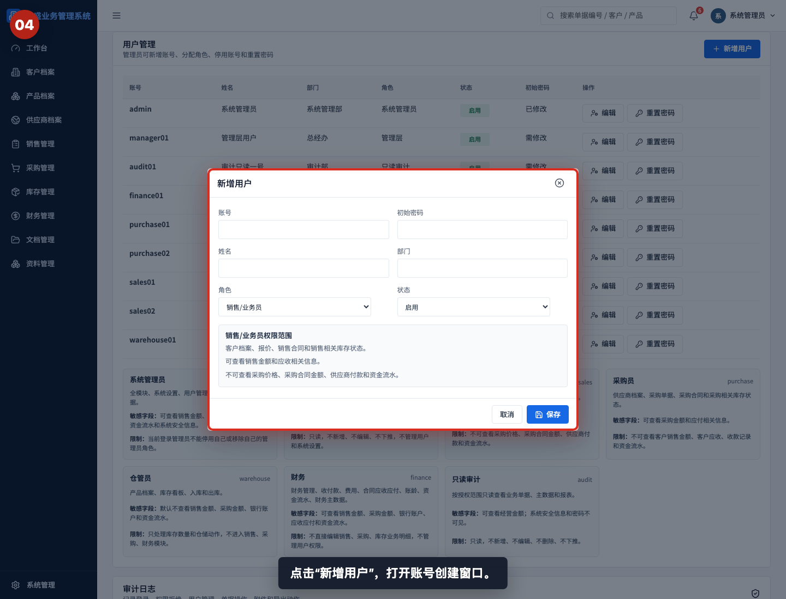

点击“新增用户”，打开账号创建窗口。新增窗口需要填写账号、初始密码、姓名、部门、角色和状态。

## 步骤 05：填写账号和初始密码

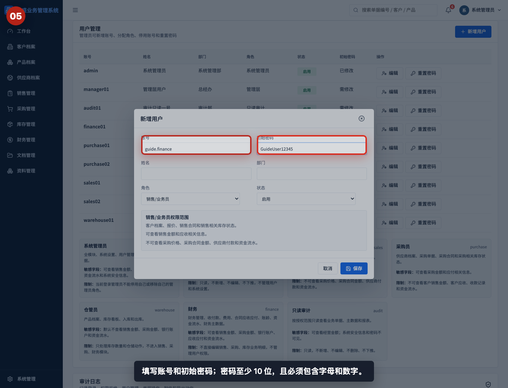

填写账号和初始密码。初始密码必须至少 10 位，并包含字母和数字；不要在公开文档或群聊中发送真实密码。

## 步骤 06：填写姓名和部门

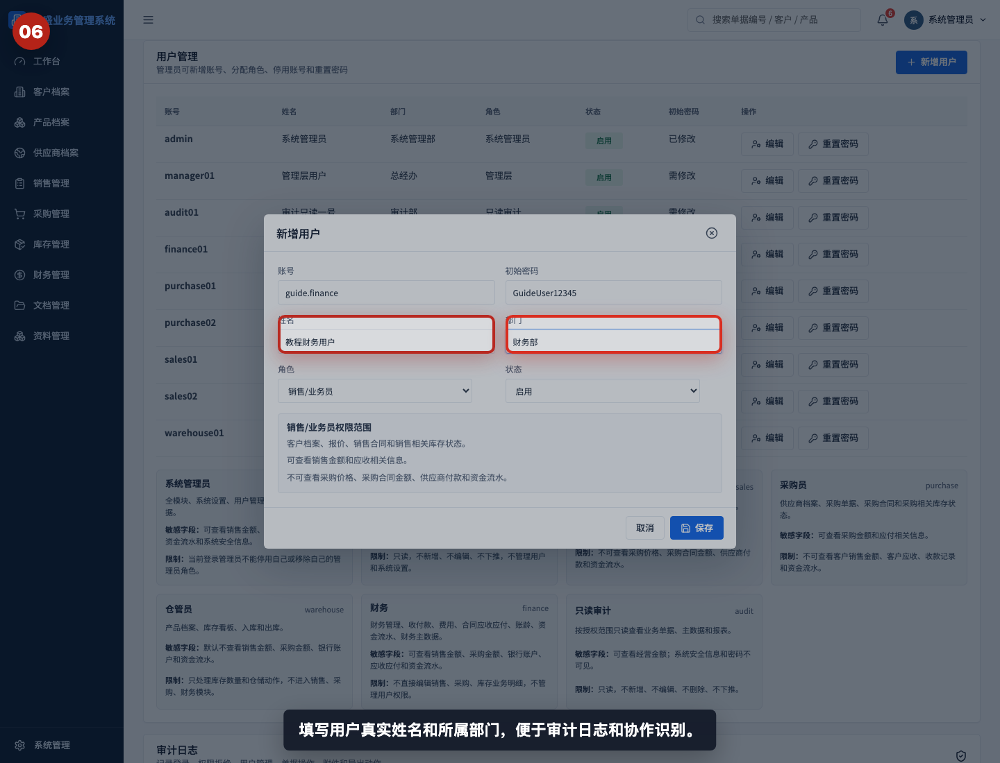

填写用户真实姓名和所属部门。审计日志和单据操作记录会使用用户信息追溯责任人。

## 步骤 07：分配用户角色

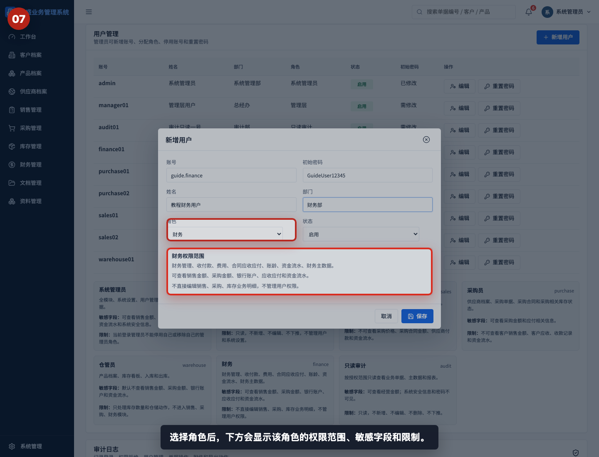

选择角色后，下方会显示该角色的权限范围、敏感字段和限制。分配角色时应按岗位最小权限原则处理。

## 步骤 08：设置账号状态

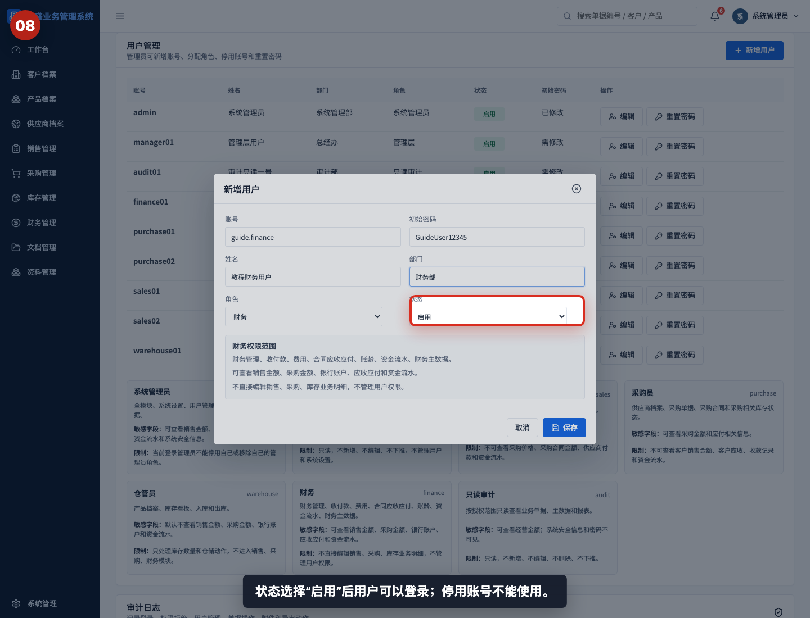

状态选择“启用”后用户可以登录；选择“停用”后账号不可使用。离职或临时冻结账号时应及时停用。

## 步骤 09：保存新用户

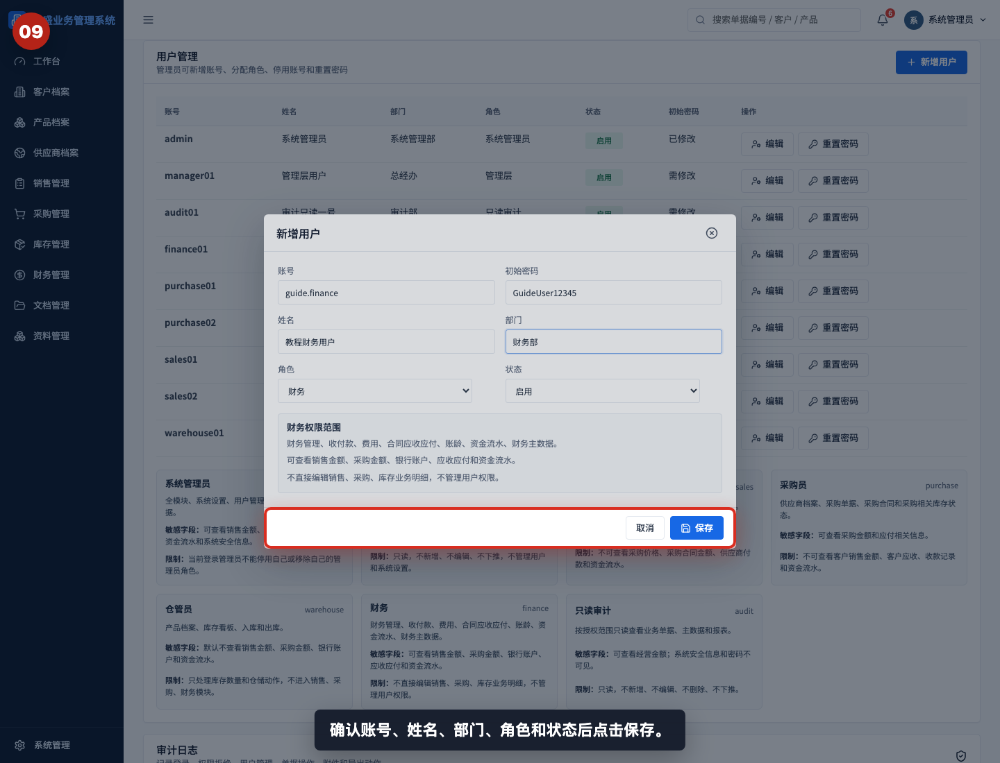

确认账号、姓名、部门、角色和状态后点击“保存”。保存前重点确认角色是否符合岗位职责。

## 步骤 10：验证用户已新增

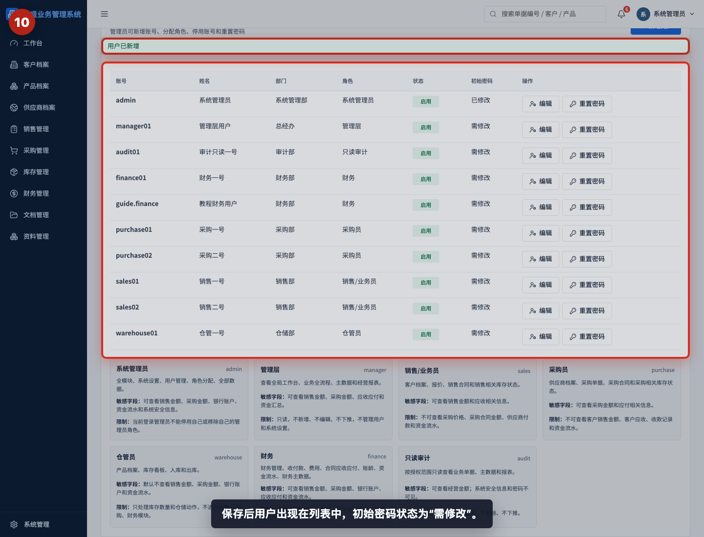

保存后用户出现在列表中，初始密码状态为“需修改”。这表示用户首次登录后应修改初始密码。

## 步骤 11：查看编辑用户窗口

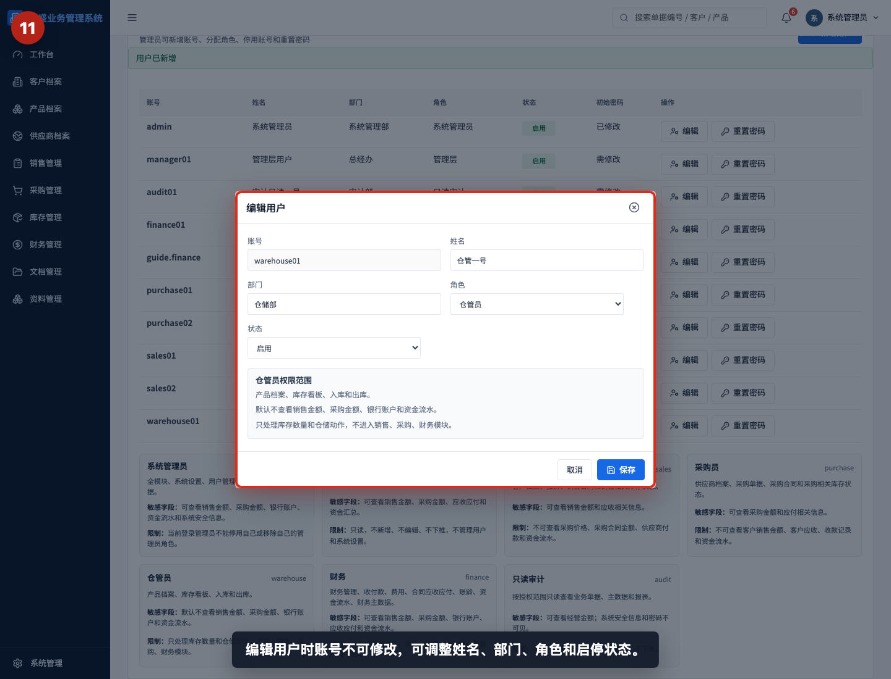

编辑用户时账号不可修改，可调整姓名、部门、角色和启停状态。若账号命名错误，通常应新建正确账号并停用错误账号。

## 步骤 12：调整角色时查看权限变化

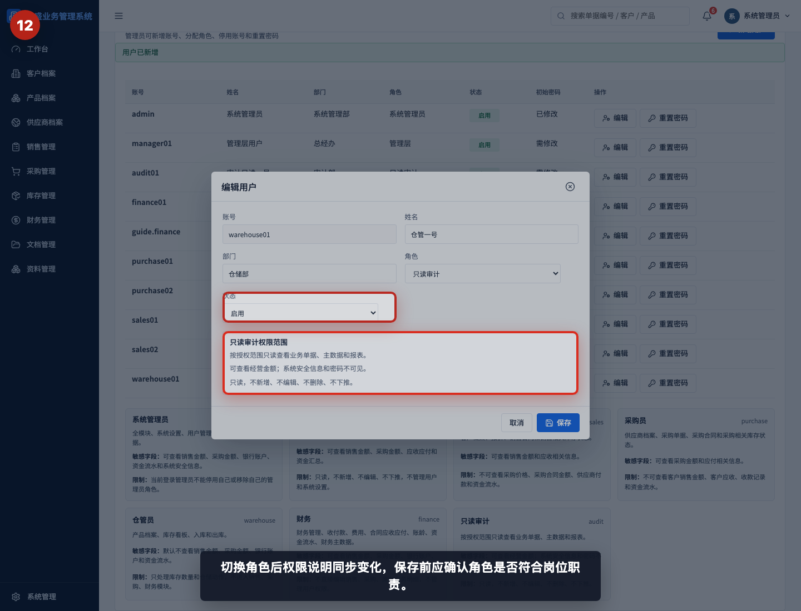

切换角色后权限说明同步变化。保存角色调整前，应确认用户是否仍符合岗位和数据敏感性要求。

## 相关教程

- [如何重置用户密码](../重置用户密码/README.md)
- [如何查看审计日志](../查看审计日志/README.md)
- [协作与管理截图指引](../../collaboration-admin/README.md)

## 常见错误

- 给普通用户分配系统管理员。管理员拥有用户管理和系统设置权限，应严格控制。
- 初始密码过短或不包含字母数字，系统会拒绝保存。
- 用共享账号代替个人账号。审计日志无法追溯真实责任人。
- 只改姓名和部门，忘记检查角色。岗位变化时角色也要同步调整。
- 离职账号未停用。离职、转岗或临时冻结时应及时停用账号。
- 在公开渠道发送真实初始密码。密码应通过安全渠道单独交付，并要求首次登录后修改。

## 保存前检查清单

- 是否确认当前操作人是系统管理员。
- 是否检查账号没有重复。
- 账号是否符合命名规则。
- 初始密码是否满足长度和复杂度要求。
- 姓名和部门是否填写正确。
- 角色是否按岗位最小权限分配。
- 状态是否为预期的启用或停用。
- 保存后是否在用户列表中看到新用户。
- 初始密码状态是否显示“需修改”。
