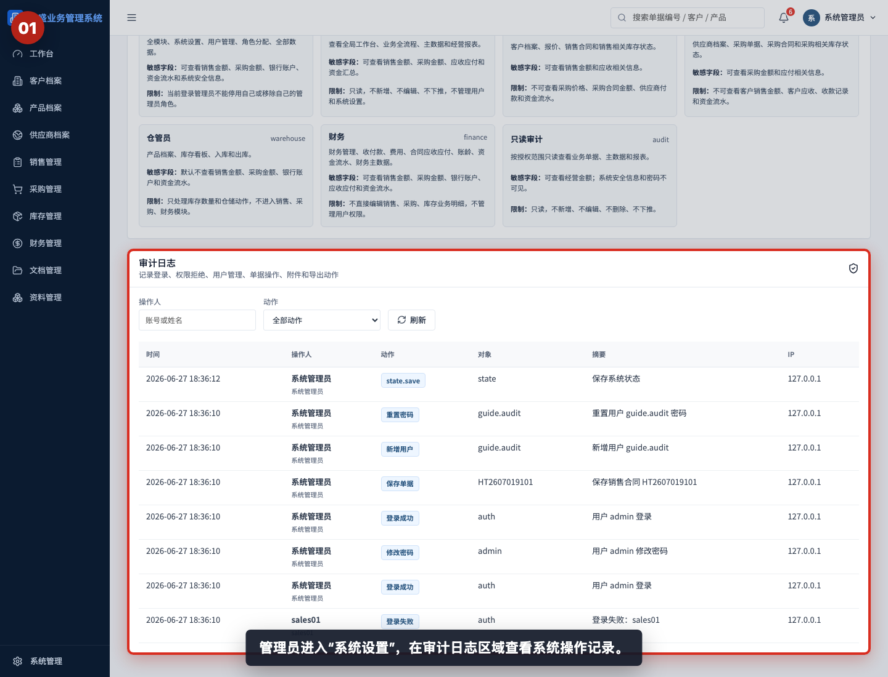
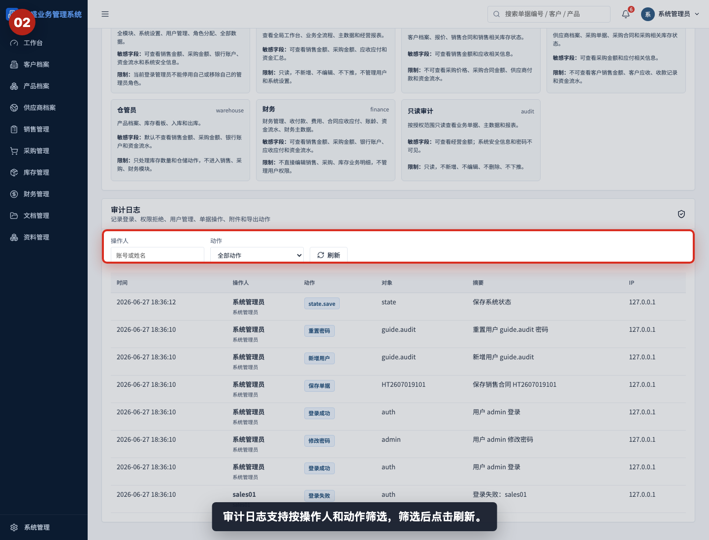
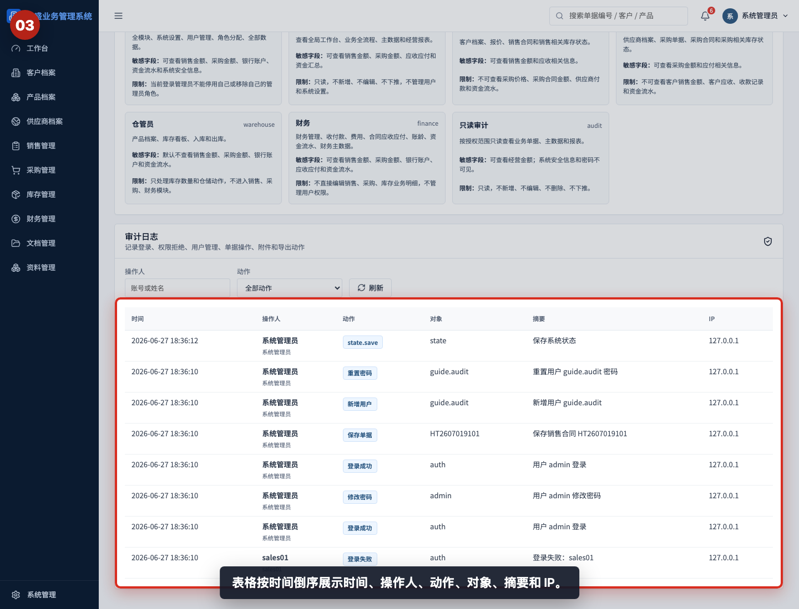
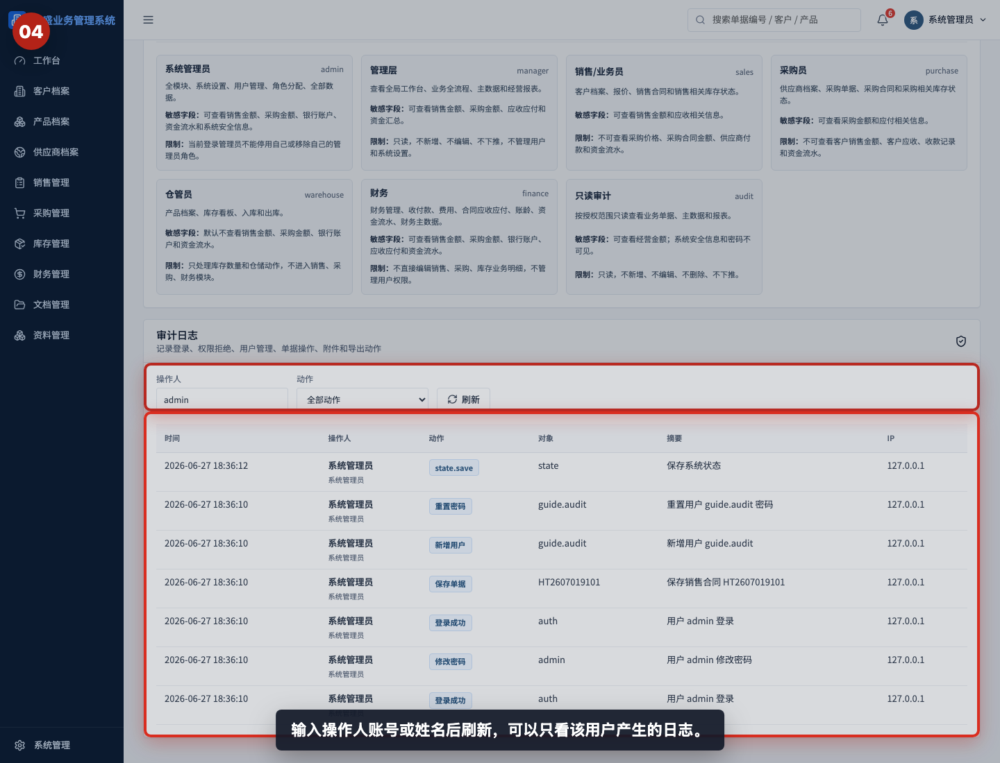
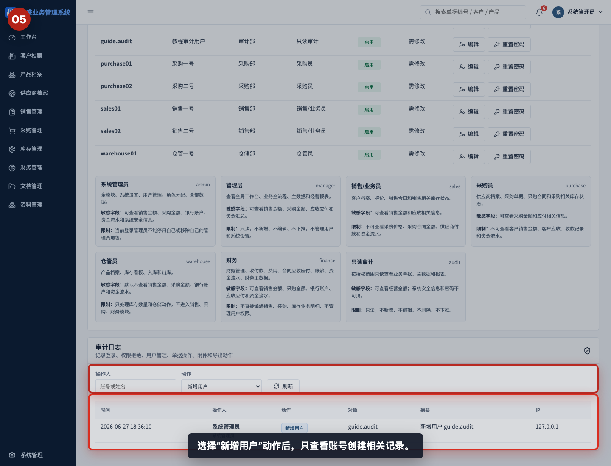
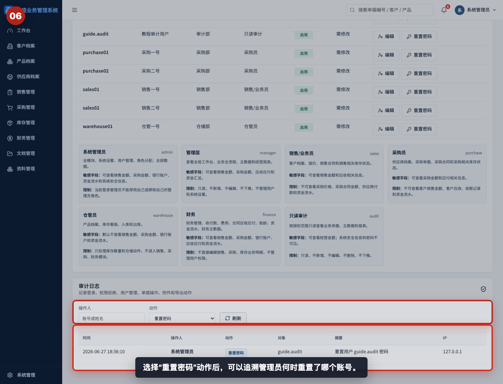
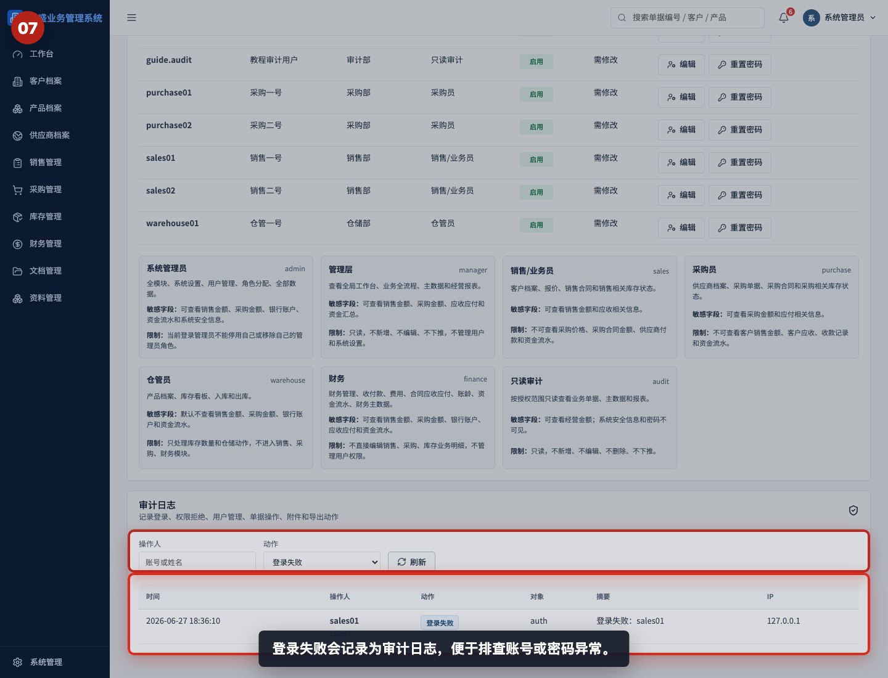
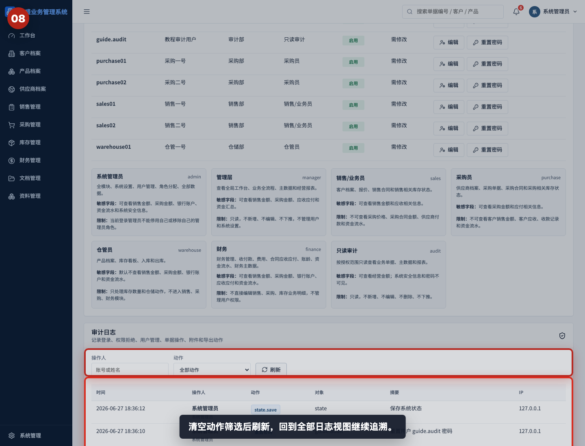
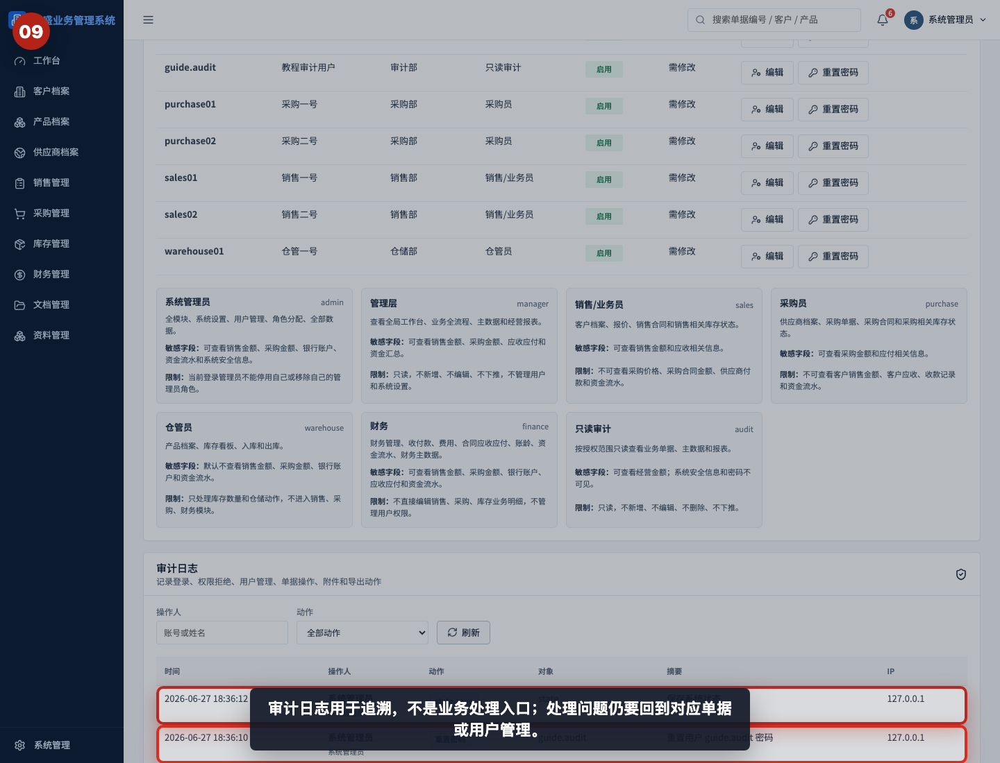

# 如何查看审计日志

本指引用于培训系统管理员查看和筛选审计日志。示例覆盖进入审计日志、理解筛选条件、阅读日志表格、按操作人筛选、按动作筛选新增用户和重置密码、查看登录失败记录，以及恢复全部日志视图。

## 适用场景

- 需要追溯某个用户什么时候登录、修改密码或操作单据。
- 需要确认谁新增了用户、重置了密码或更新了账号。
- 出现权限拒绝、登录失败或异常操作时，需要排查原因。
- 需要查看附件上传、删除、PDF 导出等系统操作记录。
- 管理员需要为内部审计或问题复盘提供操作证据。

## 字段说明

| 字段 | 含义 | 阅读方式 |
|---|---|---|
| 时间 | 操作发生时间 | 按倒序查看，最新操作在前 |
| 操作人 | 执行动作的账号/姓名和角色 | 用于追溯责任人 |
| 动作 | 系统记录的操作类型 | 例如登录成功、新增用户、保存单据、重置密码 |
| 对象 | 被操作的对象 | 可能是用户、单据、附件或系统状态 |
| 摘要 | 操作说明 | 用于快速判断发生了什么 |
| IP | 请求来源 IP | 用于辅助判断来源环境 |

## 常见动作

```text
登录成功 / 登录失败
修改密码 / 重置密码
新增用户 / 更新用户
新增单据 / 保存单据 / 下推单据
上传附件 / 删除附件
导出 PDF
权限拒绝
```

## 步骤 01：进入审计日志



管理员进入“系统设置”，在审计日志区域查看系统操作记录。普通业务角色不能查看系统设置中的审计日志。

## 步骤 02：查看筛选条件



审计日志支持按操作人和动作筛选。输入筛选条件后，需要点击“刷新”重新加载结果。

## 步骤 03：阅读日志表格



表格按时间倒序展示时间、操作人、动作、对象、摘要和 IP。排查问题时先看时间，再看操作人和摘要。

## 步骤 04：按操作人筛选



输入操作人账号或姓名后刷新，可以只看该用户产生的日志。适合排查某个账号近期做过哪些操作。

## 步骤 05：按动作筛选新增用户



选择“新增用户”动作后，只查看账号创建相关记录。它适合确认谁在什么时候新增了某个账号。

## 步骤 06：按动作筛选重置密码



选择“重置密码”动作后，可以追溯管理员何时重置了哪个账号。密码本身不会出现在审计日志中。

## 步骤 07：查看登录失败日志



登录失败会记录为审计日志，便于排查账号输错、密码输错或异常尝试登录。

## 步骤 08：刷新回到全部日志



清空操作人和动作筛选后点击刷新，回到全部日志视图继续追溯。

## 步骤 09：理解日志用途



审计日志用于追溯，不是业务处理入口。发现问题后，仍要回到对应单据、用户管理或附件管理页面处理。

## 相关教程

- [如何新增用户并分配角色](../新增用户并分配角色/README.md)
- [如何重置用户密码](../重置用户密码/README.md)
- [如何上传和预览合同附件](../../文档管理/上传和预览合同附件/README.md)
- [协作与管理截图指引](../../collaboration-admin/README.md)

## 常见误读

- 认为审计日志可以修改业务数据。审计日志只用于查看和追溯，不能处理业务问题。
- 只看摘要，不看操作人和时间。追责或复盘时必须结合时间、操作人和对象。
- 忽略筛选条件。筛选后如果忘记清空，可能误以为日志缺失。
- 以为密码会被记录。审计日志只记录重置动作，不记录具体密码。
- 把 IP 当作唯一判断依据。IP 只能辅助判断来源，仍需结合账号、时间和动作。

## 查看前检查清单

- 是否由系统管理员进入系统设置。
- 是否确认需要追溯的时间范围或大致时间点。
- 是否知道要按操作人、动作，还是全部日志查看。
- 筛选后是否点击了“刷新”。
- 是否同时查看时间、操作人、动作、对象和摘要。
- 排查完成后是否清空筛选条件，避免下次误读。
