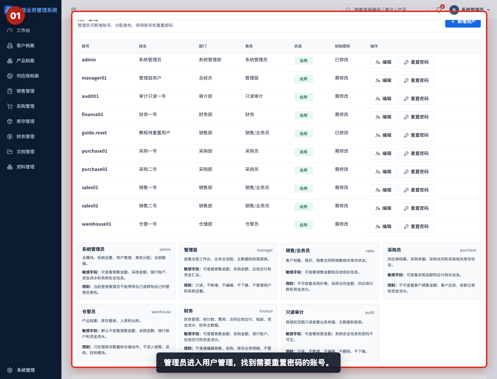
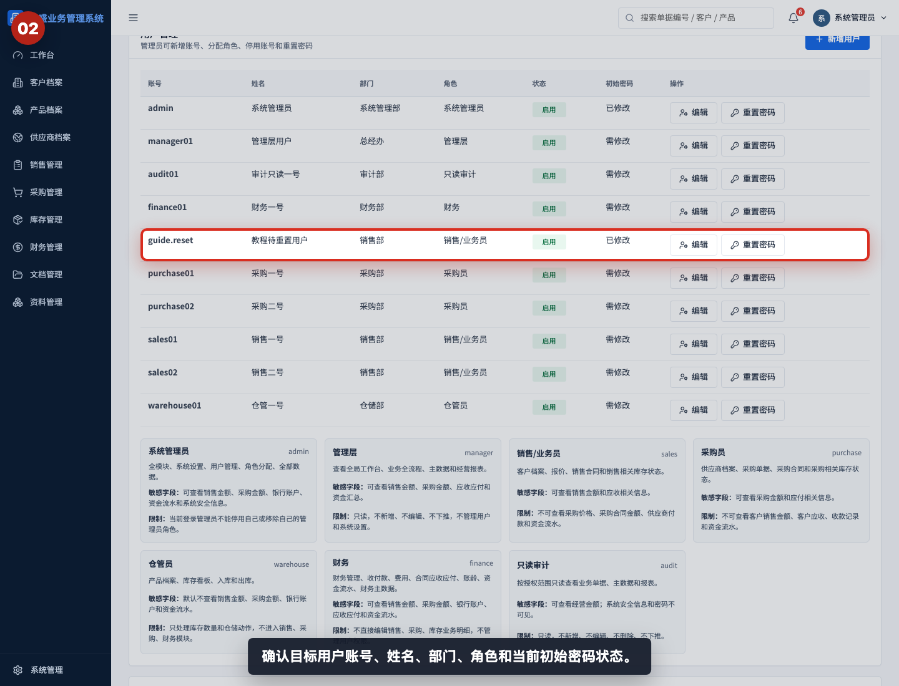
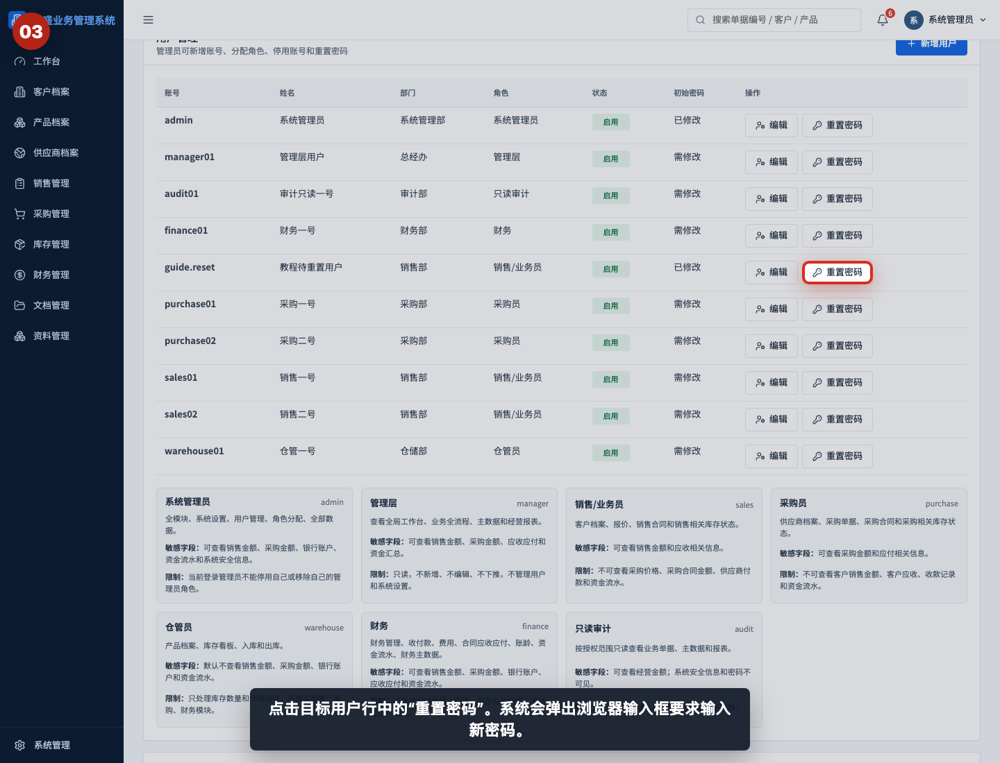
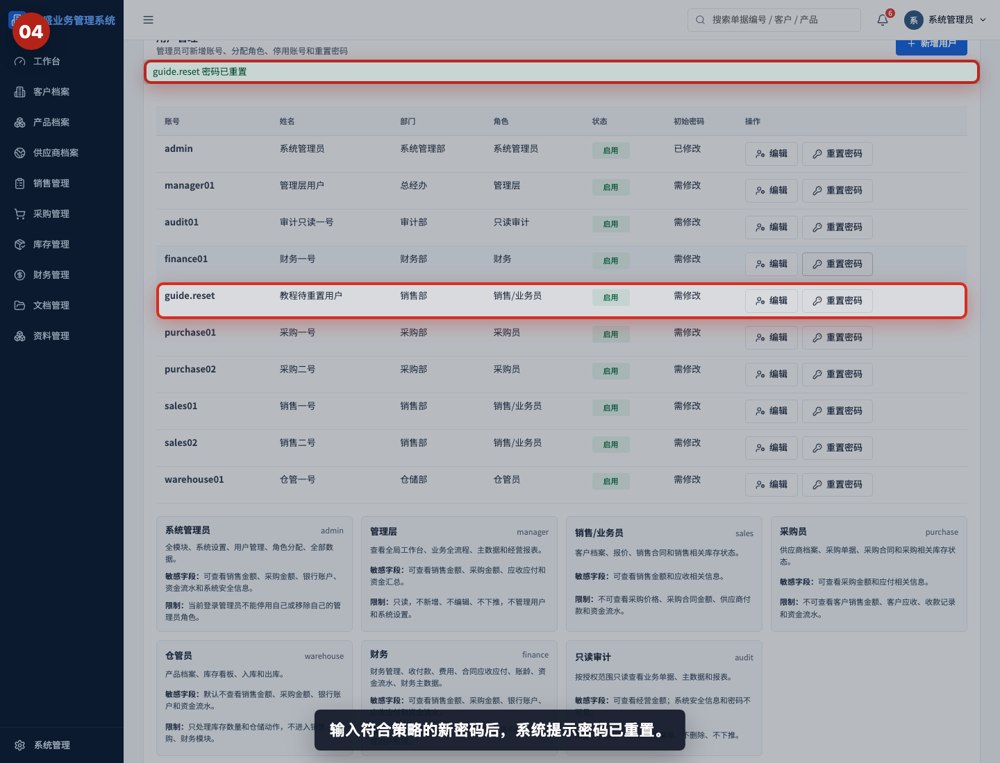
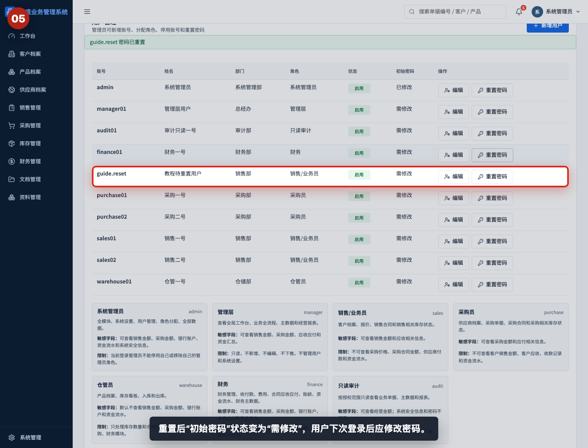
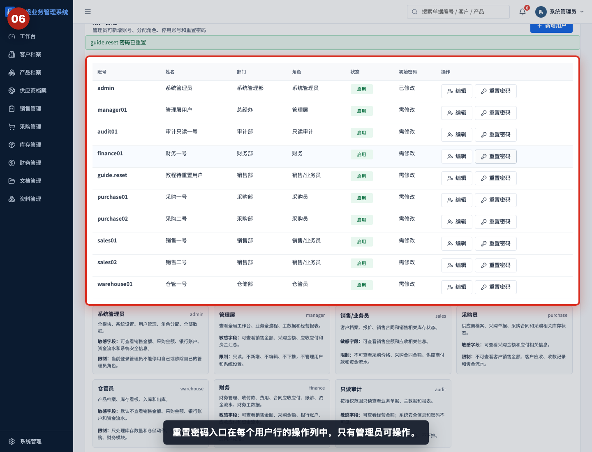
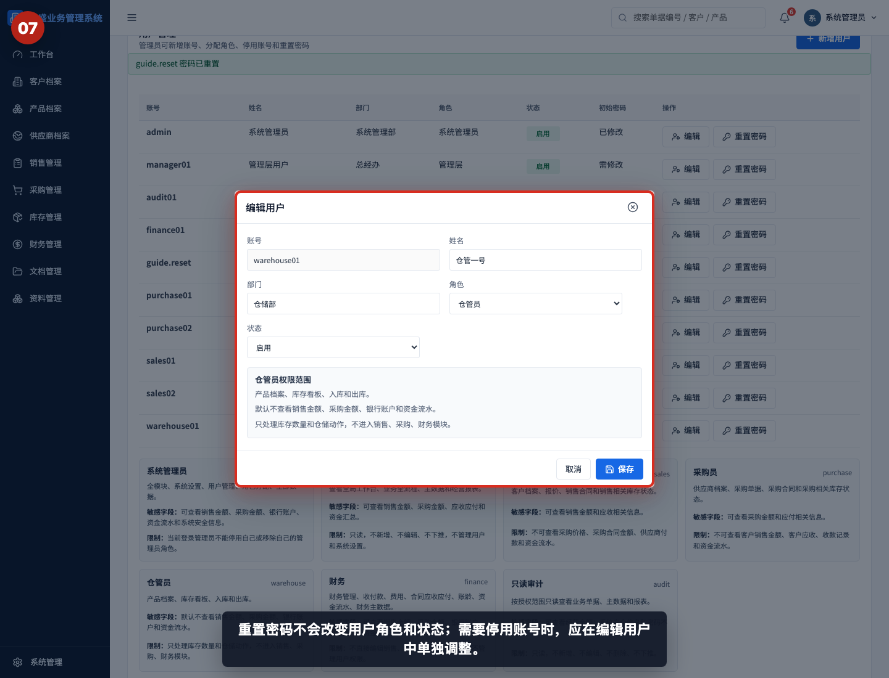

# 如何重置用户密码

本指引用于培训系统管理员为用户重置密码。示例覆盖进入用户管理、确认目标用户、点击重置密码、输入符合策略的新密码、验证“需修改”状态，以及确认重置密码不会改变用户角色和启停状态。

## 适用场景

- 用户忘记密码，无法登录系统。
- 新员工未及时修改初始密码，需要管理员重新发放。
- 账号存在安全风险，需要临时重置密码。
- 管理员需要确认用户下次登录必须修改密码。

## 操作规则

| 项目 | 说明 |
|---|---|
| 操作权限 | 只有系统管理员可以重置用户密码 |
| 新密码要求 | 至少 10 位，且必须包含字母和数字 |
| 重置结果 | 用户列表中的初始密码状态变为“需修改” |
| 影响范围 | 只改变密码，不改变用户角色、部门和启停状态 |
| 交付方式 | 新密码应通过安全渠道单独告知用户 |

## 步骤 01：进入用户管理

管理员进入“系统设置 > 用户管理”，找到需要重置密码的账号。

## 步骤 02：确认目标用户状态

重置前确认账号、姓名、部门、角色和当前初始密码状态，避免重置错用户。

## 步骤 03：点击重置密码

点击目标用户行中的“重置密码”。系统会弹出浏览器输入框，要求输入新密码。

## 步骤 04：验证密码已重置

输入符合策略的新密码后，系统提示密码已重置。新密码不要截图、不要写入公开文档，也不要通过公开群聊发送。

## 步骤 05：确认需修改状态

重置后“初始密码”状态变为“需修改”。用户下次登录后应立即修改为自己的密码。

## 步骤 06：查看重置密码入口位置

重置密码入口在每个用户行的操作列中。只有管理员可以看到并执行这个操作。

## 步骤 07：确认账号仍可编辑状态

重置密码不会改变用户角色和状态。需要停用账号时，应进入编辑用户窗口单独调整状态。

## 相关教程

- [如何新增用户并分配角色](../新增用户并分配角色/README.md)
- [如何查看审计日志](../查看审计日志/README.md)
- [协作与管理截图指引](../../collaboration-admin/README.md)

## 常见错误

- 重置错用户。重置前必须核对账号、姓名和部门。
- 新密码不符合策略。密码至少 10 位，且必须包含字母和数字。
- 把新密码发到公开群聊或写入文档。应通过安全渠道单独告知。
- 以为重置密码会停用账号。重置密码只改变密码，不改变启停状态。
- 用户拿到新密码后没有修改。管理员应提醒用户首次登录后立即修改。

## 重置前检查清单

- 是否确认当前操作人是系统管理员。
- 是否确认目标账号、姓名和部门。
- 是否准备了符合策略的新密码。
- 是否确认新密码交付渠道安全。
- 重置后是否看到系统提示密码已重置。
- 用户列表中的初始密码状态是否变为“需修改”。
- 如需停用账号，是否已单独进入编辑用户调整状态。
