# 如何从入库单生成采购发票

本指引用于培训新用户把已确认采购入库单下推为采购发票。示例覆盖查找已确认入库单、核对入库明细、阅读生成确认、生成采购发票草稿、核对来源入库单和采购合同、选择默认出账账户、填写发票号码和开票信息、核对开票金额与入库金额差异、保存确认、查看应付看板，以及确认后续付款单入口。

## 适用场景

- 供应商货物已经实际入库，需要登记供应商正式发票。
- 财务需要把入库事实转换为正式应付口径。
- 采购发票金额需要和入库金额核对，发现差异后进入发票差异看板处理。
- 后续需要基于采购发票继续登记供应商付款。

## 前置条件

- 采购入库单已保存并已确认。
- 入库单已正确关联采购合同。
- 供应商、产品、入库数量、买入单价和入库金额已核对。
- 已确认发票号码、发票类型、开票日期和默认出账公司账户。

## 字段填写说明

| 字段 | 是否必填 | 填写方式 | 影响 |
|---|---|---|---|
| 供应商/货代 | 必填 | 从入库单自动带出 | 应付、账龄和付款按供应商追溯 |
| 来源单号 | 必填 | 由入库单下推自动带出 | 用于核对入库事实和发票金额 |
| 关联合同 | 必填/自动 | 从入库单带出采购合同 | 应付看板、付款和采购履约追溯来源 |
| 币种 | 建议保留 | 从入库单带出 | 保持入库金额和发票金额口径一致 |
| 默认出账账户 | 必填 | 系统按币种带出默认公司账户，可手动调整 | 后续下推付款单时可带出 |
| 发票号码 | 必填 | 填供应商正式发票号码 | 采购发票保存确认的必填项 |
| 发票代码 | 按需填写 | 按实际票据填写 | 便于财务查票和归档 |
| 发票类型 | 必填 | 选择增值税专票、普票、形式发票或其他 | 发票分类和后续核对参考 |
| 开票日期 | 必填 | 按实际开票日期填写 | 应付确认和账龄参考 |
| 收票日期 | 可选 | 按收到供应商发票日期填写 | 票据流转参考 |
| 不含税金额 | 可选 | 按发票明细填写 | 税额和价税合计核对参考 |
| 税额 | 可选 | 按发票税额填写 | 税务核对参考 |
| 处理状态 | 自动/按需 | 金额一致通常为正常；有差异时选金额异常或处理中 | 发票差异看板跟进状态 |
| 差异处理方式 | 差异时填写 | 供应商退款、红冲重开、订单变更等 | 差异闭环依据 |
| 产品明细 | 必填 | 从入库单带出，可按实际发票核对 | 正式应付金额来源 |
| 发票金额 | 自动 | 由产品明细数量和单价计算 | 采购发票正式应付金额 |
| 差异金额 | 自动 | 发票金额减入库金额 | 不为 0 时进入差异处理 |
| 备注 | 按需填写 | 写来源入库单、开票依据和差异说明 | 便于财务、采购和管理层追溯 |
| 保存状态 | 必填 | 草稿 / 已确认 | 已确认后作为正式应付口径 |

关键规则：

```text
入库单 = 实际到货和库存增加事实
采购发票 = 正式应付口径
付款单 = 供应商实际付款和资金流水
```

## 步骤 01：找到已确认入库单

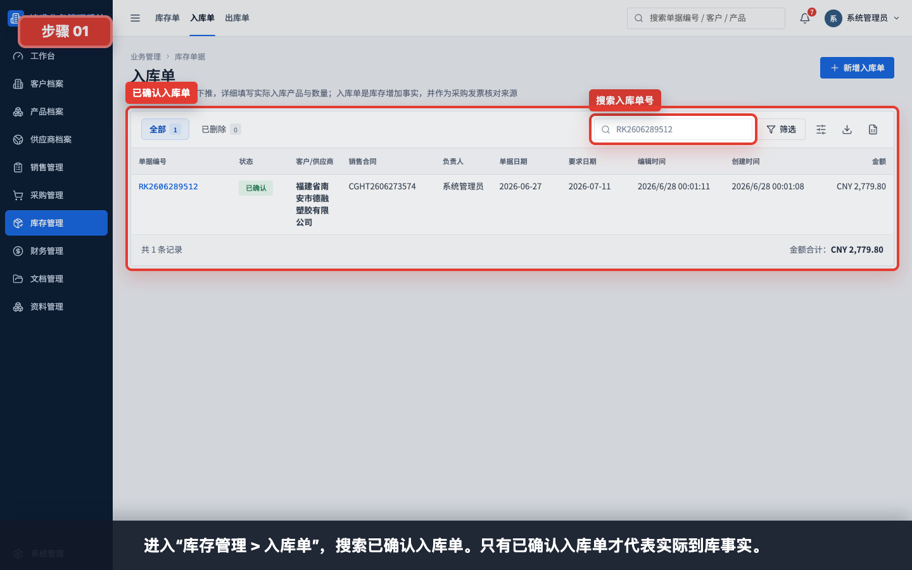

进入“库存管理 > 入库单”，搜索已确认入库单。只有已确认入库单才代表实际到库事实。

## 步骤 02：打开入库单详情

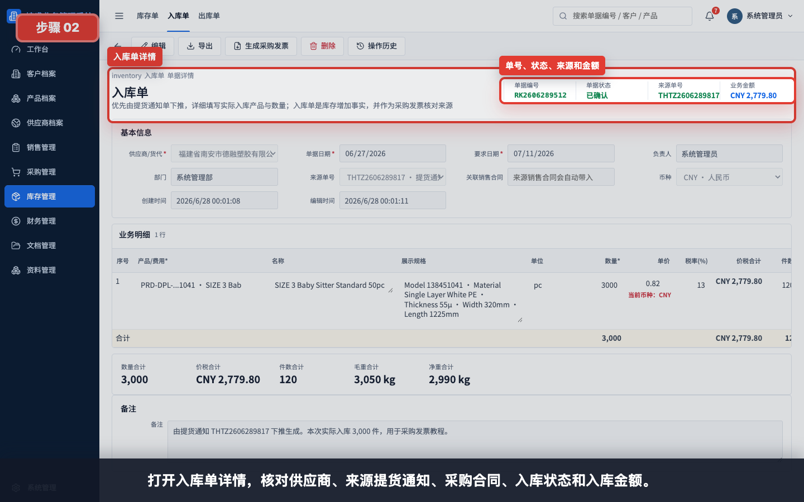

打开入库单详情，核对供应商、来源提货通知、采购合同、入库状态和入库金额。

## 步骤 03：核对入库明细和金额

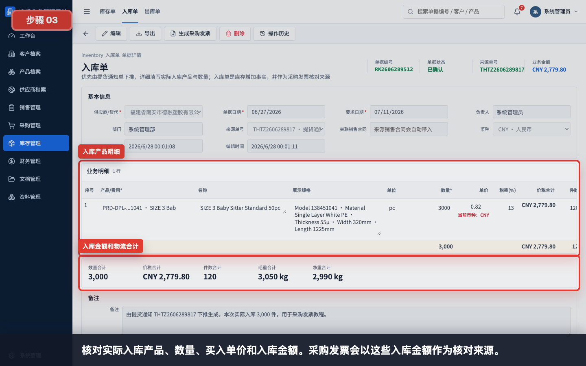

核对实际入库产品、数量、买入单价和入库金额。采购发票会以这些入库金额作为核对来源。

## 步骤 04：确认生成采购发票入口

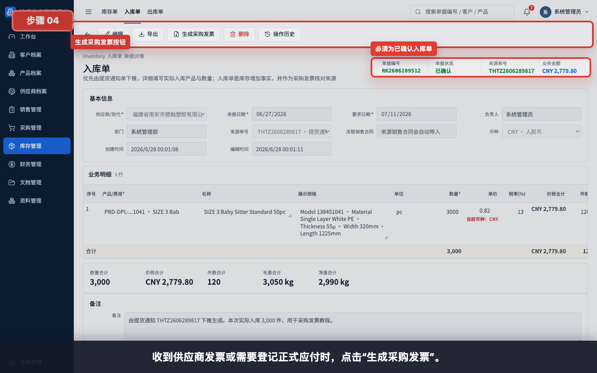

收到供应商发票或需要登记正式应付时，点击“生成采购发票”。

## 步骤 05：查看生成采购发票确认

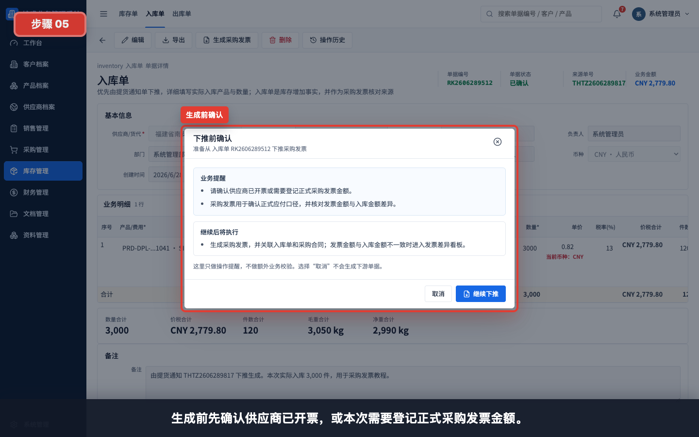

生成前先确认供应商已开票，或本次需要登记正式采购发票金额。

## 步骤 06：确认采购发票影响

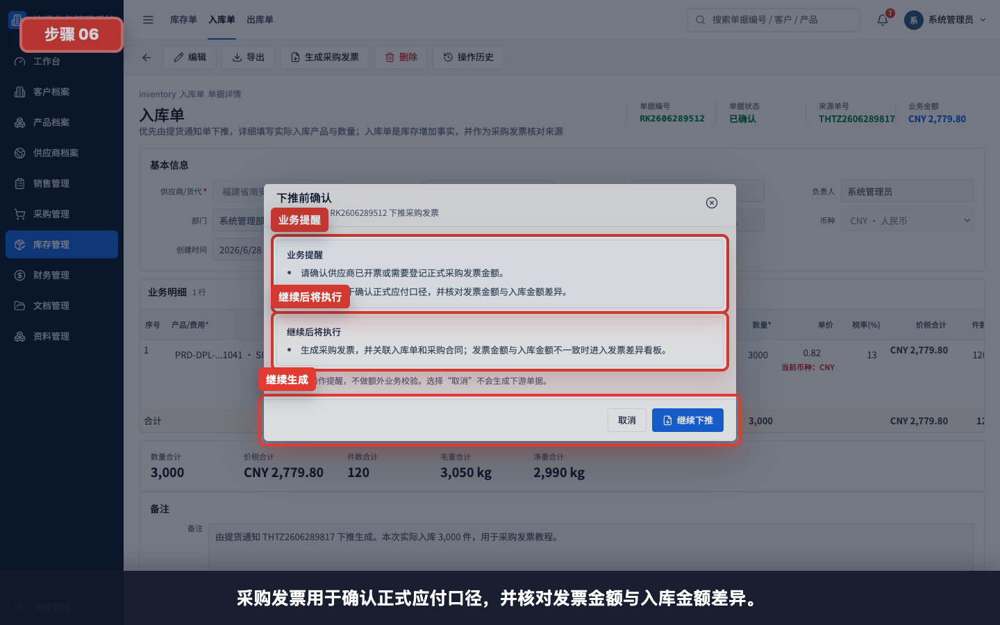

系统会提示：采购发票用于确认正式应付口径，并核对发票金额与入库金额差异。

## 步骤 07：生成采购发票草稿


继续生成后，系统生成采购发票草稿，并带出入库单、采购合同、供应商和入库产品明细。

## 步骤 08：核对来源入库单和采购合同

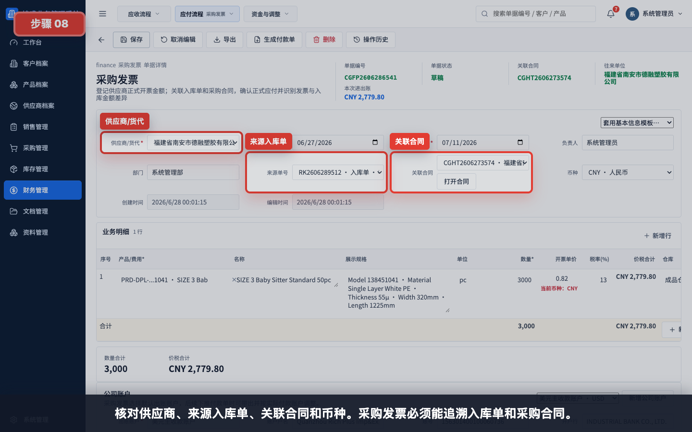

核对供应商、来源入库单、关联合同和币种。采购发票必须能追溯入库单和采购合同。

## 步骤 09：核对默认出账公司账户

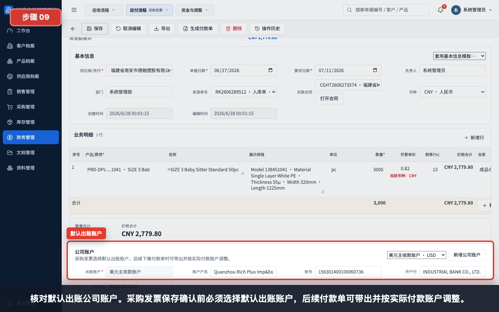

核对默认出账公司账户。采购发票保存确认前必须选择默认出账账户，后续付款单可带出并按实际付款账户调整。

## 步骤 10：填写发票号码和开票信息

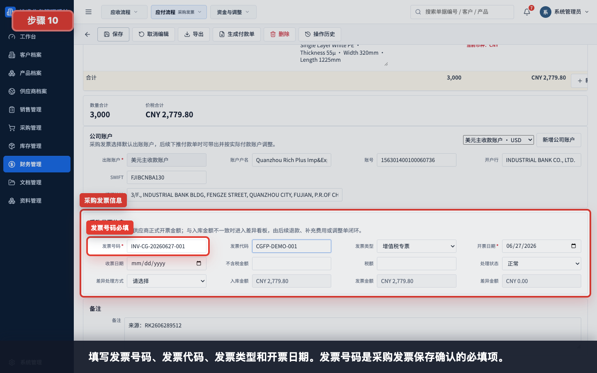

填写发票号码、发票代码、发票类型和开票日期。发票号码是采购发票保存确认的必填项。

示例：

| 字段 | 示例 | 说明 |
|---|---|---|
| 发票号码 | INV-CG-20260627-001 | 供应商正式发票号 |
| 发票代码 | CGFP-DEMO-001 | 可按实际票据填写 |
| 发票类型 | 增值税专票 | 按实际发票类型选择 |
| 开票日期 | 2026-06-27 | 按实际开票日期填写 |

## 步骤 11：核对开票明细和发票金额

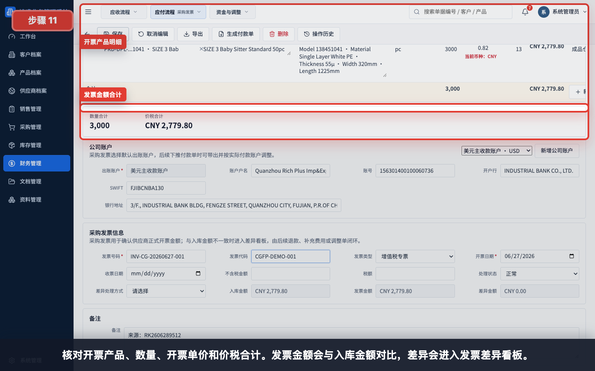

核对开票产品、数量、开票单价和价税合计。发票金额会与入库金额对比，差异会进入发票差异看板。

## 步骤 12：核对入库金额和差异金额

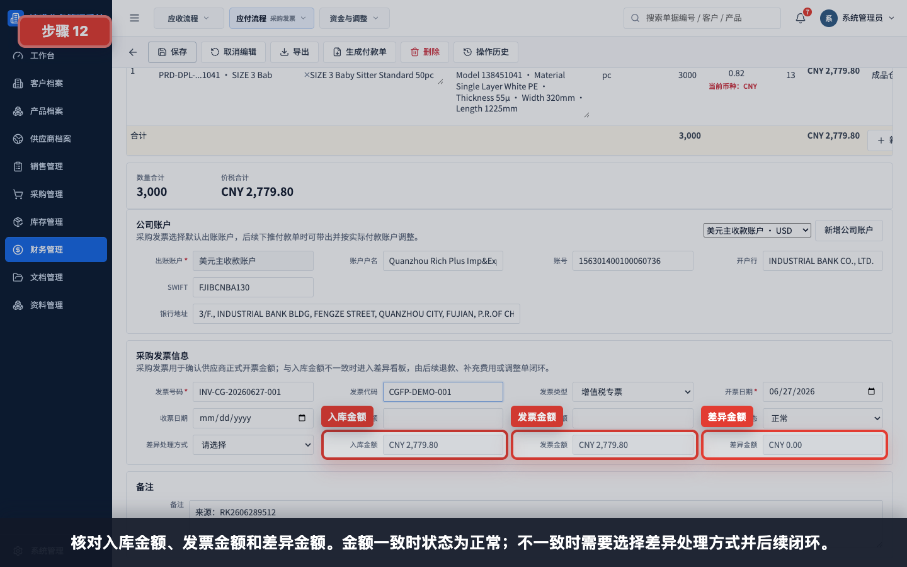

核对入库金额、发票金额和差异金额。金额一致时状态为正常；不一致时需要选择差异处理方式并后续闭环。

差异处理参考：

| 情况 | 建议处理 |
|---|---|
| 发票金额大于入库金额 | 核实是否补充费用、订单变更或后续补录 |
| 发票金额小于入库金额 | 核实是否供应商折让、退款、红冲重开或损失处理 |
| 金额录错 | 修正产品行单价、数量或重新登记发票 |

## 步骤 13：填写备注并保存采购发票

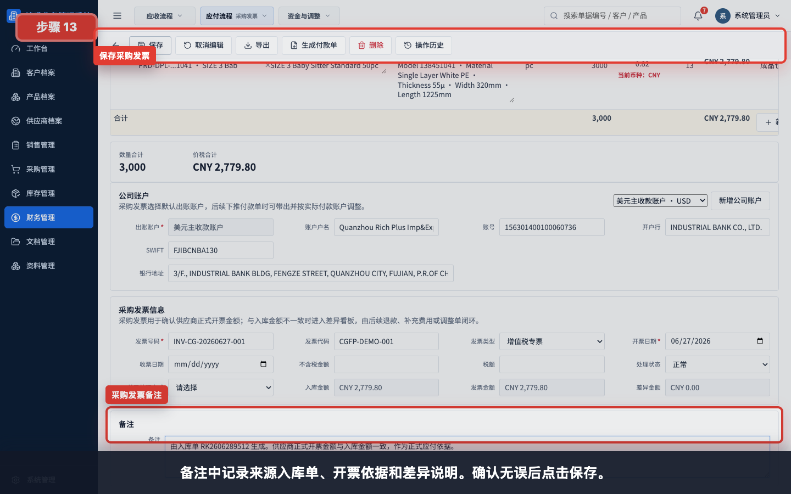

备注中记录来源入库单、开票依据和差异说明。确认无误后点击保存。

备注示例：

```text
由入库单 RK2606274281 生成。供应商正式开票金额与入库金额一致，作为正式应付依据。
```

## 步骤 14：保存并确认采购发票

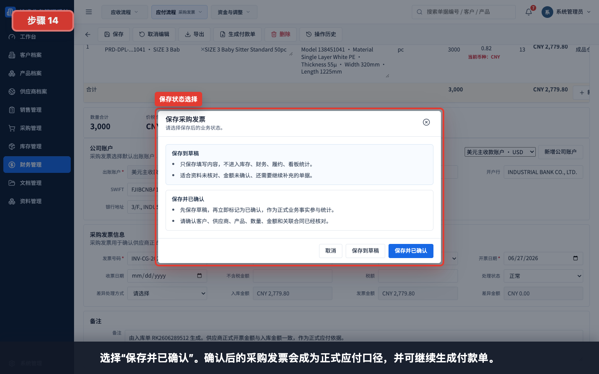

资料未齐时可以先保存到草稿；发票号码、默认出账账户、产品明细和金额核对无误后，选择“保存并已确认”。

状态说明：

| 状态 | 适用情况 | 后续影响 |
|---|---|---|
| 保存到草稿 | 发票号码、账户或金额仍需复核 | 不作为正式应付口径 |
| 保存并已确认 | 开票信息和金额已确认 | 作为正式应付口径，可生成付款单 |

## 步骤 15：回到采购发票列表验证

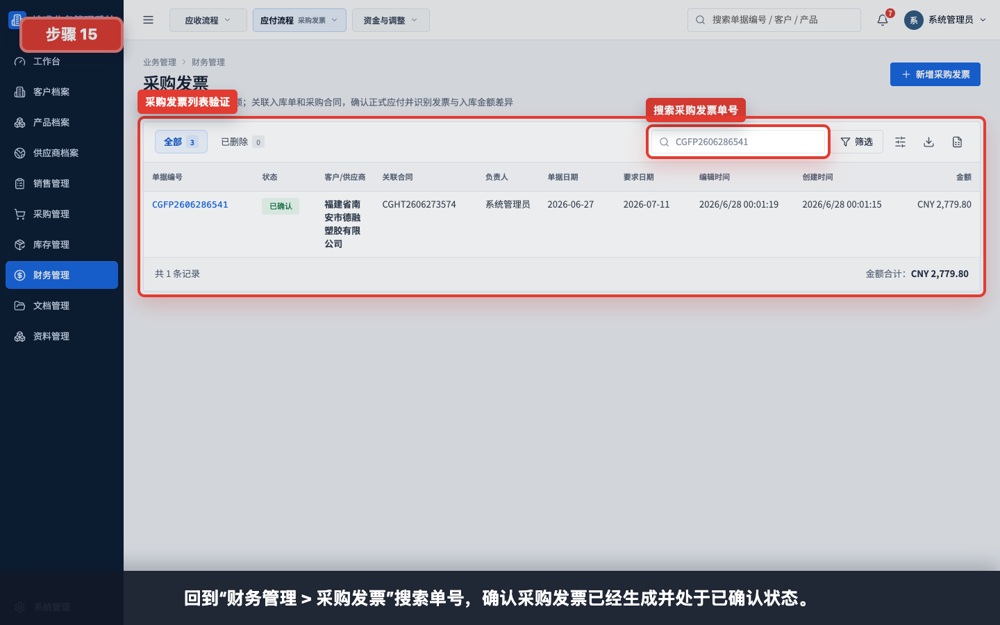

回到“财务管理 > 采购发票”搜索单号，确认采购发票已经生成并处于已确认状态。

## 步骤 16：查看应付看板正式应付

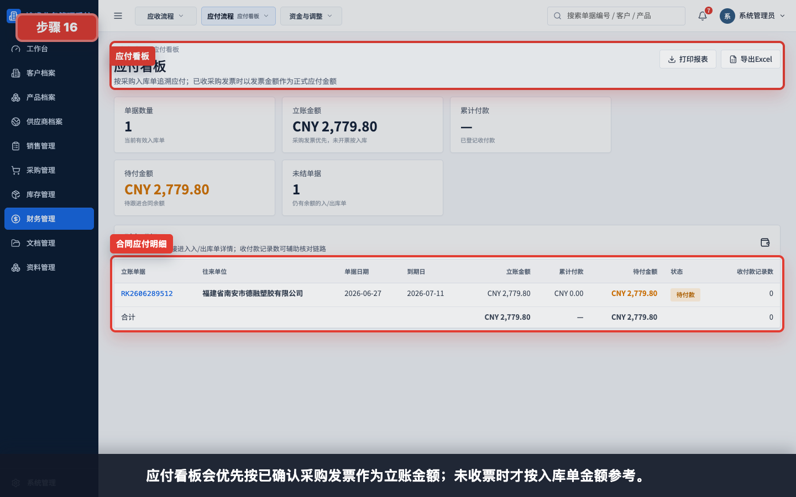

应付看板会优先按已确认采购发票作为立账金额；未收票时才按入库单金额参考。

## 步骤 17：确认后续付款单入口

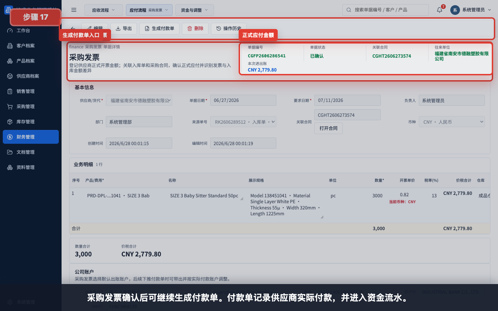

采购发票确认后可继续生成付款单。付款单记录供应商实际付款，并进入资金流水。

## 常见错误

- 入库单仍是草稿就尝试生成采购发票。
- 采购发票没有关联入库单或采购合同，导致应付追溯断开。
- 未选择默认出账公司账户，导致发票无法保存确认。
- 未填写发票号码。
- 发票产品数量或单价没有和供应商发票核对。
- 发票金额和入库金额不一致，但没有填写处理状态和差异处理方式。
- 采购发票只保存到草稿，误以为已经形成正式应付。
- 实际付款后忘记继续生成付款单，导致应付长期未结。

## 保存前检查清单

- 入库单状态为已确认。
- 供应商、来源入库单和关联合同正确。
- 默认出账公司账户已选择。
- 发票号码、发票类型和开票日期已填写。
- 开票产品、数量、单价和价税合计已核对。
- 入库金额、发票金额和差异金额已核对。
- 如有差异，处理状态和处理方式已填写。
- 备注已写清来源入库单、开票依据和差异说明。
- 如要形成正式应付，保存时选择“保存并已确认”。
- 后续实际付款后，从采购发票生成付款单。
