# 如何维护公司账户

本指引用于培训管理员或财务关键用户维护公司账户。公司账户用于收款入账、付款出账、客户退款、供应商退款、费用单、报销单和部分导出文件，财务单据应选择实际发生的公司账户。

## 适用场景

- 新增公司收款账户、付款账户或备用账户。
- 公司账号、开户行、SWIFT 或银行地址发生变化。
- 需要设置默认账户，供单据自动带出。
- 财务单据保存时提示必须选择公司账户。
- 需要区分不同币种或不同用途的收付款账户。

## 字段填写说明

| 字段 | 填写方式 | 注意事项 |
|---|---|---|
| 编码 | 使用唯一账户编码，例如 `BANK-USD-001` | 便于搜索和长期维护 |
| 账户名称 | 填写业务可读名称，例如“美元主收款账户” | 用户在单据下拉框中会看到 |
| 账户户名 | 填写银行账户户名 | 必填，应与银行资料一致 |
| 账号 | 填写完整银行账号 | 必填，保存前必须核对 |
| 开户行 | 填写开户银行名称 | 必填 |
| 币种 | 填写账户主要收付款币种 | 用于单据自动匹配账户 |
| SWIFT | 外币账户填写 SWIFT | 外贸收款和导出文件常用 |
| 默认账户 | 选择是或否 | 设为默认会取消其他账户默认标记 |
| 银行地址 | 填写银行地址 | 外贸收款资料常用 |
| 备注 | 说明账户用途 | 便于财务选择 |

## 步骤 01：进入公司账户

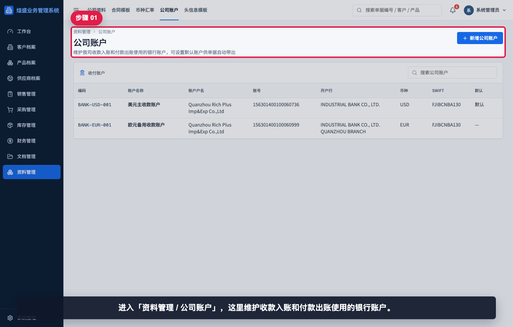

进入“资料管理 / 公司账户”。这里维护收款入账和付款出账使用的银行账户。

## 步骤 02：查看公司账户列表

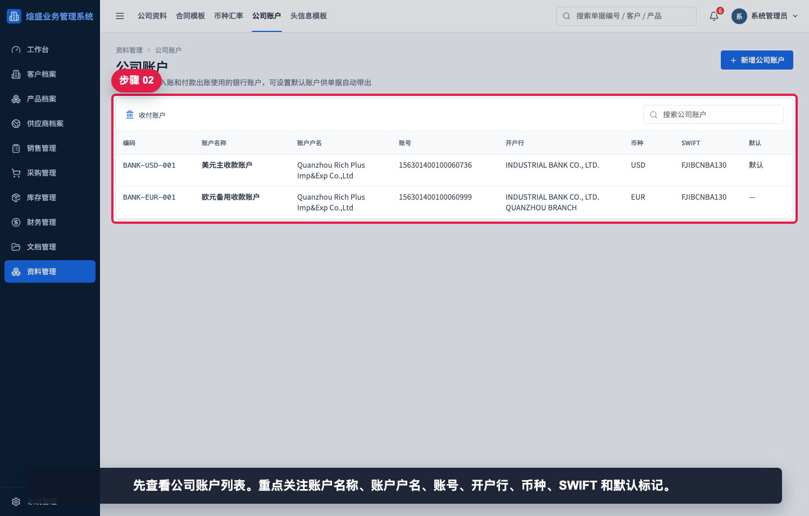

先查看公司账户列表。重点关注账户名称、账户户名、账号、开户行、币种、SWIFT 和默认标记。

## 步骤 03：搜索已有账户

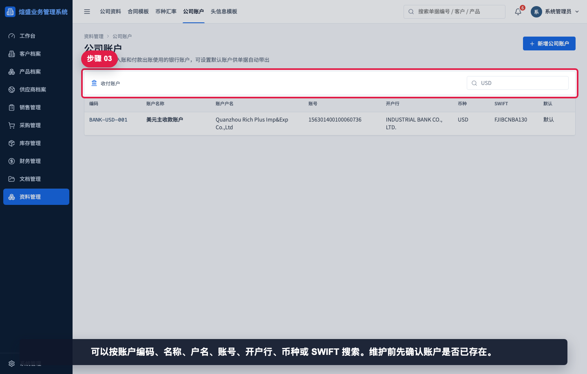

可以按账户编码、名称、户名、账号、开户行、币种或 SWIFT 搜索。维护前先确认账户是否已存在。

## 步骤 04：打开已有公司账户

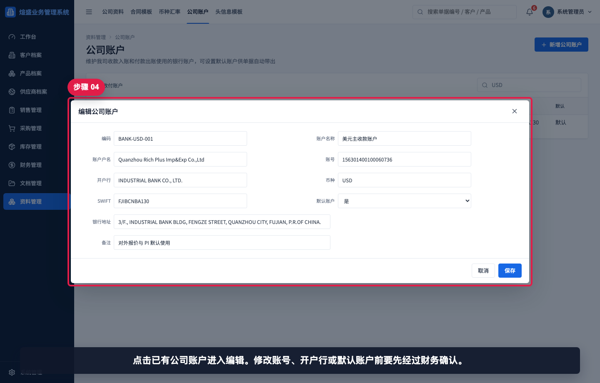

点击已有公司账户进入编辑。修改账号、开户行或默认账户前要先经过财务确认。

## 步骤 05：核对账户必填字段

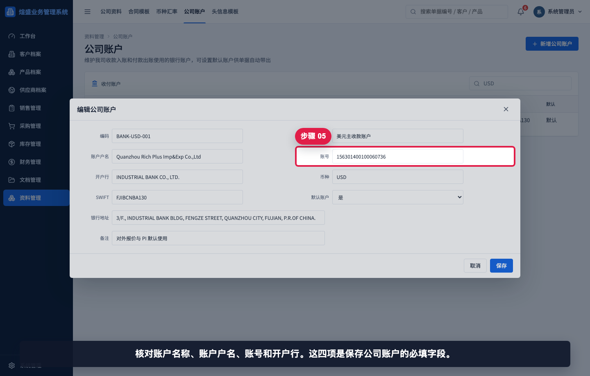

核对账户名称、账户户名、账号和开户行。这四项是保存公司账户的必填字段。

## 步骤 06：核对币种和默认账户

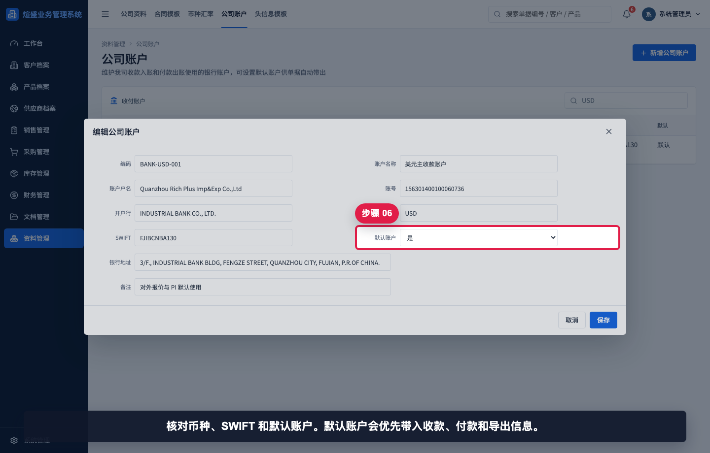

核对币种、SWIFT 和默认账户。默认账户会优先带入收款、付款和导出信息。

## 步骤 07：新增公司账户

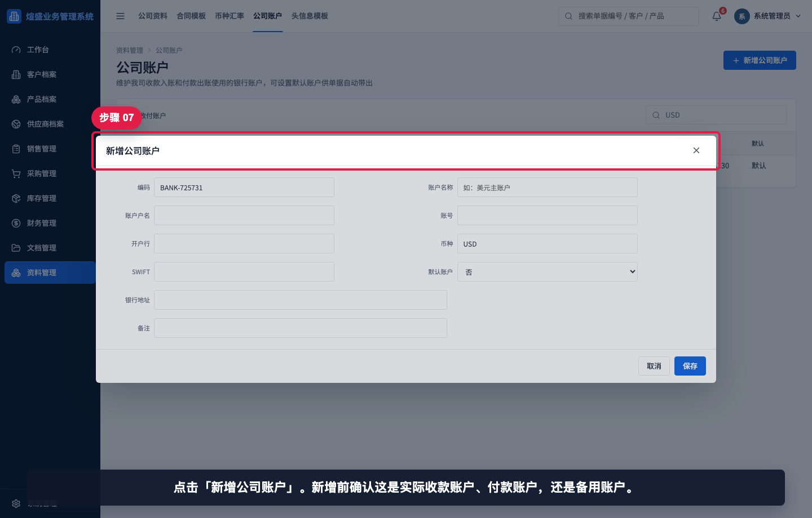

点击“新增公司账户”。新增前确认这是实际收款账户、付款账户，还是备用账户。

## 步骤 08：填写账户识别信息

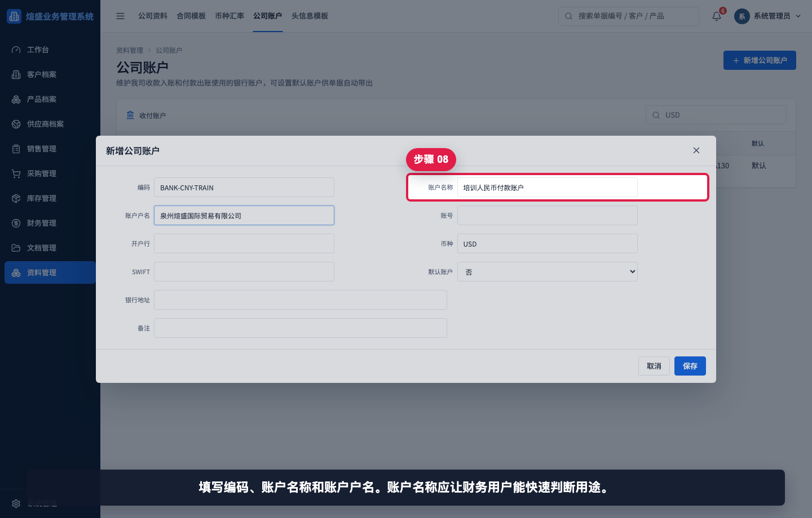

填写编码、账户名称和账户户名。账户名称应让财务用户能快速判断用途。

## 步骤 09：填写账号开户行币种

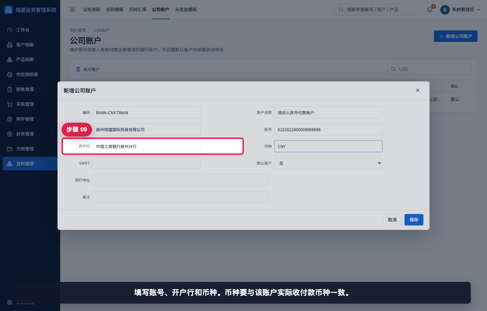

填写账号、开户行和币种。币种要与该账户实际收付款币种一致。

## 步骤 10：填写 SWIFT 和默认标记

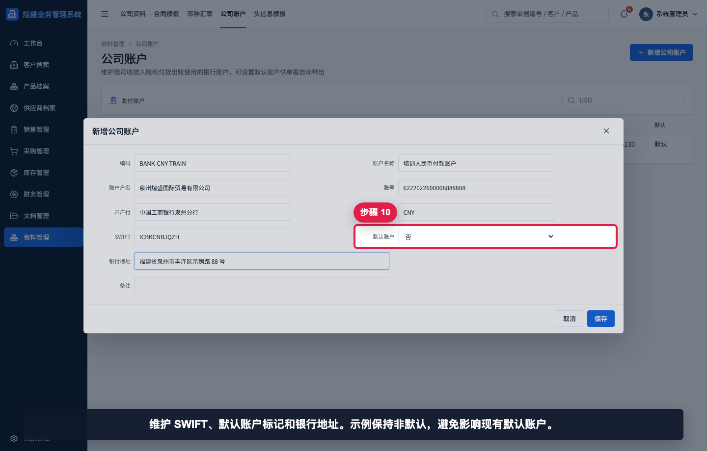

维护 SWIFT、默认账户标记和银行地址。示例保持非默认，避免影响现有默认账户。

## 步骤 11：填写账户备注

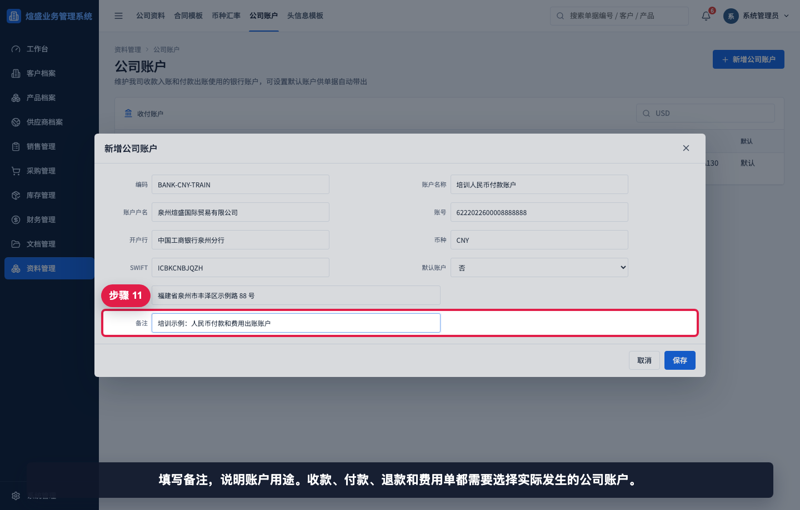

填写备注，说明账户用途。收款、付款、退款和费用单都需要选择实际发生的公司账户。

## 步骤 12：保存后查看公司账户

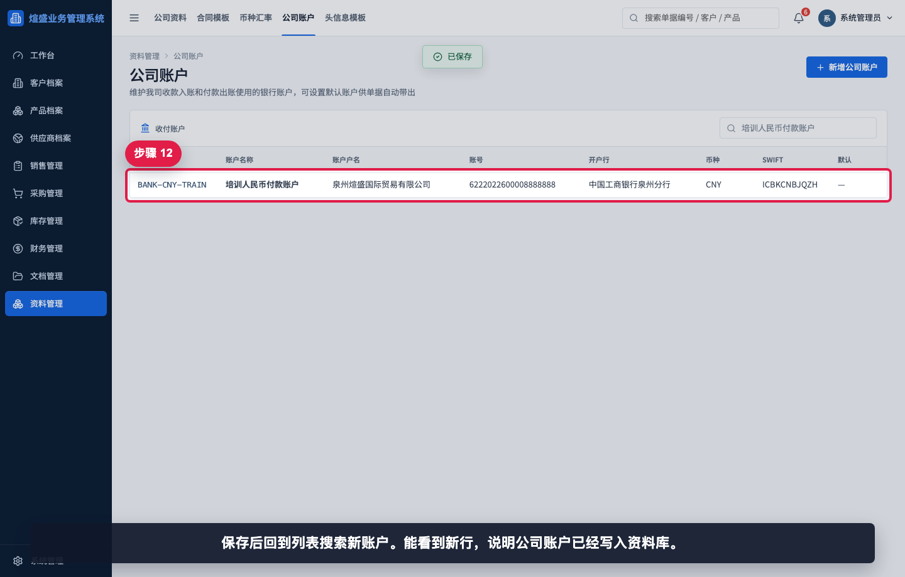

保存后回到列表搜索新账户。能看到新行，说明公司账户已经写入资料库。

## 相关教程

- [如何维护币种汇率](../维护币种汇率/README.md)
- [如何维护头信息模板](../维护头信息模板/README.md)
- [如何从销售发票生成收款单](../../财务管理/销售发票生成收款单/README.md)
- [如何从采购发票生成付款单](../../财务管理/采购发票生成付款单/README.md)
- [如何查看资金流水](../../看板报表/查看资金流水/README.md)

## 常见错误

- 只维护头信息模板，没有维护公司账户。财务单据仍需要选择公司账户。
- 将备用账户设为默认账户，导致新单据自动带出错误账户。
- 币种和账户实际币种不一致，造成收付款选择错误。
- 账号、开户行、SWIFT 录入错误，影响外贸收款和付款资料。
- 账户名称太泛，业务用户不知道该选哪个账户。

## 保存前检查清单

- 账户名称、账户户名、账号、开户行是否完整。
- 币种是否与账户实际币种一致。
- SWIFT 和银行地址是否由财务确认。
- 默认账户标记是否符合当前自动带出规则。
- 备注是否说明账户用途。
- 保存后是否能在列表中搜索到该账户。
