# 如何维护公司资料

本指引用于培训管理员或关键用户维护公司资料。公司资料会影响报价单、PI、销售合同、采购合同和 PDF 抬头内容，因此应在正式制作单据前确认。

## 适用场景

- 公司名称、英文名称、地址、联系人或邮箱发生变化。
- 对外报价单、合同或 PI 的 Logo、公章、抬头信息需要调整。
- 采购合同或付款资料中的采购方主体、税号、联系人需要统一。
- 新环境初始化后，需要先配置默认币别、编号规则、报价有效期和付款提醒。
- 发现 PDF 导出内容不准确，需要回到公司资料核对来源字段。

## 字段填写说明

| 字段 | 填写方式 | 影响范围 |
|---|---|---|
| 公司 Logo | 上传清晰图片，建议使用透明底或浅底图片 | 报价单等 PDF 抬头 |
| 公司公章 | 上传盖章图片，避免模糊或裁切 | 报价单、PI 签章位置 |
| 销售公司中文名称 | 填写对内识别的公司中文全称 | 内部页面、部分导出抬头 |
| 销售公司英文名称 | 填写对外合同使用的英文全称 | 外贸报价、合同和 PDF |
| 销售公司联系人 / 邮箱 / 地址 | 使用对外沟通口径，地址建议英文版 | 报价、合同、客户沟通资料 |
| 采购方主体名称 / 税号 | 使用采购合同和付款资料中的主体信息 | 采购合同、采购付款资料 |
| 采购方联系人 / 电话 / 邮箱 / 地址 | 使用供应商沟通口径 | 采购合同和供应商沟通 |
| 默认币别 | 选择新单据默认使用的币种 | 新建报价、合同、财务单据 |
| 编号规则 | 选择按单据类型或按组织 + 单据类型 | 新单据编号生成 |
| 报价有效期(天) | 填写销售报价默认有效天数 | 报价单默认规则 |
| 付款提醒(天) | 填写提前提醒应收应付的天数 | 财务提醒和看板 |
| 允许手动汇率 | 按财务规则决定是否开放 | 收付款和结算参考汇率 |

## 步骤 01：进入公司资料

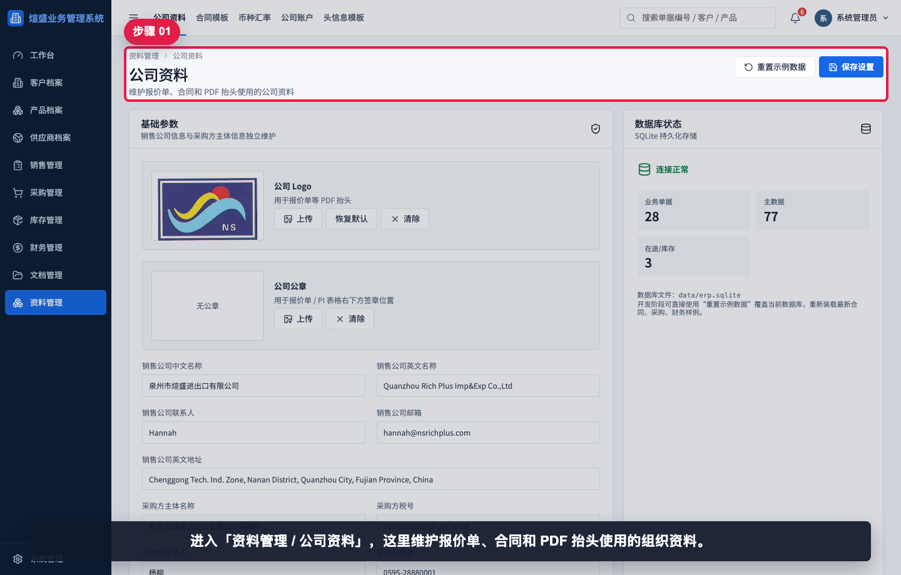

进入“资料管理 / 公司资料”。这里维护报价单、合同和 PDF 抬头使用的组织资料。

## 步骤 02：确认页面用途

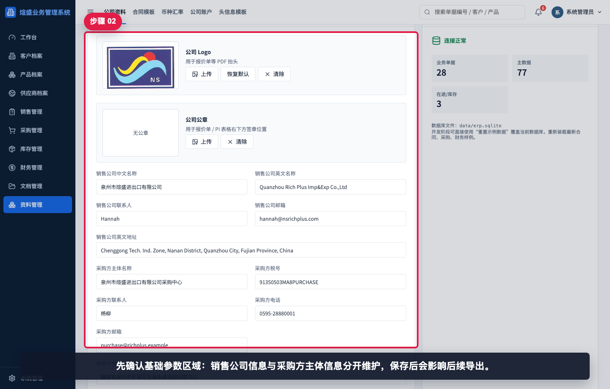

先确认基础参数区域。销售公司信息和采购方主体信息分开维护，保存后会影响后续导出。

## 步骤 03：上传公司 Logo

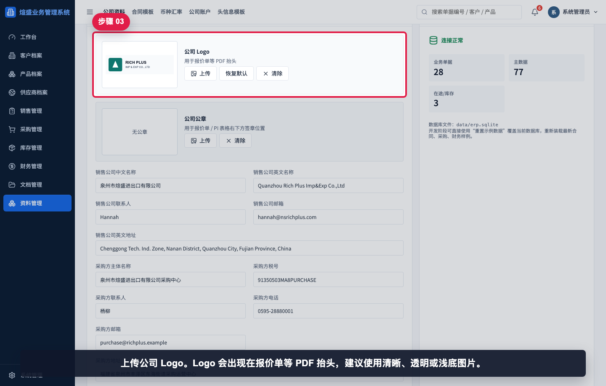

点击公司 Logo 的“上传”，选择图片文件。Logo 建议使用清晰、比例稳定的图片，避免在 PDF 抬头中变形。

## 步骤 04：上传公司公章

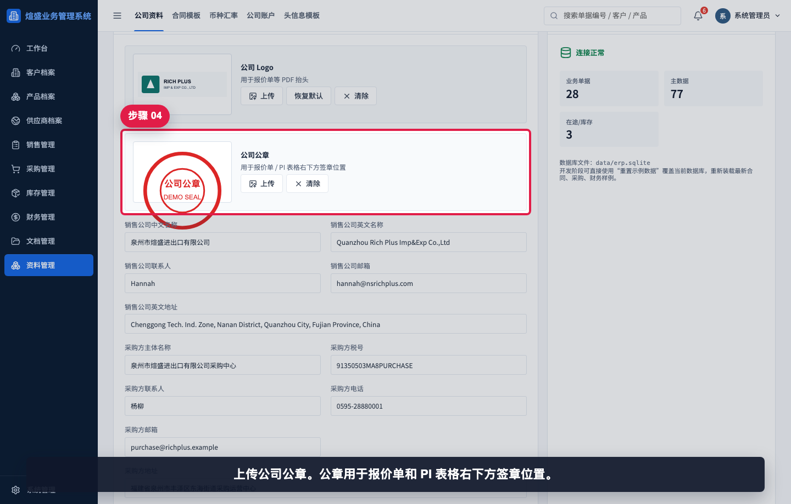

点击公司公章的“上传”，选择签章图片。公章用于报价单或 PI 的签章区域，应避免背景过深或边缘裁切。

## 步骤 05：填写销售公司名称

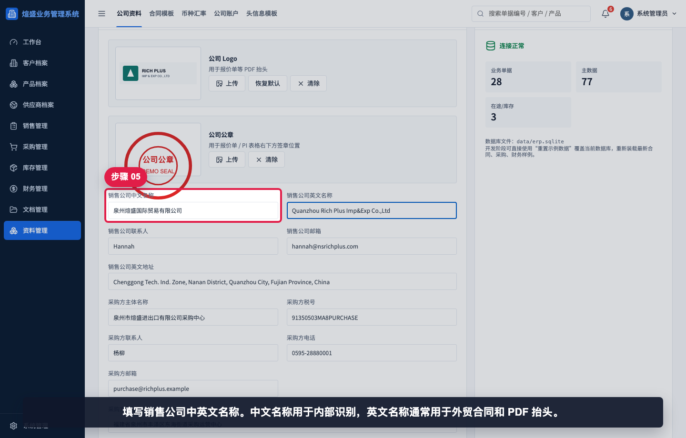

填写销售公司中文名称和英文名称。英文名称通常直接用于外贸合同和 PDF 抬头，保存前要按公司对外标准核对。

## 步骤 06：填写销售联系方式

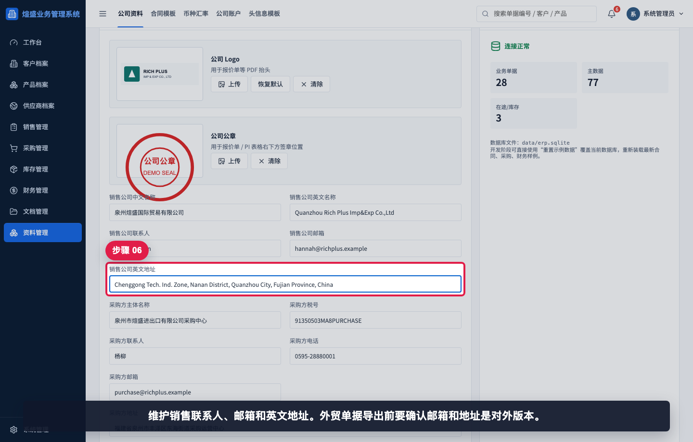

填写销售公司联系人、邮箱和英文地址。对外文件中出现的联系方式应与业务名片、邮件签名保持一致。

## 步骤 07：填写采购主体

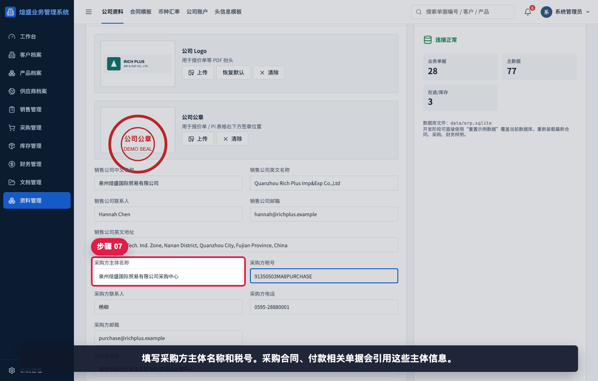

填写采购方主体名称和税号。采购合同、供应商付款资料会引用这些信息。

## 步骤 08：填写采购联系方式

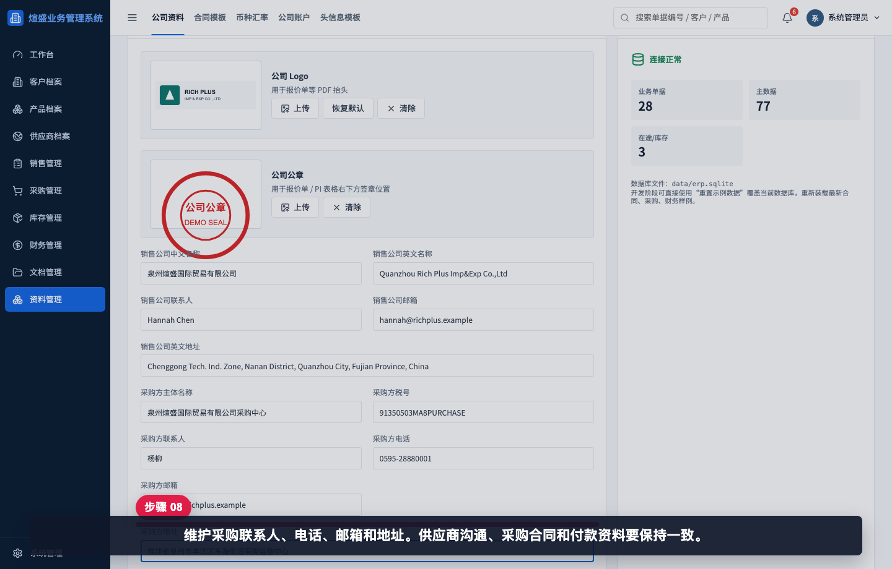

填写采购方联系人、电话、邮箱和地址。供应商侧使用的采购资料应统一维护在这里。

## 步骤 09：设置币别和编号规则

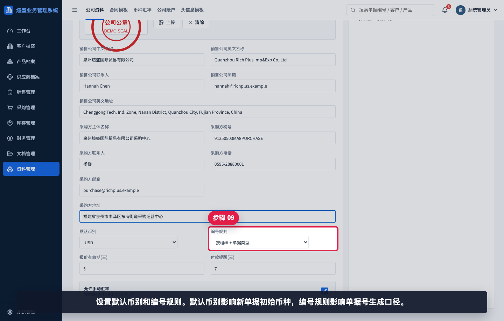

默认币别影响新单据的初始币种，编号规则影响单据号生成口径。变更前应先确认团队当前编号规范。

## 步骤 10：设置有效期和提醒

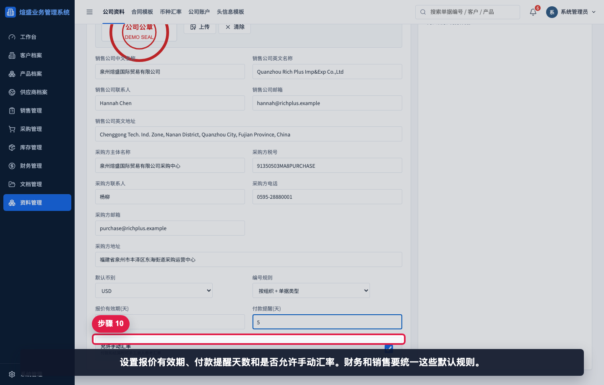

维护报价有效期、付款提醒天数，并确认是否允许手动汇率。销售和财务应统一这些默认规则。

## 步骤 11：保存公司资料

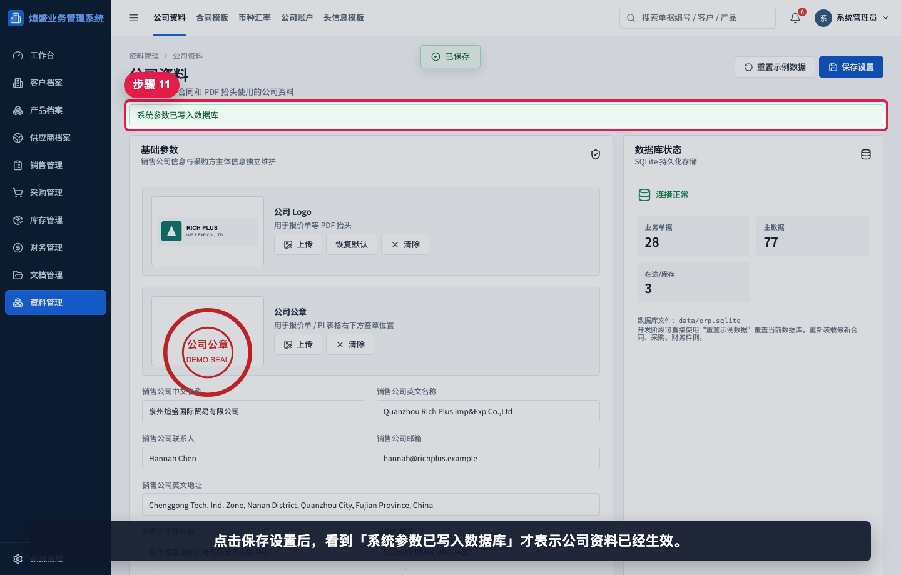

点击“保存设置”。看到“系统参数已写入数据库”后，才表示本次维护已经生效。

## 步骤 12：检查数据库状态

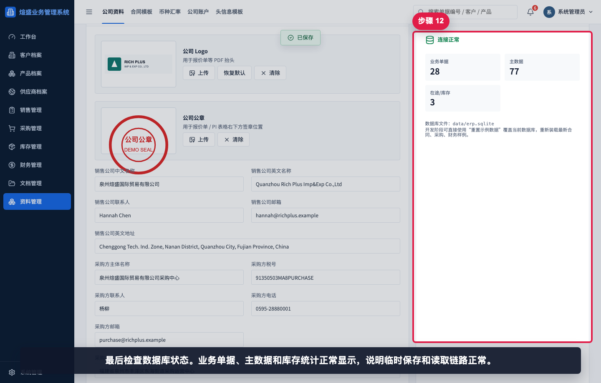

检查数据库状态是否正常显示。若数据无法保存或统计异常，应先处理数据库连接问题，再继续维护资料。

## 相关教程

- [如何创建报价单](../../销售管理/创建报价单/README.md)
- [如何创建销售合同](../../销售管理/创建销售合同/README.md)
- [如何创建采购合同](../../采购管理/创建采购合同/README.md)
- [协作与管理截图指引](../../collaboration-admin/README.md)

## 常见错误

- 只上传 Logo，没有点击“保存设置”。页面刷新后未保存的图片会丢失。
- 英文公司名称或英文地址拼写错误，导致 PDF 抬头对外展示错误。
- 把销售公司主体和采购方主体混用，导致采购合同中的买方信息不准确。
- 修改默认币别或编号规则前没有同步业务团队，造成新单据口径不一致。
- 误点“重置示例数据”。该按钮会覆盖当前开发数据，正式环境应谨慎操作。

## 保存前检查清单

- Logo 和公章是否清晰、完整、比例正常。
- 销售公司中文名称、英文名称、联系人、邮箱、地址是否为对外标准版本。
- 采购方主体名称、税号、联系人、电话、邮箱、地址是否与采购合同一致。
- 默认币别、编号规则、报价有效期、付款提醒是否已经与销售、采购、财务确认。
- 点击保存后是否看到“系统参数已写入数据库”。
