# 如何维护合同模板

本指引用于培训管理员或关键用户维护合同模板。合同模板控制客户 PI、销售合同、采购合同的导出结构，包括变量组、头字段、明细字段和模板内容，不替代业务单据本身的录入和审批。

## 适用场景

- 需要新增一种 PI、销售合同或采购合同导出模板。
- 需要调整合同导出的头字段、明细列或变量范围。
- 需要区分客户模板和采购模板，避免单据套错模板。
- 业务团队发现导出文件缺少字段，需要确认模板配置。
- 新环境初始化后，需要核对默认模板是否符合公司标准。

## 字段填写说明

| 字段 | 填写方式 | 影响范围 |
|---|---|---|
| 模板编码 | 使用唯一编码，例如 `TPL-C-PI-001` 或 `TPL-P-001` | 单据引用模板的稳定标识 |
| 模板名称 | 使用业务可读名称，例如“采购合同标准模板” | 列表搜索和业务选择 |
| 模板类型 | 客户或采购 | 区分客户 PI/销售合同和采购合同 |
| 模板场景 | PI、销售合同、采购合同 | 决定模板对应的业务场景 |
| 适用单据 | 填写报价单、客户合同、采购合同等 | 帮助用户判断适用范围 |
| 模板格式 | HTML 或 Word | 决定导出模板格式 |
| 变量 | 以英文逗号分隔，例如 `document.number,supplier.name,lines` | 模板内容可引用的数据 |
| 变量组 | 以英文逗号分隔，例如 `document,supplier,terms,lines` | 列表展示和模板能力识别 |
| 头字段 | 以英文逗号分隔，例如 `partner,paymentTerm` | 控制合同头部展示字段 |
| 明细字段 | 以英文逗号分隔，例如 `itemCode,itemName,quantity` | 控制产品明细行展示列 |
| 模板内容 | 使用文本或 HTML，并用 `{{变量}}` 占位 | 导出文件主体结构 |
| 备注 | 说明模板适用范围、维护口径或注意事项 | 便于后续维护 |

## 步骤 01：进入合同模板

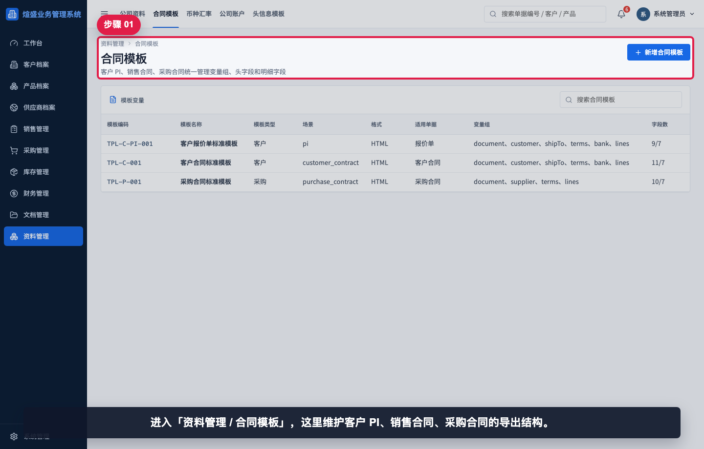

进入“资料管理 / 合同模板”。这里维护客户 PI、销售合同、采购合同的导出结构。

## 步骤 02：查看模板列表

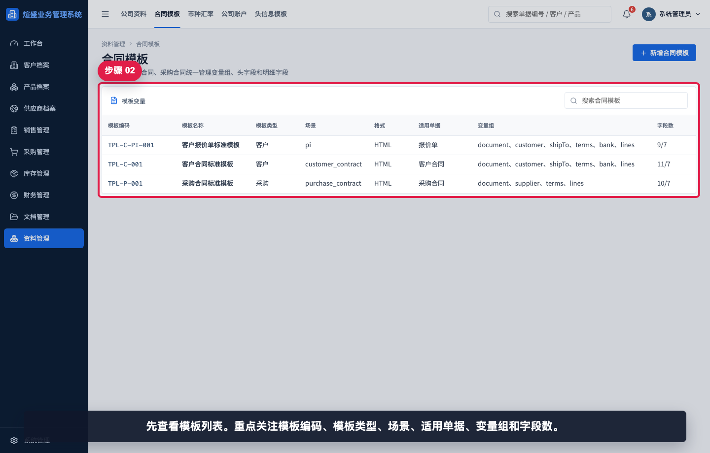

先查看模板列表。重点关注模板编码、模板类型、场景、适用单据、变量组和字段数。

## 步骤 03：搜索采购合同模板

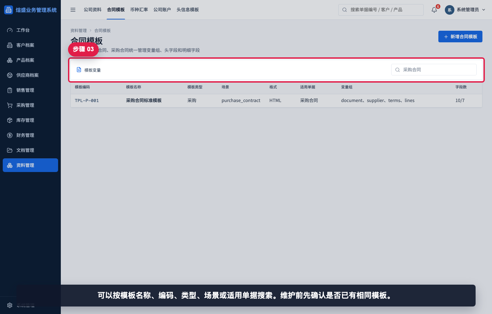

可以按模板名称、编码、类型、场景或适用单据搜索。维护前先确认是否已有相同模板，避免重复创建。

## 步骤 04：打开现有模板

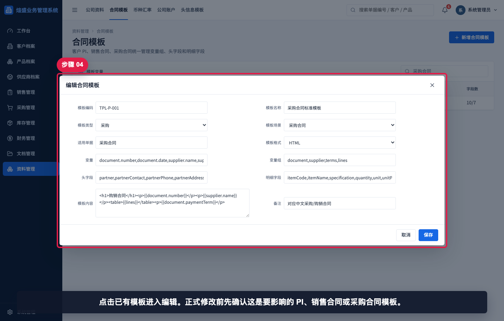

点击已有模板进入编辑。正式修改前先确认该模板影响的是 PI、销售合同还是采购合同。

## 步骤 05：核对模板基础信息

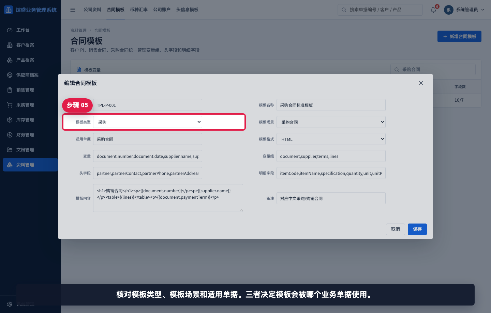

核对模板类型、模板场景和适用单据。三者决定模板会被哪个业务单据使用。

## 步骤 06：核对变量和字段

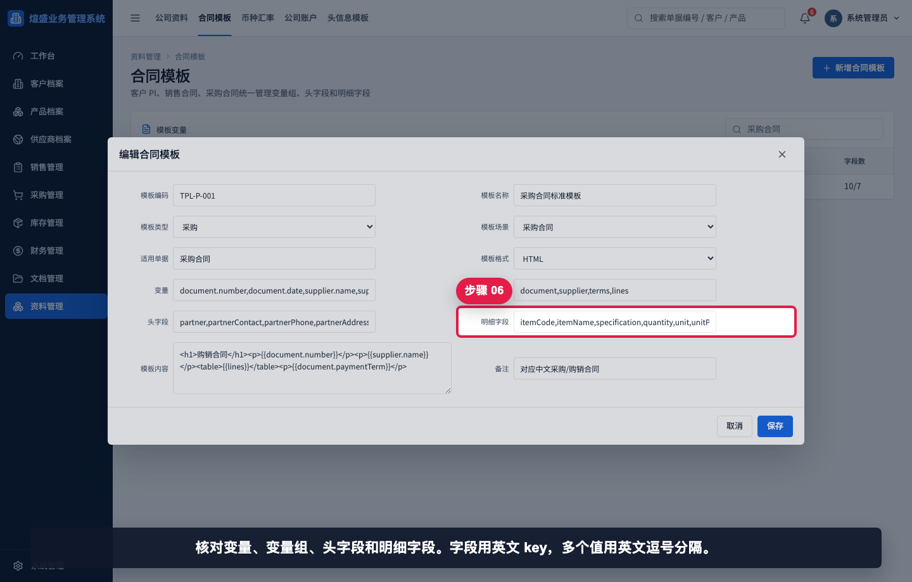

核对变量、变量组、头字段和明细字段。字段使用英文 key，多个值用英文逗号分隔。

## 步骤 07：新增合同模板

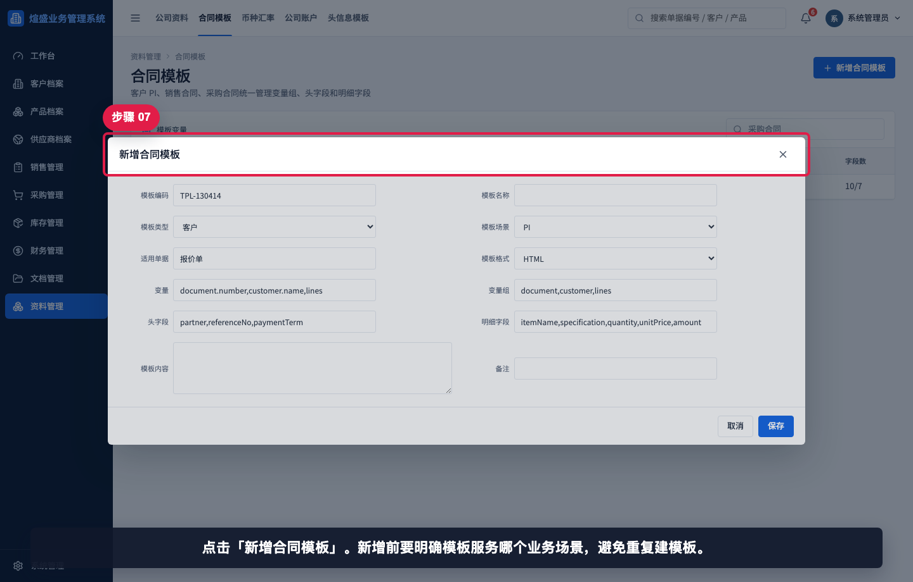

点击“新增合同模板”。新增前要明确模板服务哪个业务场景，避免创建重复模板。

## 步骤 08：填写模板基础字段

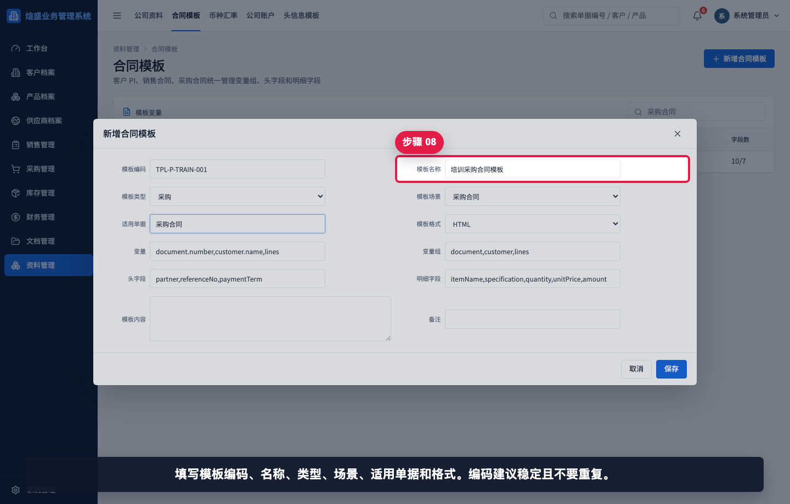

填写模板编码、名称、类型、场景、适用单据和格式。编码应稳定且不要重复。

## 步骤 09：填写变量和变量组

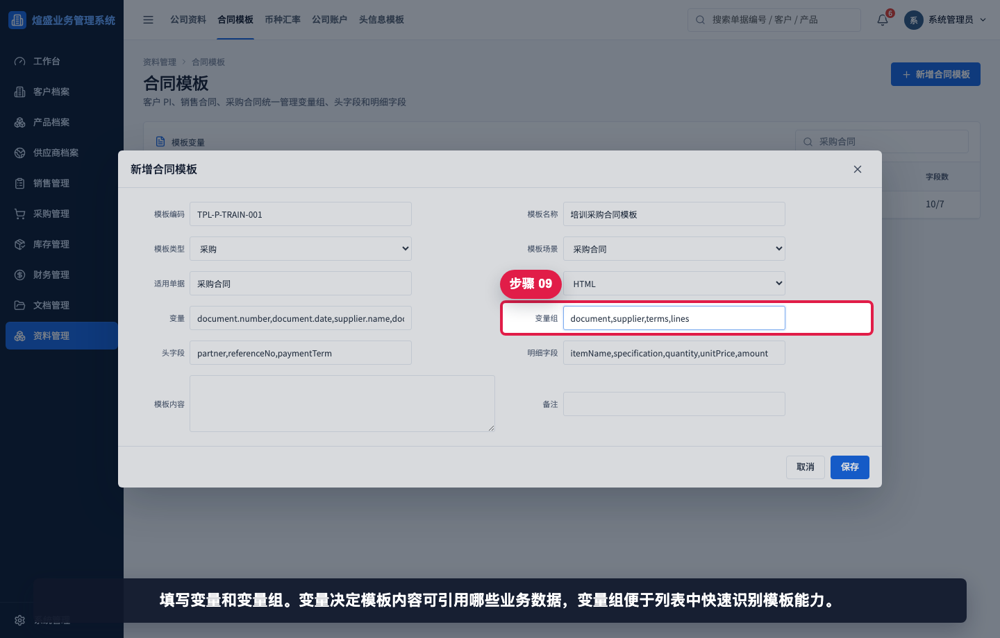

填写变量和变量组。变量决定模板内容可以引用哪些业务数据，变量组便于列表中快速识别模板能力。

## 步骤 10：填写头字段和明细字段

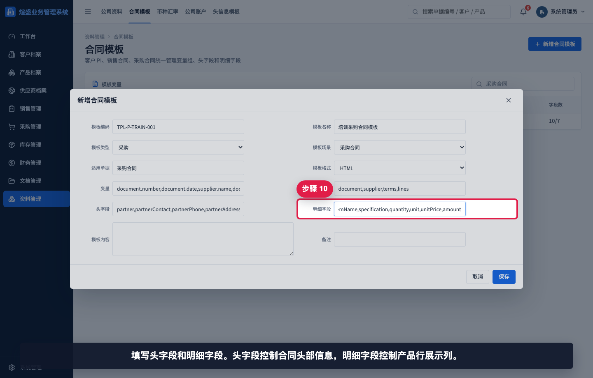

填写头字段和明细字段。头字段控制合同头部信息，明细字段控制产品行展示列。

## 步骤 11：填写模板内容和备注

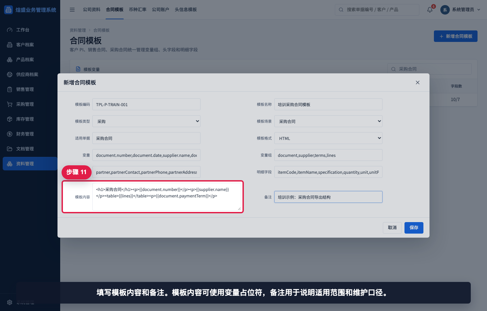

填写模板内容和备注。模板内容可使用变量占位符，备注用于说明适用范围和维护口径。

## 步骤 12：保存后查看新模板

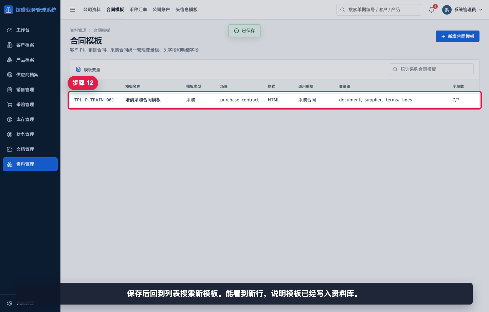

保存后回到列表搜索新模板。能看到新行，说明模板已经写入资料库。

## 相关教程

- [如何维护公司资料](../维护公司资料/README.md)
- [如何维护头信息模板](../维护头信息模板/README.md)
- [如何创建销售合同](../../销售管理/创建销售合同/README.md)
- [如何创建采购合同](../../采购管理/创建采购合同/README.md)

## 常见错误

- 模板类型和模板场景不匹配，例如采购模板却选择客户类型。
- 变量、变量组、头字段或明细字段使用中文逗号，导致拆分失败。
- 模板编码重复，保存时会覆盖或冲突。
- 只改模板内容，没有同步头字段和明细字段，导出仍缺少列。
- 把合同模板当作业务数据录入口。业务金额、客户、供应商、产品仍要在单据中维护。

## 保存前检查清单

- 模板编码是否唯一、稳定、符合命名规范。
- 模板类型、模板场景、适用单据是否一致。
- 变量、变量组、头字段、明细字段是否使用英文逗号分隔。
- 模板内容中的 `{{变量}}` 是否已包含在变量列表中。
- 保存后是否能在列表中搜索到该模板。
